# Transfer customizations between instances using solution export and import

[!INCLUDE[pn-microsoftcrm](../includes/pn-microsoftcrm.md)] is highly customizable. You can use its online tools to modify or create fields, entities, business processes, and more. Usually, you'll do your customization work on a sandbox instance, test them, and then transfer the final customizations to your production instances when they're ready. Best practices recommend that you proceed as follows:

1. [Create a copy](manage-marketing-instances.md#copy-to-sandbox) of your current production instance onto a sandbox instance where you can work without affecting your ongoing operations.
1. [Create a new managed solution](../customize/create-solution.md) on the sandbox and implement your customizations there. This lets you add customizations without affecting the underlying system, and you can revert your customizations at any time by removing the solution.
1. Test the customized solution on your sandbox until you've confirmed it's working correctly.
1. [Export](../customize/import-update-export-solutions.md) the custom solution from your sandbox and then [Import](../customize/import-update-export-solutions.md) it on your production instance.

For general information about creating and working with solutions, see the links in the previous procedure and also the [Solutions overview](../customize/solutions-overview.md). For a full example procedure, see the following section.

## Example: Create a custom solution and then move it to another instance

This section provides a complete example for how to set up a simple customization as a new solution and then move it to another instance.

### Part 1: Create a custom solution

In this exercise, you'll create a new solution and add a simple customization to it. This will provide a simple custom solution that you can use to export and and transfer to a new instance later in this topic. If you already have a custom solution to work with, then you can skip ahead to [Part 2](#export-solution).

1. Sign in to the instance where you will develop your custom solution.

1. Go to the custom app by selecting **[!INCLUDE[pn-custom-app-module](../includes/pn-custom-app-module.md)]** from the app-selector menu.    
    

1. In the custom app, navigate to **Settings** > **Solutions**. A list of existing solutions opens. Select **New** on the command bar to create a new one.    
    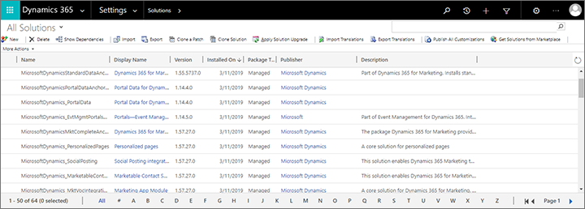

1. A new **PowerApps** window opens. Provide a **Display name**, **Name**, **Publisher**, and **Version** and then select **Save** on the command bar to save your solution.  
    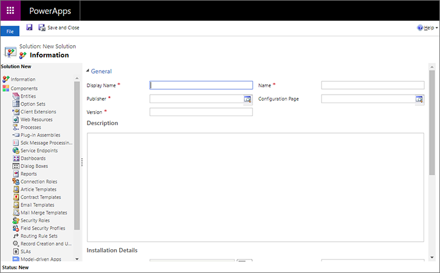

1. For this example, we're going to copy an existing entity and then customize it, so open the **Add Existing** drop-down list and select **Entity**.    
    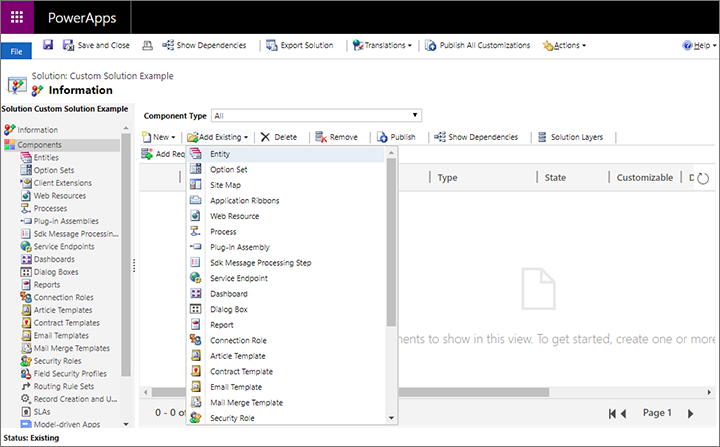

1. A dialog opens, showing all the available entities. Here you can add any number of entities to your new solution. For this example, just select the **Marketing form** check box and then select **OK** to add it to your solution.    
    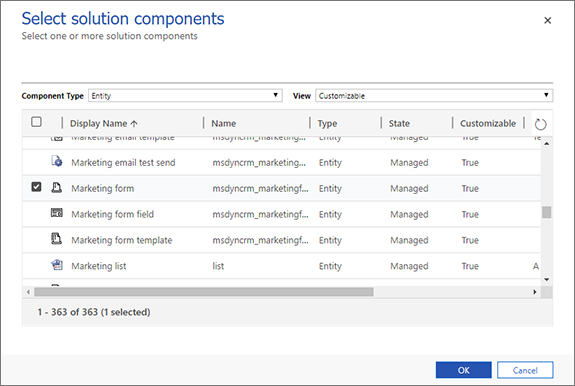

1. You're now asked to choose which aspects of the selected entity you'd like to include. In this case, we want to include everything related to marketing forms, so select the **Add all assets** check box and then select **Finish**.    
    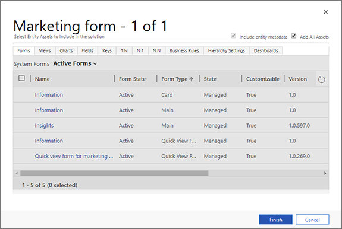

1. If your selected entity requires additional components, then you'll be asked whether to include them. Select **Yes, include required components** and then select **OK**.    
    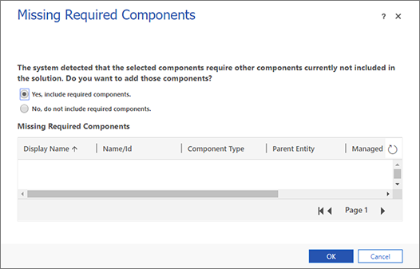

1. You now return to your new solution, which now includes all of the entities and related components that you selected to include. In side panel, expand **Entities** to see the entities you added, and then expand the **Marketing form** entity and select **Fields**.    
    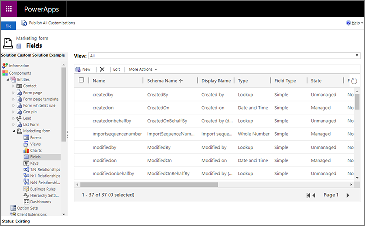

1. For this example, we'll customize the Marketing form entity by adding a new field. Select **New** to create a new field and enter a **Display Name**. Leave the other settings at the default values (we'll allow this to be a text field).    
    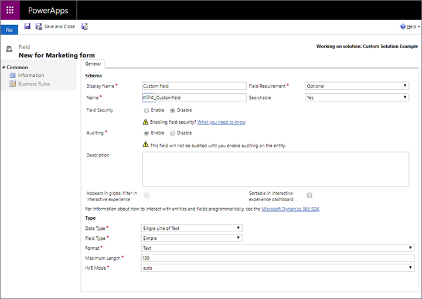

1. When you're done making all the required settings, select **Save and close** on the command bar.

1. You now return to the **PowerApps** window where you're setting up the new solution. Select **Publish All Customizations** to make your new field available to the app.

1. In the side panel of the **PowerApps** window, go to **Components** > **Entities** > **Marketing form** > **Forms**. We need to add our new custom field to a form to make it visible to users in the app.

1. Open the from named **Information** with a **Form type** of **Main** by selecting its name. This is the form that users see when they create or open a marketing-form record.    
    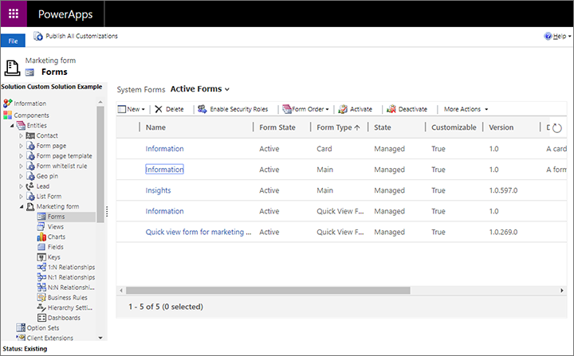

1. A new **PowerApps** window opens showing your selected form setup. In the central pane of this window, scroll down to the **Summary** section. Then drag your new custom field from the **Field explorer** panel to the **General information** section under the **Summary**.    
    

1. Select **Save and close** on the ribbon.

1. You now return to the **PowerApps** window where you're setting up the new solution. Select **Publish All Customizations** to make your customized form available to the app.

1. When publishing is complete, close the **PowerApps** window.

If you'd like to confirm your changes, you can go to the Marketing app, open a marketing form record and look for your new field on the **Summary** tab.

### Part 2: Export a solution

When you're done customizing your solution and ready to move it to another instance, the next thing you must do is export the custom solution. Here's how:

1. If you're not already there after the last exercise, open the custom app and navigate to **Settings** > **Solutions**.    
    

1. Select the check box for the solution you want to export, and then select **Export** on the command bar.

1. The system now reminds you that only published changes will be exported. If you followed the procedure in the previous section, then you should already have published everything, but if you're not sure, you can publish now. When you're ready to continue, select **Next**.    
    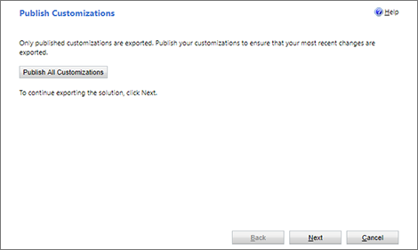

1. You can now choose to include various system settings in the export. System settings will be applied permanently on the destination instance, and will remain there even if you later remove the solution. Normally, you shouldn't include any system settings, and if you are just doing this procedure as an exercise, then don't select any of these check boxes now. Select **Next** to continue.    
    

1. Select **Managed** and then select **Export**.    
    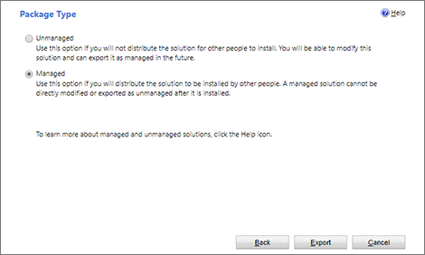

1. The solution now downloads as a zip file named after the solution name.

### Part 3: Import a solution
