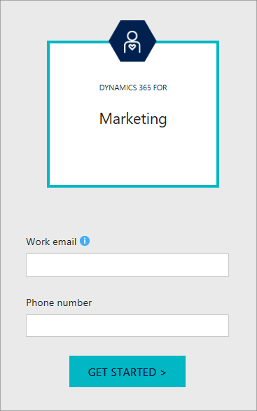

# Sign up for a free trial of Dynamics 365 Marketing

You can sign up for, install, and use a trial version of Dynamics 365 Marketing for free. Trials last for 30 days.

> [!IMPORTANT]
> - You will receive a trial Dynamics 365 instance together with your Marketing trial. You must run the Marketing trial on a trial instance, and can't install it on a production instance.
> - You can't convert a trial instance into a production instance.
> - You can install, at most, one Dynamics 365 Marketing trial per Microsoft 365 tenant.
> - You can only install the trial if you are located in a country/region where the product is supported. To read the latest list of countries/regions where you can use Dynamics 365 Marketing, download the [Microsoft Dynamics 365 International Availability](https://go.microsoft.com/fwlink/p/?linkid=875097) document (PDF).

> [!IMPORTANT]
> Your system is constrained by certain limits and quotas that apply to the number of contacts you can market to, monthly email messages you can send, Litmus previews you can view, and more. Please familiarize yourself with the terms and limits of the product before you begin to use it. The limits are different based on whether you are running a trial, preview, or subscribed version of the product.
> 
> - For subscribed (paid) versions, please download the [Microsoft Dynamics 365 Licensing Guide](https://go.microsoft.com/fwlink/p/?linkid=866544).
> - For trials, see [Dynamics 365 Marketing limits for trials](trial-preview-limits.md).
> 
> You can keep an eye on your usage levels by going to  **Settings**  >  **Advanced settings**  >  **Other settings**  >  **Quota limits**  in Dynamics 365 Marketing. More information: [Quota limits](quota-management.md)
> 
> See also the  [Readme](https://go.microsoft.com/fwlink/p/?linkid=864736) document for the latest news and updates.

> [!NOTE]
> If would like help setting up a trial, or if you would prefer to get a guided demo, go to the [Get started with Dynamics 365 Marketing](https://dynamics.microsoft.com/get-started/?appname=marketing) page and then fill out and submit the **Request a call back** form. You will soon be contacted by a Dynamics 365 sales representative who can help you. To set up your own trial without personal assistance, continue reading this topic.

## How Marketing trials are different from production instances

In most ways, Marketing trials are fully functional, but time-limited, production instances. However, there are a few key differences:

- Each Marketing trial comes pre-installed on a dedicated trial instance included with the trial. You can't install a Marketing trial on an existing instance.
- Marketing trials can't be integrated with a Dynamics 365 Portal. Instead, they provide a special mechanism that lets you try out landing pages, forms, the event website, and other interactive features without requiring a Dynamics 365 Portal or external CMS system. More information: [Integrate Marketing with a CMS system or Dynamics 365 Portal](portal-optional.md)
- You can't uninstall/re-install trials using the standard tools provided by the Dynamics 365 admin center. Trials are special and are handled differently than production instances.
- You don't need to run the [setup wizard](purchase-setup.md) when setting up a trial.

## Step 1: Choose or prepare your Microsoft 365 tenant

Dynamics 365 Marketing is a cloud-based application that runs on a *Microsoft 365 tenant*. Your tenant hosts your cloud applications (including Office 365 and Dynamics 365), provides user and license management, and much more. The procedure for setting up your trial depends on whether you already have a *managed* tenant (which is a tenant where Azure Active Directory (Azure AD) is available), an unmanaged tenant, or no tenant at all. Nearly all instances that already use Office 365 or Dynamics 365 have managed tenants, but if your instance doesn't currently use any Microsoft services (or have only ever set up a trial tenant), then you must set up a managed trial tenant first. Do one of the following:

- *If you already have a managed tenant*, then you can install the Dynamics 365 Marketing trial there simply by requesting it. The trial setup installs a dedicated Dynamics 365 trial instance at the same time and configures Marketing to run on that trial (you can't install the Marketing trial on a production instance of Dynamics 365). Jump to [Step 2: Install the Dynamics 365 Marketing trial on your tenant](#install-on-existing-tenant) to continue.
- *If you don't already have a Microsoft 365 tenant*, then you can set up an Office 365 trial that creates its own managed trial tenant at the same time. We recommend that you sign up for an Office 365 E3 trial, which you can do by going to [products.office.com/business/office-365-enterprise-e3-business-software](https://products.office.com/business/office-365-enterprise-e3-business-software). You can also purchase Office 365 from there. When your trial tenant is ready, continue to [Step 2: Install the Dynamics 365 Marketing trial on your tenant](#install-on-existing-tenant).
- *If you already have an unmanaged tenant and prefer to continue using it*, then you must first convert it to a managed one as described in [Take over an unmanaged directory as administrator in Azure Active Directory](https://go.microsoft.com/fwlink/p/?linkid=866761). Then continue with [Step 2: Install the Dynamics 365 Marketing trial on your tenant](#install-on-existing-tenant).

If you try to install the Marketing trial on an unmanaged tenant, you'll see the following error message when you try to run the Marketing setup wizard:

## Step 2: Install the Dynamics 365 Marketing trial on your tenant

To install your trial on a managed tenant:

1. Make sure you have a [managed tenant](#choose-tenant) available.

1. Go to the [Get started with Dynamics 365 Marketing](https://dynamics.microsoft.com/get-started/?appname=marketing) page and select the **Sign up for a free trial** link to get started.

1. Enter your email address and phone number in the fields provided. Use the email address that you normally use to sign into the tenant where you will install the Marketing trial (or the one created for you if you set up a trial tenant) and choose **Get Started**.    
    

1. The website should recognize your email address as belonging to an existing tenant account. If you aren't already signed in, then select **Sign in** and follow the instructions on your screen to sign in.    
    

1. After you are signed in, you'll be presented with some disclaimer text and contact options. Read the text and select the options you prefer. Then select **Create** to start setting up the trial.    
    

1. Next, you're asked to allow the new app the permissions it requires on your tenant. Read the information provided carefully. If you agree with the terms, select **Consent on behalf of your organization** and then select **Accept**.    
    

1. A second permissions page opens. Once again, read the information provided carefully. If you agree with the terms, select **Consent on behalf of your organization** and then select **Accept**.    
    

1. A third settings page now opens, asking for a few more consent permissions and your organization's physical street address.

    - Carefully read the consent text shown for each check box, and follow the links to make sure you understand all the relevant issues. If you agree with the terms, then mark each check box as you go to indicate your consent. Some of these are optional, so you can still use the product without them, though the related features will be disabled. Other features are required, so you won't be able to use Dynamics 365 Marketing without agreeing to them.

    - Type the full physical street address for your organization in the field provided. All marketing email messages sent by Dynamics 365 Marketing must include the physical street address of your organization (among several other required elements). These requirements help maximize email deliverability while also helping make sure you conform to common legal requirements for marketing email.  More information: [Best practices for email marketing](get-ready-email-marketing.md)

    

1. Select **Get started** to start setting up your Marketing trial.

1. When you're trial is ready, select **Begin** to go to the app.
    

1. On launching the app, you'll be welcomed by the **Get started** page, which  provides shortcuts to several key features, highlights new features, and gives links to featured help topics.
    

## Add more users to a trial

After you set up a Marketing trial you'll have a Marketing license assigned to the user account you used to set up the trial. Read this section to learn how to grant access to other user accounts.

### Add users to a Marketing trial running on a production tenant

If you set up your Marketing trial on a production tenant, then users that already have an account on that tenant can add themselves to the Marketing trial by going to [trials.dynamics.com/Dynamics365/marketing](https://trials.dynamics.com/Dynamics365/marketing) and then signing up for the trial using their existing Microsoft 365 account.

### Add users to a Marketing trial running on a trial tenant

If you set up a trial tenant and installed the Marketing trial there, then you should now have the following:

- A trial tenant.
- A trial Dynamics 365 instance installed on the trial tenant.
- A trial Office 365 Enterprise E3 license installed on the trial tenant.
- A trial Dynamics 365 Marketing app installed on the trial Dynamics 365 instance.

The user account that you used to set it up is now:

- The global administrator for the trial tenant.
- A system administrator for the Dynamics 365 instance.

To add a new Marketing user to this type of setup, use the following steps.

#### Step 1: Add a new user account to the trial tenant

Start by adding a new user account to the trial tenant as follows:

1. Open a web browser and go to [admin.microsoft.com](https://admin.microsoft.com). Sign in to your trial tenant as the global administrator that you set up while signing up for the trial.
2. Once you are signed in, go to [admin.microsoft.com/adminportal/home#/users](https://admin.microsoft.com/adminportal/home#/users) to open the **Active users** page, where you can manage users for the tenant.
3. Select **Add a user** to open the **New user** flyout panel.
4. Enter the new user's name and other details in the flyout panel.
   - Make sure the **Domain** is the same as the trial tenant.
   - Create a non-random password and make a note of the password.
   - Under **Product licenses**, enable licenses for both Office 365 and Dynamics 365.
5. Select **Add** to create the new user, and then select **Send email and close** to close the flyout panel.

#### Step 2: Assign a Microsoft Office license to the new user (optional)

The new user account is now available on your tenant, where it is also assigned trial licenses to Office 365 Enterprise E3 and Dynamics 365. The user also has an email address at your trial Office 365 domain. You should consider setting up mail forwarding to make sure the new user will receive signup messages. To set up forwarding:

1. On the **Active users** page, select the name of the new user account. A flyout panel opens showing details about the selected user.
1. Expand the **Mail Settings** heading on the flyout panel. (If you see a message that the mailbox is still being set up, then wait for the setup to complete.)
1. Select the **Edit** link for **Email forwarding**.
1. Turn forwarding on and specify the target email address. Then select **Save**.
1. Close the flyout panel.
1. Sign out of Office 365 and quit your browser.

#### Step 3: Sign the new user up for the Marketing trial

Now the new user needs to sign up for the Marketing trial. You can either set this up for them or ask them to do it themselves. Either way, you'll need to approve the new user afterwards. The procedure is as follows:

1. Open a web browser and go to [trials.dynamics.com/Dynamics365/marketing](https://trials.dynamics.com/Dynamics365/marketing).
2. A form opens asking for your email address and phone number. Use the email address for the new user that you just set up in Office 365.
3. A page opens to tell you that you already have an Office 365 account, so just select **Sign in**.
4. Sign in using the Office 365 email address and password that you created for the new user. 
5. A page opens to tell you that you already have a license for Dynamics 365. Select **OK, got it**.
6. You now see a list of Dynamics 365 instances that are available on your trial tenant (there may be just one). Select the instance that you want to add the new user to and then select **Join**.
7. A dialog box asks you to choose an app. **Marketing** is probably already shown and selected, so just select **Continue**.
   A thank-you page opens telling you that a request has been sent to the trial owner (this is the global admin account created when you first set up the trial org).
8. Sign out of Office 365 and quit your browser.

Check the email inbox for the trial global admin. You should find a message telling you that you have a request to join your Dynamics 365 trial. 
1. Select the **Approve** link included in the email.
2. The link opens in your browser, which should now be asking you to sign in to Dynamics 365. Sign in using the global admin account.

You should now see an **Approved!** message. The system sends the new user an email that includes a link they can use to sign in to the Dynamics 365 Marketing trial using the password you chose for them.
The new user is granted most security roles (including admin) in Dynamics 365 Marketing. If you'd like to restrict access, then see [Manage user accounts, licenses, and roles](admin-users-licenses-roles.md) for instructions.
