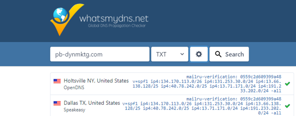
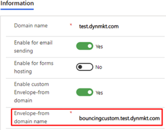
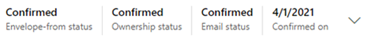

# Troubleshoot domain authentication errors

The domain authentication process can be daunting and confusing. The lack of DNS industry hosting standardization does not make it any easier.

This article is a checklist to help you troubleshoot domains that fail confirmation.

## Check for all required DNS records

The first step in troubleshooting domain authentication issues is to make sure all required DNS records have been added. The following are some how-to documents for editing and creating DNS records with common DNS providers:

- [Cloudflare](https://support.cloudflare.com/hc/articles/200168626-How-do-I-add-a-SPF-record-)
- [GoDaddy](https://www.godaddy.com/help/manage-dns-for-your-domain-names-680)
- [NameCheap](https://www.namecheap.com/support/knowledgebase/article.aspx/317/2237/how-do-i-add-txtspfdkimdmarc-records-for-my-domain)

## Ensure DNS records are updated

The next step is to check that your DNS records have been updated. Depending on your DNS provider, DNS records can take up to 24 hours to update.

One way to determine if a DNS value has been updated is to use a service like [What's My DNS](https://www.whatsmydns.net/).

When you use What’s My DNS, make sure to use the correct hostname and select the DNS record type (TXT for ownership, CNAME for DKIM/Envelope-from) as shown in the image below.

> [!div class="mx-imgBorder"]
> 

### Tips on locating hostnames

#### Ownership hostname

The ownership hostname is the sending domain name you added in the **Domain name** section in Dynamics 365 Marketing.

#### DKIM CNAME records

The DKIM CNAME record hostname is composed of the host portion from inside the CNAME instructions plus the sending domain.

*Examples:*

Dynamics 365 Marketing users should always separate their email flows into marketing and transactional. Usually, marketing emails are sent using a subdomain of your main domain, such as the following:

- **Domain name**: test.dynmkt.com
- **CNAME host part**: namkey1._domainkey
- **Full hostname**: namkey1._domainkey.test.dynmkt.com (Always include the full domain name as added, including the subdomain.)

If you assign your root domain as the sending domain, your setup will look like the following:

- **Domain name**: dynmkt.com
- **CNAME host part**: namkey1._domainkey
- **Full hostname**: namkey1._domainkey.dynmkt.com

#### Envelope-from

To locate the Envelope-from value, copy the Envelope-from domain.

> [!div class="mx-imgBorder"]
> 

## Check the DNS confirmation status

The final step is to check the [DNS confirmation status](mkt-settings-authenticate-domains.md#dns-confirmation-statuses). This process can only be completed only if the status is “confirmed,” as in the image below.

> [!div class="mx-imgBorder"]
> 

> [!NOTE]
> If the status is not yet confirmed, remember to select the **Confirm** button.

The following video guide describes the domain authentication process in detail: [Domain Authentication in Dynamics 365 Marketing](https://community.dynamics.com/365/b/techtalks/posts/domain-authentication-in-dynamics-365-marketing-march-29-2021).

If after trying these troubleshooting steps you still can't determine why your domain authentication is failing, reach out to the support team.

[!INCLUDE[footer-include](../includes/footer-banner.md)]