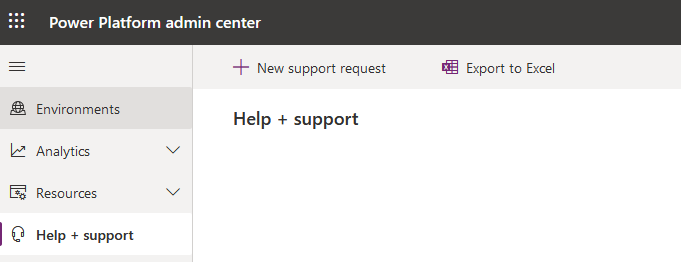
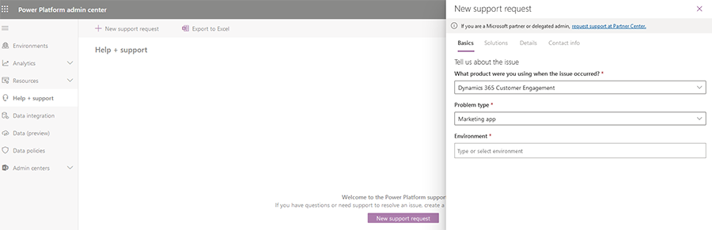

# Frequently asked questions for Dynamics 365 Marketing - General

## Where can I find help for errors, unexpected behavior, crashes, or bugs?

The list below details sources and channels for issues that you can find solutions to in the documentation:

- [Dynamics 365 Marketing community forum](https://community.dynamics.com/365/marketing/f/dynamics-365-for-marketing-forum)
- [Dynamics 365 Marketing ideas site](https://experience.dynamics.com/ideas/categories/?forum=dfa5b83d-9e4c-e811-a956-000d3a1bef07&forumName=Dynamics%20365%20Marketing)
- [Dynamics 365 Licensing Guide](https://go.microsoft.com/fwlink/?LinkId=866544&clcid=0x409)
- [Create a Dynamics 365 support ticket](https://dynamics.microsoft.com/contact-us/)

You can leave feedback on the documentation by selecting **Submit and view feedback for this page** at the bottom of any docs page. You also help us improve our documentation by selecting **Yes** or **No** under **Is this page helpful?** on the right side of any docs page.

## How can I create a support ticket from the Power Platform admin center?

Admins can use the [Help + support experience](https://docs.microsoft.com/power-platform/admin/get-help-support) in the Power Platform admin center to open support requests.

1. Sign in to the [Power Platform admin center](https://admin.powerplatform.microsoft.com/environments) with your admin credentials.
1. Select **Help + support** > **New support request**.

    > [!div class="mx-imgBorder"]
    > 

1. Select **Dynamics 365 Customer Engagement** > **Marketing app**.

    > [!div class="mx-imgBorder"]
    > 

### See also

[Administration and setup FAQ](setup-troubleshooting.md)   