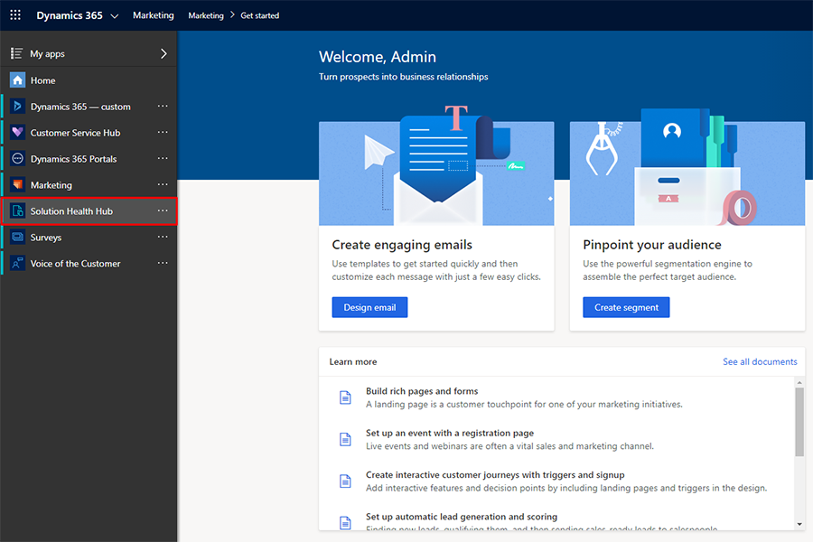
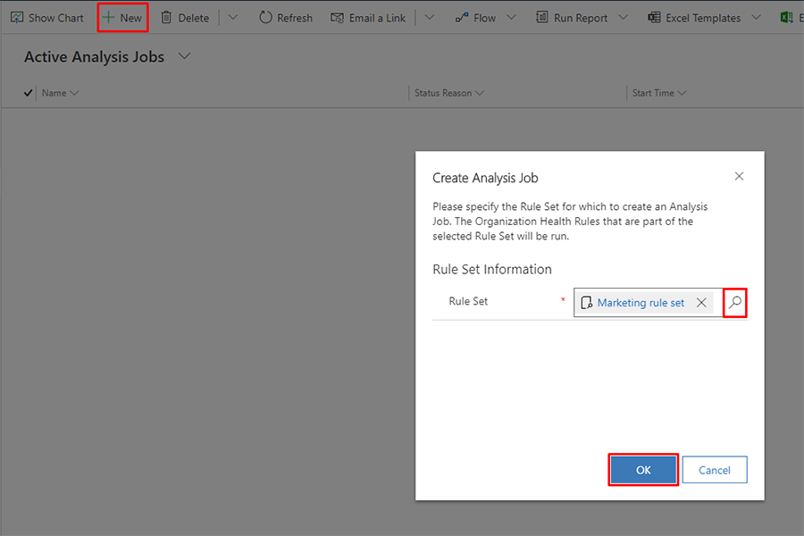
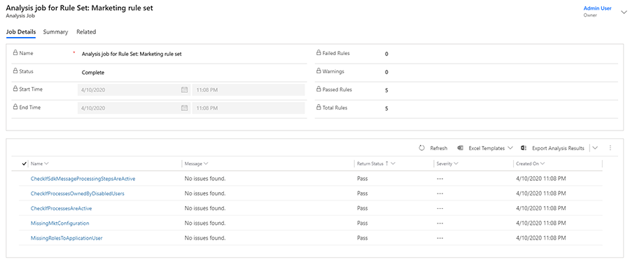
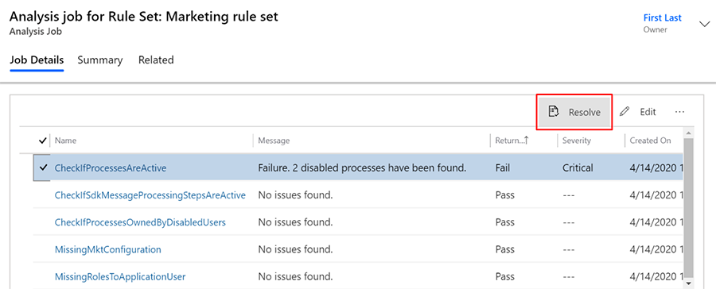
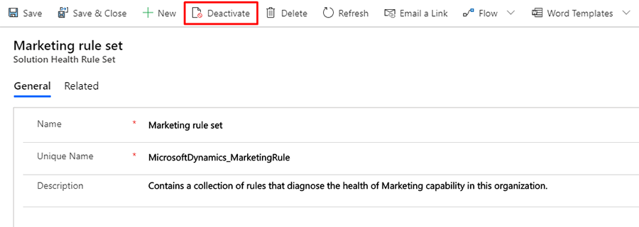

# Troubleshoot Marketing issues with Solution Health Hub

Solution Health Hub detects issues in your Dynamics 365 environment, giving you a better picture of the state of your instances. Your environment's configuration might change over time, due to natural system operations. Solution Health Hub runs rules within an instance to validate the environment's configuration. Some of the rules are specific to Dynamics 365 Marketing. You can run rules on demand when you encounter an issue. Or, you can execute rules automatically, outside of business hours. Automatic execution ensures minimal disruption to your Marketing processes.

Here are a few common issues the Solution Health Hub detects:

1. Whether critical Marketing processes are deactivated.
1. Whether processes that will cause an upgrade failure are assigned to disabled user accounts.
1. Customized web resources that will later lead to runtime issues.

## Prerequisites

- Marketing v1.35.10057.1054 or later.
- Solution Health Hub extends the [Power Apps checker](/powerapps/maker/common-data-service/use-powerapps-checker) to ensure continued healthy operation of an environment.

> [!Note]
> Currently, the Marketing rule set uses five rules to verify that the environment is in a good state.

## Run a health check

To run an analysis job for Marketing:

1. Open the Solution Health Hub app.

    > [!div class="mx-imgBorder"]
    > 

1. On the welcome screen, select **Continue** in the lower right.
1. Select **Analysis Jobs** and create a new analysis job.
1. When the dialog box opens, select **Marketing rule set**.
1. Select **OK** and the analysis job will begin.

    > [!div class="mx-imgBorder"]
    > 

Below are the rules currently included for Marketing:

| Rule name | What it checks |
| --- | --- | 
| CheckIffSdkMessageProcessingStepsAreActive    | Checks whether any [SDK Message Processing Steps](../customerengagement/on-premises/developer/entities/sdkmessageprocessingstep.md) are disabled. Disabled SDK Message Processing Steps result in incorrect behavior when using Dynamics 365 Marketing. | 
| CheckIfProcessOwnedByDisabledUsers    | Checks whether there are any process definitions in the system that are assigned to user accounts that are disabled. If that's the case, upgrading will fail. | 
| CheckIfProcessesAreActive    | Checks whether there are any process definitions in draft status. If there are processes in draft status, Marketing will not work correctly. | 
| MissingMktConfiguration    | Checks for the presence of a Marketing configuration entity record. If the configuration entity record is missing, Marketing will not work properly. | 
| MissingRolesToApplicationUser    | Checks whether MarketingServices ApplicationUser has all required roles assigned. If some of the roles are missing, the Marketing application might not work properly. |

## View health check results

Once you run the analysis job, you will be directed to the overview page. The overview page will automatically refresh when the run has finished. The following screenshot shows an example overview of a run.

> [!div class="mx-imgBorder"]
> 

When running an analysis job, you will see a **Return Status** for each rule, which indicates whether the rule passed, failed, or there was a configuration error. Rules also return a severity if they are failing, which shows how severe each problem is. All possible return status outcomes are listed in the following table.

| Rule return status |     Recommendation|
| --- | --- |  
| Fail    | Highlights specific failures within the system; fix the rule as suggested.| 
| Warning    | Be aware of the implications mentioned in the rule message.| 
| Pass    | Indicates that there are no problems with this rule. All rules should be in this state.| 

## Use health check results to resolve issues

In the Marketing rule set, the following rules support "resolve" actions:

| Rule name                                | Resolve action                                                          |
|-------------------------------------------|--------------------------------------------------------------------------|
| CheckIfSdkMessageProcessingStepsAreActive | Enables deactivated SDK message processing steps.                        |
| CheckIfProcessesAreActive                 | Enables deactivated processes that are listed in the failed records tab. |
| MissingRolesToApplicationUser             | Assigns required roles back to the Marketing service user.               |

To resolve issues found in the Analysis Results tab, select the rule that failed, then click on the **Resolve** button that appears above the rules.

> [!div class="mx-imgBorder"]
> 

## Opt out from automatic rule set execution

If you want to opt out from automatically executing the Marketing rule set, complete the following steps:

1. In the Solution Health Hub, navigate to **Setup** in the left-hand navigation pane and click on **Solution Health Rule Sets**.

    > [!div class="mx-imgBorder"]
    > 

1. Select the **Marketing rule set**.
1. Select **Deactivate** in the top ribbon.

    > [!div class="mx-imgBorder"]
    > 

1. A confirmation window will appear. Confirm that you want to deactivate the rule set by clicking the **Deactivate** button.
1. Inactive rule sets are visible in "Inactive Solution Health Rule Sets" section in the **Solution Health Rule Sets**. You can reactivate inactive rule sets anytime.

[!INCLUDE[footer-include](../includes/footer-banner.md)]