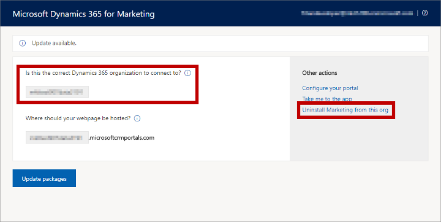

# Uninstall [!INCLUDE[pn-marketing-app-module](../includes/pn-marketing-app-module.md)] from a [!INCLUDE[pn-microsoftcrm](../includes/pn-dynamics-365.md)] instance

You can remove [!INCLUDE[pn-marketing-app-module](../includes/pn-marketing-app-module.md)] from any [!INCLUDE[pn-microsoftcrm](../includes/pn-dynamics-365.md)] instance where you have installed it. After removing it, you'll end up with a free [!INCLUDE[pn-marketing-app-module](../includes/pn-marketing-app-module.md)] entitlement (license) that you can install on another [!INCLUDE[pn-microsoftcrm](../includes/pn-dynamics-365.md)] instance if needed.

To uninstall [!INCLUDE[pn-marketing-app-module](../includes/pn-marketing-app-module.md)]:

1. [Open the Dynamics 365 admin center](dynamics-365-admin-center.md).

1. Select the **Applications** tab to see a list of applications you have installed.  
    

    The list shows a row marked **Dynamics 365 Marketing Application** for each entitlement (license) you have for [!INCLUDE[pn-marketing-business-app-module-name](../includes/pn-marketing-business-app-module-name.md)]. Free entitlements (which can't be uninstalled) show a **Status** of **Not configured**. Installed entitlements show a **Status** of **Configured** and include the name of the instance where they are installed as part of their application name.

1. Select the configured [!INCLUDE[pn-marketing-app-module](../includes/pn-marketing-app-module.md)] entitlement that you want to uninstall and then select the **Manage** button  in the side panel. 

1. The [!INCLUDE[pn-marketing-app-module](../includes/pn-marketing-app-module.md)] setup wizard opens.  It shows the name of the Dynamics 365 instance you are about to uninstall. Make sure you have chosen the right one.  
    

1. Under **Other actions**, select **Uninstall Marketing from this org**.

1. Follow the instructions on your screen to confirm and complete the uninstall.

### See also

[Open the Dynamics 365 admin center](dynamics-365-admin-center.md)  
[Keep Marketing up to date](apply-updates.md)  
[Manage Marketing instances](manage-marketing-instances.md)  