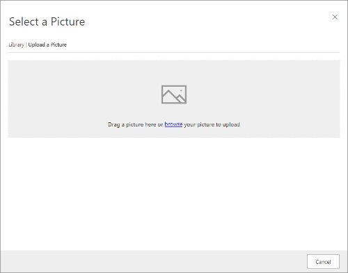
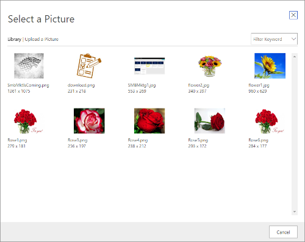

# Upload and use images and files in online content

Images are an important part of most marketing-page and marketing-email designs. The images you use must be available publicly on the internet so your emails and pages can access and display them. Though you could host your images anywhere, one convenient place to keep them is in the Dynamics 365 Marketing image library, which stores the images, hosts them publicly, and provides an image browser that helps you find and place them while working in Dynamics 365 Marketing.

> [!NOTE]
> For security purposes, this feature only allows you to upload image files. The following image formats are supported:
> 
> - GIF
> - BMP
> - JPEG
> - PNG
> 
> You will see an error message if you attempt to upload a file of an unsupported type.

> [!NOTE]
> The maximum file size for uploaded images is 5 MB.

## Upload files to Dynamics 365

Whenever you add an image element to a marketing page or email, you can choose to add an image that already exists in your Dynamics 365 Marketing library or upload a new one. After you've uploaded a file in this way, the file will also be available for use in other designs.

You can also add images for use later in some future design. You might do this to establish a collection of clip-art images that your message and page designers can use as needed. Go to **Marketing** > **Marketing content** > **Files** to see a list view of all files available to your organization, and then select **New** to upload a new file. You can also find and edit existing images here.

Note that you can apply keywords each time you upload a file. Keywords can make it much easier for other users to find and identify files in the future, so we recommend that you use them.

## Establish keywords

Keywords make it easier to find your images later when you want to use them in content. Each time you upload a new image, you're offered a chance to apply a keyword to it. You can also add or remove keywords from existing images by going to **Marketing** > **Marketing content** > **Files**.

To help keep your keywords under control, Dynamics 365 Marketing requires you to establish a list of specific keywords that users can apply to their files. Users must therefore select keywords from a list rather than enter free text. This helps prevent users from applying competing ontologies and also helps prevent typos.

To view and edit the keywords available to your organization, go to **Marketing** > **Marketing content** > **Keywords**. All existing keywords are listed here. Select any listed keyword to edit it, or select **New** to create a new one. You can also delete keywords here.

Be careful when editing or deleting keywords. If you edit an existing keyword, all existing files that use it will instead show the new value from now on. If you delete a keyword, it is simply removed from all files that use it.

## Use images in your content

To add an image to a marketing page or email, start by dragging an image element onto your design, which positions a placeholder. Then select the element with the placeholder image and open the **Properties** tab, where you can define the source, alt text, and link for the image. Select the browse button  for **Source** to open an image browser where you can find any image already uploaded to Dynamics 365 Marketing.

To find an image more quickly, try using the **Filter Keyword** drop-down list to show only images that include the keyword you selected.

If the image you need isn't there, select **Upload a Picture** to add a new one. We recommend that you apply one or more keywords when uploading the image to make it easier for you and others to find later.

### See also

[Manage images](manage-images.md)

[!INCLUDE[footer-include](../includes/footer-banner.md)]