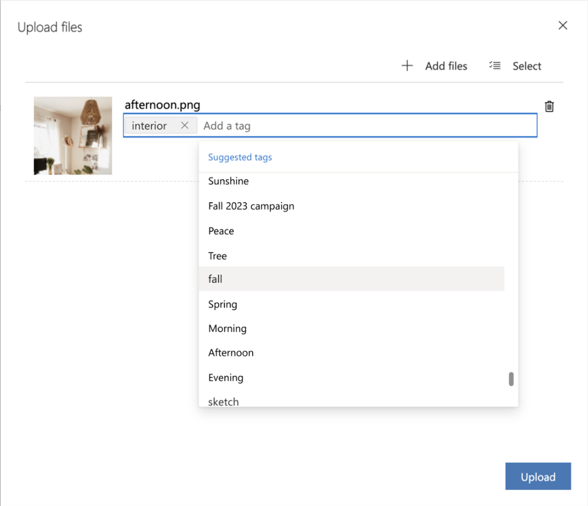

# Upload, manage, and use images, files, and videos in online content

Shareable assets are critical for meaningful and successful customer experiences. The files you use must be available publicly on the internet so your emails and pages can access and display them. The Dynamics 365 Marketing library stores images, documents, and videos, hosting them publicly and providing an easy way to find and link to them while creating content. The library is shared across real-time and outbound marketing, making it easy to upload and use assets where you need them. 

> [!NOTE]
> The following file types are supported: AVI, CS, CSS, DOC, DOCX, EPUB,GIF, JPG, JPEG, MP3, MP4, MPEG, MPG, ODP, ODS, ODT, PDF, PNG, PPT, PPTX, PS, RTF, SVG, TAR, TGZ, TXT, WMV, XLS, XLSX, XML, ZIP
>
> You will see an error message if you attempt to upload a file of an unsupported type. 
> The maximum file size is: 
> - 5MB for images
> - 32MB for documents
> - 128MB for videos
>
> Files are stored in the organization’s Microsoft Dataverse storage and will count against 
> their file storage capacity. For more information on Dataverse storage capacity, see [New 
> Microsoft Dataverse storage capacity](https://learn.microsoft.com/en-us/power-platform/admin/capacity-storage)

> [!TIP]
> As files are stored in the organization’s Microsoft Dataverse storage, ensure that the file types you want to use are not in the list of blocked files extension described at [System Settings General tab - Power Platform](/power-platform/admin/system-settings-dialog-box-general-tab) or the list of blocked MIME types described [here](/power-platform/admin/settings-privacy-security#mime-type-validation). Note that SVG files are in that list by default.  

## Upload files

You can create a collection of images, videos, and files for later use. To upload new files, go to **Real-time marketing > Assets > Library** and select **New**.

> [!div class="mx-imgBorder"]
> 

You can manually add **tags** when you upload a file so it’s easier to organize and find it later.

Additionally, thanks to enhanced AI tagging, tags are automatically generated any time you upload images to the library.

> [!IMPORTANT]
> The AI tagging feature is currently in preview.

When you add an image element to your content or need to [link to a file or video](/dynamics365/marketing/real-time-marketing-email#link-to-documents-and-videos-stored-in-the-asset-library), you can choose to use a file that already exists in your Marketing app library or upload a new one. After you've uploaded a file in this way, it will also be available in the library for use in other content.

## Edit assets 
You can easily see and edit asset details in the side pane. Simply select the asset to rename, add tags and alt text, and copy the asset URL.

You can **replace** your assets with newer versions whenever needed. To replace an asset:
1. Select the image.
2. Select **Upload file** in the command bar.
3. Select a new image.
4. A new version of the asset appears in the asset library. The new version will also appear wherever the asset is currently being used.
5. If you open the asset, you can see the version number, but you can't view the previous versions.

## Find assets
Use the tabs to quickly switch between files categories such as images, videos, or documents. You can use the search bar at the top to search assets by name or use the filter to quickly find assets by tag.

## Use images in your content

To add an image, start by dragging an image element onto your design, which positions a placeholder. Then select the placeholder image to open the **Edit image** tab, where you can define the source, alt text, and link for the image. Select **Choose an image** > **Browse library** to find any image already uploaded to Dynamics 365 Marketing.

> [!div class="mx-imgBorder"]
> 

To find an image more quickly, try using the **Filter** search bar to look for specific keywords.
If the image you need isn't there, select **+Upload** to add a new one.

Additionally, the Copilot assistant automatically identifies a selection of images from your library that best complement your content. Quickly and easily choose images that resonate with your audience without having to spend time searching for them.

### See also

[Link to documents stored in the asset library](/dynamics365/marketing/real-time-marketing-email#link-to-documents-and-videos-stored-in-the-asset-library)

[!INCLUDE[footer-include](../includes/footer-banner.md)]
