# What's new in Dynamics 365 Marketing

[!INCLUDE[marketing-trial-cta](../shared/trials/marketing-trial-cta.md)]

We're excited to announce our newest updates! This article summarizes early access features, preview features, general availability enhancements, monthly updates, and bug fixes. To see the long-term feature plans, take a look at the [Dynamics 365 and Power Platform release plans](/dynamics365/release-plans/).

Marketing updates are [pushed to customers automatically](https://cloudblogs.microsoft.com/dynamics365/it/2020/04/27/automatic-update-policy-for-dynamics-365-marketing/). Solutions are available for early validations. To manually update your instances, follow the steps in [Keep Marketing up to date](apply-updates.md).

To submit and vote on **feature requests** and **product suggestions**, go to the [Dynamics 365 Application Ideas portal](https://experience.dynamics.com/ideas/categories/?forum=dfa5b83d-9e4c-e811-a956-000d3a1bef07&forumName=Dynamics%20365%20Marketing).

## 2022 updates

### December 2022 update

For the December 2022 release, general availability features include custom channels that allow you to extend your outreach in real-time marketing, date and time formatting flexibility for different locales, and access to more personalization data. Public preview features include real-time marketing lead capture forms that convert visitors into customers and filtering for email lists.

Starting this month, we’ll highlight recently published blogs and scenario documentation in addition to the product docs that support the newly released features.

> [!IMPORTANT]
> This release brings changes to the real-time marketing consent system and underlying Dataverse entities. This change is transparent to users **who do not** have code that directly reads or writes to the **msdynkmt_compliancesettings** or **msdynmkt_contactpointconsent2** Dataverse entities. As part of the upgrade to this release, any user who enables the [Preview: Create and manage real-time marketing forms](real-time-marketing-form-editor.md) feature will have their consent data automatically migrated to use the new entities. Most users will not need to take any action in response to this change.
>
> Users who have code that directly interacts with the **msdynkmt_compliancesettings** and **msdynmkt_contactpointconsent2** Dataverse entities will need to make changes after this release to direct their code to read/write to the new **msdynkmt_compliancesettings3** and **msdynmkt_contactpointconsent3** Dataverse entities.
>
> To aid in the transition, we will continuously scan for new records written to the to-be-deprecated **msdynmkt_contactpointconsent2** entities and automatically copy them to new **msdynkmt_compliancesettings3** entities. Copies may take up to 48 hours to complete. We will disable this automatic copy in a future release.
>
> In the future, all users will be migrated to make use of these new entities. For the time being, only users who have opted into the real-time marketing forms preview will have their data automatically migrated.

#### Version number

| App              | GA release      |
|------------------|-----------------|
| Marketing        |  1.90.2011.0    |

> [!Tip]
> To check your current version number, go to **Settings** > **Overview** > **Versions**.

#### General availability features

- **Extend your outreach with custom channels**
    - Extend real-time marketing using the communication channels you're familiar with to engage your customers in moments that matter. Use real-time marketing personalization, consent, and analytics tools to create compelling content and deliver it over your preferred communication channels such as a local SMS provider or WhatsApp. Capitalize on proven channels, plug any of them into your new or existing journeys, and unfold their true potential with Dynamics 365 Marketing to maximize customer engagement.
    - [Release plan](/dynamics365-release-plan/2022wave2/marketing/dynamics365-marketing/extend-outreach-custom-channels)
    - [Docs](real-time-marketing-create-custom-channels.md)

    > [!div class="mx-imgBorder"]
    > 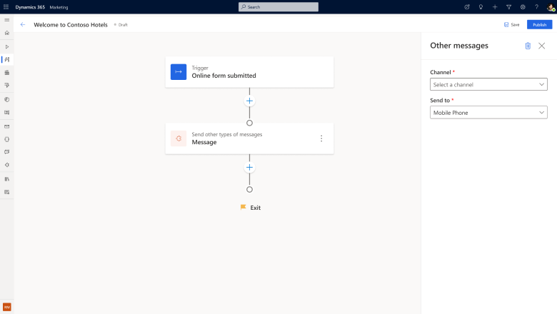

- **Communicate dates and times in a variety of formats**
    - When working in multiple geographies and languages, communicating dates and times clearly requires using a format that matches the recipient's expectations. To make sure your customers always receive the correct information, real-time marketing supports a variety of date and time formats. Whenever dynamic text is defined using a "datetime" type attribute, an additional set of options becomes available to select a date/time format that is readable and consistent with the locale (language and region) of the audience. If desired, you can also change the locale, and time zone to match the audience. The Marketing app then automatically converts the stored date/time to the selected time zone.
    - [Release plan](/dynamics365-release-plan/2022wave2/marketing/dynamics365-marketing/communicate-dates-times-variety-formats)
    - [Docs](real-time-marketing-predefined-dynamic-text.md#communicate-dates-and-times-in-various-formats)

    > [!div class="mx-imgBorder"]
    > 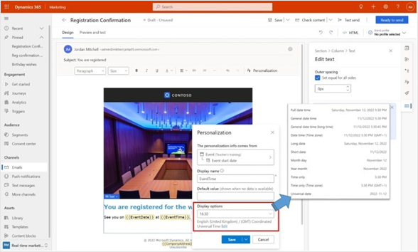

- **Access even more data to personalize your customer outreach**
   - You're no longer limited to accessing Dataverse tables that are directly related to an Audience or Triggers. Now, you can access any Dataverse table to include information in your communications. For example, for a product launch email, you may want to include product information, image, and SKU number. Such details may be available in a Product table, which you can now use for personalization.
   - [Docs](real-time-marketing-predefined-dynamic-text.md#access-even-more-data-for-personalization)

    > [!div class="mx-imgBorder"]
    > 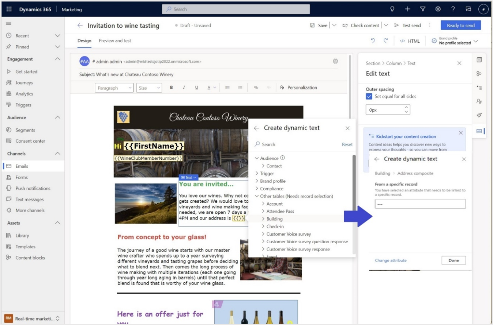

#### Public preview

- **Create lead capture forms that convert visitors to customers**
   - Now in real-time marketing, create modern website forms that capture your customers' attention while allowing them to enter their data. Use the drag-and-drop editor to create forms that collect marketing data, convert visitors into leads, and convert leads into paying customers. With the new form editor, you can create robust forms without relying on complex code and developers.
   - [Release plan](/dynamics365-release-plan/2022wave2/marketing/dynamics365-marketing/create-lead-capture-forms-that-convert-visitors-customers)
   - [Docs](real-time-marketing-form-editor.md)

    > [!div class="mx-imgBorder"]
    > 

- **Fine-tune email communications with filtered lists**
   - Including an entire list in an email is a common scenario. But there are times when it's more effective to only include items from a list that meet certain conditions. For example, in a confirmation email about an order, you may need to separately list items that are back ordered. Similarly, communication about a multi-session conference is easier to consume if the sessions are organized by topic or track. Now you can easily achieve these scenarios by simply adding a filter to your email list.
   - [Docs](real-time-marketing-personalize-lists.md#define-a-list-filter)

    > [!div class="mx-imgBorder"]
    > 

#### Monthly enhancements

- **Real-time marketing journeys**
   - Delete real-time marketing journeys directly from list view and remove unused or abandoned journeys. Maintain full control of your journey list and focus on the right journeys when you need them.
   - Tailor your user experience by disabling create and edit functionality for journeys on mobile devices.
- **Real-time segment builder**
   - Create segments using more attributes that are indirectly related to the Contact or Lead. For example, you can use attributes like the event sessions a Contact has checked into in a conference or webinar they attended. Use attributes from Dataverse tables that have up to five degrees of separation from the Contact or Lead table (up from three previously).

    > [!div class="mx-imgBorder"]
    > 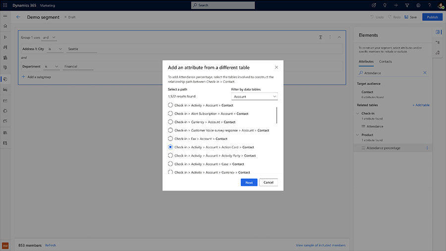

#### New blogs and scenario docs

Learn about making the most of the new Dynamics 365 Marketing features in our latest blogs and scenario docs:

- [5 steps for transforming customer experience with Dynamics 365 - Dynamics 365 Blogs for BDM](https://cloudblogs.microsoft.com/dynamics365/bdm/2022/11/29/5-steps-for-transforming-customer-experience-with-dynamics-365-marketing-and-customer-insights-updates/)
- [Engage your customers faster with AI-powered marketing email content - Dynamics 365 Blogs for IT Pro](https://cloudblogs.microsoft.com/dynamics365/it/2022/11/30/engage-your-customers-faster-with-ai-powered-marketing-email-content/)
- [’Tis the season for exceptional customer experiences - Microsoft Industry Blogs](https://cloudblogs.microsoft.com/industry-blog/retail/2022/12/01/tis-the-season-for-exceptional-customer-experiences/)
- [Deploying Event Portal Changes in Dynamics 365 Marketing - Dynamics FastTrack Blogs](https://community.dynamics.com/365/dynamics-365-fasttrack/b/dynamics-365-fasttrack-blog/posts/deploying-event-portal-changes-in-dynamics-marketing)
- [Trigger a Plugin from Custom Trigger - Dynamics FastTrack Blogs](https://community.dynamics.com/365/dynamics-365-fasttrack/b/dynamics-365-fasttrack-blog/posts/trigger-a-plugin-from-custom-trigger)
- [Extracting Marketing Interactions in Dynamics 365 Marketing - Dynamics FastTrack Blogs](https://community.dynamics.com/365/dynamics-365-fasttrack/b/dynamics-365-fasttrack-blog/posts/extracting-marketing-interactions-in-dynamics-365-marketing)
- [Transition from Outbound to Real-time Marketing Playbook - Dynamics FastTrack Blogs](https://community.dynamics.com/365/dynamics-365-fasttrack/b/dynamics-365-fasttrack-blog/posts/transition-from-outbound-to-real-time-marketing-playbook)
- [Send a targeted email blast in real-time marketing - Scenario doc](/dynamics365/marketing/real-time-marketing-email-get-started)

### November 2022 update

The Dynamics 365 Marketing November 2022 update includes one preview feature and one monthly enhancement. The preview feature enables date and time formatting flexibility for different locales. The monthly enhancement improves personalization access and usability.

#### Version number

| App              | GA release      |
|------------------|-----------------|
| Marketing        | 1.89.2008.0     |

> [!Tip]
> To check your current version number, go to **Settings** > **Overview** > **Versions**.

#### Preview feature

- **Communicate dates and times in a variety of formats**
    - When working in multiple geographies and languages, communicating dates and times clearly requires using a format that matches the recipient's expectations. To make sure your customers always receive the correct information, real-time marketing supports a variety of date and time formats. Whenever dynamic text is defined using a "datetime" type attribute, an additional set of options becomes available to select a date/time format that is readable and consistent with the locale (language and region) of the audience. If desired, you can also change the locale, and time zone to match the audience. The Marketing app then automatically converts the stored date/time to the selected time zone.
    - [Release plan](/dynamics365-release-plan/2022wave2/marketing/dynamics365-marketing/communicate-dates-times-variety-formats)

    > [!div class="mx-imgBorder"]
    > 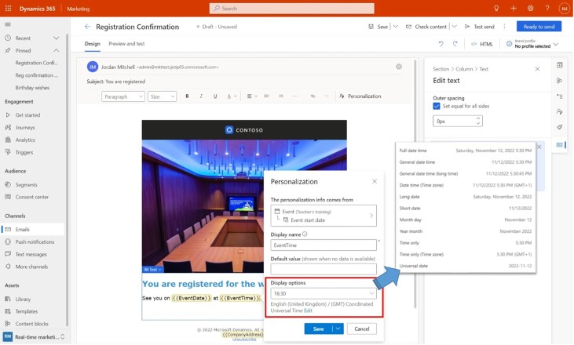

#### Monthly enhancements

- **Usability improvements in the personalization pane**
    - The personalization pane in the email editor provides one-stop access to personalization-related capabilities. Personalization placeholders are grouped according to their types. You can expand and collapse the groups to help with readability. Specific records are used to access additional personalization data such as event details, orders, or products. Specific records in use are identified at the top of the side pane and on the info card for each personalization placeholder that uses them. Conditions created by conditional content are also available on the pane (as “Element conditions”) for review and updating.

### October 2022 update

Dynamics 365 Marketing’s 2022 wave 2 release has arrived! The October 2022 update has six general availability features and four public previews from the [2022 wave 1 release plans](/dynamics365-release-plan/2022wave2/marketing/dynamics365-marketing/). The general availability features include advanced personalized content blocks, the ability to make quick updates and manage version control for journeys, brand profiles that allow you to easily manage content across multiple brands, the ability to test all custom triggers before using them in a journey with real customers, QR codes in emails for coupons and events, and feature-rich links in emails for websites, surveys, events, marketing pages, Microsoft Teams events, and calendar items.

The public preview features include custom channels that allow you to extend your outreach in real-time marketing, natural language segment creation in real-time marketing, static segments in real-time marketing, and the ability to create segments in real-time marketing where specific people are always included or excluded.

Monthly improvements include updates to personalization, segmentation, and text messaging capabilities.

#### Version number

| App              | GA release      |
|------------------|-----------------|
| Marketing        | 1.88.2018.0     |

> [!Tip]
> To check your current version number, go to **Settings** > **Overview** > **Versions**.

#### General availability feature

- **Drive engagement at scale with highly tailored audience-specific content**
    - Conditional content helps deliver highly tailored content to drive engagement. Make the conditional content reusable by saving it in a content block. Anyone on your team can then reuse these advanced personalized content blocks in different messages to achieve personalization at scale with ease and efficiency. Use cases for advanced personalized content blocks include differentiated company contact information, depending on the recipient’s location; varying offers, depending on loyalty program membership levels; delivering required legal text in the language that matches the recipient’s language preference; and, a content block that delivers different discounts (for example, 10%, 20%, or 30% off) using unique criteria to qualify each recipient.
    - [Release plan](/dynamics365-release-plan/2022wave2/marketing/dynamics365-marketing/drive-engagement-at-scale-highly-tailored-audience-specific-content)
    - [Content blocks docs](content-blocks.md)
    - [Conditional content docs](conditional-content.md)

    > [!div class="mx-imgBorder"]
    > 

- **Make incremental updates and optimize journeys while analyzing all past versions**
    - Editing journeys is now easier and more collaborative. You can now make light edits to live journeys, such as renaming elements and adjusting goal percentages without creating new versions. Also, because the Marketing app automatically version-tracks each update, you can make complex and structural changes to journeys confidently and collaboratively with your team. This makes editing journeys as simple as editing documents; each change is tracked and is available for auditing.
    - [Release plan](/dynamics365-release-plan/2022wave2/marketing/dynamics365-marketing/make-incremental-updates-optimize-journeys-while-analyzing-all-past-versions)
    - [Docs](real-time-marketing-edit-journey.md)

    > [!div class="mx-imgBorder"]
    > 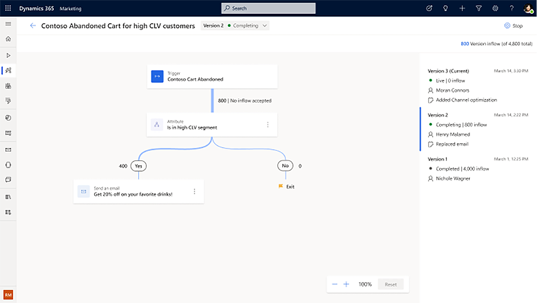

- **Easily manage content across multiple brands in the email designer**
    - Brand profiles allow you to manage different brands easily. Reduce content-related errors by defining default senders for emails and default social links. Extend your brand profile entity with custom values that you can use when creating content. Create multiple profiles for your organization and for each of your business units.
    - [Release plan](/dynamics365-release-plan/2022wave2/marketing/dynamics365-marketing/create-consistent-content-brand-profiles)
    - [Docs](brand-profiles.md)

    > [!div class="mx-imgBorder"]
    > 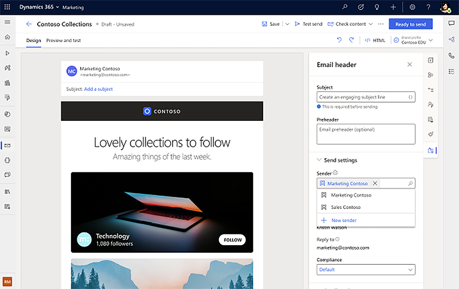

- **Test all paths customers take before publishing journeys**
    - Testing custom triggers before using them in a journey is the safest way to ensure that your expectations meet the customer's reality. The test send feature gives you reassurance in the quality and behavior of your custom triggers before you send them to your audience. To test your custom triggers, you can run internal users through the journey to determine if your triggers work correctly, and validate the path that your customers will take.
    - [Release plan](/dynamics365-release-plan/2022wave2/marketing/dynamics365-marketing/test-every-path-customers-will-take-before-publish-journey)
    - [Docs](real-time-marketing-test-triggers.md)

    > [!div class="mx-imgBorder"]
    > 

- **Increase customer engagement with QR codes in emails**
    - Increase customer engagement and promote your business using QR codes for events or coupons. QR codes allow your customers to access marketing event information or dynamic links with just a single scan! QR codes work by simply scanning the code with a mobile device that is equipped with a camera and QR code reader application. Once the QR code is scanned, it's translated into actionable information such as a webpage or event check-in.
    - [Release plan](/dynamics365-release-plan/2022wave2/marketing/dynamics365-marketing/increase-customer-engagement-qr-codes-emails)
    - [Docs](real-time-marketing-email.md#link-to-qr-codes)

    > [!div class="mx-imgBorder"]
    > 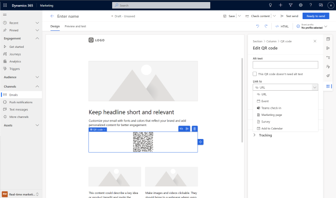

- **Create engaging email content using feature-rich text links**
    - Create engaging email content with text links to websites, events, and marketing pages. The text links can also allow recipients to join a Microsoft Teams event or create a new calendar item with a click of a button.
    - [Release plan](/dynamics365-release-plan/2022wave2/marketing/dynamics365-marketing/create-engaging-email-content-using-feature-rich-text-links)
    - [Docs](real-time-marketing-email.md#link-to-documents-and-videos-stored-in-the-asset-library)

    > [!div class="mx-imgBorder"]
    > 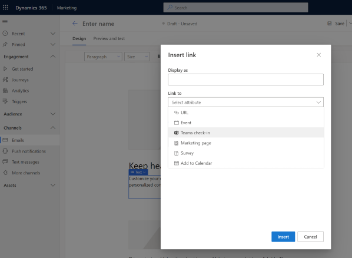

#### Preview features

- **Extend your outreach with custom channels**
    - Extend real-time marketing using the communication channels you're familiar with to engage your customers in moments that matter. Use real-time marketing personalization, consent, and analytics tools to create compelling content and deliver it over your preferred communication channels such as a local SMS provider or WhatsApp. Capitalize on proven channels, plug any of them into your new or existing journeys, and unfold their true potential with Dynamics 365 Marketing to maximize customer engagement.
    - [Release plan](/dynamics365-release-plan/2022wave2/marketing/dynamics365-marketing/extend-outreach-custom-channels)
    - [Docs](real-time-marketing-create-custom-channels.md)

    > [!div class="mx-imgBorder"]
    > 

- **Use natural language to create segments in real-time marketing**
    - Segment creation traditionally required extensive knowledge of the complex data structures defined by your business. Now, instead of selecting specific data tables manually, you can use natural language to create segments in real-time marketing by simply describing the segment definition in plain English. This flexible experience lets you add the results query onto the segment builder at any level of the query logic, either as a new group or as an additional condition in your existing logic. You can improve the natural language engine by giving thumbs-up or down feedback so that it can help you achieve even more accurate results in the future.
    - [Release plan](/dynamics365-release-plan/2022wave2/marketing/dynamics365-marketing/use-natural-language-create-segments-real-time-marketing)
    - [Docs](real-time-marketing-natural-language-segments.md)

    > [!div class="mx-imgBorder"]
    > 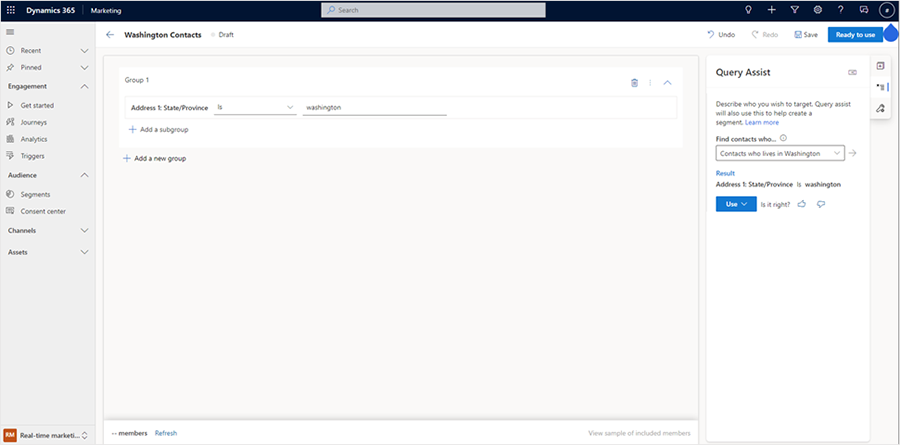

- **Create a static snapshot of segment membership**
    - Static segment lists are an important part of audience management for marketers. Use static segments in one-off campaigns or newsletters where it’s essential to implement segment membership based on a specific date or time. Static segments ensure that new people that become eligible for the segment won't enter the one-off journey, even if it continues to be live. You can create static snapshots no matter how the segment is built (whether it uses query conditions or manual inclusions or exclusions). The flexibility in static segment creation separates how segments are defined from how you want to update or refresh segments.
    - [Release plan](/dynamics365-release-plan/2022wave2/marketing/dynamics365-marketing/create-static-snapshot-real-time-marketing-segment-membership)
    - [Docs](real-time-marketing-static-snapshot.md)

    > [!div class="mx-imgBorder"]
    > 

- **Create a segment where specific people are always included or excluded**
    - Adding manual inclusions or exclusions is a powerful way to augment segment building criteria. Manually include or exclude specific people to ensure segments always reach VIP customers, or just as an easy way to build test segments for journeys.
    - [Docs](real-time-marketing-include-exclude.md)

    > [!div class="mx-imgBorder"]
    > 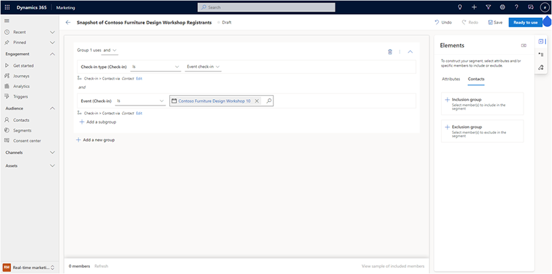

#### Monthly enhancements

- **Personalization**
    - While conditional content can be used for selecting the right image in a lot of scenarios, there are times when it's more natural to use a dynamic URL that comes from a Contact or some other entity when the content designer doesn’t have the visibility into (or doesn’t want to be involved in) how images are selected. Personalization is now supported in image URL boxes in the email designer, allowing you to use dynamic URLs for images.
- **Segmentation**
    - **[Preview]** You no longer must rely on admins to select data tables to be synced into the Marketing app to get started with segmentation. In real-time marketing, instead of waiting for admins to add data tables under **Dataset Configurations** in the **Settings** area, you can add tables to be used for creating segments to the list in the building experience itself.
        - [Docs](real-time-marketing-sync-data-tables.md)
    - **[Preview]** Build segments using multiple query logic groups. This opens more segment scenarios and more enriched segment definitions, such as “Contacts whose accounts are managed by partners in Contoso Consultants *but not* preferred to be contacted by phone”.
        - [Docs](real-time-marketing-build-segments.md#preview-add-a-new-group-to-a-segment)

### September 2022 update

The Dynamics 365 Marketing September 2022 update has one general availability feature from the [2022 wave 1 release plans](/dynamics365-release-plan/2022wave1/marketing/dynamics365-marketing/). The general availability feature—conditional dynamic content—enables marketers to create personalized messaging more quickly and easily. Monthly enhancements include improvements to personalization and triggers.

Additionally, real-time marketing features are now available in France and Switzerland, completing geographical parity between real-time marketing and outbound marketing features.

#### Version number

| App              | GA release      |
|------------------|-----------------|
| Marketing        | 1.87.2024.0     |

> [!Tip]
> To check your current version number, go to **Settings** > **Overview** > **Versions**.

#### General availability feature

- **Win customer attention by creating conditional dynamic content with easy-to-use no-code experiences**
    - Conditional dynamic content is key to delivering highly personalized messages to customers. Creating content where entire sections target specific customer segments allows you to craft messages that align with your customers’ interests and preferences, driving engagement and brand loyalty. Until now, achieving this level of dynamic content was complex and required coding. With the new conditional content experience, marketers can easily create messages targeted to specific segments or attributes, bringing content that is truly unique to each customer without writing any code.
    - [Release plan](/dynamics365-release-plan/2022wave1/marketing/dynamics365-marketing/win-customer-attention-creating-conditional-dynamic-content-easy-to-use-no-code-experiences)
    - [Docs](conditional-content.md)

    > [!div class="mx-imgBorder"]
    > 

#### Monthly enhancements

- **Personalization**
    - **[Preview]** Access even more data for personalization and fine-tune your customer outreach. In previous releases, you were limited to accessing Dataverse tables that were directly related to an Audience or Triggers. Now, you can access many additional commonly used Dataverse tables, such as Events.
- **Triggers**
    - Testing triggers before using them in a journey is the safest way to ensure that your expectations meet the customer's reality. The test send feature gives you reassurance in the quality and behavior of your custom triggers before you send them to your audience. For example, when you create an abandoned cart journey, you can use the test send feature to ensure that your “cart abandoned” custom trigger behaves as expected.
        - [Docs](real-time-marketing-test-triggers.md)
- **Real-time marketing geo expansion**
    - Real-time marketing features are now available in all geographies where Dynamics 365 Marketing is available. You can find a list of geographies on [Dynamics 365 and Power Platform availability](https://dynamics.microsoft.com/availability-reports/).

### August 2022 update

The Dynamics 365 Marketing August 2022 update has one general availability feature from the [2022 wave 1 release plans](/dynamics365-release-plan/2022wave1/marketing/dynamics365-marketing/). It also includes a public preview from [2022 wave 2 release plans](/dynamics365-release-plan/2022wave2/marketing/dynamics365-marketing/). The general availability feature is a new email creation canvas and user experience. The public preview feature allows you to use AI-powered content ideas to kickstart email creation, now with built-in default data so you don’t have to create dozens of emails to get started.

Additionally, this update includes improvements to real-time journeys and personalization.

#### Version number

| App              | GA release      |
|------------------|-----------------|
| Marketing        | 1.86.2014.0     |

> [!Tip]
> To check your current version number, go to **Settings** > **Overview** > **Versions**.

#### General availability feature

- **Create emails faster with precise drag-and-drop, in-context menu, and easy-select interactions**
    - The reimagined email editor is optimized for a productive workflow, allowing you to quickly create engaging and relevant content. With this release, the editor is further enhanced with precise drag-and-drop interactions, easy selection of elements, columns, or sections, and an in-context menu for faster content creation so you can create pixel-perfect emails in minutes.
    - [Release plan](/dynamics365-release-plan/2022wave1/marketing/dynamics365-marketing/create-emails-faster-precise-drag-and-drop-in-context-menu-easy-select-interactions)
    - [Docs](create-marketing-email.md)

    > [!div class="mx-imgBorder"]
    > 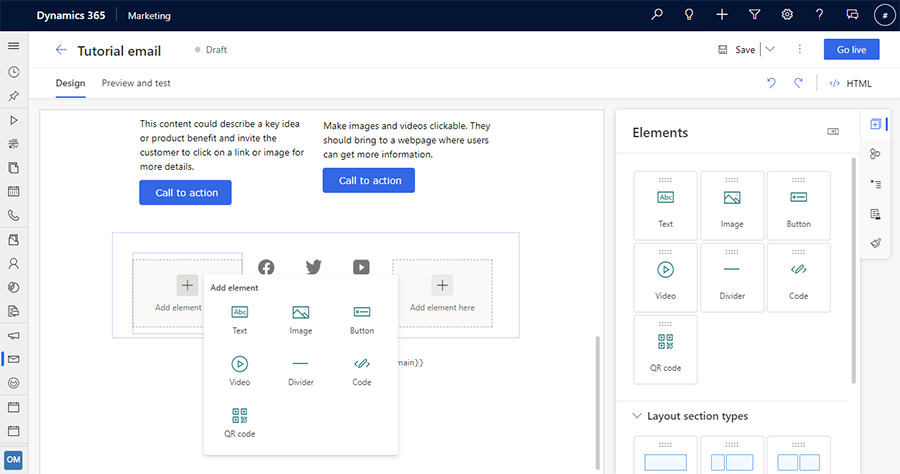

#### Preview feature

- **Boost your creativity with AI-powered email content ideas**
    - Content ideas help you find writing inspiration. You can use content ideas as a starting point when creating email content—it’s like asking a group of colleagues to brainstorm with you. Content ideas make creating emails simpler, more efficient, and fun. It's a new and innovative functionality with the latest AI technologies (GPT-3 language model) behind the scenes. Now, content ideas includes default email content data, allowing users to get up and running even quicker.
    - [Release plan](/dynamics365-release-plan/2022wave2/marketing/dynamics365-marketing/boost-creativity-ai-powered-email-content-ideas)
    - [Docs](content-ideas.md)

    > [!div class="mx-imgBorder"]
    > 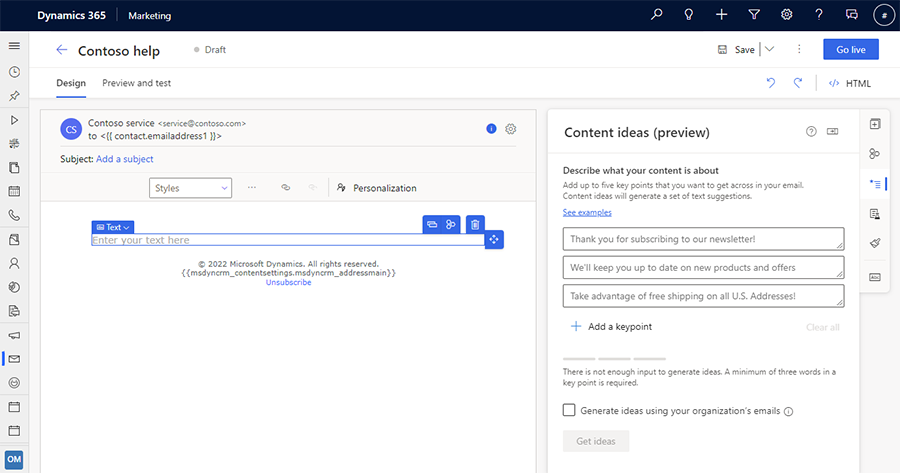

#### Monthly enhancements

- **Real-time journeys**
    - Deliver more personalized experiences by accessing a richer set of trigger data for defining the journey entry/exit criteria, conditions/branches, and waits. When you add any of these elements to the journey, you will now be able to see data attributes not only from the trigger’s core entity/table, but also from entities/tables directly related to those attributes. For example, when creating a journey to nurture new opportunities (using the “Opportunity created” trigger), you can branch the journey based on the “budget” attribute from the Opportunity table. This enables you to create journey variations for opportunities that are more likely to buy.
    - [Docs](real-time-marketing-personalize-triggers.md)

        > [!div class="mx-imgBorder"]
        > 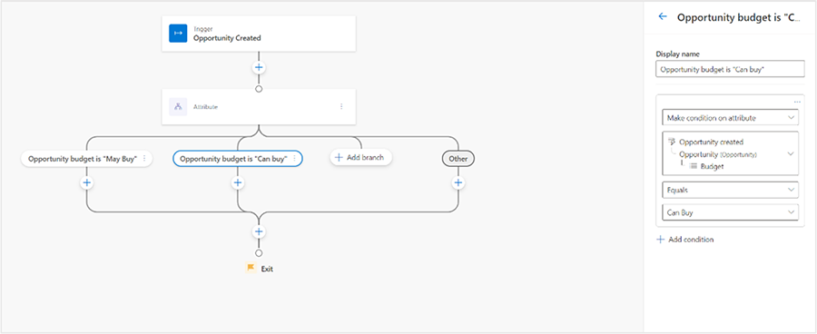

    - Multiple branch journeys now include a detailed analytics view. The detailed analytics view for the attribute branch allows you to see a preview of journey audience details such as name, ID, type, and time. This helps you gain additional insights into how the journey is executing.

        > [!div class="mx-imgBorder"]
        > 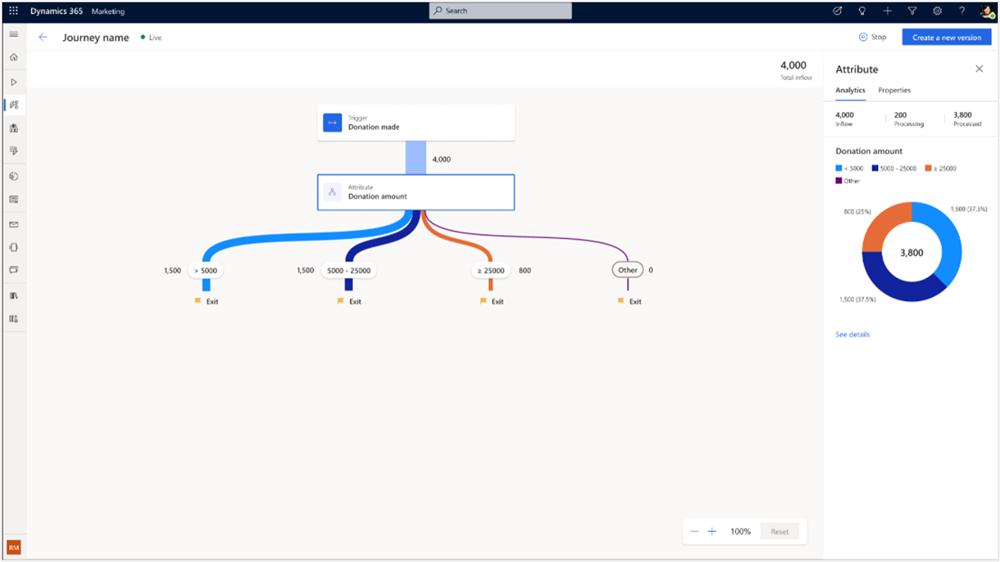

        > [!div class="mx-imgBorder"]
        > 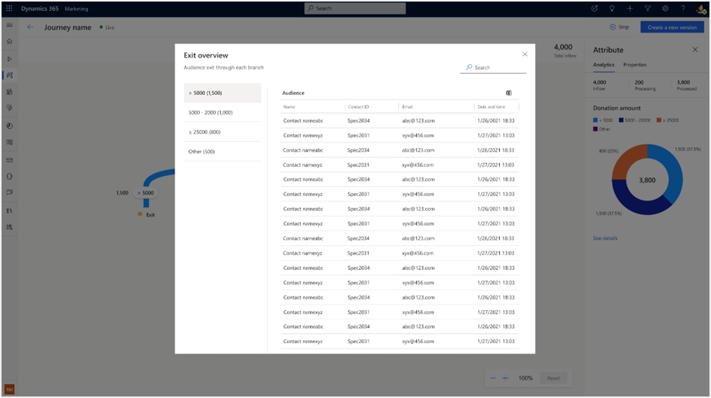

- **Personalization**
    - Conditional content (preview) enhancements: Preview and test send now remove content variations that are not possible. You can also give the default a name (like other variations) to help explain situations where the content will be used.

### July 2022 update

The Dynamics 365 Marketing July 2022 update has four general availability features and one pubic preview from the [2022 wave 1 release plans](/dynamics365-release-plan/2022wave1/marketing/dynamics365-marketing/). It also includes a public preview from the [2022 wave 2 release plans](/dynamics365-release-plan/2022wave2/marketing/dynamics365-marketing/). The general availability features include reusable content blocks for quick email creation, the ability to continue customer conversations by taking action on text message replies, multiple journey branches to create more personalized variations, and a new channel analytics dashboard to track delivery and engagement metrics across multiple channels.

The public preview features include the ability to edit live journeys with improved version tracking capabilities for real-time marketing journeys and brand profiles including custom sender profiles, social links, and custom fields for better branding consistency within organizations.

The update also includes improvements to real-time journeys, the text message channel, and event management.

#### Version number

| App              | GA release      |
|------------------|-----------------|
| Marketing        | 1.85.2012.0     |

> [!Tip]
> To check your current version number, go to **Settings** > **Overview** > **Versions**.

#### General availability enhancements

- **Quickly create emails with enhanced reusable content blocks**
    - Content blocks are reusable pieces of content that let you easily assemble rich and consistent emails. New and enhanced content blocks are now available in outbound and real-time marketing. The enhanced content blocks can include all standard elements such as text, images, and buttons, as well as custom layouts and personalization.
    - [Release plan](/dynamics365-release-plan/2022wave1/marketing/dynamics365-marketing/quickly-create-emails-enhanced-reusable-content-fragments)
    - [Docs](content-blocks.md)

    > [!div class="mx-imgBorder"]
    > 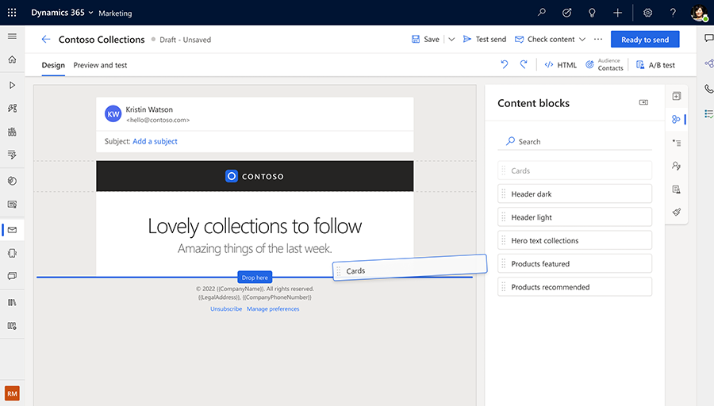

- **Continue the conversation with your customers by taking action on their text message replies**
    - Text messaging allows you to quickly communicate with customers. But it’s not enough to just send messages out, you also need to act on text message responses. Now, you can interact with your customers by creating journeys based on their replies to your text messages. Create custom keywords and add them to your messages and journey branches to continue the conversation with your customers.
    - [Release plan](/dynamics365-release-plan/2022wave1/marketing/dynamics365-marketing/continue-conversation-customers-taking-action-their-sms-replies)
    - [Docs](set-up-automated-sms-keyword-flow.md)

    > [!div class="mx-imgBorder"]
    > 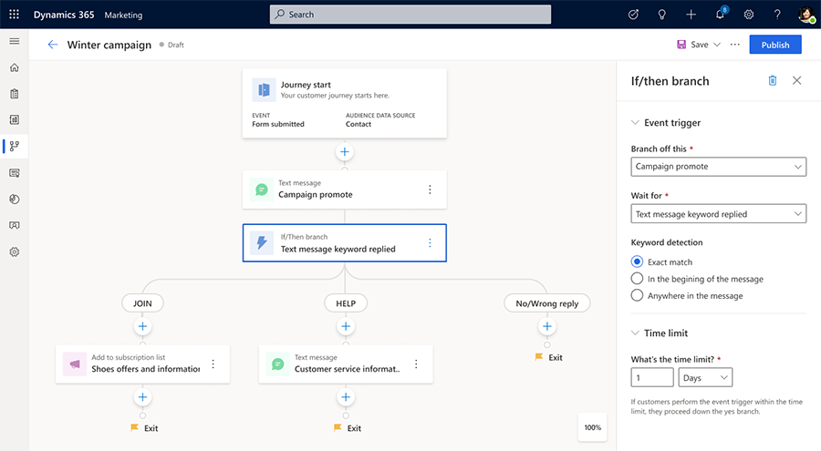

- **Create more personalized journey variations using multiple journey branches**
    - Journey branches let you create personalized journeys for customers, engaging them in different ways based on who they are and their past actions. Create more than two branches at any given step in the journey—creating more fine-grained personalization and engaging each customer differently based on their unique profile and behavioral signals. This eliminates the need to nest branches and makes analyzing journeys easier. Merge the branches back so that customers can continue the common journey steps after going through their specialized branches.
    - [Release plan](/dynamics365-release-plan/2022wave1/marketing/dynamics365-marketing/create-more-personalized-journey-variations-using-multiple-journey-branches)
    - [Docs](real-time-marketing-multiple-branches.md)

    > [!div class="mx-imgBorder"]
    > 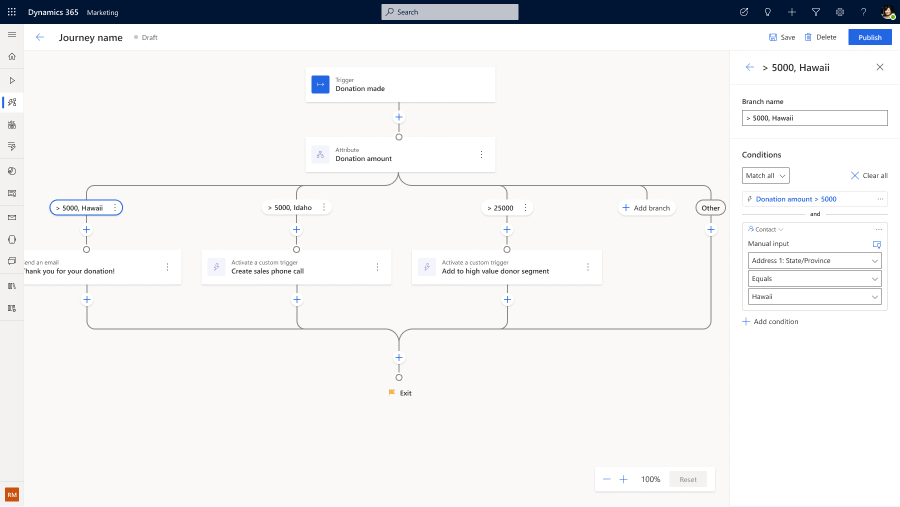

- **Measure campaign effectiveness with a new channel analytics dashboard**
    - To create effective campaigns, you need to continuously track asset delivery across multiple channels. You also need to review campaign engagement metrics so that you can make improvements where needed. With the new out-of-the-box aggregated channel analytics dashboard in real-time marketing, you can track important delivery and engagement metrics at any level of aggregation—across all channels, journeys, and marketing assets. Zoom in on a particular channel or individual message. Identify trends over a specified time period to further improve your marketing efforts.
    - [Release plan](/dynamics365-release-plan/2022wave1/marketing/dynamics365-marketing/measure-campaign-effectiveness-new-channel-analytics-dashboard)
    - [Docs](real-time-marketing-channel-analytics.md)

    > [!div class="mx-imgBorder"]
    > 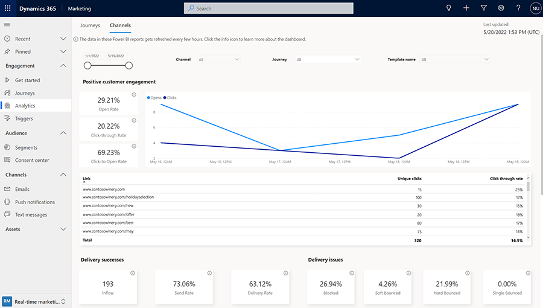

#### Preview features

- **Edit, publish, and optimize journeys by making incremental updates, while tracking and analyzing all previous versions together**
    - Improved journey version tracking and editing. Make light edits to live journeys&mdash;such as renaming elements and adjusting goal percentages&mdash;without creating new versions. Because the Marketing app automatically version tracks each update, you can make complex and structural changes to journeys confidently and collaboratively with your team. This makes editing journeys as simple as editing documents; each change is tracked and is available for auditing. Customers who are mid-flight in journeys are not impacted. Mid-flight customers can continue going through the journey version they entered while all new customers experience the journey with the latest updates. Copies are no longer created each time a change is made, leaving you with an uncluttered view of your journey list. Analytics are preserved for each version. This enables you to compare journey flow and goal attainment across journey versions.
    - [Release plan](/dynamics365-release-plan/2022wave2/marketing/dynamics365-marketing/make-incremental-updates-optimize-journeys-while-analyzing-all-past-versions)
    - [Docs](real-time-marketing-edit-journey.md)

    > [!div class="mx-imgBorder"]
    > 

- **Create consistent content with brand profiles**
    - To ensure branding consistency, the email editor supports brand profiles, including custom sender profiles, social links, and custom fields. Create multiple brand profiles for your organization or for each of your business units.
    - [Release plan](/dynamics365-release-plan/2022wave2/marketing/dynamics365-marketing/create-consistent-content-brand-profiles)
    - [Docs](brand-profiles.md)

    > [!div class="mx-imgBorder"]
    > 

#### Monthly enhancements

- **Real-time marketing**
    - Triggers can have up to 29 attributes (formerly limited to 10).
- **Text message channel**
    - Text message metrics allow you to measure campaign performance including response rate, percentage of responses that include a defined keyword, and most used keywords.
- **Marketing pages**
    - Improved reliability of e-mail link clicked insights for customers.
- **Event management**
    - Check-ins are created when joining an event 2 hours or less before it starts (formerly limited to 30 minutes before the event start), ensuring check-ins are created for early joiners.

### June 2022 update

The Dynamics 365 Marketing June 2022 update has three preview features and two general availability features from the [2022 wave 1 release plans](/dynamics365-release-plan/2022wave1/marketing/dynamics365-marketing/get-started). The preview features include a segment builder for real-time marketing, the ability to continue customer conversations by taking action on text message replies, and multiple journey branches to create more personalized variations. General availability features include a unified timeline to view customer activity across Dynamics 365 Marketing, Dynamics 365 Sales, Dynamics 365 Customer Service and the ability to trigger journeys based on data changes in any Dynamics 365 app.

The update also includes an administrator digital data sharing opt-in for better performing AI features, better visibility for errors that occur when going live with pages and forms, and conditional content support for email templates.

#### Version number

| App              | GA release      |
|------------------|-----------------|
| Marketing        | 1.84.2011.0 |

> [!Tip]
> To check your current version number, go to **Settings** > **Overview** > **Versions**.

#### Preview features

> [!IMPORTANT]
> A preview feature is a feature that is not complete, but is made available before it’s officially in a release so customers can get early access and provide feedback. Preview features aren’t meant for production use and may have limited or restricted functionality.
> 
> Microsoft doesn't provide support for this preview feature. Microsoft Dynamics 365 Technical Support won’t be able to help you with issues or questions. Preview features aren’t meant for production use, especially to process personal data or other data that are subject to legal or regulatory compliance requirements.

- **Target the right contacts and leads using the real-time marketing segmentation builder**
    - Precisely targeting an audience is often complicated, requiring you to understand database and SQL concepts and operators. The real-time marketing segmentation builder simplifies segment creation and empowers you to build segments for your campaigns without assistance from data analysts or scientists, no matter how complex the logic. Build segments on leads without requiring the lead to have a parent contact. Market to leads directly using customer journeys. The real-time marketing segmentation builder also enables you to take an iterative approach to building the segment logic through member previews that populate as you build the segment.
    - [Release plan](/dynamics365-release-plan/2022wave1/marketing/dynamics365-marketing/target-right-contacts-leads-using-reimagined-easy-use-segmentation-builder)
    - [Docs](real-time-marketing-build-segments.md)

    > [!div class="mx-imgBorder"]
    > 

- **Continue the conversation with your customers by taking action on their text message replies**
    - Text messages allow you to quickly communicate with your customers. However, it’s not enough to just send messages out, you also need to act on customer responses. Now, you can interact with your customers by creating journeys based on their replies to your text messages. Create custom keywords and add them to your messages and journey branches to continue the conversation with your customers.
    - [Release plan](/dynamics365-release-plan/2022wave1/marketing/dynamics365-marketing/continue-conversation-customers-taking-action-their-sms-replies)
    - [Docs](set-up-automated-sms-keyword-flow.md)

    > [!div class="mx-imgBorder"]
    > 

- **Create more personalized journey variations using multiple journey branches**
    - Journey branches let you create personalized journeys for customers, engaging them in different ways based on who they are and their past actions. Create more than two branches at any given step in the journey, allowing for more fine-grained personalization and engaging each customer differently based on their unique profile and behavioral signals. Multiple branches eliminate the need to nest branches and make analyzing journeys easier. Merge the branches back so that customers can continue the common journey steps after going through their specialized branches.
    - [Release plan](/dynamics365-release-plan/2022wave1/marketing/dynamics365-marketing/create-more-personalized-journey-variations-using-multiple-journey-branches)
    - [Docs](real-time-marketing-multiple-branches.md)

    > [!div class="mx-imgBorder"]
    > 

#### General availability enhancements

- **Personalize interactions using a unified view of customer activity across Dynamics 365 Marketing, Dynamics 365 Sales, and Dynamics 365 Customer Service**
    - Sales reps and customer service agents use the Dynamics 365 unified timeline to view their customers’ past activities so they can personalize engagement. Now, reps and agents can also view real-time and outbound marketing activities in the Dynamics 365 unified timeline. The timeline allows filtering based on the specific type(s) of activity or interactions. The timeline also allows previews of individual messages sent to customers. Message previews enable, for instance, loan agents in a financial services firm to know what document request was made to a loan applicant in a previous email so that the agent can quickly find the right document.
    - [Release plan](/dynamics365-release-plan/2022wave1/marketing/dynamics365-marketing/personalize-interactions-using-unified-view-customer-activity-across-dynamics-365-marketing-sales-customer-service)
    - [Docs](timeline.md)

- **Trigger journeys based on data changes in any Dynamics 365 app to engage customers at the right time without writing any code**
    - Interactions in any Dynamics 365 app can be used to trigger and drive customer journeys without requiring developers or customizations. Customers interact with several departments and functions in companies throughout their lifetime, all of which use their own CRM, ERP, and business apps. Each of these interactions, such as a service ticket being closed, represents an opportunity to engage more deeply with your customers. Data no longer has to remain siloed within separate apps and out of reach of your customer engagement or marketing automation tools.
    - [Release plan](/dynamics365-release-plan/2022wave1/marketing/dynamics365-marketing/trigger-journeys-based-data-changes-dynamics-app-engage-customers-at-right-time-without-writing-code)
    - [Docs](real-time-marketing-dataverse-trigger.md)

#### Monthly enhancements

- **Real-time marketing**
    - Administrators can opt-in to share data to enhance the performance of the Natural Language Assist feature, get better content recommendations for content ideas (GPT-3), and get better recommendations for channel optimization.
- **Marketing pages**
    - Errors are displayed when a page is stuck in a “Going Live” state, allowing users to see what’s wrong and select the **Stop** button if needed.
- **Conditional content**
    - [Preview] Email templates support conditional content.

#### Bug fixes

- **First run experience**
    - Resolved a bug that occasionally resulted in an error in newly provisioned environments indicating that an installation included solutions but not the services required by the Marketing app.
- **Segmentation**
    - Fixed an internal server error that sometimes occurred when creating a segment and going live with it.
- **Marketing emails**
    - Improved security in the email editor (updated components address potential cross-site scripting and information disclosure vulnerabilities).

### May 2022 update

The Dynamics 365 Marketing May 2022 update has two preview features and one general availability feature from the [2022 wave 1 release plans](/dynamics365-release-plan/2022wave1/marketing/dynamics365-marketing/get-started). The preview features include conditional dynamic content, which helps marketers create hyper-personalized messages, and a new channel analytics dashboard to track delivery and engagement metrics across multiple channels. The new general availability feature enables the use of outbound subscription centers in real-time marketing.

The update also includes improved email content blocks, the ability to manually populate event trigger parameters when raising triggers to run power automate flows, and real-time marketing geographical expansion to Brazil, India, Japan, and the United Arab Emirates. Read on for details!

#### Version number

| App              | GA release      |
|------------------|-----------------|
| Marketing        | 1.83.2008.0 |

> [!Tip]
> To check your current version number, go to **Settings** > **Overview** > **Versions**.

#### Preview features

> [!IMPORTANT]
> A preview feature is a feature that is not complete, but is made available before it’s officially in a release so customers can get early access and provide feedback. Preview features aren’t meant for production use and may have limited or restricted functionality.
> 
> Microsoft doesn't provide support for this preview feature. Microsoft Dynamics 365 Technical Support won’t be able to help you with issues or questions. Preview features aren’t meant for production use, especially to process personal data or other data that are subject to legal or regulatory compliance requirements.

- **Win customer attention by creating conditional dynamic content with easy-to-use no-code experiences**
    - Conditional dynamic content is key to delivering highly personalized messages to customers. Creating content where entire sections target specific customer segments allows you to craft messages that align with your customers’ interests and preferences, driving engagement and brand loyalty. Until now, achieving this level of dynamic content was complex and required coding. With the new conditional content experience, marketers can easily create messages targeted to specific segments or attributes, bringing content that is truly unique to each customer without writing any code.
    - [Release plan](/dynamics365-release-plan/2022wave1/marketing/dynamics365-marketing/win-customer-attention-creating-conditional-dynamic-content-easy-to-use-no-code-experiences)
    - [Docs](conditional-content.md)

    > [!div class="mx-imgBorder"]
    > 

- **Measure campaign effectiveness with a new channel analytics dashboard**
    - To create effective campaigns, marketers need to continuously track the delivery of assets across numerous channels. They also need to review campaign engagement metrics so that they can make improvements where needed. With the new out-of-the-box aggregated channel analytics dashboard in real-time marketing, you can track important delivery and engagement metrics at any level of aggregation—across all channels, journeys, and marketing assets. You can even zoom in on a particular channel or message. You can also learn from trends of important metrics over a specified time period to further improve your marketing efforts.
    - [Release plan](/dynamics365-release-plan/2022wave1/marketing/dynamics365-marketing/measure-campaign-effectiveness-new-channel-analytics-dashboard)
    - [Docs](real-time-marketing-channel-analytics.md)

    > [!div class="mx-imgBorder"]
    > 

#### General availability enhancements

- **Use outbound subscription centers in real-time journeys**
    - Collecting consent is a critical business need. Subscription centers are a way to gather consent preferences from your customers. Businesses need to be able to customize their subscription center to match their branding and business needs. They also need the ability to create different subscription centers for different regions, brands, or lines of business. Now, you can bring the flexibility of subscription centers available in outbound marketing to real-time marketing journeys, enabling you to have multiple subscription centers, customized and branded to your needs.
    - [Release plan](/dynamics365-release-plan/2022wave1/marketing/dynamics365-marketing/use-outbound-marketing-subscription-centers-real-time-marketing-journeys)
    - [Docs](real-time-marketing-outbound-subscription.md)

    > [!div class="mx-imgBorder"]
    > 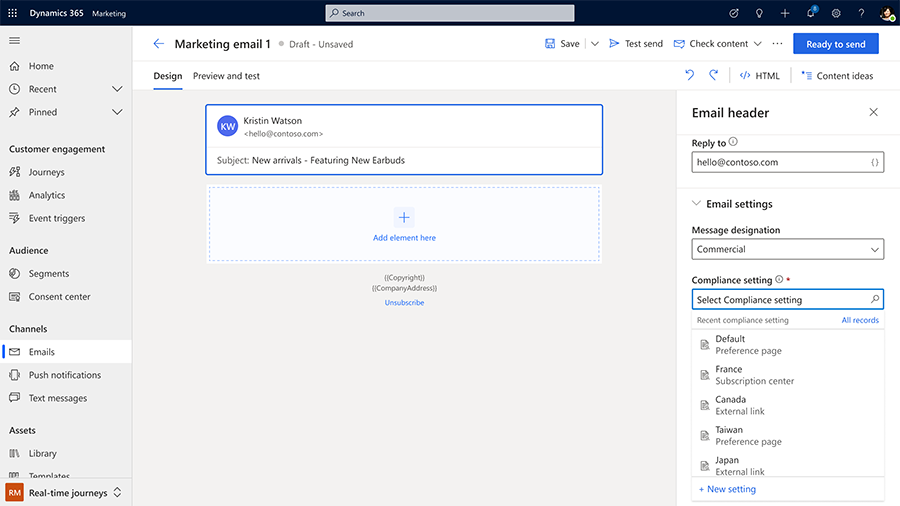

#### Monthly enhancements

- **Email content blocks**
    - [Preview] User can locate all emails where the current content block is used.
- **Custom triggers**
    - Pass trigger parameters from a journey to a Power Automate flow or to another journey by easily populating the data for a custom trigger inside a journey.
- **Geographic expansion**
    - Real-time marketing is now available in four additional geographies: Brazil, India, Japan, and the United Arab Emirates.

#### Bug fixes

- **Real-time marketing**
    - Resolved a bug that sometimes prevented real-time marketing solutions from being manually uninstalled.

### April 2022 update

The Dynamics 365 Marketing April 2022 update is a milestone release. It offers three preview features and five general availability features from the [2022 wave 1 release plans](/dynamics365-release-plan/2022wave1/marketing/dynamics365-marketing/get-started). The preview features include a new email creation canvas and user experience, a unified timeline to view customer activity across Dynamics 365 Marketing, Sales, and Customer Service, and reusable content blocks for quick email creation.

Generally available features include the ability to raise triggers from a journey to run another journey or Power Automate flow, reusable dynamic text for personalization, more out-of-the-box real-time marketing triggers, filter conditions for triggers, and improved email templates.

The update also includes monthly enhancements to journeys, domain authentication settings improvements, and improved contact card consent management.

#### Version number

| App              | GA release      |
|------------------|-----------------|
| Marketing        | 1.82.2016.0 |

> [!Tip]
> To check your current version number, go to **Settings** > **Overview** > **Versions**.

#### Preview features

> [!IMPORTANT]
> A preview feature is a feature that is not complete, but is made available before it’s officially in a release so customers can get early access and provide feedback. Preview features aren’t meant for production use and may have limited or restricted functionality.
> 
> Microsoft doesn't provide support for this preview feature. Microsoft Dynamics 365 Technical Support won’t be able to help you with issues or questions. Preview features aren’t meant for production use, especially to process personal data or other data that are subject to legal or regulatory compliance requirements.

- **Create emails faster with precise drag-and-drop, in-context menu, and easy-select interactions**
    - The reimagined email editor is optimized for a productive workflow, allowing you to quickly create engaging and relevant content. With this release, the editor is further enhanced with precise drag-and-drop interactions, easy selection of elements, columns, or sections, and an in-context menu for faster content creation so you can create pixel-perfect emails in minutes.
    - [Release plan](/dynamics365-release-plan/2022wave1/marketing/dynamics365-marketing/create-emails-faster-precise-drag-and-drop-in-context-menu-easy-select-interactions)
    - [Docs](create-marketing-email.md)

- **Personalize interactions using a unified view of customer activity across Dynamics 365 Marketing, Sales, and Customer Service**
    - Sales and Customer Service agents use the Dynamics 365 unified timeline to view their customers’ past activities so they can personalize engagement. Now, these agents can also view real-time and outbound marketing activities in the Dynamics 365 unified timeline. The timeline allows filtering based on the specific type(s) of activity or interactions. It also allows previews of messages sent to customers. This enables, for instance, loan agents in a financial services firm to know what document request was made to a loan applicant in a previous email so that the agent can quickly find the right document.
    - [Release plan](/dynamics365-release-plan/2022wave1/marketing/dynamics365-marketing/personalize-interactions-using-unified-view-customer-activity-across-dynamics-365-marketing-sales-customer-service)
    - [Docs](timeline.md)

    > [!div class="mx-imgBorder"]
    > 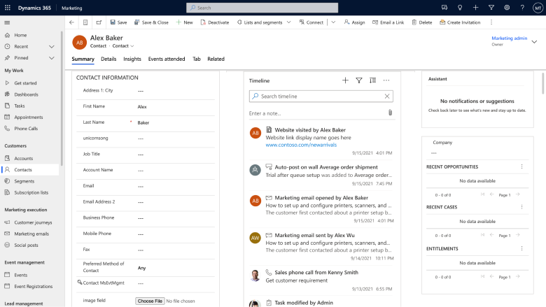

- **Quickly create emails with enhanced reusable content blocks**
    - Content blocks are reusable pieces of content that let you easily assemble rich and consistent emails. New and enhanced content blocks are now available in outbound and real-time marketing. The enhanced content blocks can include all standard elements such as text, images, and buttons, as well as custom layouts and personalization.
    - [Release plan](/dynamics365-release-plan/2022wave1/marketing/dynamics365-marketing/quickly-create-emails-enhanced-reusable-content-fragments)
    - [Docs](content-blocks.md)

    > [!div class="mx-imgBorder"]
    > 

#### General availability enhancements

- **Create individualized journeys by adding conditions based on attributes captured as part of the event trigger**
    - Previously, marketers had to instrument fine-grained triggers for their journeys. For instance, they needed separate triggers for each campaign page if they wanted to create a unique journey per campaign. Now, marketers can simply ask their web developers to add a single trigger across all campaign pages. They can then use filter conditions on the trigger to spawn a unique journey per campaign page. This gives marketers more control over how they use triggers and enables them to create future journeys without needing new triggers every time. Trigger conditions are even more powerful when combined with out-of-the-box triggers such as marketing form filled or event registration, as marketers can now scope a journey to a specific form or marketing event using a single out-of-the-box trigger. Trigger filters can also be added at exits, branches, or to measure journey goals.
    - [Release plan](/dynamics365-release-plan/2022wave1/marketing/dynamics365-marketing/create-individualized-journeys-adding-conditions-based-attributes-captured-as-part-event-trigger)

- **Take action with your customers in more ways by raising triggers from a journey to run another journey or Power Automate flow**
    - Marketers can trigger journeys as well as Power Automate flows directly from anywhere in their journey. When used to trigger other journeys, this allows marketers to chain journeys together and create multiple journeys that logically function together. Likewise, when used with a Power Automate flow, marketers can run any custom process outside of their journey or connect to myriad Power Automate connectors.
    - [Release plan](/dynamics365-release-plan/2022wave1/marketing/dynamics365-marketing/take-action-customers-more-ways-raising-triggers-journey-run-another-journey-or-power-automate)
    - [Docs](real-time-marketing-custom-actions.md)

- **Improved email layout templates for faster content creation**
    - Default layout templates have been replaced with popular and useful layouts allowing marketers to easily kick-start the email creation process. The templates have a modern look and feel for a better experience. They include simplified guidance with more descriptive and actionable content placeholders.
    - [Release plan](/dynamics365-release-plan/2022wave1/marketing/dynamics365-marketing/improved-email-layout-templates-faster-content-creation)
    - [Docs](email-templates.md)

- **Easily author personalized content using pre-defined dynamic text without the need to understand the data model**
    - With pre-defined dynamic text, marketers have a quick list of the most commonly used dynamic text to select from. Marketers can simply select and insert the pre-defined text into an email to personalize it. Marketers familiar with the data model can create and share additional dynamic text so that the rest of the team can focus on authoring content rather than learning database concepts. Not only does this promote ease of use, but it also customizes the list with dynamic text that’s specific to individual businesses.
    - [Release plan](/dynamics365-release-plan/2022wave1/marketing/dynamics365-marketing/quickly-personalize-emails-using-predefined-dynamic-text-without-need-know-underlying-data-structure)
    - [Docs](real-time-marketing-predefined-tokens.md)

- **Quickly create customer journeys triggered by marketing interactions such as webinar check-ins and form submissions**
    - New out-of-the-box triggers allow you to create customer journeys triggered by marketing interactions such as webinar check-ins and form submissions. This eliminates the need to create and manage hundreds or thousands of segments and journeys. Now, you can use one trigger per a form and marketing event. A single journey can replace them all – and dynamic content can be used to tailor the outgoing messages to the respective form or marketing event.
    - [Release plan](/dynamics365-release-plan/2022wave1/marketing/dynamics365-marketing/quickly-create-customer-journeys-triggered-marketing-interactions-such-as-webinar-check-ins-form-submissions)
    - [Docs](real-time-marketing-triggers.md#business-triggers)

#### Monthly enhancements

##### Real-time marketing

- **Journeys**
    - The triggers page now works in [Solution Only mode](purchase-setup.md#solution-only-app).
    - Out-of-the-box triggers allow you to launch journeys for marketing events without the need to create custom triggers.

- **Marketing emails**
    - A streamlined, guided experience for DKIM domain authentication settings allows marketers to maximize email deliverability and enables the embedding of Dynamics 365 Marketing forms on websites. Learn more: [Real-time marketing domain authentication](real-time-marketing-domain.md).
    - Content ideas now includes an in-product feedback survey.

- **Consent**
    - Contact cards now show a unified view of consent for real-time and outbound marketing, giving customers clarity on contact point vs contact-based consent and the results for the different journeys. The new view also allows you to update contact point consent, giving a single place to manage consent for a contact.

##### Outbound marketing

- **Marketing pages**
    - Email field validation is now enabled by default.

#### Bug fixes

- **Real-time marketing analytics**
    - Resolved a bug that caused email, push, and text analytics to continually reload and display a "There was a problem getting the data" error message.
- **Real-time marketing email**
    - Fixed an issue that sometimes caused an editing cursor to appear when hovering over a tooltip field.
- **Real-time marketing journeys**
    - Improved handling and displaying of error messages.
- **Text messages**
    - Fixed an issue that sometimes caused a control loading error in the message field.

### March 2022 update

The Dynamics 365 Marketing March 2022 update includes many new features. This release includes two preview features from the [2022 wave 1 release plans](/dynamics365-release-plan/2022wave1/marketing/dynamics365-marketing/get-started): a bring your own data lake option for Customer Insights integration and new out-of-the-box triggers for events and forms. The update also includes enhancements to marketing emails, partial and relative dates in real-time marketing personalization, performance upgrades, and bug fixes.

#### Version number

| App              | GA release      |
|------------------|-----------------|
| Marketing        | 1.35.10081.2002 |

> [!Tip]
> To check your current version number, go to **Settings** > **Overview** > **Versions**.

#### Preview features

> [!IMPORTANT]
> A preview feature is a feature that is not complete, but is made available before it’s officially in a release so customers can get early access and provide feedback. Preview features aren’t meant for production use and may have limited or restricted functionality.
> 
> Microsoft doesn't provide support for this preview feature. Microsoft Dynamics 365 Technical Support won’t be able to help you with issues or questions. Preview features aren’t meant for production use, especially to process personal data or other data that are subject to legal or regulatory compliance requirements.

- **Connect Dynamics 365 Customer Insights with customer journey orchestration when using your own data lake**
    - Use Dynamics 365 Customer Insights data, such as customer profile and segment information, that is stored in Azure Data Lake Storage in the same way you do today with standard Customer Insights connected to Microsoft Dataverse.
    - [Release plan](/dynamics365-release-plan/2022wave1/marketing/dynamics365-marketing/connect-dynamics-365-customer-insights-customer-journey-orchestration-when-using-own-data-lake)
- **Quickly create customer journeys triggered by marketing interactions such as webinar check-ins and form submissions**
    - New out-of-the-box triggers allow you to create customer journeys triggered by marketing interactions such as webinar check-ins and form submissions.
    - Learn more: [Real-time marketing triggers](real-time-marketing-triggers.md).

    > [!div class="mx-imgBorder"]
    > 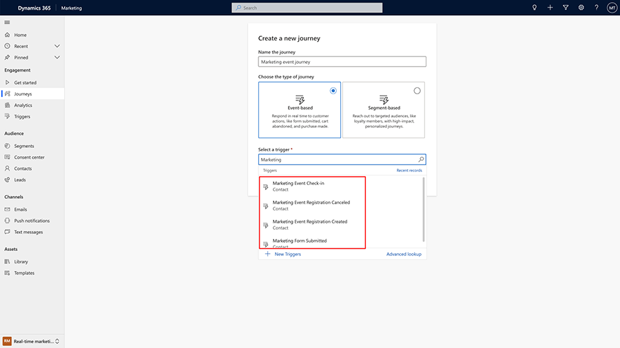

#### Monthly enhancements

##### Real-time marketing

> [!Note]
> “Event triggers” are now called “triggers” in the app and the documentation. The change was made to avoid confusion when referencing event management functionality versus triggering real-time marketing journeys.

- **Marketing emails**
    - Link buttons or images to URLs, surveys, events, marketing pages, or files. You can also create button or image links that allow recipients to join a Microsoft Teams event or that create a new calendar item. Learn more: [Create real-time marketing emails](real-time-marketing-email.md).

    > [!div class="mx-imgBorder"]
    > 

- **Personalization**
    - Now, you can personalize both an email and the customer’s journey relative to important milestones (such as order date or an upcoming appointment) by creating content variations and branches that use relative and partial dates when defining a condition using dates. Partial dates allow you to define conditions such as "Birthday is today" and relative dates allow you to define conditions such as "Birthday is next month." So, depending on when an email goes out and how close it is to someone’s birthday, a different offer can be shown. Learn more: [Personalize content](real-time-marketing-personalize-inline-conditions.md#partial-and-relative-dates-in-conditional-content).

#### Bug fixes

- **Channel optimization (real-time marketing)**
    - Channel optimization will not recommend a channel which a customer has not consented to. If no channel has consent, no communication will be sent out and the customer will progress to the next step in the journey. Learn more: [Manage user compliance settings](real-time-marketing-compliance-settings.md).
- **First run experience**
    - Resolved an issue during provisioning that ocassionally caused the user interface to get stuck in a refresh state.
- **Marketing pages**
    - Fixed a form capture error that occurred when the URL to capture ended with a period. For example, *contoso.com/form.".
    - Resolved a form capture error that resulted when a URL had more than 1024 characters.
    - Session cookies are now changed (instead of being grouped together) after 20 minutes of activity (the default marketing page setting). Learn more about cookie settings: [Set up website tracking and read results](track-online-behavior.md#set-up-website-tracking-and-read-results).

### February 2022 update

The Dynamics 365 Marketing February 2021 update includes many new features and improvements. This release includes three features from the [2022 wave 1 release plans](/dynamics365-release-plan/2022wave1/marketing/dynamics365-marketing/get-started): Microsoft Teams chat integration, a new journey tile that raises a trigger at any point in a customer journey, and pre-defined dynamic text tokens. The update also includes multiple enhancements to customer journeys and the email editor, performance upgrades, and bug fixes.

#### Version number

| App              | GA release      |
|------------------|-----------------|
| Marketing        | 1.35.10080.2009 |

> [!Tip]
> To check your current version number, go to **Settings** > **Overview** > **Versions**.

#### Preview features

> [!IMPORTANT]
> A preview feature is a feature that is not complete, but is made available before it’s officially in a release so customers can get early access and provide feedback. Preview features aren’t meant for production use and may have limited or restricted functionality.
> 
> Microsoft doesn't provide support for this preview feature. Microsoft Dynamics 365 Technical Support won’t be able to help you with issues or questions. Preview features aren’t meant for production use, especially to process personal data or other data that are subject to legal or regulatory compliance requirements.

- **Collaborate across your organization to create the best marketing campaigns possible using the built-in Microsoft Teams chat**
    - With Microsoft Teams chat, you can easily collaborate with your team without leaving the journey canvas or email editing experience.
    - [Release plan](/dynamics365-release-plan/2022wave1/marketing/dynamics365-marketing/collaborate-across-organization-create-best-marketing-campaigns-possible-using-built-teams-chat)
    - [Docs](teams-chat.md)
- **Quickly personalize emails using predefined dynamic text, without the need to know the underlying data structure**
    - With predefined dynamic text, marketers will have a quick list of the most commonly used tokens to select from. Marketers familiar with the data model can create and share additional tokens so that the rest of the team can focus on authoring content rather than learning database concepts.
    - [Release plan](/dynamics365-release-plan/2022wave1/marketing/dynamics365-marketing/quickly-personalize-emails-using-predefined-dynamic-text-without-need-know-underlying-data-structure)
    - [Docs](real-time-marketing-predefined-tokens.md)
- **Take action with your customers in more ways by raising triggers from a journey to run another journey or Power Automate flow**
    - Use custom triggers to link between journeys and between journeys and custom processes. A new journey tile will raise a trigger at any point in a customer journey. Any journey or Power Automate flows connected to the trigger run immediately run when a customer reaches the tile. This includes triggers used in exit criteria, goals, and if/then branches for journeys.
    - [Release plan](/dynamics365-release-plan/2022wave1/marketing/dynamics365-marketing/take-action-customers-more-ways-raising-triggers-journey-run-another-journey-or-power-automate)
    - [Docs](real-time-marketing-custom-actions.md)

#### Monthly enhancements

##### Real-time marketing

- **Customer journeys**
    - Create customer journeys more quickly by defining only the minimum entry criteria when making a new journey.
    - Include multiple suppression segments in a journey, fine-tuning where users exit the journey.
    - Stop and edit custom events even if they are used in live journeys.
    - Developers can now include a unique identifier to correlate triggers between journeys. For example, if a customer places multiple, separate orders, multiple order confirmation journeys would be triggered. Previously, if the customer cancelled one of the orders (triggering an order cancellation event), they would receive cancellation emails from both order journeys they were a part of. Now, a developer can insert a correlation identifier into the trigger for each unique order. The identifier ensures that only the journey occurrence tied to the cancelled order sends the cancellation email. Learn more: [Correlate across custom triggers](real-time-marketing-correlate-triggers.md).
- **Marketing emails**
    - Add feature-rich links to emails by directly linking to documents stored in the asset library.
    - Link buttons and images to existing events and marketing pages in the Marketing app database without looking up the specific URL.

##### Outbound marketing

- **Event management**
    - Teams online event calendar invites include a 15-minute reminder before the event for attendees and speakers.

> [!NOTE]
> The outbound email editor now includes a deprecation warning that is only visible to users of pre-October 2021 versions of the Marketing app.

##### Global updates

- **Marketing emails**
    - Multiple email editor enhancements including easier element resizing and performance improvements.
    - Easily set equal heights for multi-column sections.

#### Bug fixes

- **Event management**
    - Contact matching now respects business unit scoping configurations.
- **Marketing emails**
    - Resolved an error that sometimes caused unsaved changes to appear even though no changes were made.
    - Email pre-headers are automatically generated and blank characters are removed, preventing pre-header-related errors.
    - Core CSS styles have been separated from customer CSS styles to improve rendering.
    - Resolved an error that caused local configs to fail when the remote configuration service is down.
    - Fixed an error that caused previously deduplicated contacts to be removed from deduplication storage after a failure and rollback.
    - Resolved an error related to custom envelope-from emails that caused "sync bounce" emails to resend as "remote bounce" emails, causing inaccurate email error reports.

### January 2022 update

There is no Dynamics 365 Marketing release for January. We will be back in February with new feature improvements, updates, and bug fixes.

> [!Tip]
> To read about updates from previous years, see the [What's new archive](whats-new-marketing-archive.md) article.