# What's new in Dynamics 365 Marketing

[!INCLUDE[consolidated-sku-rtm-only](../includes/consolidated-sku-rtm-only.md)]

[!INCLUDE[marketing-trial-cta](../shared/trials/marketing-trial-cta.md)]

We're excited to announce our newest updates! This article summarizes early access features, preview features, general availability enhancements, monthly updates, and bug fixes. To see the long-term feature plans, take a look at the [Dynamics 365 and Power Platform release plans](/dynamics365/release-plans/).

Marketing updates are [pushed to customers automatically](https://cloudblogs.microsoft.com/dynamics365/it/2020/04/27/automatic-update-policy-for-dynamics-365-marketing/). Solutions are available for early validations. To manually update your instances, follow the steps in [Keep Marketing up to date](apply-updates.md).

To submit and vote on **feature requests** and **product suggestions**, go to the [Dynamics 365 Application Ideas portal](https://experience.dynamics.com/ideas/categories/?forum=dfa5b83d-9e4c-e811-a956-000d3a1bef07&forumName=Dynamics%20365%20Marketing).

## August 2023 update

### Version number

| App              | GA release      |
|------------------|-----------------|
| Real-time marketing        |        |

On September 1, 2023, Dynamics 365 Marketing will transition to focus on real-time marketing features only. To support this transition, in early August 2023, provisioning of new instances will change in the following ways:

- New customers will no longer receive the outbound marketing module. They will need to contact support to add outbound marketing features.
- Existing customers will also see the same provisioning change but will be able to add outbound marketing features themselves using a self-serve interface available on the **Settings > Versions page**.

 > [!div class="mx-imgBorder"]
 > 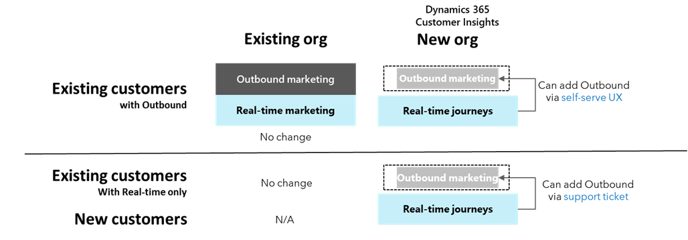

### General availability

- Prioritize best leads and empower sellers with new lead scoring builder
    - To maximize return on investment from marketing activities, it is essential to identify the best prospects at the right moment when they're ready to engage with your sales team. With real-time marketing, you can use a new simple but powerful lead scoring builder to define your scoring criteria and model more efficiently. Prioritize the most engaged leads from companies that match your ideal customer profile using engagement and profile-based scoring. Define qualification criteria and post-qualification actions to grow your pipeline while ensuring that each qualified lead receives attention from your sales teams. With proper scoring and qualification criteria, you can prioritize the best leads and empower the sales team to spend more time winning deals and less time chasing lukewarm opportunities.
    - [Release plan]()
    - [Docs]()

- Further personalize journeys using custom events with entity references
    - Entity references for custom triggers enable greater personalization of messages sent to customers. Create entity references for custom events instead of adding multiple attributes manually, bypassing the previous limit of 30 attributes. For example, if you want to create a custom trigger that triggers a journey for all customers who purchased a specific product on your website, you can now capture the purchase event and the contents related to the SKU that was purchased. Instead of manually entering all attributes (with a maximum limit of 30) for the custom trigger, you can now add an entity reference to select as part of the custom trigger attribute definition.
    - [Release plan]()
    - [Docs]()

### Public preview

- Use journey Copilot to create customer journeys by describing them in your own words
    - With Dynamics 365 Marketing, anybody can now create customer journeys in minutes, even when they may have never done it before. Simply describe, in everyday words, what you want to create and rely on Copilot generative AI to build the journey for you. This empowers you to do more with less. Instead of spending time getting the mechanics of the journey right, you can now ensure that you’re delivering the most personalized experience for your customers by collaborating with your entire team and quickly driving stakeholder alignment. Using journey Copilot together with the content ideas copilot assistant for email creation, you can now get your customer experience ideas to market in no time.
    - [Release plan]()
    - [Docs]()

### New blogs and scenario docs

Learn how to make the most of the new Dynamics 365 Marketing features in our latest blogs and scenario docs:

- [Transition to real-time marketing and transform your Customer Experience - Microsoft Dynamics 365 Blog](https://cloudblogs.microsoft.com/dynamics365/it/2023/07/18/transition-to-real-time-marketing-and-transform-your-customer-experience/)

## July 2023 update

### Version number

| App              | GA release      |
|------------------|-----------------|
| Real-time marketing        |  1.1.26671.175      |

> [!IMPORTANT]
> With the July 2023 release, customer consent data began migration to utilize the new multi-brand consent features. For some Marketing users, the migration changed the settings that control whether tracking links are included in messages. The changes may prevent tracking in messages if customers have not given explicit consent. After the migration, if you want to enable tracking links in messages for customers who have not provided tracking consent, [update the **Tracking purpose** enforcement model](real-time-marketing-email-text-consent.md#consent-enforcement-diagram) of your **Compliance Profile(s)** to "Non-restrictive." This enables tracking links to be substituted in emails as long as the receiver has not explicitly opted out of tracking.

> [!TIP]
> Starting in July 2023, custom workflows can no longer *read* from the **msdynmkt_contactpointconsent2** and **msdynmkt_contactpointconsent3** consent entities. To ensure continued functionality, you must update custom workflows to read from the latest **msdynmkt_contactpointconsent4** entity.
>
> Custom workflows that *write* to the **msdynmkt_contactpointconsent2** and **msdynmkt_contactpointconsent3** consent entities will automatically have data synced to the latest **msdynmkt_contactpointconsent4** entity until January 2024, with some delay (potentially 24 hours or longer). If your workflows depend on data being available sooner than that, you should update your workflows to *write* to the **msdynmkt_contactpointconsent4** entity instead.
>
> Additionally, as of June 2023, the **Consent Type** field is mandatory for the **msdynmkt_contactpointconsent4** entity. To ensure continued functionality of custom workflows, update the workflows to include this mandatory field.

### General availability

- **Make your push notifications more engaging by adding images**
    - Orchestrate beautiful, personalized push notifications with images to increase customer engagement. Add product images, promotional graphics, brand logos, or appealing illustrations to your push notifications to make them more informative and persuasive. New, eye-catching push notifications lead to higher user engagement and better campaign results.
    - [Release plan](/dynamics365/release-plan/2023wave1/marketing/dynamics365-marketing/make-push-notifications-more-engaging-adding-images)
    - [Docs](real-time-marketing-push-notifications.md)

- **Easily set up your push notifications and engage customers worldwide**
    - We’ve streamlined the configuration process for push notifications with an enhanced, guided experience. It's now easier to set up the push notification channel and incorporate it into your marketing mix, reducing the time and effort required for implementation. Additionally, push notifications are now available worldwide, so you can engage customers across the globe, expand your market presence, and drive growth.
    - [Release plan](/dynamics365/release-plan/2023wave1/marketing/dynamics365-marketing/easily-set-up-push-notifications-engage-customers-worldwide)
    - [Docs](real-time-marketing-developer-push.md)

- **Easily import outbound emails, content blocks, and templates to real-time marketing**
    - Save time and resources, reuse and adapt your existing outbound assets to create engaging and relevant real-time marketing experiences. Easily import your outbound marketing emails, templates, and content blocks into real-time marketing to plug them into your real-time journeys.
    - [Release plan](/dynamics365/release-plan/2023wave1/marketing/dynamics365-marketing/import-outbound-marketing-emails-templates-real-time-marketing)
    - [Docs](real-time-marketing-import-email-to-real-time.md)

- **Match your business needs with multi-brand consent and customizable preference centers**
    - In real-time marketing, marketers can now fully customize out-of-the-box preference centers to better represent their brands and meet their business needs. Create separate preference centers per brand, allowing you to independently capture and manage consent for multiple lines of business. Keep your customers engaged by giving them control over the channels they want to connect to while ensuring that you capture the consent you need to satisfy legal and regulatory requirements.
    - [Release plan](/dynamics365/release-plan/2023wave1/marketing/dynamics365-marketing/match-business-needs-more-granular-customizable-consent-preference-centers)
    - [Docs](compliance-overview.md)

- **Tailor communications to the topics customers want to receive**
    - Improve customer engagement and reduce unsubscriptions by giving customers granular control over the real-time marketing messages they receive. Target your messages to the audience that wants to engage with your content the most by capturing detailed consent. Easily configure topics for messages, enabling per-topic customer opt-in or opt-out. Allow customers to subscribe to the topics that matter to them while capturing the consent you need to satisfy legal and regulatory requirements. Avoid embarrassing and costly configuration mistakes by leveraging real-time marketing topic support, preventing the complications of maintaining and enforcing lists of subscribed customers, all while taking advantage of enhanced real-time marketing preference centers that better represent your brand. 
    - [Release plan](/dynamics365/release-plan/2023wave1/marketing/dynamics365-marketing/tailor-communications-topics-customers-want-receive)
    - [Docs](real-time-marketing-email-text-consent.md)

- **Plan events with intuitive event registration form**
    - Easily plan events in real-time marketing that drive high attendance, convert customers, and meet your business goals. Events are a critical part of marketing. With the updated event planning features based on new, intuitive registration forms, creating, and managing events is a breeze. Event planning’s tight integration with real-time marketing makes it easier than ever to guide attendees to the next step in their journey.
    - [Release plan](/dynamics365/release-plan/2023wave1/marketing/dynamics365-marketing/easily-plan-events-intuitive-event-registration-form-experience)
    - [Docs](set-up-event.md)

- **Confidently send emails after previewing trigger-based personalization**
    - Personalizing content is an effective strategy for boosting engagement but ensuring such personalized content is accurate for a variety of recipients can be a challenging task. We made this task easier in April 2023 release that added support for previewing emails using data from a selected audience record. This release extends this capability to include support for triggers. Now any personalization that uses data from any out of the box triggers can also be tested easily. Additionally, you can now enter values manually for selected personalization that override data from audience or trigger for easily testing edge cases.
    - [Docs](real-time-marketing-email.md#preview-and-test-send-your-email)

- **Easily include QR codes for event registration, link, page, or any custom text**
    - QR codes are widely used to share information that is easily actionable on mobile devices with just a simple scan. They are an effective tool for promoting and increasing engagement for various purposes like events, web pages, coupons, and more. The email designer already includes a feature that allows easy insertion of QR codes for commonly used targets such as events, URLs, surveys, and file downloads. Now, we've added two additional targets. The "Event registration code" target fills a gap in real-time functionality by supporting QR codes for event registration pages along with the registration code needed for check-in. The "Text" option enables you to generate a QR code for any text you type in. Additionally, you can make the QR code dynamic by using personalized data like discount codes or loyalty program membership numbers.
    - [Docs](email-design.md)

### Public preview

- **Scale your business with confidence with 300M maximum monthly interactions**
    - Reach up to 100 million contacts or leads and send up to 300 million messages per month with Dynamics 365 real-time marketing customer journey orchestration. This added capacity empowers you to deliver personalized experiences at scale and delight customers in new ways. Additional interactions will help you grow your business, whether you’re increasing your customer base in new markets, reaching additional geographies, promoting new products, or expanding your prospective customer pipeline to reach higher sales targets.
    - [Release plan](/dynamics365/release-plan/2023wave1/marketing/dynamics365-marketing/scale-business-confidence-300m-maximum-monthly-interactions)
    - [Docs](fair-use-policy.md)

### Monthly enhancements

- **Customizable form entity**
- **Create composite segments**
- **Subscriptions list support for load consent**

### New blogs and scenario docs
Learn how to make the most of the new Dynamics 365 Marketing features in our latest blogs and scenario docs:

- [Revolutionize marketing with query assist and content ideas - Microsoft Dynamics 365 Blog](https://cloudblogs.microsoft.com/dynamics365/bdm/2023/06/21/copilot-in-dynamics-365-marketing-revolutionizes-marketing-with-query-assist-and-content-ideas/)

## June 2023 update

General availability features include improved copilot assistance for the query assist segmentation builder, enhancements to the asset and templates libraries, and business unit domain support for emails.

Public preview features include tailoring communications to improve customer engagement.

### Version number

| App              | GA release      |
|------------------|-----------------|
| Real-time marketing        |  1.1.25335.62    |

### General availability

- **Create better targeted segments using everyday language that include behavioral interactions with query assist, a copilot feature**
    - Marketers are now able to quickly build targeted segments using conversational everyday language that includes customer interactions with your marketing messages, websites, events, and other channels. With these updates, you can create complex segments that not only focus on demographic or firmographic data but also marketing behavioral data without requiring deep knowledge of the back-end data model.
    - [Docs](nl-segment-build.md)

- **Easily tag and update assets with an enhanced experience**
    - Swiftly manage and customize your assets. Need to rename, tag, or update assets? Now, it's just a matter of a few clicks. Our enhanced design ensures a visually appealing workspace, while the right-side pane provides quick previews of your files. Take control with editable property panes, allowing you to customize assets effortlessly. The new tagging controls simplifies file organization, enabling efficient categorization and effortless searching.
    - [Docs](upload-images-files.md)

- **Assign specific business units to your authenticated domains**
    - When modernized business units are turned on, and business unit scoping is enabled, the domain authentication wizard allows users to specify what business unit they want their domain to be authenticated. When a business unit is selected for a domain, this domain is solely available for that business unit unless you want to make it shareable across your organization.
    - [Docs](domain-authentication.md#domain-authentication-for-modernized-business-units)

### Public preview

- **Tailor communications to the topics customers want to receive**
    - Improve customer engagement and reduce unsubscriptions by giving customers granular control over the real-time marketing messages they receive. Target your messages to the audience that wants to engage with your content the most by capturing detailed consent.  Allow customers to subscribe to the topics that matter to them while capturing the consent you need to satisfy legal and regulatory requirements. Avoid embarrassing and costly configuration mistakes by leveraging real-time marketing topic support, preventing the complications of maintaining and enforcing lists of subscribed customers, all while taking advantage of enhanced real-time marketing preference centers that better represent your brand.
    - [Release plan](/dynamics365/release-plan/2023wave1/marketing/dynamics365-marketing/tailor-communications-topics-customers-want-receive)
    - [Docs](real-time-marketing-compliance-settings.md#topics)

### Monthly enhancements

- **Achieve more accurate results in your A/B tests by specifying a control group**
    - With the new control group features, marketers can now specify how many people to test a message on before releasing the remaining audience to the winning version. This update gives you more control over the testing process and helps ensure accurate results.

### New blogs and scenario docs

Learn how to make the most of the new Dynamics 365 Marketing features in our latest blogs and scenario docs:
- [Create dynamic content for multiple countries and languages](real-time-marketing-dynamic-content-multiple-languages.md)
- [Identify and resolve errors with real-time customer care journeys - Scenario docs](real-time-marketing-customer-care-journey.md)
- [Deliver personalized customer experiences with Copilot in Dynamics 365 Marketing and Customer Insights - Microsoft Dynamics 365 Blog](https://cloudblogs.microsoft.com/dynamics365/bdm/2023/03/14/deliver-personalized-customer-experiences-with-copilot-in-dynamics-365-marketing-and-customer-insights/)

## May 2023 update

The May 2023 release general availability features include the availability of interaction data in the segment builder, the ability to move custom triggers between environments, journey reminders, lead insights, and the ability to surface the next best action for leads with your sales team.

Public preview features include AI-powered milestone attribution analysis, multi-brand consent and customizable preference centers. We also continue to improve the content ideas and query assist Copilot features.

### Version number

| App              | GA release      |
|------------------|-----------------|
| Real-time marketing        |  1.1.24040.75    |

### General availability

- **Use interaction data to improve targeting in the redesigned segment builder**
    - Segments are critical for targeting the right customers and personalizing their experience. The redesigned real-time marketing segment builder allows you to create segments based on customer interactions and engagement with your marketing messages, websites, events, or other channels. Combined with the demographic and firmographic attributes already available for segmentation, the segment builder enables you to reach the right customers at the right time. You can then use these segments for targeting, journey branching or content variants to personalize the experience for each customer.
    - [Release plan](/dynamics365/release-plan/2023wave1/marketing/dynamics365-marketing/leverage-interaction-data-improve-targeting-using-re-designed-segmentation-builder)
    - [Docs](real-time-marketing-redesigned-segment-builder.md)

- **Save time by easily moving triggers between environments**
    - With Dynamics 365 Marketing, you can create custom triggers in development or pre-production environments to securely test the intended behavior before you use them in production for live marketing journeys and campaigns. You can then move the triggers to a production environment using Power Platform Solutions in any state. The ability to move published triggers enables you to align your testing workflow with your application lifecycle management process. Dynamics 365 Marketing automatically takes care of packaging the triggers and any related metadata when you export and import the solutions.
    - [Release plan](/dynamics365/release-plan/2023wave1/marketing/dynamics365-marketing/save-time-easily-moving-triggers-between-environments)
    - [Docs](move-triggers-between-environments.md)

- **Boost your productivity with enhanced journey reminders**
    - You can now create journeys that nudge and remind a customer to take a required action, such as completing an application/survey, filling a health check, checking out their cart, and more. You can remind customers until they complete the call to action or until a certain date or time. Additionally, you can bypass certain journey steps when a customer action makes them irrelevant. For instance, if you’re welcoming/onboarding the customer to a product or service through daily messages, but they complete the onboarding before all the messages have been sent – you can skip the remaining messages by exiting the customer from that block. This simplifies not only the journey logic required to capture the whole scenario in a single journey, but also makes a single block of journey actions (such as a series of reminders) easy to analyze and optimize.
    - [Release plan](/dynamics365/release-plan/2023wave1/marketing/dynamics365-marketing/boost-productivity-enhanced-journey-reminders)
    - [Docs](real-time-marketing-enhanced-journey-reminders.md)

- **Customize marketing strategies based on Lead insights**
    - Access Lead-specific insights in real-time marketing and tailor your marketing experiences according to your Leads’ behavior. Lead insights provide a holistic view of each Lead's interactions with your marketing activities. This includes access to journey engagement history, encompassing past email sends, opens, clicks, form submissions, and other relevant data.
    - [Docs](real-time-marketing-analytics.md)

- **Surface the next best action to your sales team when a Lead engages with Marketing**
    - As you nurture Leads and opportunities with real-time journeys, the Leads' signals might indicate an urgency to engage with your sales teams. With Dynamics 365 Marketing, you can now create sales activities such as tasks and phone calls directly from journeys so that Leads get individualized attention when they’re most likely to engage. You can also activate a sales sequence to accelerate a deal, ensuring that sellers receive automated recommendations based on the sales playbook associated with the campaign.
    - [Release plan](/dynamics365/release-plan/2023wave1/marketing/dynamics365-marketing/optimize-lead-management-process-engaging-sellers-right-away)
    - [Docs](real-time-marketing-optimize-lead-management.md)

### Public preview

- **Easily discover and use content ideas Copilot to create highly engaging emails**
    - With this enhancement you can easily start using Copilot to generate email content thanks to prefilled key points matching your selected topic, and by accessing it directly within your email flow.
    - [Release plan](/dynamics365/release-plan/2023wave1/marketing/dynamics365-marketing/easily-create-engaging-content-using-ai-powered-content-ideas)
    - [Docs](content-ideas.md)

- **Understand how marketing activities contribute to defined milestones using AI**
    - Dynamics 365 Marketing enables you to create highly personalized experiences to nudge customers toward important milestones in the buyer's journey such as completing a purchase, becoming a loyalty program member, or becoming a qualified sales opportunity. Now, you can define such milestones and measure them over time. You can then optimize your marketing mix using AI or rules-based attribution which quantifies the contribution of your real-time marketing journeys, channels, and messages in driving customers to complete those milestones.
    > [!NOTE]
    > This feature will be gradually rolled out during the month and may have delayed availability compared to the other May releases.
    - [Release plan](/dynamics365/release-plan/2023wave1/marketing/dynamics365-marketing/understand-how-marketing-activities-contribute-defined-milestones)
    - [Docs](real-time-marketing-effectiveness.md)

- **Match your business needs with multi-brand consent and customizable preference centers**
    - In real-time marketing, marketers can now fully customize out-of-the-box preference centers to better represent their brands and meet their business needs. Create separate preference centers per brand, allowing you to independently capture and manage consent for multiple lines of business. Keep your customers engaged by giving them control over the channels they want to connect to while ensuring that you capture the consent you need to satisfy legal and regulatory requirements.
    - [Release plan](/dynamics365/release-plan/2023wave1/marketing/dynamics365-marketing/match-business-needs-more-granular-customizable-consent-preference-centers)
    - [Docs](compliance-overview.md)

### Monthly enhancements

- **Attribute branch supports complex conditions that can span multiple entity relationships**
    - Access attributes of entities related to a Contact or Lead, even if those entities are several hops away. For example, you can hop from the contact to the name of the account associated with that contact, making it easier to create more powerful and complex conditions.

- **Expanded audience insights: view text messages and push notifications engagement**
    - Now, in addition to email and form interactions, you can also access comprehensive insights for text messages, push notifications, and custom channels in real-time marketing contact and lead insights. Get a holistic view of how your audience engages with all your marketing channels, make data-driven decisions, and optimize your strategies for even better results.

- **Clearly communicate dates and times in formats that match expectations of your audience**
    - Different parts of the world use different formats for date and time, so it is critical to use the right format your audience expects to avoid confusion. We are expanding available time formats to add 12-hour formats in certain languages/countries where they officially follow 24-hour format but in practice also use 12-hour format (for example, English (UK)). We also added recently used formats at the top. Not only does this save time, it also makes it easy to pick a single consistent format across the message.
    - [Docs](real-time-marketing-predefined-dynamic-text.md#communicate-dates-and-times-in-various-formats)

- **Create segments effortlessly using everyday language with the improved query assist experience**
    - The new query assist experience is designed to help marketers seamlessly switch between query assist and manual mode giving you more control over the segment creation process. We've also improved the feature ensures a more intuitive experience. With these updates, you can build segments using everyday language to target the right audience without requiring deep knowledge on the back-end data model.
    - [Docs](compliance-overview.md)

- **Create segments using Marketing Lists and other entities that are related to Contacts/Leads with many:many relationships**
    - You can now create segments with data tables, such as Marketing Lists, that have N:N relationships with target entities like Leads and Contacts.

### New blogs and scenario docs

Learn how to make the most of the new Dynamics 365 Marketing features in our latest blogs and scenario docs:
- [Identify and resolve errors with real-time customer care journeys - Scenario docs](real-time-marketing-customer-care-journey.md)
- [Deliver personalized customer experiences with Copilot in Dynamics 365 Marketing and Customer Insights - Microsoft Dynamics 365 Blog](https://cloudblogs.microsoft.com/dynamics365/bdm/2023/03/14/deliver-personalized-customer-experiences-with-copilot-in-dynamics-365-marketing-and-customer-insights/)
- [Use generative AI to drive customer engagement with 2023 release wave 1 for Dynamics 365 Marketing and Customer Insights](https://cloudblogs.microsoft.com/dynamics365/bdm/2023/04/19/use-generative-ai-to-drive-customer-engagement-with-2023-release-wave-1-for-dynamics-365-marketing-and-customer-insights/)
- [Drive customer engagement with 2023 release wave 1 - Microsoft Dynamics 365 Blog](https://cloudblogs.microsoft.com/dynamics365/bdm/2023/04/19/use-generative-ai-to-drive-customer-engagement-with-2023-release-wave-1-for-dynamics-365-marketing-and-customer-insights/)

## April 2023 update

The April release marks the availability of many [2023 release wave 1](/dynamics365/release-plan/2023wave1/marketing/dynamics365-marketing/planned-features) features. General availability features include a simplified email editor, new email templates, send now email functionality, modernized forms for real-time marketing, extending recipient lists with carbon copies, message frequency limits, UTM tagging, contact insights for real-time marketing, one-to-many relationships for personalization, sample audience data for email previews, business units for real-time marketing, and the ability to change your organization URL in the Power Platform Admin Center.

Monthly enhancements include tracking of unique opens and clicks, attachment support for custom channels, and extended regional availability for query assist.

> [!IMPORTANT]
> An earlier version of this article incorrectly announced the availability of the enhanced journey reminders preview in the April release. Enhanced journey reminders are *not* included in the April release.

### Version number

| App              | GA release      |
|------------------|-----------------|
| Real-time marketing        |  1.1.10512.27    |

### General availability

- **Create beautiful and engaging emails with ease**
    - The simplified email editor allows you to create engaging content within minutes, whether you are an experienced marketer or create emails occasionally to engage with your customers. Now, you can make basic content modifications and even add new elements and sections directly on canvas, and thus enjoy easy, delightful, and focused experience.
    - [Docs](real-time-marketing-email-get-started.md)

    > [!div class="mx-imgBorder"]
    > 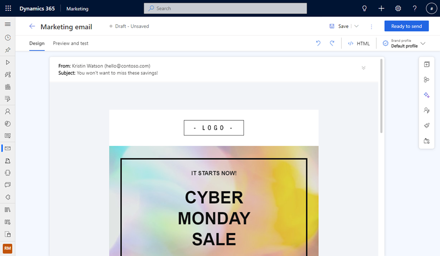

- **Easily find and select one of many new templates to create beautiful emails in minutes**
    - The new template gallery now features over 20 attractive templates for the most typical email types, such as: abandoned cart, event invitation, product launch, newsletter, and more. It is now possible to mark selected templates as favorites and all templates are grouped into relevant categories, making it easier than ever to find just the right template for your next email.
    - [Docs](real-time-marketing-email-get-started.md)

    > [!div class="mx-imgBorder"]
    > 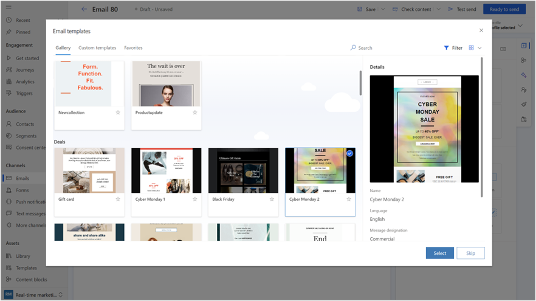

- **Send emails quickly without building a journey**
    - Enable anyone to easily send branded, personalized emails with interaction analytics and link tracking. This simplified sending workflow allows you to select from a new template library, make changes easily with simplifications to the email editor, and send emails to the segment members you need to reach within minutes without being a marketing technology expert.
    - [Release plan](/dynamics365/release-plan/2023wave1/marketing/dynamics365-marketing/send-segment-based-emails-quickly-without-building-journey)
    - [Docs](email-without-journey.md)

    > [!div class="mx-imgBorder"]
    > 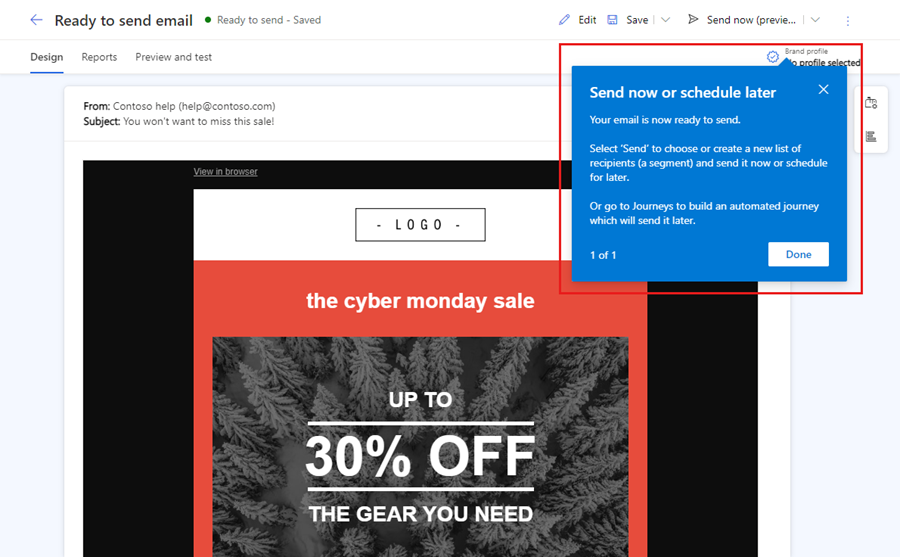

- **Easily create modern forms using the new intuitive form experience**
    - Lead capture forms are crucial for gathering marketing information, turning visitors into leads, and turning leads into valuable customers. With the new intuitive forms experience in real-time marketing, you can easily create modern forms with advanced capabilities without depending on developers. Effortlessly create smart forms to place on your websites and capture your customers’ attention while allowing them to input their details.
    - [Release plan](/dynamics365/release-plan/2023wave1/marketing/dynamics365-marketing/easily-create-modern-forms-using-new-intuitive-form-experience)
    - [Docs](real-time-marketing-form-overview.md)
 
    > [!div class="mx-imgBorder"]
    > 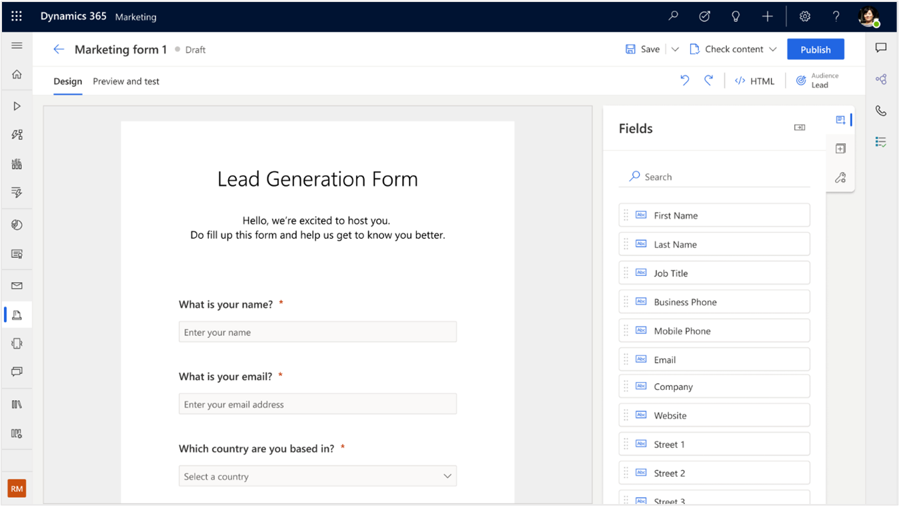 

- **Keep stakeholders in the loop by seamlessly copying them on email campaigns**
    - Improve your customer experience by keeping your sales, customer service, and finance teams in the loop by copying key recipients on email campaigns. Enable other teams to follow up on hot leads or rapidly answer customers' inquiries, speeding up your pipeline and increasing customer satisfaction.
    - [Release plan](/dynamics365/release-plan/2023wave1/marketing/dynamics365-marketing/keep-stakeholders-loop-seamlessly-copying-them-email-campaigns)
    - [Docs](real-time-marketing-add-cc-recipients.md)

    > [!div class="mx-imgBorder"]
    > 

- **Prevent message fatigue by limiting the messages sent to a customer in a specific period**
    - Ensure that your customers receive the right message at the right moment and at the right frequency while preventing fatigue, minimizing unsubscribes, and facilitating optimal engagement with your key messages. Some customers qualify for multiple journeys and campaigns that run simultaneously, which may result in customers receiving multiple messages through one channel in a short period of time. Customers may perceive these messages as spam, which lowers their engagement. With the frequency cap feature, you can optimize engagement by controlling how many messages are sent across multiple channels over a period.
    - [Release plan](/dynamics365/release-plan/2023wave1/marketing/dynamics365-marketing/prevent-message-fatigue-limiting-messages-sent-customer-specific-period)
    - [Docs](real-time-marketing-frequency-cap.md)

    > [!div class="mx-imgBorder"]
    > 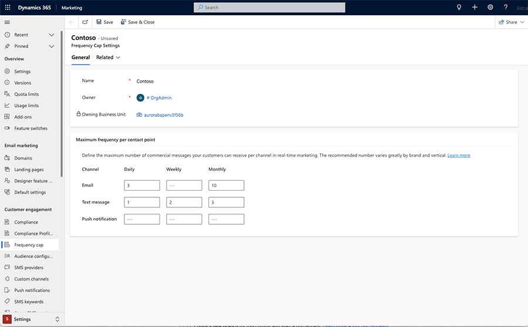

- **Measure marketing activity, web traffic, and conversion goals using automatic UTM tagging**
    - Urchin Tracking Module (UTM) codes help you track sources of traffic for your websites and landing pages, enabling you to attribute conversions to the right source. Marketing messages can be a significant contributor to this traffic, but it is hard to track them without UTM parameters. They’re often left out entirely from the links in messages due to the time-consuming process of manually adding the tags to each link. In addition to automatically tagging all your messages with UTM parameters, you now can choose to customize your parameters so that it matches an existing UTM naming convention that your business already uses in google analytics reports. For example, you can choose UTM campaign to point to a campaign ID instead of the journey name.
    - [Release plan](/dynamics365/release-plan/2023wave1/marketing/dynamics365-marketing/measure-marketing-activity-web-traffic-conversion-goals-using-automatic-utm-tagging)
    - [Docs](real-time-marketing-utm.md)

    > [!div class="mx-imgBorder"]
    > 

- **Review engagement history and tailor marketing efforts using contact insights**
    - Use contact insights in real-time marketing to gain a better understanding of your audience's behavior and interests, make informed decisions based on past engagement, and tailor your marketing efforts to their specific needs and preferences.
    - [Docs](real-time-marketing-analytics.md)

    > [!div class="mx-imgBorder"]
    > 

- **Drive engagement with personalized content using data with one-to-many relationships**
    - Unlock even more data for personalization with ability to define dynamic text using data that requires traversing one-to-many relations. Consider a university alumni donation campaign where you would want to include the name of the college attended by each alum for driving maximum engagement. However, an alum might have attended multiple colleges in that university, resulting in a "one-to-many" relationship between student and college records. You can now define dynamic text for such data.
    - [Docs](real-time-marketing-predefined-dynamic-text.md)

    > [!div class="mx-imgBorder"]
    > 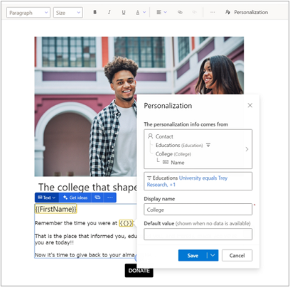

- **Confidently send emails after quickly previewing emails using sample audience data**
    - Personalizing content is an effective strategy for boosting engagement. However, ensuring that the personalized content is accurate for a variety of recipients can be a challenging task. Fortunately, real-time marketing makes this easy – simply select a sample audience member record to preview the exact content that will be delivered to that recipient.  
    - [Docs](real-time-marketing-email.md#preview-and-test-send-your-email)

    > [!div class="mx-imgBorder"]
    > 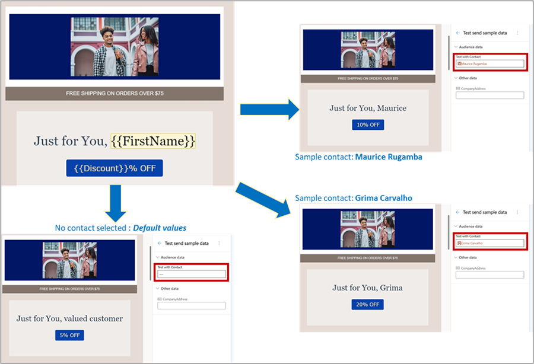

- **Scale your business effortlessly and define access to marketing assets**
    - Improve productivity by defining marketing asset access and visibility to match your business structure. As businesses create vast amounts of assets, organizing data according to organizational structure becomes critical. Well-organized assets are important to remaining compliant and productive. Now in real-time marketing, you can effortlessly organize your digital assets, content, and journeys to match your organizational structure by separating business and customer data across organizational boundaries. Separating data enables you to gain comprehensive insights into a specific brand's marketing performance without losing sight of the bigger picture. Compliance risk is reduced by using out-of-the-box campaigns and data segregation capabilities across your organization.
    - [Release plan](/dynamics365/release-plan/2023wave1/marketing/dynamics365-marketing/scale-business-effortlessly-define-access-marketing-assets)
    - [Docs](real-time-marketing-business-units.md)

- **Dynamics 365 Marketing now supports changing the organization URL in Power Platform Admin Center**
    - People often want to change the URL of the Marketing application to a branded name which is easy to remember. This has been supported for some time in the Power Platform Admin Center, but was not previously supported by the Dynamics 365 Marketing application. With this release, you can now change the organization URL in Power Platform Admin Center and the Marketing application continues to work without side effects.
    - [Docs](manage-marketing-environments.md#change-the-url-for-an-environment-with-real-time-or-outbound-marketing-installed)

### Monthly enhancements

- **Optimize your marketing strategy with unique opens and clicks**
    - Gain insight into the unique individuals who are engaging with your journeys, rather than simply counting the number of times an email or link has been opened or clicked. Tracking unique opens and clicks provides a more accurate picture of your campaign’s reach and engagement by eliminating duplicate interactions from the same customer.
    - [Docs](real-time-marketing-analytics.md)

    > [!div class="mx-imgBorder"]
    > 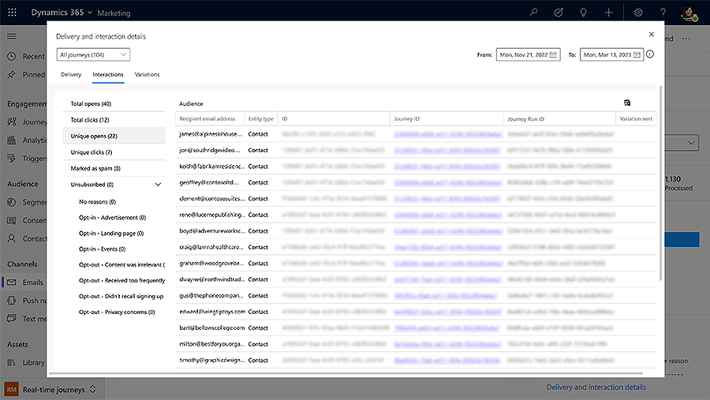

- **Support attachments in custom channel messages**
    - You can now personalize your communications even more by attaching images or other types of files to your custom channel messages. Build new channels like MMS and include images with your WhatsApp or Viber messages, making your customer interactions even more engaging.
    - [Docs](real-time-marketing-create-custom-channels.md)

- **Expanded regional availability for Query Assist**
    - Query Assist, a copilot capability powered by generative AI that enables you to build segments using everyday words, is now available in EUR (Europe).
    - [Docs](real-time-marketing-natural-language.md)

### New blogs and scenario docs

Learn how to make the most of the new Dynamics 365 Marketing features in our latest blogs and scenario docs:

- [Identify and resolve errors with real-time customer care journeys - Scenario docs](real-time-marketing-customer-care-journey.md)
- [Deliver personalized customer experiences with Copilot in Dynamics 365 Marketing and Customer Insights - Microsoft Dynamics 365 Blog](https://cloudblogs.microsoft.com/dynamics365/bdm/2023/03/14/deliver-personalized-customer-experiences-with-copilot-in-dynamics-365-marketing-and-customer-insights/)

## March 2023 update

The Dynamics 365 Marketing March 2023 release general availability features include static segments in real-time marketing, filtering for email lists, enriched marketing content with additional file types, support for SMS providers Infobip and LINK Mobility, customized journeys tailored to your business needs, enhanced real-time journey designer, and segments in real-time marketing where specific people are always included or excluded.

Public preview features include AI-powered content ideas for engaging content creation, simplified email editor, sending segment-based emails without building a journey, preventing message fatigue by limiting the messages sent to a customer in a specific period, business units for real-time marketing, and the ability to hop over one-to-many relationships for dynamic text.

Monthly enhancement includes an upgraded side pane for goals and exit criteria.

### Version number

| App              | GA release      |
|------------------|-----------------|
| Marketing        |  1.92.2019.0    |

### General availability

- **Create a static snapshot of segment membership**
    - Static segment lists are an important part of audience management for marketers. Use static segments in one-off campaigns or newsletters where it’s essential to implement segment membership based on a specific date or time. Static segments ensure that new people that become eligible for the segment won't enter the one-off journey, even if it continues to be live. You can create static snapshots no matter how the segment is built (whether it uses query conditions or manual inclusions or exclusions). The flexibility in static segment creation separates how segments are defined from how you want to update or refresh segments.
    - [Release plan](/dynamics365-release-plan/2022wave2/marketing/dynamics365-marketing/create-static-snapshot-real-time-marketing-segment-membership)
    - [Docs](real-time-marketing-static-snapshot.md)
  
    > [!div class="mx-imgBorder"]
    > 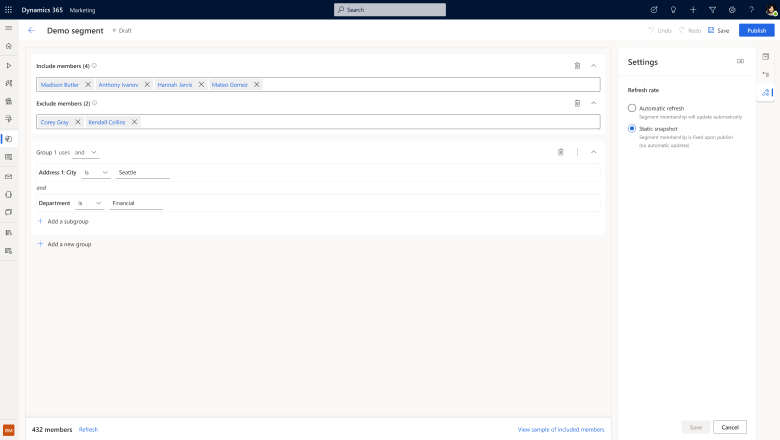

- **Fine-tune email communications with filtered lists**
    - Including an entire list in an email is a common scenario. But there are times when it's more effective to only include items from a list that meet certain conditions. For example, in a confirmation email about an order, you may need to separately list items that are back-ordered. Similarly, communication about a multi-session conference is easier to consume if the sessions are organized by topic or track. Now you can easily achieve these scenarios by simply adding a filter to your email list.
    - [Release plan](/dynamics365-release-plan/2022wave2/marketing/dynamics365-marketing/fine-tune-email-communications-filtered-lists)
    - [Docs](real-time-marketing-personalize-lists.md#define-a-list-filter)
  
    > [!div class="mx-imgBorder"]
    > 

- **Seamlessly manage and embed assets into your content with an enhanced unified library**
    - Sending your customers’ rich, compelling content is key to keeping them engaged with your brand. With this release, using assets across real-time and outbound marketing got easier. With the enhanced unified library, you can now upload files once and use them where you need them. No need to copy or download assets for backup. Using additional file types, such as documents, PDFs, presentations, videos and more, you can now add asset links to your emails to create richer content for your customers.
    > [!NOTE]
    > To foster the new simplified way of managing and using assets, the [real-time marketing library add-on](real-time-marketing-asset-library.md) is no longer available for installation. If you previously installed it, you could continue to use the add-on.
    - [Docs](upload-images-files.md)

    > [!div class="mx-imgBorder"]
    > 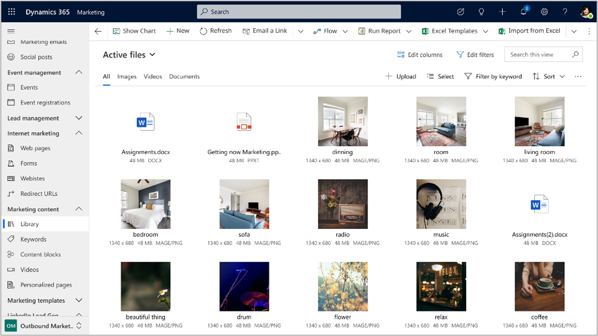

- **Engage your customers with text messages sent using Infobip and LINK Mobility**
    - In addition to Twilio and Telesign, you can now integrate with Infobip and LINK Mobility to send text messages. Connect your existing Infobip or LINK Mobility account and use all Real-time marketing text message features to maximize customer engagement.
    - [Docs](real-time-marketing-outbound-text-messaging.md)

    > [!div class="mx-imgBorder"]
    > 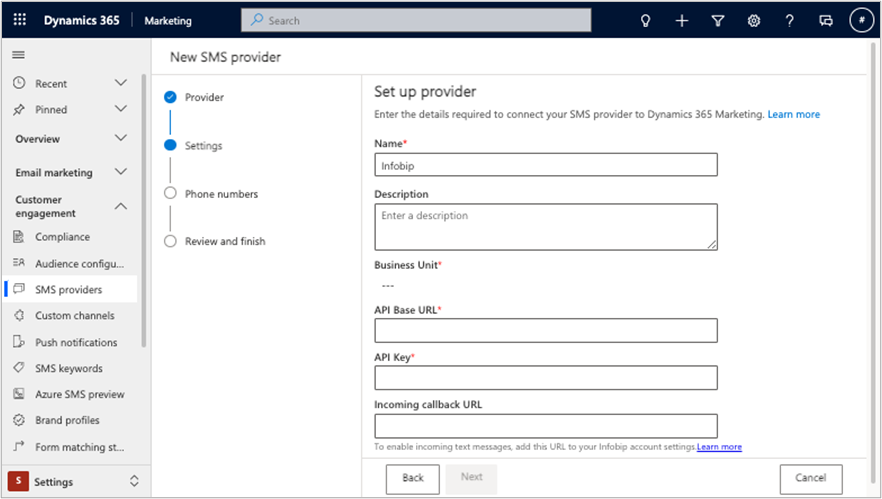

- **Customize the real-time journey designer to better streamline your business flows**
    - Customization of your customer journeys is now available in Dynamics 365 Real-time Marketing. Not only can marketers use out-of-the-box Marketing capabilities to effectively engage with their customers, but they can also now create personalized, flexible, and efficient solutions through Power Apps to better tailor the app to their specific business needs. For example, you can now extend your Real-time journey canvas to add any customized fields through Dataverse to better streamline your business processes for higher efficiency. This allows you to add custom fields such as 'campaign' to your journeys to better manage your assets, collaborate amongst your team members, and gives you more flexibility to create customized analytics reports.
    - [Docs](real-time-marketing-journey-designer.md)

    > [!div class="mx-imgBorder"]
    > 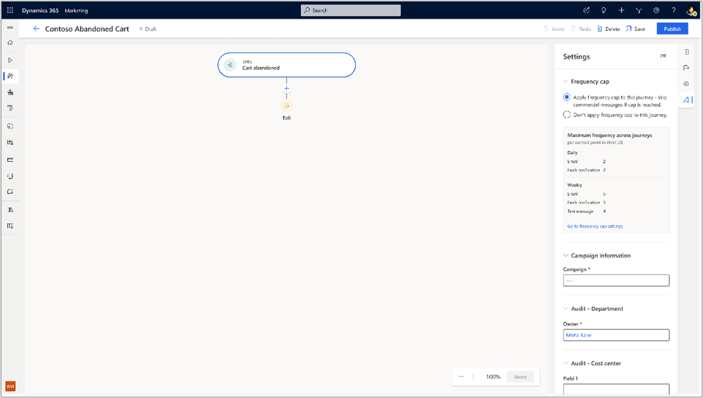

- **Individually manage segment members with inclusions and exclusions**
    - Adding manual inclusions or exclusions is a powerful way to augment segment-building criteria. Manually include or exclude specific people to ensure that segments always reach VIP customers. Or use inclusions and exclusions as an easy way to build test segments for journeys.
    - [Release plan](/dynamics365-release-plan/2022wave2/marketing/dynamics365-marketing/individually-manage-segment-members-inclusions-exclusions)
    - [Docs](real-time-marketing-include-exclude.md)

### Public preview

- **Easily create engaging content using AI-powered Content ideas Copilot**
    - Content ideas uses generative AI to help you find inspiration and can be used as a starting point when composing text for your email. Now, Content ideas features a refreshed look & feel, and generated results are much more creative and of great quality. Additionally, you can select from one of available tone-of-voices (engaged, casual, adventurous, luxury, formal), to make your content even more engaging.
    - [Release plan](/dynamics365/release-plan/2023wave1/marketing/dynamics365-marketing/easily-create-engaging-content-using-ai-powered-content-ideas)
    - [Docs](content-ideas.md)

- **Accurately target customers using improved AI-powered natural language segments**
    - The query assist feature is enhanced with generative AI capabilities. Use conversational, everyday language to quickly build targeted segments. Generate rules that are more accurate with less effort, allowing you to spend more time building customer relationships and less time constructing complex segments from scratch. For example, you can say “Please show me active contacts that attended the coffee tasting event”
    - [Release plan](/dynamics365/release-plan/2023wave1/marketing/dynamics365-marketing/accurately-target-customers-using-improved-ai-powered-natural-language-segments)
    - [Docs](real-time-marketing-natural-language-segments.md)

- **Create beautiful and engaging emails in minutes**
    - The simplified email editor with the improved template gallery allows you to create engaging content within minutes, whether you are an experienced marketer or create emails occasionally to engage with your customers. Now, you can make basic content modifications directly on canvas, and enjoy easy, delightful, and focused experience. Whereas the new template gallery makes it easier than ever to find just the right template for your next email. 
    - [Release plan](/dynamics365/release-plan/2023wave1/marketing/dynamics365-marketing/send-segment-based-emails-quickly-without-building-journey)

    > [!div class="mx-imgBorder"]
    > 

- **Send emails quickly without building a journey**
    - Send emails without creating a journey. This workflow allows you to select from a new template library, make changes easily with simplifications to the email editor, and send emails to the segment members you need to reach within minutes.
    - [Release plan](/dynamics365/release-plan/2023wave1/marketing/dynamics365-marketing/send-segment-based-emails-quickly-without-building-journey)
    - [Docs](email-without-journey.md)

    > [!div class="mx-imgBorder"]
    > 

- **Prevent message fatigue by limiting the messages sent to a customer in a specific period**
    - Ensure that your customers receive the right message at the right moment and at the right frequency to prevent fatigue, avoid unsubscribes, and facilitate optimal engagement with your key messages. Some customers qualify for multiple journeys and campaigns that run simultaneously. This results in customers receiving multiple messages through one channel in a short period of time. Customers may perceive these messages as spam, which lowers their engagement. With the frequency cap feature, you can optimize engagement by controlling how many messages are sent across multiple channels over a period.
    - [Release plan](/dynamics365/release-plan/2023wave1/marketing/dynamics365-marketing/prevent-message-fatigue-limiting-messages-sent-customer-specific-period)
    - [Docs](real-time-marketing-frequency-cap.md)

    > [!div class="mx-imgBorder"]
    > 

- **Scale your business effortlessly and define access to marketing assets**
    - Improve productivity by defining marketing asset access and visibility to match your business structure. As businesses create vast amounts of assets, organizing data according to organizational structure becomes critical. Well-organized assets are important to remaining compliant and productive. Now in real-time marketing, you can effortlessly organize your digital assets, content, and journeys to match your organizational structure by separating business and customer data across organizational boundaries. Separating data enables you to gain comprehensive insights into a specific brand's marketing performance without losing sight of the bigger picture. Compliance risk is reduced by using out-of-the-box campaigns and data segregation capabilities across your organization.
    - [Release plan](/dynamics365/release-plan/2023wave1/marketing/dynamics365-marketing/scale-business-effortlessly-define-access-marketing-assets)
    - [Docs](real-time-marketing-business-units.md)

- **Hop over one-to-many relationships for dynamic text**
    - With dynamic text data that requires traversing 1-to-many relations, unlock even more data for personalization. Consider a university alumni donation campaign where you would want to include the name of the college attended by each alum for driving maximum engagement. However, an alum might have attended multiple colleges in that university, resulting in a "1-to-many" relationship between student and college records. Dynamic text can now be defined for such data.
    - [Docs](real-time-marketing-predefined-dynamic-text.md)

    > [!div class="mx-imgBorder"]
    > 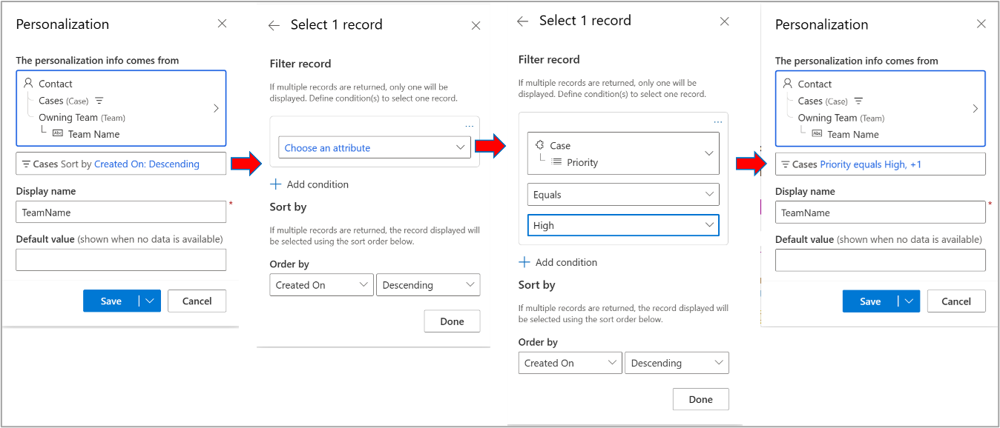

### Monthly enhancement

- **Updated journey side pane**
    - The new journey side pane is designed to improve productivity and streamline your workflow by displaying all the important information upfront. The entry and exit criteria and the journey’s goal and frequency cap settings are more discoverable, making it easier for you to remember to change or update these settings without leaving the journey canvas.

### New blogs and scenario docs

Learn how to make the most of the new Dynamics 365 Marketing features in our latest blogs and scenario docs:

- [Real-Time Marketing – Using Conditional Content within your emails! - Dynamics FastTrack Blogs](https://community.dynamics.com/blogs/post/?postid=d87eb0dd-1965-404a-830c-b7b14c8577f4)
- [Level up customer journeys with advanced orchestration features in Dynamics 365 Marketing - Microsoft Dynamics 365 Blog](https://cloudblogs.microsoft.com/dynamics365/it/2023/02/03/level-up-customer-journeys-with-advanced-orchestration-features-in-dynamics-365-marketing/)
- [Extend and optimize your customer outreach with custom channels - Microsoft Dynamics 365 Blog](https://cloudblogs.microsoft.com/dynamics365/it/2023/02/23/extend-and-optimize-your-customer-outreach-with-custom-channels/)

## February 2023 update

This month, the new real-time marketing segment builder is generally available. Also, a new public preview feature allows you to measure marketing activity, web traffic, and conversion goals using automatic UTM tagging.

### Version number

| App              | GA release      |
|------------------|-----------------|
| Marketing        |  1.91.2018.0    |

### General availability

- **Target the right audience using the new segment builder**
    - Improve your productivity by intuitively creating segments for contacts and leads in the new segment builder. To improve marketing return on investment, your segments must target the right audience. You can now build segments effortlessly by describing them in natural language (using GPT) or by using an easy drag-and-drop logic builder that doesn’t require specialized knowledge of complex data structures and logical operators. To further ensure your confidence in building segments, you can preview the members and estimate the size of draft segments as part of the creation process (within seconds for most segments). In addition, the segment builder enables you to build segments using leads. You can then target the leads directly using customer journeys for your demand generation programs.
    - [Release plan](/dynamics365-release-plan/2022wave2/marketing/dynamics365-marketing/target-right-audience-using-new-segment-builder)
    - [Docs](real-time-marketing-build-segments.md)

    > [!div class="mx-imgBorder"]
    > 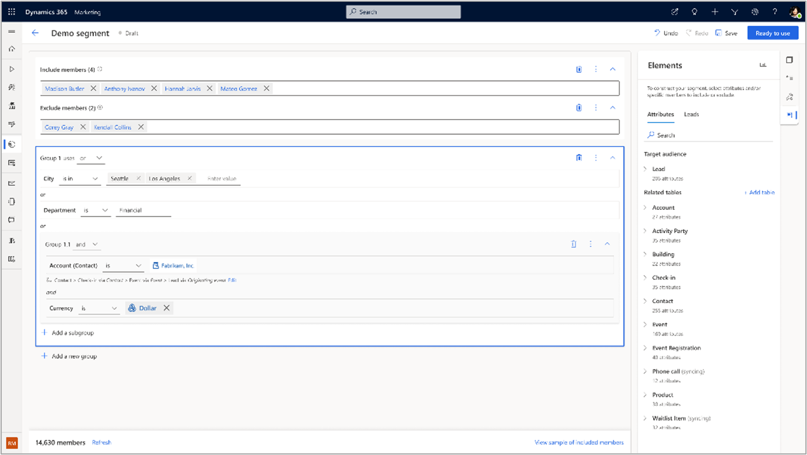

### Public preview

- **Measure marketing activity, web traffic, and conversion goals using automatic UTM tagging**
    - Urchin Tracking Module (UTM) codes help you track sources of traffic for your websites and landing pages, enabling you to attribute conversions to the right source. Marketing messages can be a significant contributor to this traffic, but it's hard to track them without UTM parameters. Links in messages are overlooked due to the time-consuming process of manually adding tags to each link. Dynamic 365 Marketing now automatically tags all your links in messages with UTM parameters, following a consistent taxonomy. This gives you full visibility into your marketing contribution to web traffic, empowering you to optimize traffic and conversions.
    - [Release plan](/dynamics365/release-plan/2023wave1/marketing/dynamics365-marketing/measure-marketing-activity-web-traffic-conversion-goals-using-automatic-utm-tagging)
    - [Docs](real-time-marketing-utm.md)

    > [!div class="mx-imgBorder"]
    > 

### Monthly enhancements

- **View Total Opens and Total Clicks KPIs and interactions in Delivery and Interactions details**
    - Track the effectiveness of your customer experiences and make data-driven decisions to optimize your marketing strategies. Understanding how many people have seen a marketing message and how many people have engaged with the experience by clicking on a link can help identify which channels are driving more engagement, allowing you to make informed decisions on how to optimize your marketing strategy.
    > [!NOTE]
    > This feature includes the temporary removal of Unique clicks and Opens from Delivery and Interactions details. Unique clicks and Opens will be added back in an upcoming release.
- **Easily manage additional tables available for personalization**
    - You can use up to 50 tables for personalization in real-time marketing (see details [here](real-time-marketing-predefined-dynamic-text.md#access-even-more-data-for-personalization)). You have control over which 50 tables to select. This selection step is easier now with additional pre-defined filters to quickly filter the tables list to all tables, tables selected by default, tables that you've selected, or tables that are in use in the current message.
- **Support for multi-line conditions in inline conditions**
    - Inline conditions are used to create HTML code for scenarios where conditional content is not appropriate such as changing one word in otherwise common content (for example, a salutation word). This user experience is now enhanced with the same condition builder experience used everywhere in the product, improving ease of use and delivering the added functionality of multi-line conditions. Learn more: [How to use inline conditions](real-time-marketing-personalize-inline-conditions.md).
- **No-code approach to adding marketing interactions to the unified timeline in custom contact/lead forms**
    - When using out-of-the-box contact/lead forms, marketing interactions based on journeys in real-time marketing and outbound marketing are automatically populated in the unified timeline. But when marketers used custom contact/lead forms, they had to manually add the marketing interactions into the timeline by making code changes. With the February release, you can add marketing interactions to your custom contact/lead forms through a simple no-code approach by adding a custom connector to your custom forms through the Power Apps maker experience. Learn more: [How to enable marketing interactions in your contact/lead timeline](timeline.md#how-to-enable-marketing-interactions-in-your-contactlead-timeline).
- **Marketing interactions in the unified timeline now showcase specific links clicked by contacts/leads in messages**
    - Sales reps and customer service agents now have visibility into specific links that a contact/lead clicked in their marketing messages. Viewing the specific links helps them understand the contact/lead’s past activities at a more granular level, enabling more personalized engagement. For instance, a credit card agent in a financial services firm can now understand which credit card offer (among many) a contact clicked on in a promotional message, allowing them to make a personalized follow-up call. Learn more: [Customer interactions timeline](timeline.md).

### New blogs and scenario docs

Learn how to make the most of the new Dynamics 365 Marketing features in our latest blogs and scenario docs:
- [Boost event engagement with real-time journeys - Scenario docs](real-time-marketing-event-registration-journey.md)
- [Real-Time Marketing – Using Conditional Content within your emails! - Dynamics FastTrack Blogs](https://community.dynamics.com/blogs/post/?postid=d87eb0dd-1965-404a-830c-b7b14c8577f4)
- [Level up customer journeys with advanced orchestration features in Dynamics 365 Marketing - Dynamics 365 IT Pro Blogs](https://cloudblogs.microsoft.com/dynamics365/it/2023/02/03/level-up-customer-journeys-with-advanced-orchestration-features-in-dynamics-365-marketing/)

## January 2023 update

There is no Dynamics 365 Marketing release for January. We will be back in February with new feature improvements, updates, and bug fixes.

### New blogs and scenario docs

Learn how to make the most of the new Dynamics 365 Marketing features in our latest blogs and scenario docs:

- [Boost event engagement with real-time journeys - Scenario docs](real-time-marketing-event-registration-journey.md)
- [Real Time Marketing – Using Conditional Content within your emails! - Dynamics FastTrack Blogs](https://community.dynamics.com/blogs/post/?postid=d87eb0dd-1965-404a-830c-b7b14c8577f4)

> [!Tip]
> To read about updates from previous years, see the [What's new archive](whats-new-marketing-archive.md) article.

[!INCLUDE[footer-include](../includes/footer-banner.md)]
