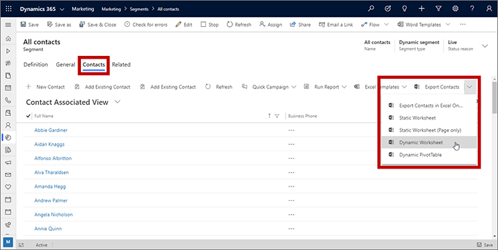
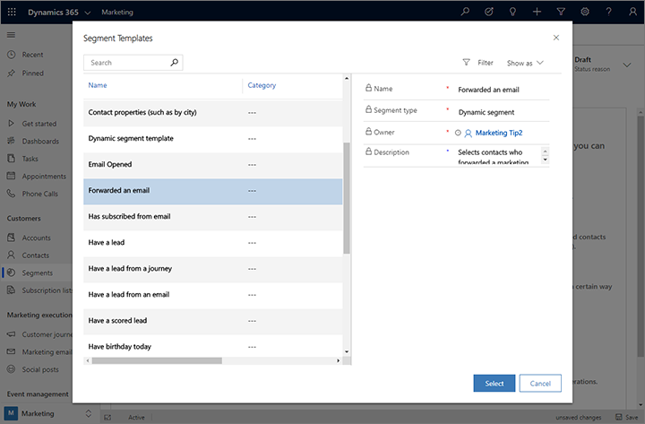
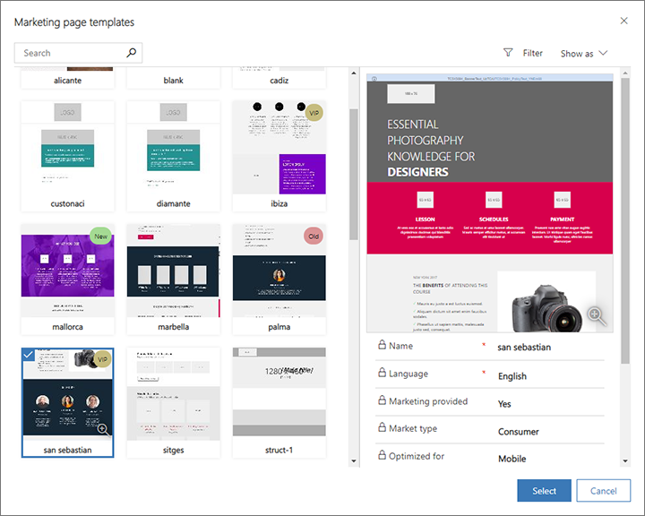
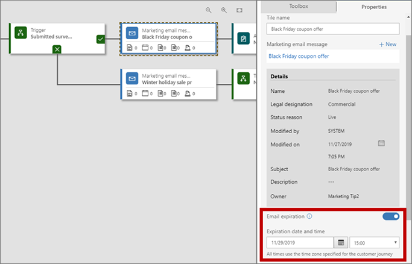
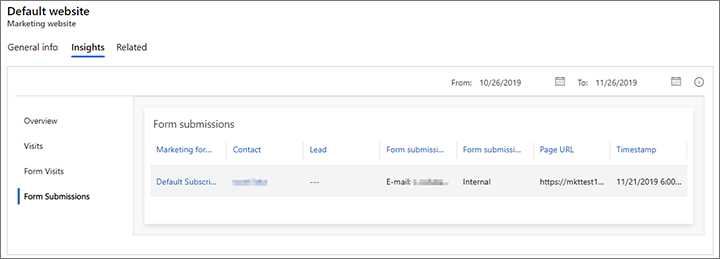
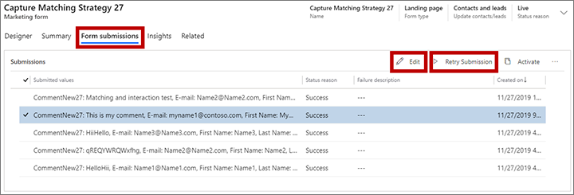

# What's new in Dynamics 365 Marketing

We're excited to announce our newest updates! This article summarizes early access features, preview features, general availability enhancements, monthly updates, and bug fixes. To see the long-term feature plans, take a look at the [Dynamics 365 and Power Platform release plans](https://docs.microsoft.com/dynamics365/release-plans/).

Marketing updates are [pushed to all customers automatically](https://cloudblogs.microsoft.com/dynamics365/it/2020/04/27/automatic-update-policy-for-dynamics-365-marketing/). Marketing follows a [phased deployment approach](https://dynamics.wiki/index.php/Dynamics_365_Marketing_Overall_Release_Calendar) aligned with the platform deployment schedule. Solutions are available for early validations. To manually update your instances, follow the steps in [Keep Marketing up to date](apply-updates.md).

> [!Note]
> To submit and vote on **feature requests** and **product suggestions**, go to the [Dynamics 365 Application Ideas portal](https://experience.dynamics.com/ideas/categories/?forum=bee3d862-df65-e811-a95d-000d3a1be7ad&forumName=Dynamics%20365%20Marketing).

## January 2021 update

There is no Dynamics 365 Marketing release for January. We will be back in February with new feature improvements, updates, and bug fixes.

## December 2020 update

The Dynamics 365 Marketing December 2020 update includes improvements to event registrations, email designer enhancements, additional social posting features, and monthly bug fixes.

### Version number

| App              | GA release      |
|------------------|-----------------|
| Marketing        | 1.35.10068.1056 |

> [!Tip]
> To check your current version number, refer to [Find out which version of Dynamics 365 Marketing you are running](https://docs.microsoft.com/dynamics365/marketing/apply-updates#find-out-which-version-of-dynamics-365-marketing-you-are-running).

### Monthly enhancements

- **Event management**
    - Added a new API for generating personalized calendar (.ics) files based on event and session data.
    - Using the new API, marketers can add an “Add to calendar” button to registration confirmation emails that automatically generates a personalized iCalendar file.
- **Marketing emails**
    - Responding to customer feedback, we added email designer support for rounded corners in Outlook
    - We also improved email rendering consistency when forwarding emails in Outlook.
- **Social posting**
    - You can now view post history and replies from social channels in the social post designer.

### Bug fixes

- **Customer journeys**
    - Fixed an issue that occasionally caused the customer journey designer to render an empty source tile even when a source was set.
    - Resolved an error resulted in contacts being sent down a **No** path from an **If/then** activity, even when the form-related prerequisite was met.
    - Improved date functionality in **Wait until** and **Send an email** tiles.
    - Resolved an issue that caused **Static segment** and **Compound segment** to incorrectly appear as options for the customer journey **Quick Create: Segment** functionality.
- **Data services**
    - Updated the documentation to reflect the current GDPR consent change record UI.
- **Event management**
    - Resolved an error that prevented events from being saved when the event name was more than 120 characters.
    - Fixed an error that caused an event thank you page to be shown for a few seconds before redirecting to the URL in the event form.
    - Fixed an issue that caused "You have enabled demo payment confirmation..." to display as an error instead of a warning.
- **First run experience**
    - Resolved an issue that caused FRE progress to get stuck and fail.
    - Fixed an error message that incorrectly appeared during the upgrade process.
    - Fixed an error message that incorrectly appeared during FRE progress.
    - Resolved an error that caused a portal to appear in the FRE page, even after the portal was deleted.
- **Marketing emails**
    - Fixed an error that caused an email background color field to be populated by the autocomplete.
    - Improved rounded button compatibility in Outlook.
    - Improved rounded border functionality with old email templates.
    - Improved layout preservation when forwarding emails from Outlook.
    - Fixed an error that caused telephone links to automatically have an "http://" prefix.
    - Improved image height rendering on mobile devices.
    - Improved the functionality and reliability of the **Prevent auto-adjustment** switch.
    - Improved rendering for column minimum height on mobile devices.
    - Fixed an error that caused text to appear next to (instead of under) a left-aligned image.
- **Marketing pages**
    - Resolved an issue where forms were occasionally not validated, even when an empty field was non-required.
    - Fixed an error where a subscription center form did not pre-fill marketing lists correctly.
    - Improved marketing form lookup field compatibility with Firefox and Safari.
    - Resolved an issue where browser retries occasionally caused submission duplication.
    - Fixed an error that caused contact updates to appear in an incorrect order.
    - Improved handling of UTF-8 characters in URLs.
    - Resolved an occasional error that caused some matching strategy results to be hidden.
    - The correct TenantID is now sent when attempting to clean the portal cache.
    - Fixed an error that prevented users from making form field labels bold for newly added form fields.
    - Resolved an error that allowed multiple live form captures for the same form.
- **Segmentation**
    - Fixed an issue where segments updated to an "Expired" status in Microsoft Dataverse remained "Active" in the backend.
    - Resolved a segment query error caused when joining an Opportunity and Account.
- **Shared UX**
    - Resolved an issue that caused an error when creating new calendar appointments in Safari.

## November 2020 update

The Dynamics 365 Marketing November 2020 update includes several enhancements including social posting improvements, Microsoft Teams integration updates, a revamped portals experience, template gallery improvements, and bug fixes.

### Version number

| App              | GA release      |
|------------------|-----------------|
| Marketing        | 1.35.10067.1044 |

> [!Tip]
> To check your current version number, refer to [Find out which version of Dynamics 365 Marketing you are running](https://docs.microsoft.com/dynamics365/marketing/apply-updates#find-out-which-version-of-dynamics-365-marketing-you-are-running).

### Monthly enhancements

- **Compliance**
    - Together with the release of [Microsoft Cloud for Healthcare](https://docs.microsoft.com/industry/healthcare/compliance-overview), Marketing is now HIPAA compliant.
- **Event management**
    - Microsoft Teams integration has improved the accuracy of event attendance tracking by restricting [attendee check-in](https://docs.microsoft.com/dynamics365/marketing/teams-webinar#inviting-registrants-to-attend-the-live-event-through-email) until 30 minutes before the start of the event.
    - Events automatically shows Teams meetings and live events on the organizer's Outlook calendar.
- **First run experience**
    - Addressing customer feedback, we’ve improved the portal trial experience.
    - Portal trials now include better tracking of the trial expiration date.
    - Differences between Dynamics 365 Portals and Power Apps portals are also explained more clearly in the UI.
- **Social posting**
    - Enhanced UI for a more efficient social posting experience.
    - Enhancements include a default calendar view, easier access to KPIs, and improved post previews.
- **Shared UX**
    - The Marketing email template gallery now includes sender fields.

### Bug fixes

- **Customer journeys**
    - Resolved an issue that occasionally caused emails to be sent after a journey ended.
    - Fixed an issue where live editing a customer journey after the last iteration had no scheduling effects.
- **Data services**
    - Fixed an issue that prevented dropping work items in auditing.
- **Event management**
    - Resolved an occasional issue that incorrectly attributed an event template owner.
    - Fixed a validation error on Events Business Rule Set default values.
    - Resolved a custom field caching error that caused sporadic failures.
- **First run experience**
    - Resolved an error where updated portals displayed as not configured on the portal page.
- **Framework**
    - Simplified the hard delete process.
- **Lead management**
    - Improved French localization on lead forms.
- **Marketing emails**
    - Fixed an issue where the Dynamics 365 Customer Voice tile was not shown in **Advanced elements** in the toolbox.
    - Resolved an error caused by setting and then removing an image width value.
    - Resolved an issue where a horizontal line sometimes appeared between two sections of an email in Outlook.
    - Fixed an issue where margins on images occasionally did not render correctly in Outlook.
    - Resolved an error that caused linked images to have a blue border.
    - Fixed an issue that caused background images in columns to not work in sections with a background image.
    - Improved new compatibility for new email templates.
- **Marketing pages**
    - Fixed an error that occasionally enabled users to save locked marketing lists.
    - Enabled visibility for subscription list lock status in list view.
    - Enabled form fields with a placeholder value to be set to required.
    - Resolved an error that caused matching strategy failure for non-string attributes.
    - Improved form capture compatibility with server-side detection.
    - Fixed an issue that caused a correlation renewal error when a browser window was collapsed for a long period of time.
    - Resolved an occasional error with custom registration fields.
    - Fixed an error that resulted when a contact quickly subscribed then unsubscribed from a marketing list.

## October 2020 update

The Dynamics 365 Marketing October 2020 update includes several feature enhancements, performance upgrades, and bug fixes. Several [2020 release wave 2](https://docs.microsoft.com/dynamics365-release-plan/2020wave2/marketing/dynamics365-marketing/planned-features) features have been made generally available in the October update, including a new customer journey designer, built-in Teams functionality for events, email designer enhancements, flexible options for data after form submissions, in-place editing of email and forms, and expanded social posting options. This release also includes a preview of natural language input for creating segments.

### Version number

| App              | GA release      |
|------------------|-----------------|
| Marketing        | 1.35.10066.1057 |

> [!Tip]
> To check your current version number, refer to [Find out which version of Dynamics 365 Marketing you are running](https://docs.microsoft.com/dynamics365/marketing/apply-updates#find-out-which-version-of-dynamics-365-marketing-you-are-running).

### General availability enhancements

- **Build customer journeys more efficiently using the new canvas experience**
    - [Release plan](https://docs.microsoft.com/dynamics365-release-plan/2020wave2/marketing/dynamics365-marketing/new-improved-customer-journey-canvas-experience)
    - [Docs](create-simple-customer-journey.md)
- **Run webinars and meetings using built in Microsoft Teams functionality**
    - [Release plan](https://docs.microsoft.com/dynamics365-release-plan/2020wave2/marketing/dynamics365-marketing/teams-integration-webinar)
    - [Docs](teams-webinar.md)
- **Create engaging, customized emails faster**
    - [Release plan](https://docs.microsoft.com/dynamics365-release-plan/2020wave2/marketing/dynamics365-marketing/create-customized-emails-faster)
    - [Docs](email-design.md)
- **Collect data from form submissions more easily with expanded entity options**
    - [Release plan](https://docs.microsoft.com/dynamics365-release-plan/2020wave2/marketing/dynamics365-marketing/capture-data-more-easily-simplified-forms-requirements)
    - [Docs](marketing-forms.md#do-not-createupdate-contacts-or-leads)
- **In-place editing of email and forms in customer journeys**
    - [Release plan](https://docs.microsoft.com/dynamics365-release-plan/2020wave2/marketing/dynamics365-marketing/in-place-editing-email-forms)
    - [Docs](customer-journeys-create-automated-campaigns.md#configure-tile-settings)
- **Create and manage content-rich social media posts and easily monitor performance**
    - [Release plan](https://docs.microsoft.com/dynamics365-release-plan/2020wave2/marketing/dynamics365-marketing/improved-social-posting)
    - [Docs](social-posting.md)

### Preview feature

> [!IMPORTANT]
> This is a preview feature. A preview feature is a feature that is not complete, but is made available before it's officially in a release so customers can get early access and provide feedback. Preview features aren't meant for production use and may have limited or restricted functionality.
>
> Microsoft doesn't provide support for this preview feature. Microsoft Dynamics 365 Technical Support won't be able to help you with issues or questions. Preview features aren't meant for production use and are subject to a separate supplemental terms of use.

- **Use natural language to create targeted segments**
    - [Release plan](https://docs.microsoft.com/dynamics365-release-plan/2020wave2/marketing/dynamics365-marketing/create-consume-segments-using-natural-language)
    - [Docs](nl-segment-build.md)

### Bug fixes

- **Customer journeys**
    - Resolved an issue where custom channels occasionally did not appear after upgrading the customer journey designer.
    - Resolved an error that prevented live customer journeys from being assigned to another user or team.
    - Fixed an error that caused customer journeys to crash when changing the **Bypass email duplication** setting to **Yes**.
    - Resolved an error in the new customer journey designer caused by legacy trigger tiles in custom templates.
    - Resolved a stability issue when creating an email using the lookup control and taking a customer journey live.
    - Improved stability when editing segments in live customer journeys.
- **Event management**
    - Fixed an error that cause event end dates and messages to be improperly handled in PublicAPI and websites.
- **First run experience**
    - Fixed an issue where "Update available" for Dynamics 365 Marketing erroneously appeared in the Power Platform Admin Center.
    - Fixed an issue where the setup wizard allowed more than 24 characters for the Portals host name.
- **Lead management**
    - Addressing [user feedback](https://experience.dynamics.com/ideas/idea/?ideaid=1c121690-48b2-ea11-8b71-0003ff68c1c4), lead scores for new lead scoring models are now reset and recalculated when the underlying entity record is modified.
- **Marketing emails**
    - Resolved an issue where videos did not scale to 100% column width in Outlook.
    - Improved rendering of image height and width on iPhones.
    - Fixed an error that caused buttons to change the size of columns.
    - Fixed a rendering error in Outlook caused by adding **background-image: initial** to an email.
    - Improved image rendering consistency in the Windows Mail app.
    - Resolved an error where the links sometimes did not populate when using assist edit.
    - Fixed an error that caused improper indentation on the second line of bullets in Outlook.
    - Fixed an issue that prevented video and button elements from being processed in Outlook when added using drag and drop functionality in the designer.
- **Marketing pages**
    - Fixed an error caused when lookup values pointed to non-existent records.
    - Resolved an issue where the **Required error message** field failed to save.
    - Added troubleshooting tips when marketing forms are unable to load.
    - Fixed an issue that caused hidden fields not to display in form templates.
    - Resolved an issue that caused the designer to occasionally not load when opening a template.
- **Quota**
    - Fixed an error that caused a Contact Addon package installation failure.
- **Segmentation**
    - Resolved an error that caused the **New** segment button to appear even for users without **Create** permissions for segments.

## September 2020 update

The September update includes email designer enhancements, social posting improvements, improved localization of events, an updated template gallery, and 23 bug fixes, improving reliability and stability. The early access release includes [2020 release wave 2](https://docs.microsoft.com/dynamics365-release-plan/2020wave2/marketing/dynamics365-marketing/planned-features) features, including a new customer journey designer and flexible options for data after form submissions.

### Version number

| App              | GA release      | Early access    |
|------------------|-----------------|-----------------|
| Marketing        | 1.35.10065.1064 | 1.35.10065.2064 |

> [!Tip]
> To check your current version number, refer to [Find out which version of Dynamics 365 Marketing you are running](https://docs.microsoft.com/dynamics365/marketing/apply-updates#find-out-which-version-of-dynamics-365-marketing-you-are-running).

### Early access features

> [!IMPORTANT]
> Early access features are currently available only on opted-in instances. You can opt in for early access on any instance, but we recommend that you do so only on trial, test, or sandbox instances, which will give you a chance to learn the new functionality before it shows up on your production instances later this year.
>
> For instructions on how to opt in and enable early access, see [Opt in to early access updates](https://docs.microsoft.com/power-platform/admin/opt-in-early-access-updates). For more information about the 2020 release wave 2 schedule, and for answers to frequently asked questions about the early access program, see [2020 release wave 2 features available for early access](https://docs.microsoft.com/dynamics365-release-plan/2020wave2/features-ready-early-access).
>
> We encourage all customers to provide feedback related to early access features on the [Dynamics 365 Marketing Forum](https://community.dynamics.com/365/marketing/f/dynamics-365-for-marketing-forum), your Microsoft contact or partner, and/or through [Microsoft Support](https://docs.microsoft.com/power-platform/admin/get-help-support).

- **Build customer journeys more efficiently using the new canvas experience**
    - [Release plan](https://docs.microsoft.com/dynamics365-release-plan/2020wave2/marketing/dynamics365-marketing/new-improved-customer-journey-canvas-experience)
    - [Docs](create-simple-customer-journey.md)
- **Collect data from form submissions more easily with expanded entity options**
    - [Release plan](https://docs.microsoft.com/dynamics365-release-plan/2020wave2/marketing/dynamics365-marketing/capture-data-more-easily-simplified-forms-requirements)
    - [Docs](marketing-forms.md#do-not-createupdate-contacts-or-leads)

### Monthly enhancements

- **Event management**
    - With localization improvements, event websites reflect the time zone of where the event is taking place.
- **Marketing emails**
    - Improved support for background images, call to action buttons, and responsiveness in Microsoft Outlook.
    - Toggle post-processing on or off for custom HTML that is pasted into the email editor.
- **Social posting**
    - Post directly to a Facebook user account or any Facebook page on which you are an admin.

### Bug fixes

- **Customer journeys**
    - Fixed an error that occasionally caused a subscription list selected in a segment tile to not populate the tile name.
    - Improved ability to reuse segments between iterations of customer journeys.
    - Fixed an issue that occasionally prevented deactivation and deletion of a subscription marketing list.
    - Fixed an error that caused no "OK" button to appear in a warning dialog regarding marketing list deactivation.
- **Event management**
    - Fixed an error where sessions were occasionally displayed for registrations for events without sessions.
    - Improved resolved an error that sometimes caused business process flows to not copy correctly when creating an event from a template.
- **First run experience**
    - Resolved an issue that sometimes prevented upgrades to solution-only environments.
- **Marketing emails**
    - Resolved an error where email sections with top or bottom padding did not render background images properly.
    - Fixed an issue with CKEditor where images did not render properly if a width and height was not specified.
    - Improved column width rendering in Outlook.
    - Improved handling of transparent background images in Outlook.
    - Improved handling of backgrounds with both a background color and an image in Outlook.
    - Improved image height rendering in Outlook.
- **Marketing pages**
    - Improved domain validation reliability.
    - Improved UI functionality when adding form fields from the "Field" lookup.
    - Fixed an error that prevented some installs from going live with the default marketing page because of a duplicate partial URL.
    - Resolved an issue that prevented form allow list migration when the domain records were already in the customer cache.
- **Segmentation**
    - Resolved an error that sometimes caused Export to Excel functionality to fail.
    - Fixed an error that sometimes prevented the segment members tab from loading properly.
    - Improved language compatibility in segment form error messages.
- **Shared UX**
    - Improved handling of height and width settings of images in text elements.
    - Resolved an error that deleted other images when deleting an image added from CKEditor.
- **Social posting**
    - Resolved an issue where a LinkedInLeadGen patch was deleting upgrade logs.

## August 2020 update

The August update includes a preview of built-in Teams functionality for events, email designer enhancements, and 33 bug fixes, improving reliability and stability. The early access release includes [2020 release wave 2](https://docs.microsoft.com/dynamics365-release-plan/2020wave2/marketing/dynamics365-marketing/planned-features) features, including improved social posting and email designer improvements.

### Version number

| App              | GA release      | Early access    |
|------------------|-----------------|-----------------|
| Marketing        | 1.35.10064.1061 | 1.35.10064.2061 |

> [!Tip]
> To check your current version number, refer to [Find out which version of Dynamics 365 Marketing you are running](https://docs.microsoft.com/dynamics365/marketing/apply-updates#find-out-which-version-of-dynamics-365-marketing-you-are-running).

### Early access features

> [!IMPORTANT]
> Early access features are currently available only on opted-in instances. You can opt in for early access on any instance, but we recommend that you do so only on trial, test, or sandbox instances, which will give you a chance to learn the new functionality before it shows up on your production instances later this year.
>
> For instructions on how to opt in and enable early access, see [Opt in to early access updates](https://docs.microsoft.com/power-platform/admin/opt-in-early-access-updates). For more information about the 2020 release wave 2 schedule, and for answers to frequently asked questions about the early access program, see [2020 release wave 2 features available for early access](https://docs.microsoft.com/dynamics365-release-plan/2020wave2/features-ready-early-access).
>
> We encourage all customers to provide feedback related to early access features on the [Dynamics 365 Marketing Forum](https://community.dynamics.com/365/marketing/f/dynamics-365-for-marketing-forum), your Microsoft contact or partner, and/or through [Microsoft Support](https://docs.microsoft.com/power-platform/admin/get-help-support).

- **Create and manage content-rich social media posts and easily monitor performance**
    - [Release plan](https://docs.microsoft.com/dynamics365-release-plan/2020wave2/marketing/dynamics365-marketing/improved-social-posting)
    - [Docs](social-posting.md)
- **Create engaging, customized emails faster**
    - [Release plan](https://docs.microsoft.com/dynamics365-release-plan/2020wave2/marketing/dynamics365-marketing/create-customized-emails-faster)
    - [Docs](email-design.md)

### Preview feature

> [!IMPORTANT]
> This is a preview feature. A preview feature is a feature that is not complete, but is made available before it's officially in a release so customers can get early access and provide feedback. Preview features aren't meant for production use and may have limited or restricted functionality.
>
> Microsoft doesn't provide support for this preview feature. Microsoft Dynamics 365 Technical Support won't be able to help you with issues or questions. Preview features aren't meant for production use and are subject to a separate supplemental terms of use.

- **Run webinars and meetings using built in Microsoft Teams functionality**
    - [Release plan](https://docs.microsoft.com/dynamics365-release-plan/2020wave2/marketing/dynamics365-marketing/teams-integration-webinar)
    - [Docs](teams-webinar.md)

### Monthly enhancements

- **Marketing emails**
    - Adding event, survey, marketing page, and Teams buttons to emails is easier with improved drag and drop functionality, enhanced appearance, and easily editable text.
    - Placeholders for images, videos, and content blocks now have a more consistent appearance and uniform icons.
    - Add up to 10 columns with improved custom column configuration controls.

### Bug fixes

- **Customer journeys**
    - Fixed an error where the customer journeys scheduler occasionally did not parse live updates properly.
- **Event management**
    - Fixed a stability error related to an event handler malfunction.
    - Resolved an issue where check-ins occasionally did not record properly for session registration.
    - You can no longer select the same building for simultaneous events.
- **Marketing emails**
    - Resolved an issue in Outlook where two or three-column email layouts sometimes did not display content or background images correctly.
    - Resolved an issue in Outlook where a double border appeared when a solid border was selected in the email designer.
    - Fixed an error where column widths sometimes rendered inconsistently in Outlook.
    - Resolved an issue where QR code and custom tile setting were sometimes removed after refreshing the email designer.
    - Fixed an error in the email designer that resulted from putting "0" as the min-height for columns.
    - Resolved an issue where padding at the top of an image did not render correctly in Outlook 2016.
    - Fixed an error where two-column layouts did not render properly in Outlook when background images were used.
    - Resolved an error where background images did not scale properly in Outlook 2019 when using a 120 DPI setting.
    - Resolved a rare issue where custom code added to marketing emails sometimes vanished.
    - Fixed an error where video thumbnails in emails were not scaled properly on some mobile devices.
    - Fixed an error where defined image sizes rendered inconsistently in Outlook.
    - Resolved an issue where padding after a content block sometimes rendered incorrectly in Outlook.
    - Improved column min. height rendering in Outlook.
- **Marketing pages**
    - Fixed an issue where a CSS error displayed a two-column layout as a single column.
    - Updated forms and tracked content do not allow IP lists.
    - Improved marketing form responsiveness.
    - Resolved an issue where a privacy banner would occasionally block a text content block in the preview view.
    - Resolved an issue where a privacy banner would occasionally block a text content block in the live view.
    - Resolved an error where the background color of a column disappeared after deleting one column from a three-column layout.
    - Fixed an error that occasionally resulted in inconsistent rendering of the shipping address form and subscription form when used in page template "Product Page 2."
    - Enabled the use of metadata size limits on marketing pages to override the hardcoded marketing page side validation limit of 64 K.
    - Updated incorrect error messages when prefill is enabled.
    - Resolved an error where users with only system admin roles could not go live on forms with custom registration fields.
    - Updated form capture components.
    - Improved the reliability of subscription tracking for marketing lists.
- **Segmentation**
    - Resolved an issue where a segment did not recover to a healthy state after a subsegment failure, even after the subsegment was repaired.
- **Shared UX**
    - Improved Element List compatibility with the NVDA tool.
    - Fixed a loading error that sometimes occurred when switching the Template Gallery to the grid layout then selecting a record.
- **Social posting**
    - Improved the UI on the calendar to create separation between adjacent items.

## July 2020 update

The Dynamics 365 Marketing July 2020 update includes several enhancements including customer journey improvements, improved email editor performance, the ability to delete social posts, a warning when nearing the limit of active segments, subscription center improvements, and bug fixes.

### Version number

| App              | GA release      |
|------------------|-----------------|
| Marketing        | 1.35.10063.1039 |

> [!Tip]
> To check your current version number, refer to [Find out which version of Dynamics 365 Marketing you are running](https://docs.microsoft.com/dynamics365/marketing/apply-updates#find-out-which-version-of-dynamics-365-marketing-you-are-running).

### Monthly enhancements

- **Customer journeys**
    - Schedule permitted sending times for marketing email message tiles directly from the tile properties.
        - [Docs](automated-scheduler.md)
    - View the number of queued contacts in the customer journey that have not yet reached the selected tile in the **Insights** pane.
        - [Docs](insights.md#designer-insights)
- **Marketing emails**
    - Improved email editor responsiveness and performance.
- **Segment management**
    - A warning is now displayed when you are nearing the limit of active segments.
    - Dynamic segments now display when the segment was last evaluated and the next evaluation time.
        - [Docs](segmentation-lists-subscriptions.md#create-and-go-live-with-a-new-segment)
    - Searches auto-complete for text field attributes based on existing data.
- **Social posting**
    - Social media post deletion now syncs with social channels, deleting posts in the app and on social media sites when you click delete in the Marketing app.
        - [Docs](social-posting.md#edit-reschedule-or-cancel-a-post)
- **Subscription center**
    - Users can now manage subscription preferences without downloading cookies. To unsubscribe, users can click the cookieless subscription center link in a marketing email and change their preferences.

### Bug fixes

- **Content settings**
    - Fixed an error where users were unable to update business unit default contact settings after enabling business unit scoping.
- **Event management**
    - Resolved an error that occurred when attempting to add an event webinar provider.
- **First run experience**
    - Marketing installation no longer fails if a default contact is not listed.
- **Lead scoring**
    - Fixed an issue where an "expression value is missing" error prevented new lead-scoring models from going live.
- **Marketing emails**
    - Resolved an issue where columns sometimes did not resize properly in two section layouts.
    - Fixed an issue where the email designer layout and the preview layout occasionally did not match.
    - Fixed an issue where text and images in emails were occasionally not responsive in Outlook.
    - Resolved an issue where the default Marketing page did not load correctly when accessed from an email sent by a trial org.
    - Fixed an issue where anchor flags in the email text box editor did not function as expected.
    - Fixed a rare error where the body of an email message disappeared when HTML was pasted into the HTML tab.
    - Resolved an error where a button in a 2:1 column layout did not align properly with the layout.
    - Added an optional meta attribute to prevent email post-processing, enabling emails to render with no changes to the HTML.
    - Resolved an occasional issue where background images disappeared when removing a column in the email editor.
    - Fixed an issue where image heights or widths set to "auto" were set to 0 after post-processing.
    - Fixed an issue where the email designer would sometimes report as having no data, despite containing HTML.
    - Resolved an issue where an email hero image did not change after updating the HTML.
    - Improved the consistency of spam score calculations.
    - Resolved an issue where image height and width displayed incorrectly after adding an image inside a text field using CKEditor.
    - Fixed an issue where templates preview images didn't update after templates were updated.
    - Fixed an issue where a content block could not be removed after inserting the block via a Marketing email template.
- **Marketing forms**
    - Fixed an error where form capture occasionally did not function properly when a form was stopped and then went live again.
- **Marketing pages**
    - Fixed an error where text field labels sometimes did not align correctly with text fields in marketing forms.
    - Added a form reload button to certain subscription center error messages, enabling users to preview forms regardless of errors.
    - Resolved an error where contacts who clicked a link from a customer journey showed up as anonymous after restarting their browser.
    - Fixed an issue where HTML code was occasionally changed when going live with a Marketing form, resulting in formatting inconsistency.
- **Marketing user tracking**
    - Resolved a rare issue where a contact was duplicated when re-registering for an event.
- **Segment management**
    - Fixed a rare error where a user assigned to a team with a Marketing Manager role was not able to create a segment.
- **Shared UX**
    - Resolved an issue where the vertical scrollbar occasionally didn't appear in **Advanced settings**.

## June 2020 update

The Dynamics 365 Marketing June 2020 update includes several enhancements including customer journey improvements, email editor improvements, improved segment management, performance upgrades, and bug fixes.

### Version number

| App              | GA release      |
|------------------|-----------------|
| Marketing        | 1.35.10062.1050 |

> [!Tip]
> To check your current version number, refer to [Find out which version of Dynamics 365 Marketing you are running](https://docs.microsoft.com/dynamics365/marketing/apply-updates#find-out-which-version-of-dynamics-365-marketing-you-are-running).

### Monthly enhancements

- **Customer journeys**
    - See which segments are used in a customer journey in the new **Segments used** section in the customer journey's **General** tab.
    - A new quota tracking enhancement issues a warning when creating customer journeys if a user is near the segmentation quota limit.
- **Marketing emails**
    - New email templates including one, two, and three column newsletters, a form double opt-in template, and a new welcome template.
    - Improved Litmus email preview usage UI and integrated best practices information.
    - A/B test email subjects, from names, email bodies, or the entire content of emails.
    - Minor email editor UI enhancements, including updates fonts and icons.
- **Segment management**
    - Quickly filter segment members using the new search function in the **Members** tab.
    - See which customer journeys use a segment in the new **Customer journeys using segment** section in the segment's **General** tab.

### Bug fixes

- **Customer journeys**
    - Composed state information for customer journeys is no longer editable.
    - Resolved an error that occurred when different users tried to stop and start a customer journey.
    - Resolved an issue where activities were not created when two rules were applied in trigger conditions.
- **Data services**
    - Added validation to prevent creating invalid interaction queries.
- **Event management**
    - Fixed an error that allowed multiple check-ins with the same event registration ID.
- **Marketing emails**
    - Fixed an error that occasionally caused ```<font>``` tags to render incorrectly after editing HTML in the email content designer.
    - Fixed an error that caused color picker colors to sometimes not apply correctly to text.
    - Resolved an issue where the cursor disappeared when adding an anchor name.
    - Improved rendering of email template dividers in Outlook.
    - Fixed an error that caused URL links on images to not save properly in the email designer.
    - Added descriptive error notifications for dynamic content in marketing emails.
- **Marketing forms**
    - Resolved an issue where custom registration fields were sometimes not propagated to event management client services.
- **Marketing pages**
    - Fixed an error where the ContactID for a SegmentSubscribed interaction was missing after using a confirmation link.
    - Resolved an error where a duplicated query parameter caused a program exception.
- **Social posting**
    - Resolved an issue where LinkedIn form submission consent field values were occasionally imported incorrectly.

## May 2020 update

The Dynamics 365 Marketing May 2020 update includes several enhancements including a revamped form capture experience, performance upgrades, and bug fixes.

> [!IMPORTANT]
> With the May 2020 release, all [Marketing 2020 release wave 1 plan](https://docs.microsoft.com/dynamics365-release-plan/2020wave1/dynamics365-marketing/planned-features) features are now generally available.
>
> Beginning in May, updates will occur automatically, corresponding with the [amended 2020 release wave 1 deployment schedule](https://docs.microsoft.com/power-platform/admin/general-availability-deployment#deployment-schedule). We will gradually implement the new update policy for instances eligible for automatic upgrade, so organizations may not see any immediate impact to their eligible instances. Organizations can still [manually update using the Marketing Setup Wizard](https://docs.microsoft.com/dynamics365/marketing/apply-updates) if there is an update that has not yet been applied.
>
> [Learn more about the automatic update policy](https://cloudblogs.microsoft.com/dynamics365/it/2020/04/27/automatic-update-policy-for-dynamics-365-marketing/).

### Version number

| App              | GA release      |
|------------------|-----------------|
| Marketing        | 1.35.10061.1037 |

> [!Tip]
> To check your current version number, refer to [Find out which version of Dynamics 365 Marketing you are running](https://docs.microsoft.com/dynamics365/marketing/apply-updates#find-out-which-version-of-dynamics-365-marketing-you-are-running). 

### Monthly enhancements

- **Marketing forms**
    - The new form capture wizard combines the initial step of placing a JavaScript code into a third-party website with the rest of the form capture experience. The wizard guides users through each step, including detecting the page, checking for previous tracking scripts, adding a script, finding existing forms on the page, and mapping the form fields. [Learn how to use the new form capture wizard here.](embed-forms.md#capture-a-new-external-form)
    - Form capture support for client-side forms that are injected dynamically via scripts.
- **Templates**
    - New template design gallery.
    - Brand new page and form templates with improved accessibility and support for multiple layouts.

### Bug fixes

- **Customer journeys**
    - Improved validation messages for customer journeys to help catch issues before going live.
- **First run experience**
    - Resolved an issue where a configured portal would occasionally display as not configured when creating a new instance.
- **Marketing emails**
    - Fixed an issue where display names for intersect entities did not load properly.
    - Improved email styling compatibility for Outlook 2013.
    - Resolved an issue where name attributes did not appear consistently on HTML tags in the email editor.
    - New UI notification when an org is suspended due to suspicious email sending activity.
- **Marketing forms**
    - Resolved an issue where form lookup fields referencing a DateTime attribute failed to prefill.
- **Marketing pages**
    - Resolved an error where the properties tab occasionally did not load properly in the marketing pages editor.
- **Segment management**
    - Added a UI indication when a "Publish changes" operation fails due to an entity that cannot be enabled for sync.
    - The segment designer now properly parses grouped "AND" and "OR" clauses.

## April 2020 update

The Dynamics 365 Marketing April 2020 update includes several feature enhancements, performance upgrades, and bug fixes. It also includes Forms Pro integration, an improved email designer, and unified segment types.

> [!IMPORTANT]
> Because of the COVID-19 outbreak, we understand that many of our customers and partners have moved to the minimum staff/business continuity model. To support this situation, we plan to extend the early access opt-in, which will allow our customers and partners additional time to test and validate the features before the features get deployed starting in May.
>
> The features that were planned to be generally available in April 2020 will be released as planned. However, we won't be enabling any features that impact end-users automatically in April. The changes in the 2020 release wave 1 updates will be automatically enabled starting May 1, 2020.
>
> To learn more, visit [Dynamics 365 release schedule and early access](https://docs.microsoft.com/dynamics365/get-started/release-schedule).

### Version number

| App              | GA release      |
|------------------|-----------------|
| Marketing        | 1.35.10060.1066 |

> [!Tip]
> To check your current version number, refer to [Find out which version of Dynamics 365 Marketing you are running](https://docs.microsoft.com/dynamics365/marketing/apply-updates#find-out-which-version-of-dynamics-365-marketing-you-are-running).

### General availability enhancements

- **Ability to test-send dynamic email messages**
    - [Release plan](https://docs.microsoft.com/dynamics365-release-plan/2020wave1/dynamics365-marketing/ability-test-send-dynamic-email-messages)
    - [Docs](email-preview.md#preview-dynamic-text-from-contact-information)
- **Automated scheduler**
    - [Release plan](https://docs.microsoft.com/dynamics365-release-plan/2020wave1/dynamics365-marketing/smart-scheduler)
    - [Docs](automated-scheduler.md)
- **Compliance made easier**
    - [Release plan](https://docs.microsoft.com/dynamics365-release-plan/2020wave1/dynamics365-marketing/compliance-made-easier)
    - [Double opt-in for forms docs](form-double-opt-in.md)
    - [Historical view of consent-level changes docs](gdpr.md#view-and-set-the-consent-level-for-each-contact)
    - [Set consent for each contact docs](gdpr.md#view-and-set-the-consent-level-for-each-contact)
- **Improved segment design and management**
    - [Release plan](https://docs.microsoft.com/dynamics365-release-plan/2020wave1/dynamics365-marketing/improved-segment-design-management)
    - [Docs](segmentation-lists-subscriptions.md)
- **Spam checker**
    - [Release plan](https://docs.microsoft.com/dynamics365-release-plan/2020wave1/dynamics365-marketing/spam-checker)
    - [Docs](spam-checker.md)
- **Support for surveys using Microsoft Dynamics 365 Customer Voice**
    - [Release plan](https://docs.microsoft.com/dynamics365-release-plan/2020wave1/dynamics365-marketing/support-surveys-using-forms-pro)
    - [Docs](customer-voice.md)
- **Export marketing results data to Excel for further analysis**
    - [Release plan](https://docs.microsoft.com/dynamics365-release-plan/2020wave1/dynamics365-marketing/export-data-excel-further-analysis)
    - [Docs](export-journey.md)
- **Improved email content designer**
    - [Release plan](https://docs.microsoft.com/dynamics365-release-plan/2020wave1/dynamics365-marketing/improved-email-content-designer)
    - [Docs](email-design.md)
- **Improved customer journey experience**
    - [Release plan](https://docs.microsoft.com/dynamics365-release-plan/2020wave1/dynamics365-marketing/improved-customer-journey-experience)
    - [Docs](email-expire.md)

### Monthly enhancements

- **Event management**
    - Improved calendar control with new options to set the first day of the week.
- **Marketing emails**
    - New modern and accessible email templates.
    - Accessibility checker for emails, forms, and pages with guidance on suggested fixes.
- **Marketing forms**
    - [Cascading form fields (parent/child fields)](marketing-fields.md#cascading-form-fields) are now available in marketing forms, expanding customization options.
- **Segment management**
    - Improved template design gallery interface.
    - Improved date picker operation by adding a "Within x" operator.
- **Social posting**
    - Improved interface design for social posting (LinkedIn, Twitter, Facebook).
- **User tracking**
    - Expanded controls to disable email tracking on a per contact basis.

### Bug fixes

- **Event management**
    - Resolved error when changing event capacity parameters.
    - Improved event registration compatibility with third-party plugins.
    - Resolved issue where the "Today" button functioned inconsistently in the calendar.
- **General**
    - Resolved a Business Process Error message that appeared when Marketing pages were refreshed in a going live state.
    - Resolved issue where Marketing pages solutions uninstalls failed for old Marketing solutions.
    - Fixed an issue where a Quick Send solution overrode the contact entity "IsAuditEnabled" parameter.
    - Resolved Quick Send error when changing content settings.
    - Templates are now saved in the default template language, not the default language of the Marketing instance.
- **Marketing emails**
    - Resolved issue where the spellchecker did not function properly in the email content designer.
    - Fixed incorrect error messages in spam checker.
    - Resolved issue where email content designer controls did not load properly if certain form fields were missing.
    - Improved German translations.
    - Resolved an issue where selecting an image in the file selector would occasionally result in an error screen.
- **Marketing insights**
    - You can now upload any file using the provided access token.
- **Segment management**
    - Improved publishing of segments created by third-party plugins.
    - Improved AssistEdit functionality in segments.
    - Resolved error when filtering segment members by a single letter.
- **Social posting**
    - Resolved issue where social posting uninstalls failed for old Marketing solutions.

## March 2020 update

The Dynamics 365 Marketing March 2020 update includes several enhancements, performance upgrades, and bug fixes. The March release also includes a preview of the redesigned getting started page.

### Version numbers

| App              | GA release      | Early access    |
|------------------|-----------------|-----------------|
| Marketing        | 1.35.10059.1039 | 1.35.10059.2039 |

> [!Tip]
> To check your current version number, refer to [Find out which version of Dynamics 365 Marketing you are running](https://docs.microsoft.com/dynamics365/marketing/apply-updates#find-out-which-version-of-dynamics-365-marketing-you-are-running).

### Preview features

> [!IMPORTANT]
> This is a preview feature. A preview feature is a feature that is not complete, but is made available before it's officially in a release so customers can get early access and provide feedback. Preview features aren't meant for production use and may have limited or restricted functionality.
>
> Microsoft doesn't provide support for this preview feature. Microsoft Dynamics 365 Technical Support won't be able to help you with issues or questions. Preview features aren't meant for production use and are subject to a separate supplemental terms of use.

- **Redesigned Get started page**
    - Updated cards and tiles with a more intuitive layout.

### Monthly enhancements

- **Customer journeys**
    - Custom channel names are now shown in the interaction timeline control.
    - Warning dialog when stopping records (emails, forms, segments) used by customer journeys.
- **Event management**
    - Added the ability to set a registration cutoff date for events.
    - Improved recurrent event behavior.
- **Marketing forms**
    - You can now allow list domains instead of allow listing individual forms pages.
- **Segment management**
    - Improved date operations for anniversaries and relative dates.
    - Improved visibility for the Export to Excel feature.
    - Improved segment template builder functionality.

### Bug fixes

- **Digital assets**
    - Disabled ability to upload file types with mismatched file extension.
- **Entitlement**
    - Resolved issue where some users were unable to reinstall a Marketing instance after an entitlement was freed.
- **Marketing list**
    - Resolved issue where the delete button was sometimes not functional in the web client.
- **Segment management**
    - Resolved issue where members of static segments did not import correctly from Customer Insights.
    - Fixed an issue where a "Business process error" could result after a successful first run experience in a disconnected org.
    - Decimal input is now supported in floating number fields.
- **User tracking**
    - Disabled behavior tracking for consent confirmation.

## February 2020 update

The Dynamics 365 Marketing February 2020 update includes an improved segment experience plus several enhancements, performance upgrades, and bug fixes. Early access features include an updated email content designer, marketing forms for event registrations, and improved customer journeys.

### Version numbers

| App              | GA release      | Early access    |
|------------------|-----------------|-----------------|
| Marketing        | 1.35.10058.1075 | 1.35.10058.2083 |

> [!Tip]
> To check your current version number, refer to [Find out which version of Dynamics 365 Marketing you are running](https://docs.microsoft.com/dynamics365/marketing/apply-updates#find-out-which-version-of-dynamics-365-marketing-you-are-running).

### Early access features

> [!IMPORTANT]
> Early access features are currently available only on opted-in instances. You can opt in for early access on any instance, but we recommend that you do so only on trial, test, or sandbox instances, which will give you a chance to learn the new functionality before it shows up on your production instances later this year.
>
> For instructions on how to opt in and enable early access, see [Opt in to early access updates](https://docs.microsoft.com/power-platform/admin/opt-in-early-access-updates). For more information about the 2020 release wave 1 schedule, and for answers to frequently asked questions about the early access program, see [2020 release wave 1 features available for early access](https://docs.microsoft.com/dynamics365-release-plan/2020wave1/features-ready-early-access).
>
> We encourage all customers to provide feedback related to early access features on the [Dynamics 365 Marketing Forum](https://community.dynamics.com/365/marketing/f/dynamics-365-for-marketing-forum), your Microsoft contact or partner, and/or through [Microsoft Support](https://docs.microsoft.com/power-platform/admin/get-help-support).

- **Export data to Excel for further analysis**
    - [Release plan](https://docs.microsoft.com/dynamics365-release-plan/2020wave1/dynamics365-marketing/export-data-excel-further-analysis)
    - [Docs](https://docs.microsoft.com/dynamics365/marketing/export-journey)
- **Improved email content designer**
    - [Release plan](https://docs.microsoft.com/dynamics365-release-plan/2020wave1/dynamics365-marketing/improved-email-content-designer)
    - [Docs](https://docs.microsoft.com/dynamics365/marketing/email-design-update)
- **Improved event management experience**
    - [Release plan](https://docs.microsoft.com/dynamics365-release-plan/2020wave1/dynamics365-marketing/improved-event-management-experience)
    - [Docs](https://docs.microsoft.com/dynamics365/marketing/event-forms)
- **Improved customer journey experience**
    - [Release plan](https://docs.microsoft.com/dynamics365-release-plan/2020wave1/dynamics365-marketing/improved-customer-journey-experience)
    - [Docs](https://docs.microsoft.com/dynamics365/marketing/email-expire)

### Monthly enhancements

- **Customer journeys**
    - Improved handling of publishable entities in live customer journeys.
- **Marketing forms**
    - Lookup support in marketing page-hosted and externally hosted forms.
    - Multi-option list support in marketing page-hosted and externally hosted forms.
- **Recurring events**
    - Recurring event instances now show a list of other recurring events in the same series in a sub grid, simplifying navigation. Recurring event series records show a list of all events in the series. There is also a new calendar view for recurring event series records.
    - Custom fields and publish statuses now copy over from recurring event series records to each recurring event instance record.
    - Recurring events are no longer locked down when in the "going live" state. Now, if you would like to immediately publish your recurring series to your website, you can do so. Additionally, you can change the recurrence pattern for already created events.
- **Segment management**
    - You no longer need to create compound dynamic segments to combine behavioral and demographic data. Segments are now categorized as dynamic or static.
    - Static segments are redesigned. Static segments now handle an unlimited number of total contacts (up to 10,000 at a time) and allow rule-based addition to list members.
    - You can select static segment contacts based on query and segment data.
    - Segments are time zone-aware, mirroring the time zone functionality in customer journeys.
    - This release also incorporates a new partial date operator. Partial dates allow you to create segments for events such as "today" or people doing an action on the first day of the month, rather than specifying exact dates.

### Bug fixes

- **Customer journeys**
    - Added a sample code snippet for easier testing of custom channels.
    - Attached workflows are now deactivated when a customer journey with a record update tile is stopped.
- **Event management**
    - Events now issue an alert message when installations are missing required services.
- **Marketing controls**
    - Improved visibility of ID values in assist edit.
- **Marketing email designer**
    - Litmus now supports plain text previews.
    - Auto save no longer overwrites email templates with unsaved changes.
    - Improved responsive design for email on mobile devices.
    - Resolved an error where HTML code didn't copy and paste correctly into the email designer.
- **Marketing pages**
    - Invalid or empty values in DateTime fields are no longer incorrectly parsed.
    - Resolved an error caused by importing a marketing page exported from an org with Dynamics 365 Portal to a Portal-less org.
    - Resolved issue where marketing pages would occasionally be unresponsive in the Going Live state after publishing.
    - Option sets created in the form-capture wizard now invoke an options-mapping list.
    - Websites with misconfigured allowed domains no longer cause errors messages when externally hosted forms are loaded.
- **Quota management**
    - Checks for whether an installation is complete no longer result in an error message for non-admin users.
- **Segment management**
    - Resolved an issue where default customer journey content settings were not populated for BU user roles.
    - Resolved an issue where long segment names blended into the page background.
- **Template galleries**
    - Resolved issue where the marketing email designer template gallery occasionally did not load correctly for all users.

## December 2019 update

The Dynamics 365 Marketing December 2019 update includes the previously announced send-now feature, plus several improvements for existing features, performance improvements, and bug fixes.

### Improved segmentation performance

Dynamics 365 Marketing now evaluates segment membership much more quickly than before. For simple segments, we now offer near-real-time evaluation. Complex segments, such as those that use relations or the TRAVERSE operator, are now processed up to four times faster. You'll now be able to see the full contact list on the **Members** tab much sooner than previously after going live with the segment.

### Export dynamic segment members to Excel

You can now export the contacts that are members of a dynamic segment straight to an Excel file and with just a few clicks, no matter how large the segment is. To do it, open a live, dynamic segment, select **Related** > **Contacts** to add a **Contacts** tab; then select **Export Contacts** from the command bar for that tab and choose the Excel format you would like.



More information: [Export dynamic segment members to Excel](segments-export-members.md)

### Template gallery for segments

You can now create a library of templates to make it fast and easy to create any of a variety commonly used segment queries. To help get you started, we provide a collection of common queries right out of the box, each of which provides both an example and a starting point for creating your own queries. Start by selecting a template that resembles the query you want to make, then customize as needed.



Each time you create a new segment you'll be presented with the **Segment templates** gallery, which resembles the galleries already provided for many other types of entities. Here you can browse, filter, search, and learn more about each listed template. Select **Cancel** to skip the templates and go to the standard new-segment hub, where you can select a basic segment type to build from scratch (as with previous versions of Dynamics 365 Marketing).

To create your own templates, you can save any existing segment as a template. Or go to **Marketing** > **Marketing templates** > **Segment templates** to browse, edit, or remove existing templates.

More information: [Work with segment templates](segments-templates.md)

### Add visual labels to templates in the template galleries

When you design a new marketing email, page, form, or segment you are first presented with a gallery of templates to choose from. Now, you can add an eye-catching visual label to any template to make it easier to find and identify when browsing the gallery and other displays. For displays that use the tile view, each label appears as a colorful overlay for each relevant template. For displays using the grid view (list view), the labels can be displayed as column values, where they also show their configured colored background.

System customizers can create as many labels as you need, and define the display text and background color for each of them. In the following screenshot, you can see a tile view of marketing-page templates labeled with "New", "Old", and "VIP".



More information: [Add visual labels for templates](email-templates.md#add-visual-labels-for-templates)

### Quickly design and deliver a marketing email with _send now_

Dynamics 365 Marketing provides a flexible and powerful framework for designing interactive email campaigns comprised of target segments, marketing email messages, customer-journey automation, and more. But sometimes, when all you want to do is write a quick marketing email with simple personalization and send it to a few selected recipients, all of these extra components and capabilities can just get in the way. In this situation, use the new _send now_ feature, which lets you design an email as usual and then just select **Send now** to choose your recipients and deliver the message.


In the background, Dynamics 365 Marketing creates a static segment to contain your recipients, and a customer journey preconfigured to send your message to that segment. The journey goes live automatically and starts sending right away. After this, you can open the generated customer journey to view results and insights as usual. Both the segment and the journey that are generated by this feature are easy to identify because Dynamics 365 Marketing assigns them the same name as the email message that generated them.

More information: [Quickly design and deliver a marketing email with](email-send-now.md)

### Add background images to sections in emails, forms, and pages

Section elements are used to establish the basic layout of your emails, marketing pages, and marketing forms. Each section offers a collection of formatting options, which already included options such as columns, background color, border style, padding, and margin. To this we now add the ability to show a background image, including fitting options such as stretch-to-fit and horizontal/vertical positioning. You can choose any image uploaded to the Dynamics 365 Marketing image gallery, or specify an external image-source URL.


More information: [Section (layout) elements](content-blocks-reference.md#section-layout-elements)

### Preview: Set static expiry dates for email tiles in a customer journey

Some of your customer journeys may include email messages with time-sensitive content, such as a time-limited offer, holiday promotional, or a two-week reminder for an upcoming event. Because contacts might join the journey at any time, you can now prevent delivering outdated information by setting an expiration date for one or more selected email messages. Any contact who enters an email tile after its expiration date has past will simply pass through that tile without being sent the message.



> [!IMPORTANT]
> This is a preview feature, which means that it's available on all updated instances, but is turned off by default and shouldn't be enabled on production instances. Admins can easily enable or disable it as needed. See [the documentation](email-expire.md) for details.

> [!IMPORTANT]
> For this preview release, the feature may sometimes still deliver a message up to six days after the expiry date. This is due to delays and retries built into the delivery system, and should occur only extremely rarely. We expect to remove this possibility entirely for the final release. Additionally, you should only use this feature with commercial messages (not transactional messages).

More information: [Preview: Set expiration dates for selected email tiles in a customer journey](email-expire.md)

### View form-visit and form-submission insights for marketing websites

The _marketing websites_ feature generates a JavaScript code that you can add to your website pages if you'd like to track page visits for use in reporting, contact evaluation, lead scoring, and more.

The feature already provided a list of page visits, each associated with a contact when possible (for known contacts with the right cookie). Now the feature also provides separate insights for visits to pages that include a marketing form, and for each submission of each form. The feature tracks both embedded and captured forms.



More information: [Analyze results to gain insights from your marketing activities](insights.md)

### Edit and resubmit forms to correct for errors or failures

Marketing-form records already provided a **Failed submissions** tab, where you could see each time the form was submitted but couldn't be processed--typically due to a technical issue, such as a non-existing ID for an option-set. Now we've made it possible to open any failed submission, correct any obvious data issues, and then resubmit it for processing.

We've also renamed this tab to **Form submissions** because now we've made it possible to include successfully processed submissions here too (optional). This lets you edit any failed _or successful_ submission and then resubmit it to update your database with or without generating a new interaction record for the resubmission.



> [!NOTE]
> You can always review successful, processed submissions by going to the **Insights** tab and opening the **Submissions** panel, but you can't resubmit from there.

More information: [Edit and resubmit form submissions](failed-submissions.md)

### Bug fixes

- Customer journeys: The schedule tile now consistently holds contacts until the next permitted time window arrives.
- Marketing email designer: The designer now gracefully handles an HTML error that can occur when image element content is edited using the HTML editor.
- Marketing email designer: When using certain templates, the email designer no longer fails to save changes and thereafter show a blank page.
- Marketing email designer: The designer now correctly processes multiple undo/redo commands.
- Marketing email designer: When you change the **Hero image** using the **Style** settings for a message based on a supplied template, the delivered message now shows the updated image (previously, the original hero image was sometimes delivered instead).
- Email dynamic content: You can now include dynamic expressions that use two single quotes, one after the other (previously, these would be reduced to just one single quote).
- Email A/B testing: Undo and redo commands now work correctly when editing the A and B versions of an email-body test.
- Content blocks: Dynamics 365 Marketing instances that don't have marketing services installed (also known as _disconnected instances_) now correctly show content blocks as in draft state and correctly display the warning that marketing services are unavailable.
- Marketing pages: Users are now warned if they try to make changes to a live marketing page that could result in a blank page or a page where the form was removed.
- Marketing forms: You can now edit and submit form designs that were created by a user that has been deleted from the system.
- Form capture: Forms that include drop-down list values containing whitespace are now captured correctly
- Lead scoring: You can now include apostrophes in expression values for lead-scoring rules (they will be correctly escaped automatically).
- Segment designer: You can now create segments that find records with null values in two-option fields.
- Event website: Custom registration fields no longer show in-field placeholder text that matches the label (to avoid displaying long, repeated text in the form).

## November 2019 update

The Dynamics 365 Marketing November 2019 update provides several improvements for existing features, plus performance improvements and bug fixes.

### A/B testing improvements

The A/B testing feature now freezes all test results when the test is finished. That means that when you're reviewing your A/B test KPIs, results, and insights, you'll only see information about what occurred during the test period (not afterwards).

For more information about this feature, see:

- [Email A/B testing](https://docs.microsoft.com/dynamics365-release-plan/2019wave2/dynamics365-marketing/email-ab-testing) (feature announcement)
- [Design and run A/B tests on your email designs](email-a-b-testing.md) (documentation)

### Segmentation improvements

Segments now support many-to-many (N:N) relationships for custom entities, which means you can define segmentation criteria on entities that relate back to contacts through these types of relationships in addition to 1:N and N:1 relationships. Previously, a few specific N:N relationships were supported (such as between contacts and marketing lists), but these were hard-coded for specific scenarios. Now you can use N:N relationships in custom scenarios too.

For more information about this feature, see:

- [Improved segmentation experience](https://docs.microsoft.com/dynamics365-release-plan/2019wave2/dynamics365-marketing/improved-segmentation-experience) (feature announcement)
- [Working with segments](segmentation-lists-subscriptions.md) (documentation)

### Customer journey insights improvements

Customer journeys provide detailed information about what occurred during the journey. Among the results presented on the **Insights** tab is the **Incomplete journey** panel, where you can see information about contacts who were stopped during the journey and emails that we blocked from being sent. Emails might be blocked for any of several reasons, which are listed here. For the November release, we've added an entry for **Other reasons**, where blocked emails that don't fall into any of the other available categories will be listed together with information about what happened.

For more information about this feature, see:

- [Customer journey insights](insights.md#customer-journey-insights) (documentation)

### Bug fixes

The Dynamics 365 Marketing November 2019 update includes the following bug fixes:

- Installation and setup: The Dynamics 365 setup wizard now succeeds when some or all workflows, plugins, and/or entities were created by a now disabled or unlicensed user.
- Marketing pages: For double opt-in, content settings are now correctly validated to identify missing confirmation settings.
- Marketing pages: Test domains are no longer checked against block listed providers.
- Marketing pages: Subscription-center forms now correctly handle the "Do not bulk email me" option when presented either as a radio button or as a check box.
- Marketing pages: Form-submission error feedback is now customizable via JavaScript.
- Email marketing: Error checking now functions correctly when date/time fields are referenced in dynamic content.
- Customer journeys: Individual marketing lists can now be reused across multiple customer journeys.
- Websites: For website insights, the **Timeline** display has been renamed to **Visits**.
- Customer Insights: Deleted contacts now sync correctly and more quickly.
