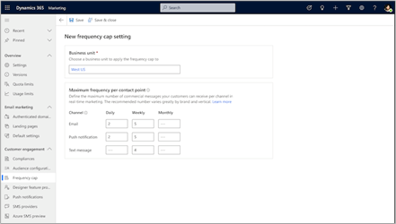
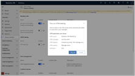

# What's new in Dynamics 365 Marketing

[!INCLUDE[marketing-trial-cta](../shared/trials/marketing-trial-cta.md)]

We're excited to announce our newest updates! This article summarizes early access features, preview features, general availability enhancements, monthly updates, and bug fixes. To see the long-term feature plans, take a look at the [Dynamics 365 and Power Platform release plans](/dynamics365/release-plans/).

Marketing updates are [pushed to customers automatically](https://cloudblogs.microsoft.com/dynamics365/it/2020/04/27/automatic-update-policy-for-dynamics-365-marketing/). Solutions are available for early validations. To manually update your instances, follow the steps in [Keep Marketing up to date](apply-updates.md).

To submit and vote on **feature requests** and **product suggestions**, go to the [Dynamics 365 Application Ideas portal](https://experience.dynamics.com/ideas/categories/?forum=dfa5b83d-9e4c-e811-a956-000d3a1bef07&forumName=Dynamics%20365%20Marketing).

## March 2023 update

The Dynamics 365 Marketing March 2023 release includes five general availability features and four public previews. The general availability features include static segments in real-time marketing, the ability to create segments in real-time marketing where specific people are always included or excluded, filtering for email lists, and enriching marketing content by embedding additional file types.

The public preview features include sending segment-based emails without building a journey, preventing message fatigue by limiting the messages sent to a customer in a specific period, scale your business effortlessly and define access to marketing assets, and customize your customer journeys to tailor to your business needs.

Monthly enhancements include improvements in templates with easy email editor and increased discoverability of side pane for goals and exit criteria.

### Version number

| App              | GA release      |
|------------------|-----------------|
| Marketing        |  1.92.2019.0    |

### General availability

- **Create a static snapshot of segment membership**
    - Static segment lists are an important part of audience management for marketers. Use static segments in one-off campaigns or newsletters where it’s essential to implement segment membership based on a specific date or time. Static segments ensure that new people that become eligible for the segment won't enter the one-off journey, even if it continues to be live. You can create static snapshots no matter how the segment is built (whether it uses query conditions or manual inclusions or exclusions). The flexibility in static segment creation separates how segments are defined from how you want to update or refresh segments. 
    - [Release plan](/dynamics365-release-plan/2022wave2/marketing/dynamics365-marketing/create-static-snapshot-real-time-marketing-segment-membership)
    - [Docs](real-time-marketing-static-snapshot.md)
    - [Watch the demo](https://msit.microsoftstream.com/video/27dd0840-98dc-ade4-ac9a-f1ed57229f18)

      > [!div class="mx-imgBorder"]
      > 

- **Individually manage segment members with inclusions and exclusions**
    - Adding manual inclusions or exclusions is a powerful way to augment segment-building criteria. Manually include or exclude specific people to ensure that segments always reach VIP customers. Or use inclusions and exclusions as an easy way to build test segments for journeys.
    - [Release plan](/dynamics365-release-plan/2022wave2/marketing/dynamics365-marketing/individually-manage-segment-members-inclusions-exclusions)
    - [Docs](real-time-marketing-include-exclude.md)

- **Fine-tune email communications with filtered lists**
    - Including an entire list in an email is a common scenario. But there are times when it's more effective to only include items from a list that meet certain conditions. For example, in a confirmation email about an order, you may need to separately list items that are back ordered. Similarly, communication about a multi-session conference is easier to consume if the sessions are organized by topic or track. Now you can easily achieve these scenarios by adding a filter to your email list. 
    - [Docs](real-time-marketing-personalize-lists.md)
    - [Watch the demo](https://msit.microsoftstream.com/video/3eb20840-98dc-bf78-0778-f1ed7b2fdb43)

      > [!div class="mx-imgBorder"]
      > 

- **Seamlessly manage and embed assets into your content with an enhanced unified library**
    - Sending your customers’ rich, compelling content is key to keeping them engaged with your brand. With this release, using assets across real-time and outbound marketing got easier. With the enhanced unified library, you can now upload files once and use them where you need them. No need to copy or download assets for backup. 
    Using additional file types, such as documents, PDFs, presentations, videos and more, you can now add asset links to your emails to create richer content for your customers.   
    **NOTE**: To foster this new simplified way of managing and using assets, the [real-time marketing library add-on](real-time-marketing-asset-library.md) is no longer available for installation. If you previously installed it, you could continue to use the add-on.
    - Release plan
    - Docs

      > [!div class="mx-imgBorder"]
      > 

- **Engage your customers with text messages sent via Infobip and LINK Mobility**
    - In addition to Twilio and Telesign, you can now integrate with Infobip and LINK Mobility to send text messages. Connect your existing Infobip or LINK Mobility account and use all Real-time marketing text message features to maximize customer engagement.
    - [Release plan](https://successhub.crm.dynamics.com/main.aspx?appid=0fe9f79a-a1f6-4064-af95-ded6c5e7bd5c&pagetype=entityrecord&etn=rn_releasenote&id=b3a0acce-019c-ed11-aad1-000d3a574bff)
    - [Docs](real-time-marketing-outbound-text-messaging.md)

      > [!div class="mx-imgBorder"]
      > 

### Public preview

- **Send emails quickly without building a journey**
    - Send emails without creating a journey. This workflow allows you to select from a new template library, make changes easily with simplifications to the email editor, and send emails to the segment members you need to reach within minutes.
    - Docs
    - [Watch the demo](https://msit.microsoftstream.com/video/0cdd0840-98dc-bf78-0480-f1ed8e1933e6)

      > [!div class="mx-imgBorder"]
      > 

- **Prevent message fatigue by limiting the messages sent to a customer in a specific period**
    - Ensure that your customers receive the right message at the right moment and at the right frequency to prevent fatigue, avoid unsubscribes, and facilitate optimal engagement with your key messages. Some customers qualify for multiple journeys and campaigns that run simultaneously. This results in customers receiving multiple messages through one channel in a short period of time. Customers may perceive these messages as spam, which lowers their engagement. With the frequency cap feature, you can optimize engagement by controlling how many messages are sent across multiple channels over a period.
    - [Release plan](https://successhub.crm.dynamics.com/main.aspx?appid=0fe9f79a-a1f6-4064-af95-ded6c5e7bd5c&pagetype=entityrecord&etn=rn_releasenote&id=5e80d4eb-502f-ed11-9db1-0022482d32a7)
    - Docs

      > [!div class="mx-imgBorder"]
      > 

- **Scale your business effortlessly and define access to marketing assets**
    - Improve productivity by defining marketing asset access and visibility to match your business structure. As businesses create vast amounts of assets, organizing data according to organizational structure becomes critical. Well-organized assets are important to remaining compliant and productive. Now in real-time marketing, you can effortlessly organize your digital assets, content, and journeys to match your organizational structure by separating business and customer data across organizational boundaries. Separating data enables you to gain comprehensive insights into a specific brand's marketing performance without losing sight of the bigger picture. Compliance risk is reduced by using out-of-the-box campaigns and data segregation capabilities across your organization.
    - Release plan
    - Docs

- **Customize your customer journeys to tailor to your business needs**
    - Customization of your customer journeys is now available in Dynamics 365 Real-time Marketing. Not only can marketers use out-of-the-box Marketing capabilities to effectively engage with their customers, but they can also now create personalized, flexible, and efficient solutions through Power Apps to better tailor the app to their specific business needs. For example, you can now extend your Real-time journey canvas to add any customized fields through Dataverse to better streamline your business processes for higher efficiency. This allows you to add custom fields such as 'campaign' to your journeys to better manage your assets, collaborate amongst your team members, and gives you more flexibility to create customized analytics reports.
    - Release plan
    - Docs

    - > [!div class="mx-imgBorder"]
    - > 

### Monthly enhancements

- **Improved template gallery**
- **Updated journey side pane**
    - The new journey side pane is designed to improve productivity and streamline your workflow by displaying all the important information upfront; the entry and exit criteria, as well as the journey’s goal and frequency cap settings are more discoverable, making it easier for you to remember to change or update these settings without leaving the journey canvas. 

### New blogs and scenario docs

Learn how to make the most of the new Dynamics 365 Marketing features in our latest blogs and scenario docs:
- [Boost event engagement with real-time journeys - Scenario docs](real-time-marketing-event-registration-journey.md)
- [Real-Time Marketing – Using Conditional Content within your emails! - Dynamics FastTrack Blogs](https://community.dynamics.com/365/dynamics-365-fasttrack/b/dynamics-365-fasttrack-blog/posts/real-time-marketing-using-conditional-content-within-your-emails)
- [Level up customer journeys with advanced orchestration features in Dynamics 365 Marketing - Microsoft Dynamics 365 Blog](https://cloudblogs.microsoft.com/dynamics365/it/2023/02/03/level-up-customer-journeys-with-advanced-orchestration-features-in-dynamics-365-marketing/)
- [Extend and optimize your customer outreach with custom channels - Microsoft Dynamics 365 Blog](https://cloudblogs.microsoft.com/dynamics365/it/2023/02/23/extend-and-optimize-your-customer-outreach-with-custom-channels/)

## February 2023 update

This month, the new real-time marketing segment builder is generally available. Also, a new public preview feature allows you to measure marketing activity, web traffic, and conversion goals using automatic UTM tagging.

### Version number

| App              | GA release      |
|------------------|-----------------|
| Marketing        |  1.91.2018.0    |

### General availability

- **Target the right audience using the new segment builder**
    - Improve your productivity by intuitively creating segments for contacts and leads in the new segment builder. To improve marketing return on investment, your segments must target the right audience. You can now build segments effortlessly by describing them in natural language (using GPT) or by using an easy drag-and-drop logic builder that doesn’t require specialized knowledge of complex data structures and logical operators. To further ensure your confidence in building segments, you can preview the members and estimate the size of draft segments as part of the creation process (within seconds for most segments). In addition, the segment builder enables you to build segments using leads. You can then target the leads directly using customer journeys for your demand generation programs.
    - [Release plan](/dynamics365-release-plan/2022wave2/marketing/dynamics365-marketing/target-right-audience-using-new-segment-builder)
    - [Docs](real-time-marketing-build-segments.md)

    > [!div class="mx-imgBorder"]
    > 

### Public preview

- **Measure marketing activity, web traffic, and conversion goals using automatic UTM tagging**
    - Urchin Tracking Module (UTM) codes help you track sources of traffic for your websites and landing pages, enabling you to attribute conversions to the right source. Marketing messages can be a significant contributor to this traffic, but it's hard to track them without UTM parameters. Links in messages are overlooked due to the time-consuming process of manually adding tags to each link. Dynamic 365 Marketing now automatically tags all your links in messages with UTM parameters, following a consistent taxonomy. This gives you full visibility into your marketing contribution to web traffic, empowering you to optimize traffic and conversions.
    - [Release plan](/dynamics365/release-plan/2023wave1/marketing/dynamics365-marketing/measure-marketing-activity-web-traffic-conversion-goals-using-automatic-utm-tagging)
    - [Docs](real-time-marketing-utm.md)

    > [!div class="mx-imgBorder"]
    > 

### Monthly enhancements

- **View Total Opens and Total Clicks KPIs and interactions in Delivery and Interactions details**
    - Track the effectiveness of your customer experiences and make data-driven decisions to optimize your marketing strategies. Understanding how many people have seen a marketing message and how many people have engaged with the experience by clicking on a link can help identify which channels are driving more engagement, allowing you to make informed decisions on how to optimize your marketing strategy.
    > [!NOTE]
    > This feature includes the temporary removal of Unique clicks and Opens from Delivery and Interactions details. Unique clicks and Opens will be added back in an upcoming release.
- **Easily manage additional tables available for personalization**
    - You can use up to 50 tables for personalization in real-time marketing (see details [here](real-time-marketing-predefined-dynamic-text.md#access-even-more-data-for-personalization)). You have control over which 50 tables to select. This selection step is easier now with additional pre-defined filters to quickly filter the tables list to all tables, tables selected by default, tables that you've selected, or tables that are in use in the current message.
- **Support for multi-line conditions in inline conditions**
    - Inline conditions are used to create HTML code for scenarios where conditional content is not appropriate such as changing one word in otherwise common content (for example, a salutation word). This user experience is now enhanced with the same condition builder experience used everywhere in the product, improving ease of use and delivering the added functionality of multi-line conditions. Learn more: [How to use inline conditions](real-time-marketing-personalize-inline-conditions.md).
- **No-code approach to adding marketing interactions to the unified timeline in custom contact/lead forms**
    - When using out-of-the-box contact/lead forms, marketing interactions based on journeys in real-time marketing and outbound marketing are automatically populated in the unified timeline. But when marketers used custom contact/lead forms, they had to manually add the marketing interactions into the timeline by making code changes. With the February release, you can add marketing interactions to your custom contact/lead forms through a simple no-code approach by adding a custom connector to your custom forms through the Power Apps maker experience. Learn more: [How to enable marketing interactions in your contact/lead timeline](timeline.md#how-to-enable-marketing-interactions-in-your-contactlead-timeline).
- **Marketing interactions in the unified timeline now showcase specific links clicked by contacts/leads in messages**
    - Sales reps and customer service agents now have visibility into specific links that a contact/lead clicked in their marketing messages. Viewing the specific links helps them understand the contact/lead’s past activities at a more granular level, enabling more personalized engagement. For instance, a credit card agent in a financial services firm can now understand which credit card offer (among many) a contact clicked on in a promotional message, allowing them to make a personalized follow-up call. Learn more: [Customer interactions timeline](timeline.md).

### New blogs and scenario docs

Learn how to make the most of the new Dynamics 365 Marketing features in our latest blogs and scenario docs:
- [Boost event engagement with real-time journeys - Scenario docs](real-time-marketing-event-registration-journey.md)
- [Real-Time Marketing – Using Conditional Content within your emails! - Dynamics FastTrack Blogs](https://community.dynamics.com/365/dynamics-365-fasttrack/b/dynamics-365-fasttrack-blog/posts/real-time-marketing-using-conditional-content-within-your-emails)
- [Level up customer journeys with advanced orchestration features in Dynamics 365 Marketing - Dynamics 365 IT Pro Blogs](https://cloudblogs.microsoft.com/dynamics365/it/2023/02/03/level-up-customer-journeys-with-advanced-orchestration-features-in-dynamics-365-marketing/)

## January 2023 update

There is no Dynamics 365 Marketing release for January. We will be back in February with new feature improvements, updates, and bug fixes.

### New blogs and scenario docs

Learn how to make the most of the new Dynamics 365 Marketing features in our latest blogs and scenario docs:

- [Boost event engagement with real-time journeys - Scenario docs](real-time-marketing-event-registration-journey.md)
- [Real Time Marketing – Using Conditional Content within your emails! - Dynamics FastTrack Blogs](https://community.dynamics.com/365/dynamics-365-fasttrack/b/dynamics-365-fasttrack-blog/posts/real-time-marketing-using-conditional-content-within-your-emails)

> [!Tip]
> To read about updates from previous years, see the [What's new archive](whats-new-marketing-archive.md) article.
