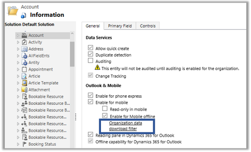
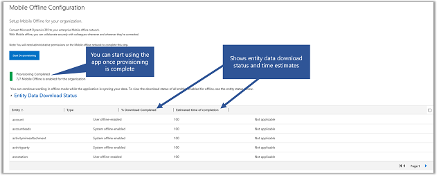
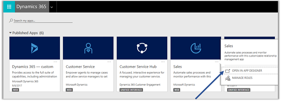
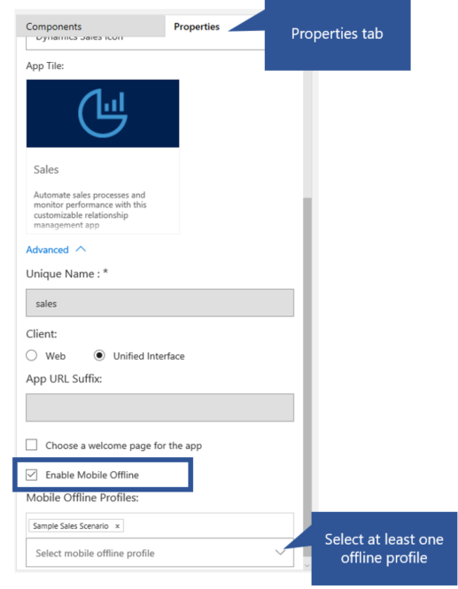

# Configure mobile offline synchronization to allow users to work in offline mode on their mobile device 

Provide an enhanced offline experience for mobile users using Dynamics 365. Once offline synchronisation is turned on, mobile users can seamlessly work in offline mode on their mobile device when they don't have an internet connection.   
  
 This offline experience uses [!INCLUDE[pn_Windows_Azure](../includes/pn-windows-azure.md)] services to periodically synchronize entities with the [!INCLUDE[pn_microsoftcrm](../includes/pn-microsoftcrm.md)] for phones and tablets apps so synchronized records are available when users’ mobile devices are disconnected. To enable mobile offline synchronization, follow the steps below.
 
 > [!IMPORTANT] 
> -   Mobile offline synchronization isn’t available for Trial, Preview  or sandbox [!INCLUDE[pn_crm_shortest](../includes/pn-crm-shortest.md)] organizations. 
> -   We’re working to improve mobile offline capabilities for release in the second quarter of 2019, and are currently onboarding only a limited set of new customers. When a preview program opens for mobile offline, we’ll let customers know. Existing customers who are already using mobile offline are not affected.
 
## Step 1: Enable entities for mobile offline synchronization 
 
One of the first things that you need to do is enable entities that will be available to mobile users when they're using the mobile app in offline mode. Any entity that is enable for mobile can also be enabled for mobile offline. To find a list of entities that are available for mobile see, [Entities displayed in Dynamics 365 for phones and tablets](../customize/customize-phones-tablets.md#entities-displayed-in-dynamics-365-for-phones-and-tablets). 
  
The following entities are enabled for mobile offline by default:  
  
-   Account  
  
-   Appointment  
  
-   Attachment  
  
-   Competitor  
  
-   Competitor Address  
  
-   Contact  
  
-   Email  
  
-   Lead  
  
-   Note  
  
-   Opportunity  
  
-   Opportunity Product  
  
-   Product  
  
-   Task  
  
-   Case  
  
-   Queue  
  
-   Queue Item  
  
-   SLA KPI Instance  
  
-   Entitlement  
  
-   Team  
  
-   User  

 > [!NOTE] 
> -   You can disable any of these above entities for offline or enable any entity from supported list for offline. Follow the steps below to enable or disable an entity. 

To enable more entities for offline, follow the steps below.
  
> [!WARNING]
>  Keep in mind that the amount of data you make available to users while they’re offline can affect the data usage rates for devices on cellular networks. The amount of data depends on:  
>   
> -   The number of entities you enable for mobile offline  
> -   The number of days you specify since records were last modified  
> -   The filters you set while creating mobile offline profiles  
  
1.  In the **Dynamics 365 - custom** app, go to **Settings > Customizations**.  
  
2.  Click **Customize the System**.  
  
3.  Expand **Entities** in the left pane.  
  
4.  Select the entity you want to enable for mobile offline (for example, **Account**).  
  
5.  Under **Outlook & Mobile**, select **Enable for mobile offline**.  

    
  
6.  Click **Organization data download filter** to filter the data and set the freshness of the data you want to make available offline. You can set up to three criteria when you define a filter. Select the field to filter by, select an operator, then set a value. 

    
  
     The entities that are enabled for mobile offline by default have **Modified On** set for **Last X Days** = 10, so the data modified or created in the last 10 days will be available for downloading to mobile devices.  
  
7.  Click **Save**.  
  
8.  When you’re done enabling entities for mobile offline, click **Publish** so your changes take effect.  
  
> [!NOTE]
>  Publishing customizations prompts the mobile apps to download changes when users next start their app, which can adversely affect their experience over slow connections. 
 
 ## Step 2: Enable mobile offline synchronization for your organization

In this step, you need to turn on mobile offline synchronization. The data for the entities that are enabled for mobile offline will be replicated in Azure service and will be available to sync with mobile clients

To enable offline synchronization, follow the steps below.
 
1.  In the **Dynamics 365 - custom** app, go to **Settings** > **Mobile Offline**. If you don’t see this option, please contact tech support.  
  
2.  Click **Mobile Offline Configuration**.  
  
3.  Click **Continue** to accept the terms of the disclaimer and allow data to be shared with an external system on [!INCLUDE[pn_azure_shortest](../includes/pn-azure-shortest.md)] services.  
  
4.  Select **Start Provisioning**. This starts the provisioning process for mobile offline. When it completes, your mobile users will  experience the new mobile offline capabilities. 

    Users can continue working in offline mode while the application is syncing your data. To view the download status of all entities enabled for offline, see **Entity Data Download Status**.

    4.1	**Track Offline Status**: Users can track the status of offline provisioning from stage 1 to 7.  In the 5th stage, you can also track the data download status in terms of percentage complete and time remaining to complete data download

    4.2 **Start Working Offline Right Away**: Once mobile offline synchronization is turned on, users can start using it without having to wait for all the entity data to download. Once mandatory entity data is complete, you can start using mobile app in offline mode while the system continue to download other entity data that you have selected. You will also be notified how long the download will take along with detailed status for each entity.

    
 
  
> [!IMPORTANT]
> **Recommendation for changing data centers or geo locations**  
>   
>  If you decide to move your org to a different data center or geo location, you need to disable and then enable mobile offline synchronization for your org after the move is complete:  
>   
> 1.  Go to **Settings > Mobile Offline.**  
> 2.  Click **Mobile Offline Configuration**.    
> 4.  Select **Start De-provisioning**. This starts the de-provisioning process. If this option isn’t available, mobile offline synchronization was disabled during the move to a different data center or geo location, and you can continue to the next step. When the de-provisioning is complete, select **Start Provisioning**. 

**Things to know when you start mobile offline provisioning** 
  
-   Admins can see the status of provisioning and de-provisioning.  
  
-   The mobile offline configuration page is auto-refreshed at regular intervals to show updated status messages during provisioning and de-provisioning.  
  
-   You can stop provisioning at any stage during provisioning.  
  
-   You can de-provision your organization when the provisioning is complete.  
  
-   De-provisioning of an organization can't be stopped once initiated.  
  
-   You can initiate provisioning again only when de-provisioning is complete.  
  
-   In  case of a provisioning or de-provisioning failure, consider retrying your provisioning before contacting support.  
  
-   All the provisioning and de-provisioning messages will be shown on the **Mobile Offline Configuration** screen along with the date and timestamp of when the status was last checked.  
 
 ## Step 3: Create a mobile offline profile to determine what data will be available while offline
 
You need to create mobile offline profiles for users to configure filters that determine how much of an entity's data (and related entities' data) will be available to the user while offline.  

> [!NOTE] 
> -  A user must have a security role that has Read permissions on the mobile offline profile to be able to use their mobile device in offline mode.
  
1.  Go to **Settings > Mobile Offline**.  
  
2.  Click **Mobile Offline Profiles**.  
  
3.  Click **New** to create a new mobile offline profile. If you already have one that you want to edit, select it from the list.  
  
4.  Enter a name and description for your mobile offline profile.  
  
5.  Click **Save** to create the mobile offline profile so you can continue editing it.  
  
6.  In the **Mobile Offline Profile Item Details** area, click **+** to create a new mobile offline profile item. You need to create a mobile offline profile item for each entity you want to make available for this mobile offline profile.  
  
7.  Enter a name and select an entity. Only entities that you enabled for mobile offline appear in this list.  
  
8.  Admins can choose what information to sync to user's devices. This can help minimize impact to user's device's memory. Admins can define a custom filter based on the following rules. You can create filters up to three levels.  

 |  |
 |---------|
 |equal     |
 |not equal     |
 |gt – greater than|  
 |ge – greater than or equal to|  
 |le – less than or equal to|  
 |lt – less than|  
 |like|  
 |not-like|  
 |in|  
 |not-in|  
 |null|  
 |not-null|  
 |eq-userid|  
 |ne-userid|  
 |eq-userteams|  
 |eq-useroruserteams|  
 |eq-useroruserhierarchy|  
 |eq-useroruserhierarchyandteams|  
 |eq-businessid|  
 |ne-businessid|  
 |eq-userlanguage|  
 |begins-with|  
 |not-begin-with|  
 |ends-with|  
 |not-end-with|
 
 > [!NOTE]
>  Make sure that your users are using the latest version of the mobile app For Advanced Filters to work offline.  
 
   Select a data download filter based on the ownership type for the entity.
  
   **User or Team**  
  
    - **Download related data only**. Make related data for this entity available offline. If you don’t set any relationships, no records for this entity will be available.  
  
    - **All records**. Make all records for this entity available offline.  
  
    - **Other data filter**. Make only the specified records for this entity available offline.  
  
     If you select **Other records**, you can choose from the following:  
  
    - **Download my records**. Make only your records available offline.  
  
    - **Download my team’s records**. Make your team’s records available offline.  
  
    - **Download my business unit’s records**. Make your business unit’s records available offline.  
  
 **Organization**  
  
    - **Download related data only**. Make related data for this entity available offline. If you don’t set any relationships, no records for this entity will be available.  
  
    - **All records**. Make all records for this entity available offline.  
  
 **Business**  
  
    - **Download related data only**. Make related data for this entity available offline. If you don’t set any relationships, no records for this entity will be available.  
  
    - **All records**. Make all records for this entity available offline.  
  
    - **Other records**. Make only the specified records for this entity available offline.  
  
     If you select **Other records**, you can choose from the following:  
  
    - **Download my business unit’s records**. Make your business unit’s records available offline.  
  
 **None**  
  
    - **Download related data only**. Make related data for this entity available offline. If you don’t set any relationships, no records for this entity will be available.  
  
9. Click **Save** to create the mobile offline profile item so you can continue editing it.  
  
10. In the **Mobile Offline Profile Item Association Details** area, click **+** to create a new mobile offline profile item association. You need to create a mobile offline profile item association for each related record you want to make available offline. In addition, you need to include any related entities in this mobile offline profile.  
  
     For example, if you create a mobile offline profile item association from the Lead entity, you need to add the Lead entity to this mobile offline profile.  
  
11. Enter a name for the mobile offline profile item association, select a relationship, and then click **Save**.  
  
    When you’re done adding mobile offline profile item associations to the mobile offline profile item, click **Save & Close** at the top of the **Mobile Offline Profile Item** screen.  
  
13. When you’re done adding mobile offline profile item details to the mobile offline profile item, click the **Save** button at the bottom right corner of the **Mobile Offline Profile Item** window.  
 
### Step 3.1: Add users to a mobile offline profile 

Once you have created a mobile offline profile, you can start adding users to the profile.  
  
> [!NOTE]
>  You can add a user to only one mobile offline profile.  
  
1.  If it’s not already open, open the mobile offline profile you want to add users to.  
  
2.  In the **Users** area, click **+** to add a new user.  
  
3.  Click the lookup field that appears and select a user to add to this mobile offline profile.  
  
4.  When you’re done adding users, choose the **Save** button in the bottom right corner of the **Mobile Offline Profile** window.  

### Step 3.2: Publish a mobile offline profile

To make a mobile offline profile available to users so they can get the mobile offline experience you've defined for them, you need to publish the profile.  
  
1.  If it’s not already open, open the mobile offline profile you want to publish.  
  
2.  When you’re done adding users and making any other changes to the mobile offline profile, click **Publish** so the data you specified can start syncing with your users’ mobile devices.  
  
> [!TIP]
> **Solution export and import**  
>   
>  When exporting a solution that includes mobile offline profile, always select the **Include entity metadata** check box for each entity you export.  
>   
>  After importing the solution into the target organization, publish all mobile offline profiles.  

## Step 4: Enable the App Module for offline

Enable mobile offline for a specific app from MyApps page.

1. In the **Dynamics 365- custom** app, go to **Settings** > **My Apps**.

2. From the list of published apps, select an app you want to enable for mobile offline.  

3. On the selected app, choose **More Options** (**...**).

4. Choose **OPEN IN APP DESIGNER**.

   

5. On the **Properties** tab, scroll down and select **Enable Mobile Offline** and then choose a profile.
 > [!NOTE] 
 > -   You can add more than one profile for an app module.

   

6. At the top choose **Save** and then **Publish**.

## Tips

Here are a few things to keep in mind about mobile offline synchronization:  
  
-   Mobile offline synchronization with mobile devices occurs periodically. A synchronization cycle could last for several minutes, depending on [!INCLUDE[pn_azure_shortest](../includes/pn-azure-shortest.md)] network latency, the volume of data that’s set for synchronization, and mobile network speed. Users can still use the mobile apps during synchronization.  
  
-   Changes to a user’s security privileges are updated during the next synchronization cycle. Until that time, users can still continue accessing data according to their previous security privileges, but any changes they make will be validated during the synchronization to the [!INCLUDE[pn_crm_shortest](../includes/pn-crm-shortest.md)] server. If they no longer have privileges to make changes for a record, they will receive an error and the record won’t be created, updated, or deleted.  
  
-   Any changes to a user’s privilege to view a record won’t take effect on the mobile device until the next synchronization cycle.  
  
> [!NOTE]
>  Once you’ve enabled mobile offline synchronization, metadata changes are pushed to the mobile apps when the changes are published, not just on app start-up. To keep mobile offline synchronization up-to-date, users should always accept the prompt to download metadata changes.  
  
## Privacy notice  
 [!INCLUDE[cc_privacy_crm_mobile_offline](../includes/cc-privacy-crm-mobile-offline.md)]
