# Dynamics 365 for phones and tablets User's Guide
Use the [!INCLUDE[pn_crm_shortest](../includes/pn-crm-shortest.md)] for phones and tablets app for your sales, in-app marketing, and customer service tasks when you're out in the field. No matter where you are, you can check your dashboards for analytics on your team's performance, or advance an important opportunity toward a successful close.  
  
> [!TIP]
> [!INCLUDE[pn_crm_shortest](../includes/pn-crm-shortest.md)] has separate mobile apps for [!INCLUDE[pn_field_service](../includes/pn-field-service.md)] and Operations. Learn about [Dynamics 365 for Field Service (Resco) mobile app](https://go.microsoft.com/fwlink/?linkid=846157) and [Dynamics 365  for Operations mobile app](https://ax.help.dynamics.com/en/wiki/mobile-development-handbook/).  
  
## Is your mobile device supported?  
 If you’re not sure if your device is supported, [check the list of supported devices](https://technet.microsoft.com/library/dn531131.aspx)  
  
### Privileges required to run the app  
  
> [!IMPORTANT]
>  You won't be able to use this app if you don't have the correct privileges. Your system administrator can configure privileges for you: [Find your Dynamics 365 administrator or support person](../basics/find-dynamics-365-administrator-support-person.md). If you're an administrator, [learn how to set privileges](https://technet.microsoft.com/en-us/library/dn531128.aspx).  
  
### Install the app from your device’s app store  
 Choose the download link for your device:  
  
|||  
|-|-|  
|**[!INCLUDE[pn_Mobile_Express_short](../includes/pn-mobile-express-short.md)] app**         |**[!INCLUDE[pn_moca_short](../includes/pn-moca-short.md)] app**         |  
    
## Which version am I using?  
 We made significant updates in the July 2017 update for Dynamics 365 (online). If your Home screen looks like the following, your mobile app is connected to the July 2017 update for Dynamics 365 (online):  
  
 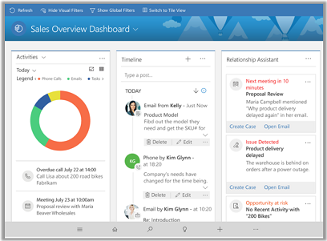  
  
 Go to [User's Guide for the latest version](#BKMK_LastestVersion)  
  
 If your Home screen looks like the following, your mobile app is connected to a previous version of Dynamics 365:  
  
 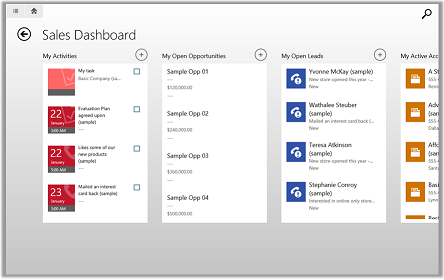  
  
 Go to [User's Guide for the previous version](#BKMK_PreviousVersion)  
  
   
## User's Guide for the latest version  
 This section of this topic describes how to use the latest version of the app, available in the  July 2017 update for Dynamics 365 (online).  
  
 **In this section:**  
  
  [Signing in and signing out](#BKMK_Signin)  
  
  [Basic navigation](#BKMK_Nav)  
 
  [Continuum support](#BKMK_Continuum)
  
  [Favorites and recently used records](#BKMK_PinFavs)    
  
  [Work with records on the dashboard](#BKMK_Dashboards) 
 
  [Take notes](#BKMK_Notes)
  
  [Manage accounts, contacts, leads, and opportunities](#BKMK_ManageAccounts)  
  
  [Track leads through the sales process](#BKMK_TrackLeads)  
  
  [Manage activities](#BKMK_ManageActivities)    
  
  [Send an email or make a call](#BKMK_SendEmailorCall)    
  
  [Use Cortana voice commands](#BKMK_Cortana)  
  
  [Troubleshooting](#BKMK_Troubleshooting)    

 
### Signing in and signing out
To sign in, you’ll need your Microsoft Dynamics 365 web address, user name, and
password. If you don’t have any of these, contact your Dynamics 365 admin.

1.  Open your app, enter your Dynamics 365 web address, and tap .

     

2.  On the next screen, enter your user name and password, and tap **Sign in**.

Here's how to sign out in case someone else needs to use your device.

1.  From your Home screen, tap .

    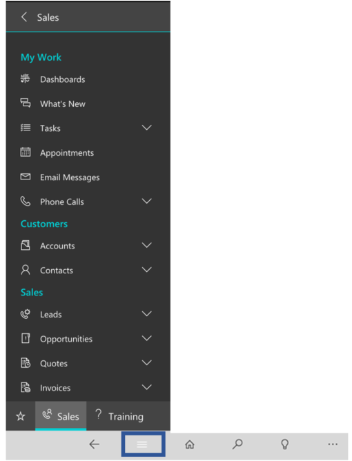

2.  Tap **Settings**.

3.  Tap **User Information**.

4.  Tap **Sign out**.

You can sign in again as the same or a different user, or you can sign in to a
different organization.

### Basic navigation
Use the main menu to view all your accounts, contacts, leads, or other records.

Tap the menu icon on the bottom, then select the type of record you want to work
with.

**The navigation bar**

Use the nav bar to access your work area, create a new record, search, or do
other tasks from the nav bar. To access more commands, tap .

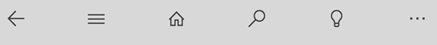

**Get help while using the app**

If you ever need help while you’re in the mobile app, just tap **Help** on the
nav bar.

**The Home page: your dashboards**

If you want to use a different dashboard, it’s easy to switch back and forth.

From the Home screen, tap dashboards menu and then select the dashboard you want
to use.

To create new dashboards in Dynamics 365 and enable them for use in Dynamics 365
for phones and tablets, see [Create or customize dashboards](../customize/create-edit-dashboards.md).

**Quickly open a record**

When you have record open and you need to view another record, tap  to choose
another record.

**Take action on record**

Take action on a record without opening the record. From a list of records,
select the record that you want to update, then on the command bar select an
action such as **Assign**, **Deactivate** or **Delete**. You can take the same
action when you select multiple records.

**Search and sort**

1.  To search, tap Search at the bottom of the screen.

  

2.  Type in the search box, and then tap Search.

Search results include only records that begin with the letters you type. For
example, if you want to search for “Alpine Ski House,” type **alp** in the
search box. If you type **ski**, the record won’t show up. 

**Filter search results**

To filter results by record type, choose a record type from the **Filter
with:** drop-down box.

**Sort items in a grid view**

You can also sort items in a grid view in Dynamics 365 for tables. For example,
when you’re looking at a list of your active accounts, tap the arrow to sort the
records in ascending or descending order.

-   To sort in ascending order by a column, tap that column’s heading.

-   To sort in descending order, tap the column’s heading again.

You can do the same from a list view in Dynamics 365 for phones.

  

**Export records to Excel**

In Microsoft list of records in Dynamics 365 for phones and mobile apps, you can
export records to Microsoft Excel, just like you can in the web app. From a grid
view in Dynamics 365 for tablets or a list of records in Dynamics 365 for
phones, tap  on the command bar and then tap **Export to Excel**.

[!INCLUDE[proc_more_information](../includes/proc-more-information.md)] [Export data to excel](../basics/export-data-excel.md) 

> [!IMPORTANT]
> [!INCLUDE[cc_feature_included_with_update_2016](../includes/cc-feature-included-with-update-2016.md)]  

**Update an image for a record**

To add an image to a record, open the record and tap the image for the record.
Next, select the image that you want to use.

### Continuum support for Windows Phone
Use your phone like a PC with Continuum support. You can connect a Windows 10
mobile device to a larger screen, allowing you to utilize your phone as a PC.
Use a dock or adapter to connect to a monitor, keyboard, and mouse, and then use
the mobile app on your Windows 10 phone and see your content on a larger screen.
When your phone is connected to another screen, the mobile app reflows to fit
the larger screen size. You can also continue to use your phone the way you
normally would without interrupting what’s playing on the larger screen. This
offers a natural, no compromise, and familiar method to seamlessly switch
between a smaller device to a bigger device, without impacting your
productivity. [Learn more about
Continuum](https://www.microsoft.com/en-us/windows/Continuum).

### Favorites and recently used records
Pinned favorites and recently used provide quick access to your records,
contacts, views, and dashboards. Tap the menu on the nav bar and then tap Favorites.

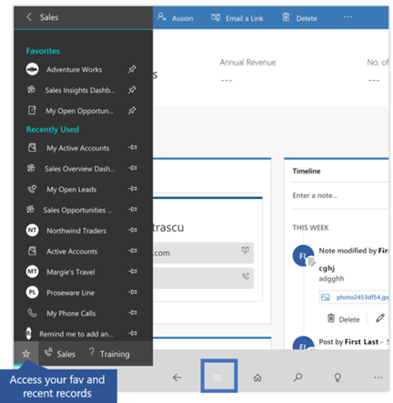

To pin a record as a favorite, from the list of **Recently Used**, tap the pin.
This will pin and move the recorded to **Favorites**.

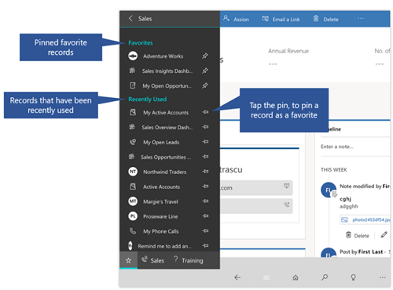

### Work with records on the dashboard
Dashboards give you an overview of valuable information. Click on the Home icon
any time to get your dashboards. Here are some of the ways you can work with
them.

| **To do this:**                                                                                                   | **Do this:**                                                                                                      |
|-------------------------------------------------------------------------------------------------------------------|-------------------------------------------------------------------------------------------------------------------|
| View all the records for a record type on the dashboard in Dynamics 365 for Mobile apps (for example, **Leads**). | Tap the header of the list. This opens your records in a grid view on your tablet.                                |
| Open the form for a record on the dashboard.                                                                      | Tap the record.                                                                                                   |
| Create a new record.                                                                                              | On the nav bar tap **…** , then tap **Quick Create Menu**, and then choose the type of record you want to create. |

**Change views for a list on the dashboard**

Tap the name of the list and select the list that you want to see.

### Take notes
The mobile app also lets you take notes and attach photos to a note, or take a
new photo with your device's camera. So if, for example, you're out at a site
and need to document a customer's issue with a product, you can capture and add
it to a note right away, rather than taking the photo, then adding it from your
camera roll later.

To add a note, open a record and in the notes area enter your note.

### Manage accounts, contacts, leads, and opportunities
As a sales professional, you’ll be working a lot with the following types of
records:

-   **Accounts**   Account records contain information about the companies you
    do business with.

-   **Contacts**   Contact records contain information about the people you know
    and work with. Usually, multiple contacts are associated with one account.
    Contacts could include people responsible for making purchasing decisions,
    people in charge of paying invoices, support technicians, or anyone you work
    with at the company.

-   **Leads**   Leads are potential sales, and you or your company can get leads
    from many different sources. For example, you can generate sales leads from
    marketing campaigns, inquiries from your website, mailing lists, social
    media posts, or in person at a trade convention.

-   **Opportunities**   When you qualify a lead, it becomes an opportunity, or a
    deal that you’re getting ready to close.

**Create or edit stakeholders or sales team members**

1.  Open Lead or Opportunity record and scroll down to
    **Stakeholders** or **Sales Team** and tap **+ New Connection**.

2.  Enter a contact name to look up in the drop-down menu that appears.

3.  Select from the contacts that appear and then **Add** at the bottom. If it’s
    a new contact, tap **New** and complete the information in the form.

  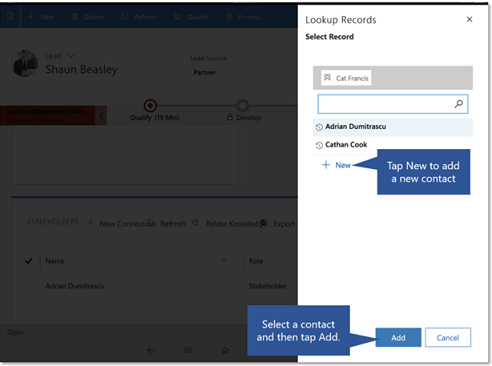
    

### Track your progress with charts
Charts give you a quick view of how you’re tracking to your goals. They’re
interactive, so you can tap an area of a chart to get more info.

-   Tap once on a chart section to see a tooltip that provides quick info about
    that area of the chart.

-   Tap again on the same section to see a grid view with more details about the
    data in the chart.

-   From the charts Home page grid, you can expand the chart or view the data in
    a table view.

    -   When chart is rendered on the Dashboard page, the buttons are slightly
        different.

        -   To expand the chart, tap the Expand view button.

        -   Or, tap  and then choose an  action: **Refresh**, **View
            Records** and **View Data Table**.
            
           

Two dimensions charts like Line, Bar, Column, and Area support zooming.
Single dimension charts like, Funnel, Doughnut, Pie, and Tag chart don’t support
zooming.

**Change the chart view**
 
Changing the chart view shows you a different breakdown of your data, such as
opportunities opened within a specific time period.

You can change a chart view by selecting the View selector on the Grid page.

For example, tap "All Opportunities", then select a different view, both chart
and grid will get refreshed.

### Track leads through the sales process
Move customers through the sales process, from lead to close, with the process
bar. Once you’ve completed the steps in one stage, you can move on to the next
one. The process bar highlights the stage you’re in including the time, so you
know where you are in the process, and shows you what to do next.

You start the process with a lead. In the first stage (**Qualify**), you qualify
or disqualify the lead based on criteria established by your company. If you
qualify the lead, it’s converted to an opportunity. The process bar then walks
you through the rest of the stages: **Develop**, **Propose**, and **Close**.

The process bar helps you and everyone on your sales team follow best practices.
The process bar that your company uses might have different stages than the one
illustrated, to match the way you do business.

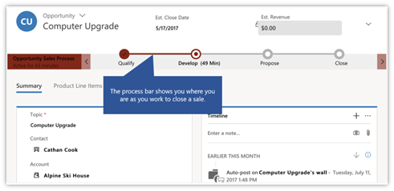

**Qualify, Disqualify, or Reopen an Lead**

To change the status of an Lead, tap **Qualify**, **Disqualify**,
or **Reactivate Lead** on the command bar.

### Manage activities
Use activities to keep track of all your customer communications. For example,
during the course of a sale, you might send emails, make phone calls, set up
appointments, or assign tasks. All of these are considered activities, and the
Dynamics 365 for phones and tablets app helps you track them so you don’t miss
an important follow-up activity.

On your dashboard, **My Activities** shows activities that are past due or due
today in a darker color than those that aren’t. You can do the following from
your activity feed:

-   To view an activity, select it from your **My Activities** feed on the
    dashboard.

-   To add an activity, tap  at the top of your **My Activities** feed and select an activity to add.

  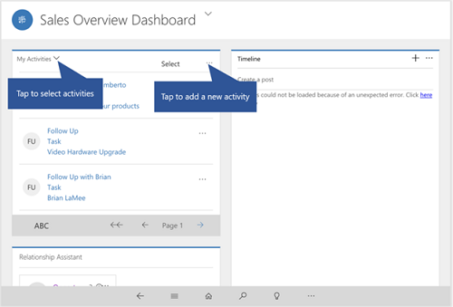

-   To mark an activity complete, open the activity and on the command bar tap
    **Mark Complete**.

### Send an email or make a call
Call or send email to your customers easily from the mobile apps. Tap any phone
number in a record to start a call, or tap the email button to send an email.

In Dynamics 365 for mobile app, tapping the phone button starts a Skype call. In
Dynamics 365 for phones, it starts a phone call.

When you’re finished with your call, the app prompts you to enter details about
the call.

### Use Cortana voice commands
You can use the following Dynamics 365 voice commands with Cortana if you’re
using Cortana on Windows 8.1 phones or later. Cortana voice commands for
Dynamics 365 are only available in English at this time.

To do this in Dynamics 365|Say this|  
|--------------------------------|--------------|  
|Open an item|**Dynamics 365 open *\<item>* called *\<item name>*.**   *Example:*   “CRM open account called Contoso.”   *Variation:*   “CRM open account *named* Contoso.”|  
|Show a view|**Dynamics 365 show *\<view name>*.**   *Example:*   “CRM show my active accounts.”   *Variation:*   “CRM *show me* my active accounts.”|  
|Search for an item|**Dynamics 365 find *\<item>* called *\<name>*.**   *Example:*   “CRM find account called Contoso.”   *Variation:*   “CRM find account *named* Contoso.”|  
|Create a new item|**Dynamics 365 create *\<item type>* called *\<item name>*.**   *Example:*   “CRM create contact called Maria Campbell.”   *Variation:*   “CRM *add new* contact *named* Maria Campbell.”|  
|Create a phone call activity|**Dynamics 365 remind me to call *\<call name>*.**   *Example:*   “CRM remind me to call Maria Campbell to set up appointment.”|  
|Create an appointment|**Dynamics 365 schedule meeting to *\<subject>*.**   *Example:*   “CRM schedule meeting to discuss quote with Maria Campbell.”|  
|Create a task|**Dynamics 365 remind me to *\<task name>*.**   *Example:*   “CRM remind me to email Maria Campbell.”   *Variations:*   “CRM *follow up* Maria Campbell.”   “CRM *follow up with* Maria Campbell.”   “CRM *follow up on* Contoso.”|  
|Open task list|**Dynamics 365 what should I do next?**   *Example:*   “CRM what should I do next?”|  
  
> [!NOTE]
>  The **create** commands work only with [!INCLUDE[pn_crm_2015_and_online_full](../includes/pn-crm-2015-and-online-full.md)] or later. The other commands work with [!INCLUDE[pn_crm2013_and_online](../includes/pn-crm2013-and-online.md)] as well as [!INCLUDE[pn_crm_2015_and_online_full](../includes/pn-crm-2015-and-online-full.md)] or later.  
  
 For more information about using [!INCLUDE[pn_cortana](../includes/pn-cortana.md)], see [Meet Cortana](http://go.microsoft.com/fwlink/p/?LinkID=401573).

### Troubleshooting
**Dynamics 365 for Windows app start-up error**

Did you receive this error?

**Additional steps may be needed to configure Microsoft Dynamics 365 for this
organization. Please contact your system administrator**.

**If you’re using a computer or tablet**

| **Users:**  | Notify your Dynamics 365 administrator that you received this error.                                                                                                                                                                                                         |
|-------------|------------------------------------------------------------------------------------------------------------------------------------------------------------------------------------------------------------------------------------------------------------------------------|
| **Admins:** | To enable the Microsoft Dynamics 365 for Windows 8.1 app for on-premises Dynamics 365 deployments, you need to make some configuration changes. [!INCLUDE[proc_more_information](../includes/proc-more-information.md)] [Set up Dynamics 365 for phones and tablets](https://technet.microsoft.com/library/dn531128.aspx)

>   Note, Dynamics 365 on-premises deployments require Windows 10 and
>   the [Dynamics 365 for Windows app built for Windows
>   10](http://go.microsoft.com/fwlink/p/?LinkID=799909)

**If you’re using a Windows phone**

You received this error because you’re trying to connect to an on-premises
deployment of Dynamics 365, which is not supported for your version on Windows
Phones. Windows Phone connection to Microsoft Dynamics 365 on-premises requires
the [Dynamics 365 for Windows app built for Windows
10](http://go.microsoft.com/fwlink/p/?LinkID=799909). More
information: [TechNet: Support for Dynamics 365 for phones and
tablets](https://technet.microsoft.com/library/dn531131.aspx)

**Reconfigure Dynamics 365 for phones and tablets**

If you used the mobile app on a phone or tablet temporarily and want to remove
all you cache data before giving to device to someone else, you need reconfigure
the app.

Reconfiguring deletes all data and metadata from the cache, though you shouldn't
rely on this as a security measure.

If you sign out of one organization and sign in to another, and then use the
Reconfigure option on the organization you signed in to, your metadata will
still remain for the organization you signed out of. To remove your metadata
from the organization you signed out of, you’ll need to sign in to it and use
the Reconfigure option there, as well.

Here's how to do it:

1.  Tap .

2.  Tap **Settings**.

3.  Tap **Reconfigure**.

 
   
## User's Guide for the previous version  
 This section of this topic describes how to use the previous version of the app, available in the [!INCLUDE[pn_crm_8_2_0_both](../includes/pn-crm-8-2-0-both.md)].  
  
 **In this section:**  
  
  [Signing in and signing out](#BKMK_oldSignin)  
  
  [Basic navigation](#BMMK_oldNav)  
  
  [Pin your favorites](#BKMK_OLDPinFavs)  
  
  [Work with records on the dashboard](#BKMK_OLDDashboards)  
  
  [Personalize your workplace](#BKMK_oldWorkplace)  
  
  [Take notes](#BKMK_oldNotes)  
  
  [Scan barcodes](#BKMK_oldBarCodes)  
  
  [Manage accounts, contacts, leads, and opportunities](#BKMK_oldmanageACLO)  
  
  [Track your progress with charts](#BKMK_oldCharts)  
  
  [Track customer service cases](#BKMK_oldServiceCases)  
  
  [Track leads through the sales process](#BKMK_OLDTrackLeads)  
  
  [Manage activities](#BKMK_OLDManageActivities)  
  
  [Create a communication card](#BKMK_OldCreateComCard)  
  
  [Send an email or make a call](#BKMK_OLDEmailOrCall)  
  
  [Manage work orders, agreements, customer assets, and time off requests](#BKMK_OldFieldService)  
  
  [Work offline](#BKMK_OldWorkOffline)  
  
  [Use Cortana voice commands](#BKMK_OLDCortana)  
  
  [Use your browser for non-mobile features](#BKMK_OLDUseBrowser)  
  
   
### Signing in and signing out  
 To sign in, you’ll need your [!INCLUDE[pn_microsoftcrm](../includes/pn-microsoftcrm.md)] web address, user name, and password. If you don’t have any of these, contact your [!INCLUDE[pn_crm_shortest](../includes/pn-crm-shortest.md)] admin.  
  
1.  Open your app, enter your [!INCLUDE[pn_crm_shortest](../includes/pn-crm-shortest.md)] web address, and tap .  
  
   
  
2.  On the next screen, enter your user name and password, and tap **Sign in**.  
  
 A few basic navigation tips appear while your app starts up. Be sure to stay on this screen while your app starts up so any changes can download successfully to your device. If you switch to another app during this time, the processing will restart when you open this one again.  
  
 Here's how to sign out in case someone else needs to use your device.  
  
1.  From your Home page, tap .  
  
2.  Tap **Settings**.  
  
3.  Tap **Sign Out**.  
  
 You can sign in again as the same or a different user, or you can sign in to a different organization.  
  
   
### Basic navigation  
 When you want to view all of your accounts, contacts, leads, or other records, use the menu.  
  
 Tap the menu icon on the top of the page, then select the type of record you want to work with.  
  
   
  
#### The command bar  
 You can add a new record, change views, or do other tasks from the command bar.  
  
 Just tap  on the bottom right-hand corner of the page.  
  
 You can also press and hold an item to display the command bar.  
  
   
  
 The command bar is context-sensitive, and the available commands change depending on where you are in the app. When you display the command bar for a specific item (when you press and hold the item), the commands that appear are relevant to that item.  
  
#### The Home page: your dashboards  
 If you want to use a different dashboard, it’s easy to switch back and forth.  
  
 Tap **Dashboards** in the menu and then select the dashboard you want to use.  
  
 When you want to go back to your Home screen, tap **Home**.  
  
   
  
 To create new dashboards in [!INCLUDE[pn_crm_shortest](../includes/pn-crm-shortest.md)] and enable them for use in [!INCLUDE[pn_crm_shortest](../includes/pn-crm-shortest.md)] for phones and tablets, see [Create or customize dashboards](../customize/create-edit-dashboards.md).  
  
#### Search and sort  
 To search, tap  on the top of the page, type in the search box, and tap  next to the search box.  
  
   
  
 Search results include only records that begin with the letters you type. For example, if you want to search for “Alpine Ski House,” type **alp** in the search box. If you type **ski**, the record won’t show up.  
  
   
  
##### Filter search results  
 To filter results by record type, choose a record type from the **Filter with:** drop-down box.  
  
   
  
##### Resize columns  
 You can resize columns in a grid in the [!INCLUDE[pn_moca_short](../includes/pn-moca-short.md)] app, and the app will remember your settings the next time you view that grid.  
  
1.  On the command bar, tap **Resize Columns**.  
  
2.  Drag the column handles that appear above the grid to the width you want.  
  
   
  
##### Sort items  
 You can also sort items in a grid in the Dynamics 365 for tablets app:  
  
-   To sort in ascending order by a column, tap that column’s heading.  
  
-   To sort in descending order, tap the column’s heading again.  
  
##### Export records to Excel  
 In [!INCLUDE[pn_Mobile_Express_long](../includes/pn-mobile-express-long.md)] and [!INCLUDE[pn_moca_short](../includes/pn-moca-short.md)], you can export records to [!INCLUDE[pn_microsoft_excel](../includes/pn-microsoft-excel.md)], just like you can in the web app. From a grid view in [!INCLUDE[pn_moca_short](../includes/pn-moca-short.md)] or a list of records in [!INCLUDE[pn_Mobile_Express_short](../includes/pn-mobile-express-short.md)], tap **…** to open the command bar and then tap **Export to Excel**.  
  
 [!INCLUDE[proc_more_information](../includes/proc-more-information.md)] [Export data to Excel](../basics/export-data-excel.md)  
  
> [!IMPORTANT]
> [!INCLUDE[cc_feature_included_with_update_2016](../includes/cc-feature-included-with-update-2016.md)]  
  
#### Navigation on Android devices  
 Navigation on [!INCLUDE[tn_android](../includes/tn-android.md)] tablets is a little different than on [!INCLUDE[tn_ipad](../includes/tn-ipad.md)] or [!INCLUDE[pn_ms_Windows_short](../includes/pn-ms-windows-short.md)] tablets.  
  
 When you scroll on an [!INCLUDE[tn_android](../includes/tn-android.md)] tablet by swiping left or right, the app scrolls a whole page at a time instead of a partial page. You can also use the arrow buttons at the bottom of the screen to scroll left or right.  
  
   
  
 Depending on where you are in the app, the [!INCLUDE[tn_android](../includes/tn-android.md)] **Back** button takes you to the previous form, cancels dialog boxes or error messages, closes the keyboard, or performs other actions depending on the context.  
  
#### Get help while using the app  
 If you ever need help while you’re in the mobile app, just tap **Help** on the command bar.  
  
   
### Pin your favorites  
 Pinned tiles provide quick access to your records, contacts, views, and dashboards. You can pin as many tiles as you want to the Pinned Tiles section of your Home screen or to the Start screen or menu of [!INCLUDE[pn_windows8](../includes/pn-windows8.md)] and [!INCLUDE[pn_windows_10](../includes/pn-windows-10.md)] devices.  
  
 Press and hold the item you want to pin, or display the command bar while viewing a record, and then tap **Pin to Home**.  
  
   
  
#### Create a communication card  
 Communication cards provide a quick way to email or call your contact just by tapping the email address or phone number on the card. Communication cards appear on contact forms, but you can also create a communication card from a contact in the Pinned Tiles section of your Home screen by expanding the pinned tile.  
  
 Press and hold a contact tile that’s pinned to the dashboard, and then tap **Larger** on the command bar.  
  
   
  
   
### Work with records on the dashboard  
Where the workspace shows you common tasks and daily priorities, dashboards give you an overview of important information. Click the home icon any time to get your dashboards. Here are some of the  ways you can work with them.  
  
|To do this:|Do this:|  
|-----------------|--------------|  
|View all the records for a record type on the dashboard in [!INCLUDE[pn_moca_short](../includes/pn-moca-short.md)] (for example, **Leads**).|Tap the header of the list. This opens your records in a grid view on your tablet.|  
|Open the form for a record on the dashboard.|Tap the record.|  
|Create a new record from the dashboard.|Tap the **+** on the right side of the header of the type of record you want to create (for example, **My Activities**).|  
  
#### Change views for a list on the dashboard  
  
-   In [!INCLUDE[pn_moca_short](../includes/pn-moca-short.md)], press and hold the name of the list and tap **Select View** on the command bar.  
  
-   In [!INCLUDE[pn_Mobile_Express_short](../includes/pn-mobile-express-short.md)], tap **…** and tap **Select View** on the command bar.  
  
   
### Personalize your workplace  
 When you first sign in to Dynamics 365 for phones and tablets, a pane slides in. This is your all-new workspace, a personalized action hub to help you get to common tasks more quickly.  
  
 From the workspace, you can instantly create new activities, records, and notes. It features a list of suggested priorities (“intelligent cards”) in the left column. These may include upcoming meetings, info relevant to that day’s activities, and other things that require attention, and are part of a suite of new features collectively called [Relationship Insights](https://www.microsoft.com/en-us/dynamics/crm-customer-center/relationship-insights.aspx). The workspace also has a list of favorite and recent items. Items that appear in the **Recent** feed can be added to **Favorites** by hitting the star icon. You can also click on your profile picture to upload or capture a new one.  
  
   
  
   
### Take notes  
 Taking a cue from easy-to-use social media apps, the mobile app now lets you start a note from anywhere, and attach the note to whatever you’re doing at that moment. You can also attach photos to a note, or take a new photo with your device's camera. So if, for example, you're out at a site and need to document a customer's issue with a product, you can capture and add it to a note right away, rather than taking the photo, then adding it from your camera roll later.  
  
   
  
   
### Scan barcodes  
 Rather than manually typing a barcode number into a field, you can scan barcodes by using your device's camera. Tap the icon to the right of the field to start the scanner. This makes it easy to capture info about inventory and other issues when you're out in the field. You'll need to ask your admin to set this feature up for you.  
  
   
  
   
### Manage accounts, contacts, leads, and opportunities  
 As a sales professional, you’ll be working a lot with the following types of records:  
  
- **Accounts** Account records contain information about the companies you do business with.  
  
- **Contacts** Contact records contain information about the people you know and work with. Usually, multiple contacts are associated with one account. Contacts could include people responsible for making purchasing decisions, people in charge of paying invoices, support technicians, or anyone you work with at the company.  
  
- **Leads** Leads are potential sales, and you or your company can get leads from many different sources. For example, you can generate sales leads from marketing campaigns, inquiries from your website, mailing lists, social media posts, or in person at a trade convention.  
  
- **Opportunities** When you qualify a lead, it becomes an opportunity, or a deal that you’re getting ready to close.  
  
#### Create or edit stakeholders or sales team members  
  
1.  In **Stakeholders** or **Sales Team** for a lead or opportunity, tap the **New Item** button **+**.  
  
2.  Enter a contact name to look up in the drop-down menu that appears.  
  
3.  Select from the contacts that appear, or, if it’s a new contact, tap the **Add** button and complete the information in the form.  
  
4.  Select a role for the contact.  
  
   
  
   
### Track your progress with charts  
 Charts give you a quick view of how you’re tracking to your goals. They’re interactive, so you can tap an area of a chart to see the data for that area, or you can tap the area outside the chart to see the data for the entire chart. In the phone app, swipe left and right to view the chart and its associated records.  
  
   
  
#### Change the chart view  
 Changing the chart view shows you a different breakdown of your data, such as opportunities opened within a specific time period.  
  
1.  On the command bar, tap **Select View**.  
  
   
  
2.  Select the view you want.  
  
   
  
#### Show a different chart  
 You can change the chart to show data for a different type of record in much the same way.  
  
1.  Tap **Select Chart** on the command bar.  
  
2.  Select the chart you want to display.  
  
   
### Track customer service cases  
 As a Customer Service Manager or Customer Service Rep, use the [!INCLUDE[pn_crm_shortest](../includes/pn-crm-shortest.md)] for phones and tablets app to keep track of activities in your customer service organization while on the go. The app's dashboard lets you track your team's performance, monitor high priority cases, and route cases from your mobile device.  
  
 If your organization has updated to [!INCLUDE[pn_crm_8_1_0_online](../includes/pn-crm-8-1-0-online.md)], you can also search the knowledge database or create new knowledge articles.  
  
#### Differences in the customer service area between the web app and the mobile apps  
 [!INCLUDE[pn_crm_shortest](../includes/pn-crm-shortest.md)] for phones and tablets is optimized for Customer Service Managers and Reps who are always on the move and need to keep track of activities in their customer service organization. Due to these optimizations, the service areas in the mobile apps have a different appearance and functionality than the web app in some cases, as shown in the following table:  
  
|Web app feature|Difference in the mobile apps|  
|---------------------|-----------------------------------|  
|Merge cases|Not available.|  
|KB article lookup|[!INCLUDE[cc_feature_included_with_update_2016](../includes/cc-feature-included-with-update-2016.md)]|  
|Queue filter in **Queue Items** list|Not available. However, you can change the view so that it filters items by queues. More information: [Customize Dynamics 365 for phones and tablets](https://technet.microsoft.com/library/dn531159.aspx)|  
|**Queue Item Details** button on forms for items that you can route to a queue; for example, cases|Not available.|  
|**Similar Cases** area on the case form|Not available.|  
|Customer contact card on the case form|Tap the customer name on the case form to view the customer record and communication card.|  
|Case origin symbols on the **Cases** list|The **Cases** list shows the list of cases without the symbols. The case origin appears on the individual case form.|  
|Subject lookup in **Case Details** area|Instead of selecting from a tree view, type in letters to start a search.|  
|**Find Case** step in **Identify**, **Similar Cases** step in **Research**, and **Resolve Case** step in **Resolve** business process flow|These actions don’t appear in the case process. However, to resolve a case, you can use **Resolve** on the command bar.|  
|Entitlement lookup|You can’t filter results in entitlement lookup.|  
|[!INCLUDE[pn_parature_from_microsoft](../includes/pn-parature-from-microsoft.md)] knowledge base integration|This feature is available in [!INCLUDE[pn_crm_8_1_0_online](../includes/pn-crm-8-1-0-online.md)] or later.|  
  
#### Open a case in the web app to work on it in more detail  
 If you need to perform more actions on a case than you can in the mobile app, you can easily open the case in your browser.  
  
1.  On the case screen, open the command bar.  
  
2.  Tap **Open in browser**.  
  
3.  Sign in to the web application when it appears. The web app goes right to the case you had open in the mobile app.  
  
   
### Track leads through the sales process  
 Move customers through the sales process, from lead to close, with the process bar. Once you’ve completed the steps in one stage, you can move on to the next one. The process bar highlights the stage you’re in so you know where you are in the process, and shows you what to do next.  
  
   
  
 For example, in the illustration above, you start the process with a lead. In the first stage (**Qualify**), you qualify or disqualify the lead based on criteria established by your company. If you qualify the lead, it’s converted to an opportunity. The process bar then walks you through the rest of the stages: **Develop**, **Propose**, and **Close**.  
  
 The process bar helps you and everyone on your sales team follow best practices. The process bar that your company uses might have different stages than the one illustrated, to match the way you do business.  
  
#### Qualify, Disqualify, or Reopen an opportunity  
 To change the status of an opportunity, tap **Qualify**, **Disqualify**, or **Reopen Opportunity** on the command bar.  
  
   
### Manage activities  
 Use activities to keep track of all your customer communications. For example, during the course of a sale, you might send emails, make phone calls, set up appointments, or assign tasks. All of these are considered activities, and the [!INCLUDE[pn_crm_shortest](../includes/pn-crm-shortest.md)] for phones and tablets app helps you track them so you don’t miss an important follow-up activity.  
  
 On your dashboard, **My Activities** shows activities that are past due or due today in a darker color than those that aren’t. You can do the following from your activity feed:  
  
-   To view an activity, select it from your **My Activities** feed on the dashboard.  
  
-   To add an activity, tap **+** at the top of your **My Activities** feed.  
  
-   To mark an activity complete, tap the check box next to the activity in the feed.  
  
-   To see a subset of your activities:  
  
    -   On a tablet, press and hold **My Activities** and tap **Select View** on the command bar.  
  
    -   On a phone, tap **Select View** on the command bar.  
  
   
  
   
### Create a communication card  
 Communication cards provide a quick way to email or call your contact just by tapping the email address or phone number on the card. Communication cards appear on contact forms, but you can also create a communication card from a contact in the Pinned Tiles section of your Home screen by expanding the pinned tile.  
  
 Press and hold a contact tile that’s pinned to the dashboard, and then tap **Larger** on the command bar.  
  
   
  
   
### Send an email or make a call  
 Call or send email to your customers easily from the mobile apps. Tap any phone number in a record to start a call, or on the communication card for a contact, tap the email button to send an email, or the phone button to start a call.  
  
   
  
 In [!INCLUDE[pn_moca_short](../includes/pn-moca-short.md)], tapping the phone button starts a [!INCLUDE[pn_skype](../includes/pn-skype.md)] call. In [!INCLUDE[pn_Mobile_Express_short](../includes/pn-mobile-express-short.md)], it starts a phone call.  
  
 When you’re finished with your call, the app prompts you to enter details about the call. If you’re using a [!INCLUDE[pn_windows8](../includes/pn-windows8.md)] or later tablet, you can enter details while you’re on the call, because [!INCLUDE[pn_skype](../includes/pn-skype.md)] snaps to the screen next to the [!INCLUDE[pn_moca_short](../includes/pn-moca-short.md)] app.  
  
   
### Manage work orders, agreements, customer assets, and time off requests  
 Field agents can use the mobile app to review work orders and get all the information they need to complete a job. Create a work order, agreement, customer asset, or submit a time off request the same way you create any record in the mobile app.  For more information on field service, see the [Dynamics 365 for Field Service - User's Guide](../field-service/user-guide.md).  
  
> [!NOTE]
>  To use these features on the mobile app, you'll need the Microsoft Dynamics 365 for Field Service solution. Note also that Field Service is currently supported in online mode only.  
  
#### Work orders  
 Work orders have information on what work needs to be done at a customer site. They're used to coordinate and schedule resources and activities, and can be used for installations, repairs, or preventative maintenance.  
  
 To find and open a work order:  
  
1.  Tap the menu icon, and then tap **Work Orders**.  
  
2.  From the list of work orders, tap a work order number to open it.  
  
3.  When the work order opens, you can add notes, attachments, photos, and more.  
  
#### Agreements  
 Agreements is where you can see customer contracts. Agreements provide the framework for automatically-generated work orders and invoices, and are ideal for preventative maintenance work.  
  
 An agreement lets you choose how often work orders are generated (daily, weekly, monthly, or yearly), and provide work order details like incidents, products, services, and service tasks.  
  
 To find and open an agreement:  
  
1.  Tap the menu icon, and then tap **Agreements**.  
  
2.  From the list of agreements, tap an agreement number to open it.  
  
#### Customer assets  
 Customer assets shows which products a customer uses. This is where you maintain a list of serviceable items that are related to a service location.  
  
 To find and open a customer asset:  
  
1.  Tap the menu icon, and then tap **Customer Assets**.  
  
2.  From the list of customer assets, tap an asset number to open it.  
  
#### Time off requests  
 If a field tech is taking some time off, log the request so that dispatchers can see the time off request on the schedule board when they're scheduling work orders.  
  
 To submit a time off request:  
  
1.  Tap the menu icon, and then tap **Time Off Requests.**  
  
2.  Tap the ellipses  , and then tap **New**.  
  
3.  Enter the required information, and  then tap **Save**.  
  
   
### Work offline  
 You’ll have one of two possible offline experiences, depending on which one your admin set up:  
  
- **Seamless mobile offline synchronization**. You can view, edit, and create records while you're disconnected from the Internet. Once you're back online, changes you've made are synchronized with [!INCLUDE[pn_crm_shortest](../includes/pn-crm-shortest.md)].  
  
     \- OR -  
  
- **Offline drafts**. This experience is available to everyone. In this case, the app keeps records you’ve used recently, so you can still access them when you’re disconnected.  
  
     You can also capture new information by creating drafts of new records - like accounts, contacts, and activities - and save the records the next time you go online.  
  
     Your offline experience might look a little different than your online experience, because charts and some images aren’t available offline.  
  
 [Watch a short video (3:06) about working offline with Dynamics 365](https://go.microsoft.com/fwlink/p/?linkid=837630).  
  
#### Working with offline drafts  
 You can view and create records offline and save them as drafts. Once you’re reconnected, save them as soon as you can. Unsaved drafts are available only on your mobile device.  
  
1.  From the menu, tap **Draft Records**.  
  
 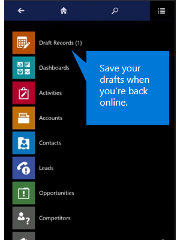  
  
2.  Select each record individually and tap **Save**.  
  
##### A few things to note about offline drafts  
  
-   While offline, you can only create and edit new records. To edit existing records, you need to be connected.  
  
-   While offline, you can only create standalone records or associate records to those that are available for offline access on your device. For example, you can create an opportunity for an account only if that account was created before you went offline, and if it’s available for offline access. You can’t create an opportunity for an account while offline if you also created the account while offline.  
  
-   While offline, you can’t set the value for lookup fields. If you create a record that is associated with another record, such as adding a phone call to a contact, some lookup fields might populate automatically (in this case, the To and From fields might pre-populate). You need to fill these fields in once you re-connect while you review and save your drafts.  
  
##### About cached data  
 The records you’ve recently used are kept on your mobile device, and are also known as cached data. Cached data is specific to your device, so if you use both the phone and tablet apps, the cached data on each device will be different, depending on the records you’ve viewed on each one.  
  
> [!WARNING]
>  Cached data is not encrypted. You can use BitLocker to encrypt the entire hard drive on a [!INCLUDE[pn_windows8](../includes/pn-windows8.md)] or [!INCLUDE[pn_windows_10](../includes/pn-windows-10.md)] device.  
  
##### If you’re prompted to sign in while you’re disconnected  
 If you’re prompted to sign in while you’re offline, tap the **Back** button on the sign-in page and you’ll still be able to work in offline mode on [!INCLUDE[tn_ipad](../includes/tn-ipad.md)] and [!INCLUDE[pn_windows8](../includes/pn-windows8.md)] tablets until you can reconnect. On all other phones and [!INCLUDE[tn_android](../includes/tn-android.md)] tablets, however, you can no longer work in offline mode and will be redirected to the **Let’s get started** page until you can reconnect and sign in again.  
  
##### Working offline with on-premises  deployments  
 If you’re using the mobile app with [!INCLUDE[pn_crm_2015](../includes/pn-crm-2015.md)] (on-premises) or later, you can continue to use [!INCLUDE[pn_moca_short](../includes/pn-moca-short.md)] while disconnected. However, with the [!INCLUDE[pn_windows8](../includes/pn-windows8.md)] app, once you close the app (like when you start another app), you can’t use it until you can connect to the Internet. With the [!INCLUDE[pn_windows_8_1](../includes/pn-windows-8-1.md)] app, you can continue to access your data even if you close the app. If you’re not sure whether your organization has an on-premises deployment, contact your Dynamics 365 admin to find out.  
  
 Note that offline synchronization is not supported by on-premises deployments.  
  
#### Background sync  
 Background sync is enabled even when the app is minimized so long as a network connection is detected. But when the app is in the background, metadata changes will not be accepted automatically. When you bring the app to the foreground, you will be prompted to accept the metadata changes.  
  
 **About background sync:**  
  
-   Sync will run until you  sign in to the mobile app.  
  
-   While the app is running in the background, sync is automatically enabled   when a network is detected .  
  
-   While the app is running in the background, sync is automatically disabled when a network is disabled  
  
-   When you bring the app to the  foreground, regular sync is detected and enabled.  
  
-   Background sync is disabled when the device is locked and enabled when the device is unlocked.  
  
-   While the app is running in the background,  metadata changes will not be accepted automatically. The mobile app will stop the background sync.  
  
-   When you bring the app to the  foreground, you are prompted to accept the metadata changes.  
  
-   While the app is running in the foreground, after metadata is updated, the app will switch to regular sync.  
  
 Background sync will be disabled if:  
  
-   Your user token expires in the background.  
  
-   The application closes for some reason.  
  
-   Your device locks.  
  
 Background sync is available on all supported devices. See [support for Dynamics 365 for phones and Dynamics 365 for tablets](https://technet.microsoft.com/library/dn531131.aspx).  
  
#### Sync conflict resolution  
 If multiple entries are made in the same field by offline users (for example, two or more “close by” dates), the conflict is clearly marked and you can choose the correct entry.  
  
 If a record has changed on the server between the time your device retrieved the record and when it tries to update or delete that record,   you'll see an exclamation mark   ("!”) by the relevant field, and will need to resubmit your  updated changes.  
  
#### Reconnect to go back online  
 Once you have phone service or Internet again, tap the offline indicator on your device to reconnect.  
  
 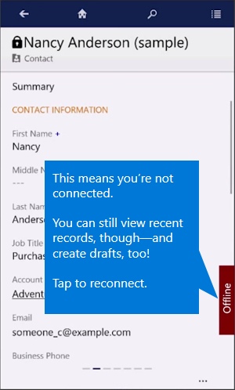  
  
 You’ll need to save your drafts to make them available in [!INCLUDE[pn_crm_shortest](../includes/pn-crm-shortest.md)].  
  
#### For admins: Enhanced sync filters  
 Admins  can choose what information to sync to user's devices. This can help minimize impact to user's device's memory.  
  
> [!NOTE]
>  Make sure that you’re using the latest version of the mobile app For Advanced Filters to work offline.  
  
 Admins can define a custom filter based on the following rules. You can create filters up to three levels.  
  
||  
|-|  
|equal|  
|not equal|  
|gt – greater than|  
|ge – greater than or equal to|  
|le – less than or equal to|  
|lt – less than|  
|like|  
|not-like|  
|in|  
|not-in|  
|null|  
|not-null|  
|eq-userid|  
|ne-userid|  
|eq-userteams|  
|eq-useroruserteams|  
|eq-useroruserhierarchy|  
|eq-useroruserhierarchyandteams|  
|eq-businessid|  
|ne-businessid|  
|eq-userlanguage|  
|begins-with|  
|not-begin-with|  
|ends-with|  
|not-end-with|  
  
##### Enhanced sync status for provisioning  
  
-   Admins can see the status of provisioning and de-provisioning.  
  
-   The mobile offline configuration page is auto-refreshed at regular intervals to show updated status messages during provisioning and de-provisioning.  
  
-   You can stop provisioning at any stage during provisioning.  
  
-   You can de-provision your organization only when the provisioning is complete.  
  
-   De-provisioning of an organization can't be stopped once initiated.  
  
-   You can initiate provisioning again only when de-provisioning is complete.  
  
-   In  case of a provisioning or de-provisioning failure, consider retrying your provisioning before contacting support.  
  
-   All the provisioning and de-provisioning messages will be shown on the mobile offline configuration page along with the date and timestamp of when the status was last checked.  
  
   
### Use Cortana voice commands  
 You can use the following [!INCLUDE[pn_crm_shortest](../includes/pn-crm-shortest.md)] voice commands with [!INCLUDE[pn_cortana](../includes/pn-cortana.md)] if you’re using [!INCLUDE[pn_cortana](../includes/pn-cortana.md)] on [!INCLUDE[pn_windows_8_1](../includes/pn-windows-8-1.md)] phones or later. [!INCLUDE[pn_cortana](../includes/pn-cortana.md)] voice commands for [!INCLUDE[pn_crm_shortest](../includes/pn-crm-shortest.md)] are only available in English at this time.  
  
 These commands work with either the [!INCLUDE[pn_Mobile_Express_short](../includes/pn-mobile-express-short.md)] app or the previous phone app, [!INCLUDE[pn_crm_for_phones_express](../includes/pn-crm-for-phones-express.md)].  
  
|To do this in Dynamics 365|Say this|  
|--------------------------------|--------------|  
|Open an item|**Dynamics 365 open *\<item>* called *\<item name>*.**   *Example:*   “CRM open account called Contoso.”   *Variation:*   “CRM open account *named* Contoso.”|  
|Show a view|**Dynamics 365 show *\<view name>*.**   *Example:*   “CRM show my active accounts.”   *Variation:*   “CRM *show me* my active accounts.”|  
|Search for an item|**Dynamics 365 find *\<item>* called *\<name>*.**   *Example:*   “CRM find account called Contoso.”   *Variation:*   “CRM find account *named* Contoso.”|  
|Create a new item|**Dynamics 365 create *\<item type>* called *\<item name>*.**   *Example:*   “CRM create contact called Maria Campbell.”   *Variation:*   “CRM *add new* contact *named* Maria Campbell.”|  
|Create a phone call activity|**Dynamics 365 remind me to call *\<call name>*.**   *Example:*   “CRM remind me to call Maria Campbell to set up appointment.”|  
|Create an appointment|**Dynamics 365 schedule meeting to *\<subject>*.**   *Example:*   “CRM schedule meeting to discuss quote with Maria Campbell.”|  
|Create a task|**Dynamics 365 remind me to *\<task name>*.**   *Example:*   “CRM remind me to email Maria Campbell.”   *Variations:*   “CRM *follow up* Maria Campbell.”   “CRM *follow up with* Maria Campbell.”   “CRM *follow up on* Contoso.”|  
|Open task list|**Dynamics 365 what should I do next?**   *Example:*   “CRM what should I do next?”|  
  
> [!NOTE]
>  The **create** commands work only with [!INCLUDE[pn_crm_2015_and_online_full](../includes/pn-crm-2015-and-online-full.md)] or later. The other commands work with [!INCLUDE[pn_crm2013_and_online](../includes/pn-crm2013-and-online.md)] as well as [!INCLUDE[pn_crm_2015_and_online_full](../includes/pn-crm-2015-and-online-full.md)] or later.  
  
 For more information about using [!INCLUDE[pn_cortana](../includes/pn-cortana.md)], see [Meet Cortana](http://go.microsoft.com/fwlink/p/?LinkID=401573).  
  
   
### Use your browser for non-mobile features  
 The following features in the web application aren’t available in [!INCLUDE[pn_crm_shortest](../includes/pn-crm-shortest.md)] for phones and tablets:  
  
- [!INCLUDE[pn_yammer](../includes/pn-yammer.md)] and activity feeds  
  
- [!INCLUDE[pn_bing_maps](../includes/pn-bing-maps.md)] integration  
  
- [!INCLUDE[pn_parature_from_microsoft](../includes/pn-parature-from-microsoft.md)] knowledge base integration  
  
 If you need to use these features or want to view a record in the web application, you can do that in your tablet’s browser. (You can only do this in the tablet app.)  
  
1.  Press and hold the record or view you want to see.  
  
2.  Tap **Open in browser**.  
  
3.  Sign in to the web application when it appears. The web app goes right to the record that you were working on in the mobile app.  
  
## Troubleshooting  
  
### Error code 800c0019 on Windows Phones  
 If you get error code 800c0019 when you try to sign in to your [!INCLUDE[cc_Microsoft](../includes/cc-microsoft.md)] account while using the [!INCLUDE[pn_Mobile_Express_long](../includes/pn-mobile-express-long.md)] or [!INCLUDE[pn_crm_for_phones_express](../includes/pn-crm-for-phones-express.md)] apps, chances are that you have the wrong date and time settings on your [!INCLUDE[pn_windows8](../includes/pn-windows8.md)] phone. This can occur after updating your [!INCLUDE[pn_windows8](../includes/pn-windows8.md)] phone, removing and replacing the battery, or after a time change.  
  
 In most cases, your phone’s date and time is set automatically by your mobile operator. If it’s not, you need to set it manually so you can sign in to your [!INCLUDE[cc_Microsoft](../includes/cc-microsoft.md)] account successfully. Here’s how:  
  
1.  On **Start**, flick left to the **App** list and tap **Settings**.  
  
2.  Tap **Date+time**.  
  
3.  Turn off **Set automatically**.  
  
4.  Set the correct values for **Time zone**, **Date**, and **Time**.  
  
### Dynamics 365 for Windows app start-up error  
 Did you receive this error?  
  
 **Additional steps may be needed to configure [!INCLUDE[pn_microsoftcrm](../includes/pn-microsoftcrm.md)] for this organization. Please contact your system administrator**.  
  
 **If you’re using a computer or tablet**  
  
|||  
|-|-|  
|**Users:**|Notify your [!INCLUDE[pn_crm_shortest](../includes/pn-crm-shortest.md)] administrator that you received this error.|  
|**Admins:**|To enable the [!INCLUDE[pn_microsoft_dynamics_crm_for_windows_81](../includes/pn-microsoft-dynamics-crm-for-windows-81.md)] app for on-premises [!INCLUDE[pn_crm_shortest](../includes/pn-crm-shortest.md)] deployments, you need to make some configuration changes. [!INCLUDE[proc_more_information](../includes/proc-more-information.md)] [Set up Dynamics 365 for phones and tablets](https://technet.microsoft.com/library/dn531128.aspx) **Important:** [!INCLUDE[pn_crm_shortest](../includes/pn-crm-shortest.md)] on-premises deployments require Windows 10 and the [Dynamics 365 for Windows app built for Windows 10](http://go.microsoft.com/fwlink/p/?LinkID=799909).|  
  
 **If you’re using a Windows phone**  
  
 You received this error because you’re trying to connect to an on-premises deployment of [!INCLUDE[pn_crm_shortest](../includes/pn-crm-shortest.md)], which is  not supported for your version on Windows Phones. Windows Phone connection to [!INCLUDE[pn_crm_2016](../includes/pn-crm-2016.md)] on-premises requires the [Dynamics 365 for Windows app built for Windows 10](http://go.microsoft.com/fwlink/p/?LinkID=799909). [!INCLUDE[proc_more_information](../includes/proc-more-information.md)] [support for Dynamics 365 for phones and tablets](https://technet.microsoft.com/library/dn531131.aspx)  
  
### Reconfigure Dynamics 365 for phones and tablets  
 Reconfiguring deletes all data and metadata from the cache, though you shouldn't rely on this as a security measure.  
  
 If you sign out of one organization and sign in to another, and then use the Reconfigure option on the organization you signed in to, your metadata will still remain for the organization you signed out of. To remove your metadata from the organization you signed out of, you’ll need to sign in to it and use the Reconfigure option there, as well.  
  
 Here's how to do it:  
  
1.  Tap .  
  
2.  Tap **Settings**.  
  
3.  Tap **Reconfigure**.  
  
 You can now sign in to a different server or organization.  
  
## Privacy notice  
[!INCLUDE[cc_privacy_crm_for_tablets](../includes/cc-privacy-crm-for-tablets.md)]
  
[!INCLUDE[cc_privacy_crm_cortana](../includes/cc-privacy-crm-cortana.md)]
  
[!INCLUDE[cc_privacy_moca_user_content_and_location](../includes/cc-privacy-moca-user-content-and-location.md)]
