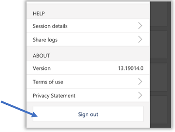
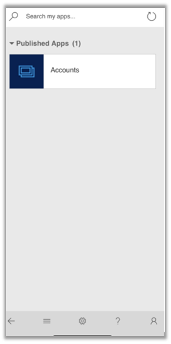
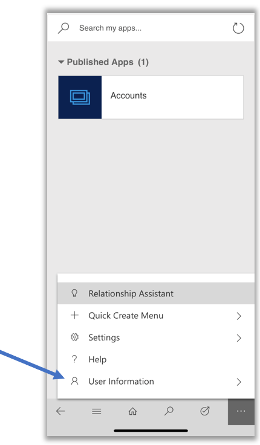
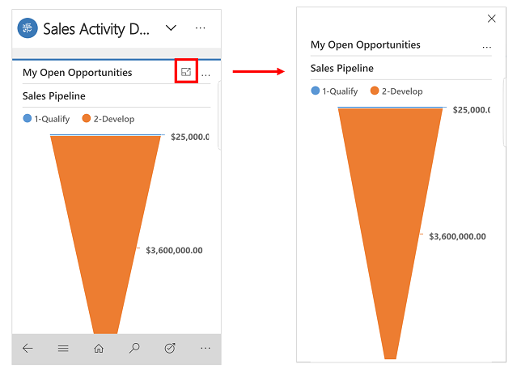
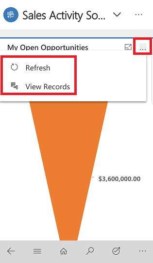
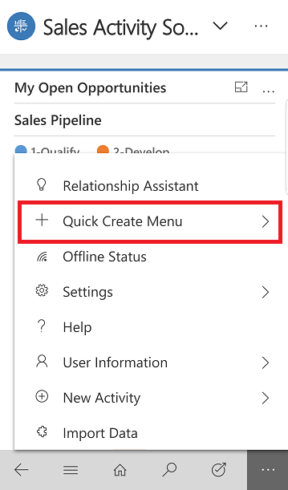

# User Guide (Dynamics 365 for phones and tablets)

Use the [!INCLUDE[pn_dyn-365_phones](../includes/pn-dyn-365-phones.md)] and [!INCLUDE[pn_dyn-365_tablets](../includes/pn-dyn-365-tablets.md)] apps for your sales, customer service, field service, and other tasks when you're on the go. With one download from your app store, you’ll automatically have access to all the apps you need for your role. You will see apps with the new Unified Interface on your mobile device.  

> [!NOTE]
> - On February 21, 2018, we announced the deprecation of the Windows Phone app for [!INCLUDE [pn-crm-9-0-0-online](../includes/pn-crm-9-0-0-online.md)]. On May 22, 2018, the Windows Phone app will no longer be supported for [!INCLUDE [pn-crm-9-0-0-online](../includes/pn-crm-9-0-0-online.md)]. Support for the  app on Windows tablets and PCs remains unchanged. The Windows Phone app will continue to be available in the store and will be supported for Dynamics 365 for Customer Engagement apps, (version 8.2) and earlier supported versions. If you wish to continue to use the Windows Phone app, you should not update to Dynamics 365 for Customer Engagement apps, version 9.0 as the Windows Phone app will not be supported with version 9.x. 
> - [!INCLUDE[pn_crm_shortest](../includes/pn-crm-shortest.md)] has separate mobile apps for [!INCLUDE[pn_field_service](../includes/pn-field-service.md)] and Operations. Learn about [Dynamics 365 for Customer Engagement apps for Field Service (Resco) mobile app](https://go.microsoft.com/fwlink/?linkid=846157) and [Dynamics 365 for Customer Engagement apps  for Operations mobile app](https://ax.help.dynamics.com/en/wiki/mobile-development-handbook/).  
> - Mobile offline feature is now available. It's available only for iOS and Android users.
    
## Install the app from your device’s app store  
[!INCLUDE[proc_more_information](../includes/proc-more-information.md)] [Install Dynamics 365 for phones and tablets](../mobile-app/install-dynamics-365-for-phones-and-tablets.md)    

## Sign in and sign out (iOS users)

Sign in to the Dynamics 365 mobile app quickly using your work email address or Customer Engagement app web address. If you need help with your sign-in information, contact your Dynamics 365 administrator. 

> [!IMPORTANT]
> - This feature is supported for version 9.x (Online and on-premises) when signing in using the mobile app on an iOS device.
> - If you are a [Dynamics 365 US Government](https://docs.microsoft.com/en-us/dynamics365/customer-engagement/admin/government/microsoft-dynamics-365-government) (GCC and GCC High) user, you are required to sign in using the web address option.

### Sign in with your email address (iOS users)

1. Enter your email address, and then select .

   > [!div class="mx-imgBorder"] 
   > .

2. From the list of apps that you have access to, select the app that you want to use.

   > [!div class="mx-imgBorder"] 
   > . 
        
#### Sign out (iOS users)

- From the upper-right corner, select  > **Sign out**.

   > [!div class="mx-imgBorder"] 
   > 

### Sign in with your web address (iOS users)

You can also sign in using your Dynamics 365 Customer Engagement app web address and user name and password. 

1. On the sign-in screen, select **Sign in with a web address instead**.

   > [!div class="mx-imgBorder"] 
   > . 

2. Enter the URL for your Dynamics 365 Customer Engagement app, and then select . 
3. Enter your user name and password.
4. From the list of apps that you have access to, select the app that you want to use.

   > [!div class="mx-imgBorder"] 
   > . 

#### Sign out (iOS users)

- From the navigation bar, select  > **User Information** > **Sign out**.

  > [!div class="mx-imgBorder"] 
  > 
      

## Sign in and sign out (Android users)

To sign in, you’ll need your [!INCLUDE[pn_crm_shortest](../includes/pn-crm-shortest.md)] web address, user name, and
password. If you need help with your sign-in information, contact your Dynamics 365 administrator. 

1. Open the mobile app, enter your Dynamics 365 for Customer Engagement apps web address, and then select .

   > [!div class="mx-imgBorder"] 
   >  

2. Enter your user name and password, and select **Sign in**.

3. From the list of apps that you have access to, select the app that you want to use.

#### Sign out

- From nav bar, select  > **User Information** > **Sign out**.

  > [!div class="mx-imgBorder"] 
  > 

## Navigation

For phones, portrait mode is set as the default screen orientation. For tablets, landscape mode is set as the default. Screen orientation for phone and tablet apps cannot be changed. 

Use the navigation bar to get to your work area, create a new record, search, swithc app, and more. 

  > [!div class="mx-imgBorder"] 
  > 

### Favorites and recently used records

The **Favorites** and **Recently Used** provides quick access to your records, views, or dashboards that you have recently used or pinned to favorites.

- To get to **Favorites** and **Recently Used**, select the site map button  > .

- To pin a record to favorites, from the list of **Recently Used** records, select the pin button next to the record that you want to add to favorites. This will move the record from  **Recently Used** to **Favorites**.

- To unpin an item from favorites, from the list of **Favorites**, select the pin button next to the record that you want to unpin.

   > [!div class="mx-imgBorder"] 
   > 

## Dashboards and charts

Dashboards give you an overview of valuable information. Select on the Home button  to view dashboards.

- To view a different dashboard, select the down arrow next to the name of the dashboard, and then select the dashbaord that you want to view. 

  > [!div class="mx-imgBorder"] 
  > 
  
- To view a chart in the dashboard in full screen mode, select the Expand button .

   > [!div class="mx-imgBorder"] 
   > 
   
 -  To view records in chart or refresh the chart view, select  and then choose an  action: **Refresh** or **View Records**. 

   > [!div class="mx-imgBorder"] 
   > 

Charts give you a quick view of how you’re tracking to your goals. They’re interactive, so you can select an area of a chart to get more info.

- On the chart, select once to see a tooltip that provides quick info about that area of the chart.

- Select again on the same section to see a grid view with more details about the data in the chart.
  
   > [!div class="mx-imgBorder"] 
   >  
      
 
- To change the chart view to show a different breakdown of your data, select the down arrow next to the name of the chart, and then select the chart that you want to view.

  > [!div class="mx-imgBorder"] 
  > 

## Work with records

The **Quick create Menu** makes it fast and easy to enter almost any type of information into the system. 
    
1.  To create a new record, on the navigation bar select, the More button .

2.  Select **Quick Create Menu** and then choose a record type.

    > [!div class="mx-imgBorder"] 
    > 

3. From the list select the type of activity or record you want to create. 

    > [!div class="mx-imgBorder"] 
    > 
    
4. Enter the required information for the record and then select **Save and Close**.

### Take action on record

Take action on a record without opening the record. 

1. Select the site map button . Select the record type that you want to update, such as, **Accounts**.

2. From the list of records, select  on the record you want to update.

3. Then  select an action such as **Assign**, **Deactivate** or **Delete**. 

  > [!div class="mx-imgBorder"] 
  > .

## Add activities in the Timeline wall 

Add activities in the Timeline wall to keep track of all your communications with a customer or contact. You add notes, posts,task, send email, add phone call details, or set up appointments. The system automatically timestamps every activity and shows who created it. You and other people on your team can scroll through the activities to see the history as you work with a customer.

**Add an activity**

- Open a record and in the **Timeline** area, tap **+**, and select the type of activity that you want to add.

- Tap  and then tap **Open Filter Pane** to filter the records in the timeline by record type.

- Tap  to change the sort order for the records from ascending to descending and vice versa.

**Take notes**

The mobile app also lets you take notes and attach photos to a note, or take a new photo with your device's camera. So, if for example, you're out at a site and need to document a customer's issue with a product, you can capture and add it to a note right away, rather than taking the photo, then adding it from your camera roll later.

To add a note, open a record and in the notes area enter your note.

### Scan barcodes  
Rather than manually typing a barcode number into a field, you can scan barcodes by using your device's camera. Tap the icon to the right of the field to start the scanner. This makes it easy to capture info about inventory and other issues when you're out in the field. You'll need to ask your admin to set this feature up for you.  

## Send an email or make a call
Call or send email to your customers easily from the mobile apps. Tap any phone number in a record to start a call, or tap the email button to send an email.

In the [!INCLUDE[pn_dyn-365_tablets](../includes/pn-dyn-365-tablets.md)] app, tapping the phone button starts a Skype call. In [!INCLUDE[pn_dyn-365_phones](../includes/pn-dyn-365-phones.md)], it starts a phone call.

When you’re finished with your call, the app prompts you to enter details about
the call.

### Update an image for a record

- To add a new image to a record, open the record and selct the current image for the record. Choose **Use Camera** to take a new pictuere or **Upload Image** to choose an existing image on your device. Then follow the prompts on your device to add the new image.

  > [!div class="mx-imgBorder"] 
  >

## Business process flow

Business process flows help you enter data consistently and follow the same steps every time you work with a record. As you work on a new record, the business process flow helps you see each step that you need to take to create the new record and fill out the required information according to your organizations business process.

**Task Flows**

Use Task Flows to complete common set of tasks. For example, if you need to perform a series of follow-up steps on a regular basis then tap Start Task Flow  button on the nav bar. This will lead you through the entire task from start to finish so, you don't forget an important step.

On a phones, tap , on the nav bar and then tap **Start Task Flow**.

> [!NOTE]
>  Tasked based flows need to be turned on by your admin. [!INCLUDE[proc_more_information](../includes/proc-more-information.md)] [Create a mobile task flow](../customize/create-mobile-task-flow.md)

## Search for records

You can search for records across multiple entities by using Relevance Search or Categorized Search. Relevance Search delivers fast and 
comprehensive results across multiple entities, in a single list, sorted by relevance. Categorized Search returns search results grouped 
by entity types, such as accounts, contacts or leads.

When Relevance Search is enabled for your organization, it becomes the default search experience.

**Switch between Relevance and Categorized search**

1. On the nav bar tap the Search button. 

   

2. From the menu, select a search type. 

   

**Use Relevance Search**

1. On the nav bar tap Search button.

   

2. Type in the search box, and then tap Search.

   

Use syntax in your search term to get the results you want. For example, type “car silver 2-door” to include matches for any word in the search term in the search results. Type “car+silver+2-door” to find only matches that include all three words. Type “car|silver|2-door” to get results that contain “car” or “silver” or “2-door”, or all three words.

**Use Categorized Search**

1. On the nav bar tap Search button.

   

2. Type in the search box, and then tap Search.

Search results include only records that begin with the letters you type. For example, if you want to search for “Alpine Ski House,” type **alp** in the search box. If you type **ski**, the record won’t show up. 

**Filter search results**

To filter results by record type, choose a record type from the **Filter
with:** drop-down box.

## Sort items in a grid view

To help you find a record quickly, you can sort items in a grid view. For example, when you’re looking at a list of your active accounts, tap the arrow to sort the records in ascending or descending order.

- To sort in ascending order by a column, tap that column’s heading.

- To sort in descending order, tap the column’s heading again.

  
  
You can do the same from a list view in [!INCLUDE[pn_dyn-365_phones](../includes/pn-dyn-365-phones.md)]. 

- Tap , tap **Sort** and then choose how you want to sort the data.
  
  

## Export records to Excel

In the list of records in [!INCLUDE[pn_crm_shortest](../includes/pn-crm-shortest.md)] mobile apps, you can export records to Microsoft Excel, just like you can in the web app. From a grid view in [!INCLUDE[pn_crm_shortest](../includes/pn-crm-shortest.md)] for tablets or a list of records in [!INCLUDE[pn_dyn-365_phones](../includes/pn-dyn-365-phones.md)] tap  on the command bar and then tap **Export to Excel**.

[!INCLUDE[proc_more_information](../includes/proc-more-information.md)] [Export data to excel](../basics/export-data-excel.md) 

## Relationship Assistant

The relationship assistant is designed to deliver the most important and relevant information in relation to what you are doing right now. The assistant works by analyzing all of the data at its disposal and generating a collection of action cards, each of which includes a message summarizing what the card is about, plus a set of links for taking action. The assistant sorts the cards by priority and filters them for your current context.

The assistant reminds you of upcoming activities; it evaluates your communications and suggests when it might be time to reach out to a contact that’s been inactive for a while; it identifies email messages that may be waiting for a reply from you; it alerts you when an opportunity is nearing its close date; and much more.

When you start your day by signing in to Dynamics 365 for Customer Engagement apps, the assistant draws your attention to your most important items and tasks, drawn from all areas of the application.

1.  To access the assistant, on the nav bar, tap .

2.  Tap **Relationship Assistant**.

    
 

## Privacy notices  
[!INCLUDE[cc_privacy_crm_for_tablets](../includes/cc-privacy-crm-for-tablets.md)]
  
<!-- [!INCLUDE[cc_privacy_crm_cortana](../includes/cc-privacy-crm-cortana.md)] -->
  
[!INCLUDE[cc_privacy_moca_user_content_and_location](../includes/cc-privacy-moca-user-content-and-location.md)]

### See Also  
 [What's supported](support-phones-tablets.md)  
 [Troubleshooting](troubleshooting-things-know-about-phones-tablets.md)   
