# User Guide (Dynamics 365 for phones and tablets)

[!INCLUDE[cc-applies-to-update-9-0-0](../includes/cc_applies_to_update_9_0_0.md)]

Use the [!INCLUDE[pn_dyn-365_phones](../includes/pn-dyn-365-phones.md)] and [!INCLUDE[pn_dyn-365_tablets](../includes/pn-dyn-365-tablets.md)] apps for your sales, customer service, field service, and other tasks when you're on the go. With one download from your app store, you’ll automatically have access to all the apps you need for your role. You will see apps with the new Unified Interface on your mobile device.  

> [!NOTE]
> - On February 21, 2018, we announced the deprecation of the Windows Phone app for [!INCLUDE [pn-crm-9-0-0-online](../includes/pn-crm-9-0-0-online.md)]. On May 22, 2018, the Windows Phone app will no longer be supported for [!INCLUDE [pn-crm-9-0-0-online](../includes/pn-crm-9-0-0-online.md)]. Support for the  app on Windows tablets and PCs remains unchanged. The Windows Phone app will continue to be available in the store and will be supported for Dynamics 365, (version 8.2) and earlier supported versions. If you wish to continue to use the Windows Phone app, you should not update to Dynamics 365, version 9.0 as the Windows Phone app will not be supported with version 9.x. 
> - [!INCLUDE[pn_crm_shortest](../includes/pn-crm-shortest.md)] has separate mobile apps for [!INCLUDE[pn_field_service](../includes/pn-field-service.md)] and Operations. Learn about [Dynamics 365 for Field Service (Resco) mobile app](https://go.microsoft.com/fwlink/?linkid=846157) and [Dynamics 365  for Operations mobile app](https://ax.help.dynamics.com/en/wiki/mobile-development-handbook/).  
    
## Install the app from your device’s app store  
[!INCLUDE[proc_more_information](../includes/proc-more-information.md)] [Install Dynamics 365 for phone and tablets](../mobile-app/install-dynamics-365-for-phones-and-tablets.md)    
      
 
## Signing in and signing out
To sign in, you’ll need your [!INCLUDE[pn_crm_shortest](../includes/pn-crm-shortest.md)] web address, user name, and
password. If you don’t have any of these, contact your [!INCLUDE[pn_crm_shortest](../includes/pn-crm-shortest.md)] admin.

1.  Open your app, enter your Dynamics 365 web address, and tap .

    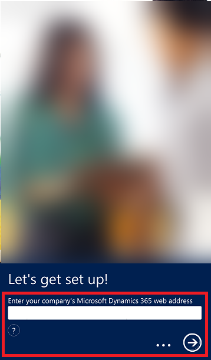 

2.  On the next screen, enter your user name and password, and tap **Sign in**.

Here's how to sign out in case someone else needs to use your device.

1.  From nav bar, tap .

2.  Tap **User Information**.

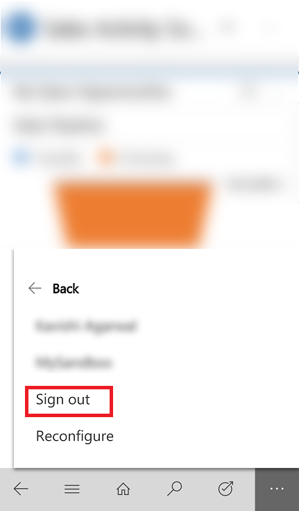

3.  Tap **Sign out**.

You can sign in again as the same or a different user, or you can sign in to a different organization.

## Basic navigation

1. When you sign in, you’ll see the MyApps page with all your apps listed. 
2. Select the App that you want to work with.

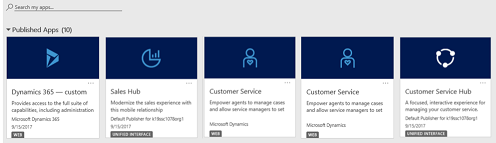

**The navigation bar**

Use the nav bar to get to your work area, create a new record, search, or do other tasks. To access more commands, tap .

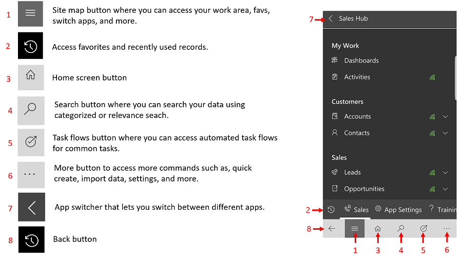

**Get help while using the app**

If you ever need help while you’re in the mobile app, on the nav bar tap , and then tap **Help**.

**Favorites and recently used records**

The Favorites and Recently Used sections provide quick access to your records, views, and dashboards. 

- To access these sections, tap the **Menu**  button on the nav bar, and then tap the **Favorites and Recent**  button.

- To pin an item as a favorite, from the list of **Recently Used** items, tap the pin. This will pin and move the item to **Favorites**.

- To unpin an item from **Favorites**, tap the pin again.

  

**Switch apps**

Go back to the MyApps pages and switch to a different app.

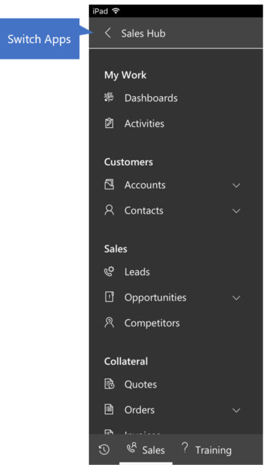

## Dashboards

Dashboards give you an overview of valuable information. Tap on the Home icon
any time to get your dashboards. 

If you want to use a different dashboard, it’s easy to switch back and forth.

From the Home screen, tap dashboards menu and then select the dashboard you want to use.

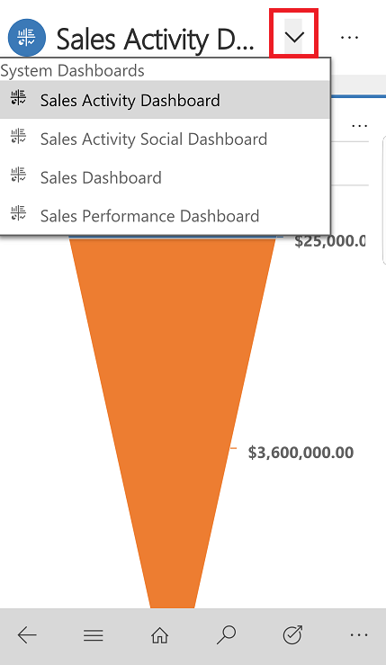

Here are some of the ways you can work with
dashboards.

| **To do this:**                                                                                                   | **Do this:**                                                                                                      |
|-------------------------------------------------------------------------------------------------------------------|-------------------------------------------------------------------------------------------------------------------|
| View all the records for a record type on the dashboard (for example, **Accounts**). | Tap the header of the list. This opens your records in a grid view on your mobile device.                                |
| Open the form for a record on the dashboard.                                                                      | Tap the record.                                                                                                   |
| To create new dashboards in Dynamics 365 and enable them for use in Dynamics 365 for phones and tablets. | See, [Create or customize dashboards](../customize/create-edit-dashboards.md). |
                                                                                              
**Change views for a list on the dashboard**

Tap the name of the list and select the list that you want to see.

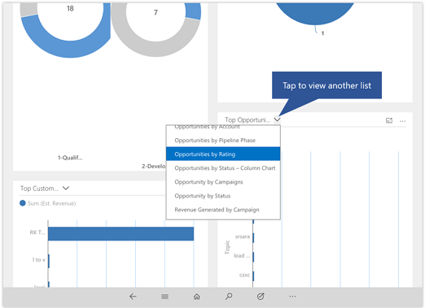

To create new dashboards in Dynamics 365 and enable them for use in Dynamics 365
for phones and tablets, see [Create or customize dashboards](../customize/create-edit-dashboards.md).

**Open a list of records in a dashboard view**

- From a list of records (for example, **Accounts**), tap **Open Dashboards**.

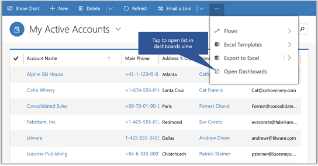

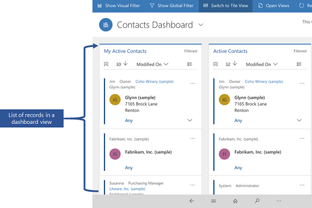

## Work with records

As a sales or service professional you’ll be working the following types of
records and more:

- **Accounts**   Account records contain information about the companies you do business with.

- **Contacts**   Contact records contain information about the people you know and work with. Usually, multiple contacts are associated with one account. Contacts could include people responsible for making purchasing decisions, people in charge of paying invoices, support technicians, or anyone you work with at the company.
    
1.  To add a record, on the nav bar tap .

2.  Tap **Quick Create Menu** and choose a record type.

3.  Select a record type to create.

4.  Enter the required information and then tap **Save**.

**Quickly open a record**

When you have a record open and you need to view another record in the same list, tap  to choose
another record.

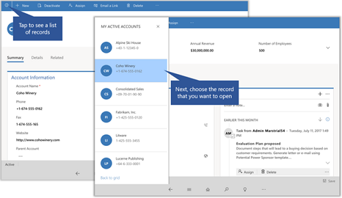

**Take action on record**

Take action on a record without opening the record. From a list of records, select the record that you want to update, then on the command bar select an action such as **Assign**, **Deactivate** or **Delete**. You can take a similar action when you select multiple records.

**Update an image for a record**

To add an image to a record, open the record and tap the image for the record. Next, select the image that you want to use.

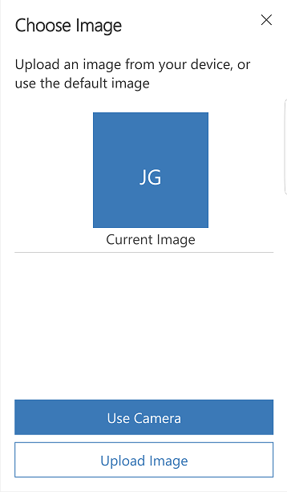

**Business process flow**

The business process bar on forms gives a clear step-by-step for building customer relationships. You can see at a glance exactly 
where you are with a customer and what you need to do next.

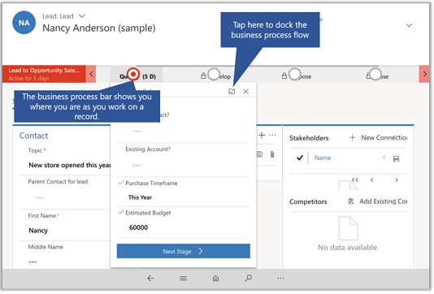

The process bar can be docked to the right side of the screen for easy reference as you work with a customer record.

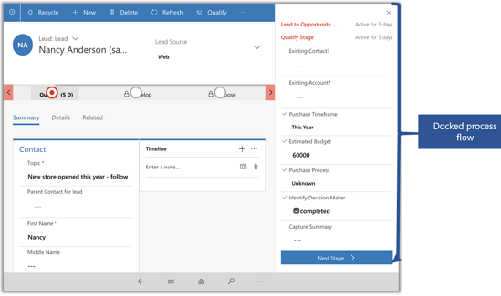

**Task Flows**

Use Task Flows to complete common set of tasks. For example, if you need to perform a series of follow-up steps on a regular basis then tap Start Task Flow  button on the nav bar. This will lead you through the entire task from start to finish so, you don't forget an important step.

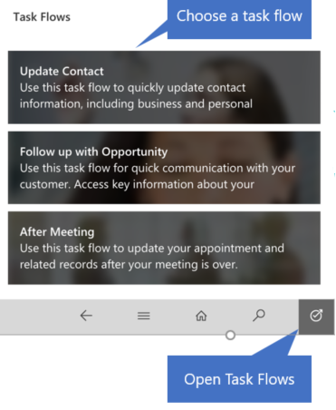

On a phones, tap , on the nav bar and then tap **Start Task Flow**.

> [!NOTE]
>  Tasked based flows need to be turned on by your admin. [!INCLUDE[proc_more_information](../includes/proc-more-information.md)] [Create a mobile task flow](../customize/create-mobile-task-flow.md)

## Track your progress with charts
Charts give you a quick view of how you’re tracking to your goals. They’re interactive, so you can tap an area of a chart to get more info.

-   Tap once on a chart section to see a tooltip that provides quick info about that area of the chart.

-   Tap again on the same section to see a grid view with more details about the data in the chart.

-   To expand a chart, from the charts Home page grid, tap the **Expand Chart**  button.

-   To view records in chart or refresh the chart, tap  and then choose an  action: **Refresh** or **View Records**.
            
       
  
    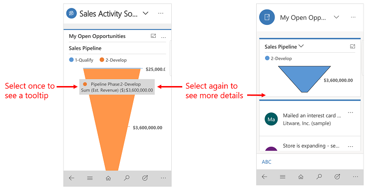 
       

Two dimensions charts like Line, Bar, Column, and Area support zooming. Single dimension charts like, Funnel, Doughnut, Pie, and Tag chart don’t support zooming.

**Change the chart view**
 
Changing the chart view shows you a different breakdown of your data, such as opportunities opened within a specific time period. You can change a chart view by selecting the View selector on the Grid page.

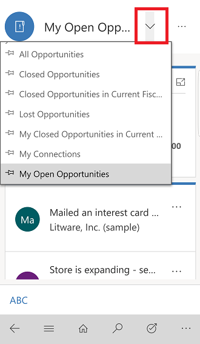

For example, tap "All Opportunities", then select a different view, both chart and grid will get refreshed.

## Search for records

You can search for records across multiple entities by using Relevance Search or Categorized Search. Relevance Search delivers fast and 
comprehensive results across multiple entities, in a single list, sorted by relevance. Categorized Search returns search results grouped 
by entity types, such as accounts, contacts or leads.

When Relevance Search is enabled for your organization, it becomes the default search experience.

**Switch between Relevance and Categorized search**

1. On the nav bar tap the Search button. 

   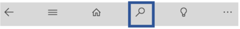

2. From the menu, select a search type. 

   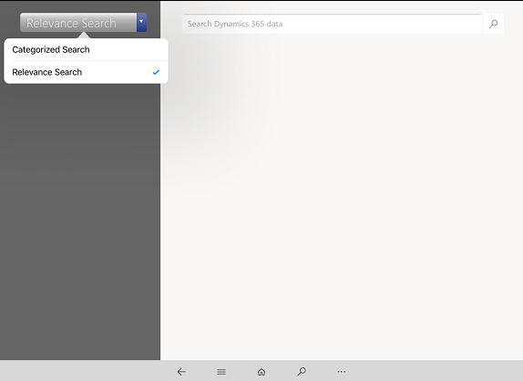

**Use Relevance Search**

1.  On the nav bar tap Search button.

  

2.  Type in the search box, and then tap Search.

   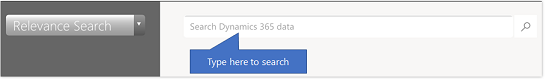

Use syntax in your search term to get the results you want. For example, type “car silver 2-door” to include matches for any word in the search term in the search results. Type “car+silver+2-door” to find only matches that include all three words. Type “car|silver|2-door” to get results that contain “car” or “silver” or “2-door”, or all three words.

**Use Categorized Search**

1.  On the nav bar tap Search button.

  

2.  Type in the search box, and then tap Search.

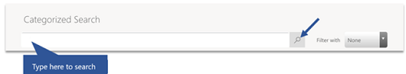

Search results include only records that begin with the letters you type. For example, if you want to search for “Alpine Ski House,” type **alp** in the search box. If you type **ski**, the record won’t show up. 

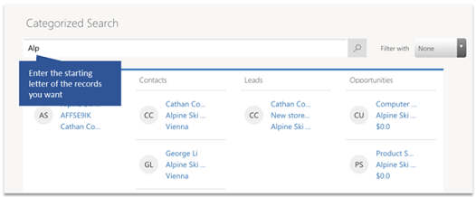

**Filter search results**

To filter results by record type, choose a record type from the **Filter
with:** drop-down box.

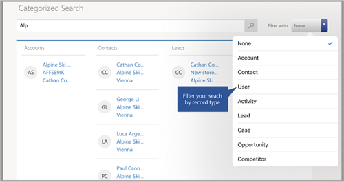

## Sort items in a grid view

To help you find a record quickly, you can sort items in a grid view. For example, when you’re looking at a list of your active accounts, tap the arrow to sort the records in ascending or descending order.

-   To sort in ascending order by a column, tap that column’s heading.

-   To sort in descending order, tap the column’s heading again.

  
  
You can do the same from a list view in [!INCLUDE[pn_dyn-365_phones](../includes/pn-dyn-365-phones.md)]. 

 -   Tap , tap **Sort** and then choose how you want to sort the data.
  
  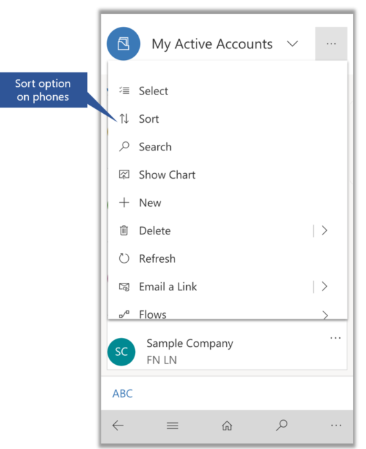

## Export records to Excel

In the list of records in [!INCLUDE[pn_crm_shortest](../includes/pn-crm-shortest.md)] mobile apps, you can export records to Microsoft Excel, just like you can in the web app. From a grid view in [!INCLUDE[pn_crm_shortest](../includes/pn-crm-shortest.md)] for tablets or a list of records in [!INCLUDE[pn_dyn-365_phones](../includes/pn-dyn-365-phones.md)] tap  on the command bar and then tap **Export to Excel**.

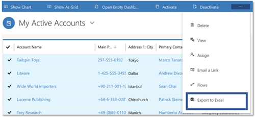

[!INCLUDE[proc_more_information](../includes/proc-more-information.md)] [Export data to excel](../basics/export-data-excel.md) 

## Relationship Assistant

The relationship assistant is designed to deliver the most important and relevant information in relation to what you are doing right now. The assistant works by analyzing all of the data at its disposal and generating a collection of action cards, each of which includes a message summarizing what the card is about, plus a set of links for taking action. The assistant sorts the cards by priority and filters them for your current context.

The assistant reminds you of upcoming activities; it evaluates your communications and suggests when it might be time to reach out to a contact that’s been inactive for a while; it identifies email messages that may be waiting for a reply from you; it alerts you when an opportunity is nearing its close date; and much more.

When you start your day by signing in to Dynamics 365, the assistant draws your attention to your most important items and tasks, drawn from all areas of the application.

1.  To access the assistant, on the nav bar, tap .

2.  Tap **Relationship Assistant**.

    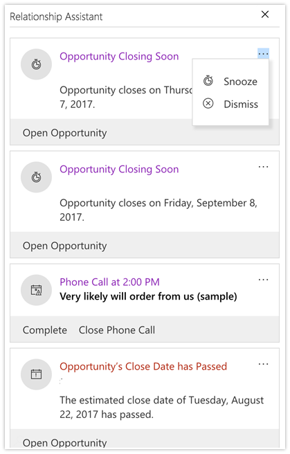

## Update your activities in the Timeline

The timeline view helps you collaborate with your team by tracking communication history on a single page in an easy-to-read 360 view.  
You can see everything from posts and voice attachments, to email and notes and more.

**Add an activity**

- Open a record and in the **Timeline** area, tap **+**, and select the type of activity that you want to add.

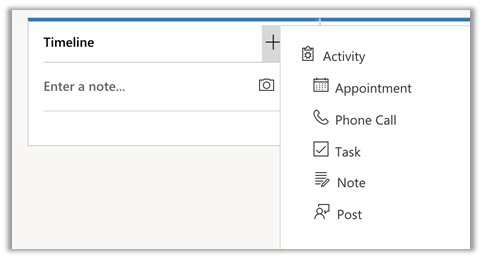

- Tap  and then tap **Open Filter Pane** to filter the records in the timeline by record type.

- Tap  to change the sort order for the records from ascending to descending and vice versa.

**Take notes**

The mobile app also lets you take notes and attach photos to a note, or take a new photo with your device's camera. So, if for example, you're out at a site and need to document a customer's issue with a product, you can capture and add it to a note right away, rather than taking the photo, then adding it from your camera roll later.

To add a note, open a record and in the notes area enter your note.

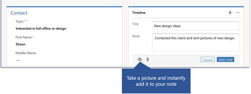

### Scan barcodes  
Rather than manually typing a barcode number into a field, you can scan barcodes by using your device's camera. Tap the icon to the right of the field to start the scanner. This makes it easy to capture info about inventory and other issues when you're out in the field. You'll need to ask your admin to set this feature up for you.  

## Send an email or make a call
Call or send email to your customers easily from the mobile apps. Tap any phone number in a record to start a call, or tap the email button to send an email.

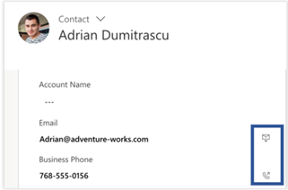

In the [!INCLUDE[pn_dyn-365_tablets](../includes/pn-dyn-365-tablets.md)] app, tapping the phone button starts a Skype call. In [!INCLUDE[pn_dyn-365_phones](../includes/pn-dyn-365-phones.md)], it starts a phone call.

When you’re finished with your call, the app prompts you to enter details about
the call.
 
## Work offline 
Seamless work offline with mobile offline synchronization. You can work with mobile app in offline mode when the device is disconnected from the internet. The app provides a rich offline experience which lets you to work with basic commands like create, read, update, and delete and business processes - so you always stay productive. Once you're back online, changes you've made are synchronized with [!INCLUDE[pn_crm_shortest](../includes/pn-crm-shortest.md)]. 

When you're admin has enabled mobile offline, the next time that you access the mobile app, you will be prompted to download updates. Once you download the updates, you can start using the mobile app in offline mode.

1. When you see the **Offline Updates Available** dialog box, choose **Update**. 

  
  
2. You'll see a progress indicator while the updates are being downloaded. When the download load is complete, it's a good idea to verify offline mode is available.

    

**See if offline mode is available**

When the updates have download, you can check to see if mobile offline is available.

1. From the nav bar, tap  and then tap, **Offline Status**.
  
      

2. **Offline Status**, tracks offline status of the whole app, and also the status of each entity individually. When the status shows as  **Available**, it indicates offline is available and data has synced successfully.

 > [!NOTE] 
 > The status here can be **Not Available** due to an error or if you missed downlading offline updates. If the status is **Not Available** due to missing the latest offline updates, then try downloading the updates again.
 
 - **Entity Status**, provides the offline status of each entity individually. For the available entities you can also track the last time the entity synced.
 
    
 
 You can also track offline status of entities from the **Menu**  button.

-  Green Wi-Fi icon next to the entity name indicates that it is available in offline mode.
-  Red Wi-Fi icon indicates that this entity is enabled for offline but is not available to work in offline mode due to an error or missing updates.
-  No Wi-Fi icon indicates that your admin has not enabled the entity to use in offline mode.

   
  
**Background sync**

Background sync is enabled even when the app is minimized so long as a network connection is detected. But when the app is in the background, metadata changes will not be accepted automatically. 

Other things to keep in mind about background sync: 
  
-   Sync will run until you  sign in to the mobile app.    
  
-   While the app is running in the background, sync is automatically disabled when a network is disabled.  
  
-   When you bring the app to the  foreground, regular sync is detected and enabled.  
  
-   Background sync is disabled when the device is locked and enabled when the device is unlocked.  
  
-   While the app is running in the background,  metadata changes will not be accepted automatically. The mobile app will stop the background sync.  
  
-   When you bring the app to the  foreground, you are prompted to accept the metadata changes.  
  
-   While the app is running in the foreground, after metadata is updated, the app will switch to regular sync.  
  
 Background sync will be disabled if:  
  
-   Your user token expires in the background.  
  
-   The application closes for some reason.  
  
-   Your device locks.  
  
 Background sync is available on all supported devices. See [support for Dynamics 365 for phones and Dynamics 365 for tablets](../mobile-app/support-phones-tablets.md).  
 
**Sync conflict resolution** 

If multiple entries are made in the same field by offline users (for example, two or more “close by” dates), the conflict is clearly marked and you can choose the correct entry.  
  
If a record has changed on the server between the time your device retrieved the record and when it tries to update or delete that record,   you'll see an exclamation mark   ("!”) by the relevant field, and will need to resubmit your  updated changes.
 
## Reconfigure the app

If you used the mobile app on a phone or tablet temporarily and want to remove all you cache data before giving to device to someone else, you need reconfigure the app.

Reconfiguring deletes all data and metadata from the cache, though you shouldn't rely on this as a security measure.

If you sign out of one organization and sign in to another, and then use the **Reconfigure** option on the organization you signed in to, your metadata will still remain for the organization you signed out of. To remove your metadata from the organization you signed out of, you’ll need to sign in to it and use the **Reconfigure** option there, as well.

Here's how to do it:

1.  Tap .

2.  Tap **User Information**.

3.  Tap **Reconfigure**. 

## Privacy notices  
[!INCLUDE[cc_privacy_crm_for_tablets](../includes/cc-privacy-crm-for-tablets.md)]
  
<!-- [!INCLUDE[cc_privacy_crm_cortana](../includes/cc-privacy-crm-cortana.md)] -->
  
[!INCLUDE[cc_privacy_moca_user_content_and_location](../includes/cc-privacy-moca-user-content-and-location.md)]

### See Also  
 [What's supported](support-phones-tablets.md)  
 [Troubleshooting](troubleshooting-things-know-about-phones-tablets.md)   
