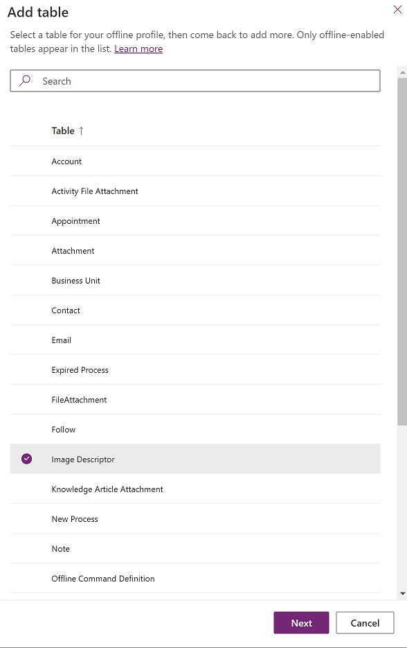

# Configure mobile offline profiles for images and files 

To work with file and images columns in offline mode, you need to add additional tables and relationships.

Follow the steps in this topic, for a mobile offline profile that has a table with a column where **Date type** is set to a file or image.

## View column properties for file or image 

1. Sign in to [Power Apps](https://make.powerapps.com).

2. On the left nav select **Data** to expand it and then select **Tables**.  

   > [!div class="mx-imgBorder"]
   >
  
  
3. Select the **Display name** of a column where **Date type** is set to a file or image.

4. The column properties show the **Date type**. Expand **Advanced options** to view the maximum size for a file or image.

   > [!div class="mx-imgBorder"]
   >

## Add image columns to mobile offline 

It is required to add both the **Image Descriptor** and **FileAttachment** tables to your mobile offline profile to make images, columns where **Data type** is **Image**, available in offline mode..

1. Go to Power Platform Admin center, [https://admin.powerplatform.microsoft.com](https://admin.powerplatform.microsoft.com) and sign-in as an admin.

2. On the right, select **Environments**.

   > [!div class="mx-imgBorder"]
   >
 
3. Choose an environment and then select **Settings**.

   > [!div class="mx-imgBorder"]
   >
 
4. Expand **Users + permissions**,  and then select **Mobile configuration**.

   > [!div class="mx-imgBorder"]
   >

5. Select a mobile offline profile to edit it.

6. In **Data available offline** select **Add table**.

7. Select **Image Descriptor** and then select **Next**.

   > [!div class="mx-imgBorder"]
    >

8. Under **Choose the records that you want to make available offline**, select **Related records only**.
9. Expand **Relationships**, for each table with a column to be downloaded, select **Column name**.

   > [!div class="mx-imgBorder"]
    >
  
10. Select **Save**.
11. In **Data available offline** select **Add table** > **FileAttachment** > **Next**. 
12. Expand **Relationships** and select **Image Descriptor, Column name: FileId**.
    
    > ![Note] Don't select **Image Descriptor, Column name: Regarding**.

    > [!div class="mx-imgBorder"]
    > 

10. Select **Save**.

## Add file columns to mobile offline 

Add all tables to your mobile offline profile where the column type is a file. For any tables that have a file column, add the **FileAttachment** table to make file available in offline mode.

1. Go to Power Platform Admin center, [https://admin.powerplatform.microsoft.com](https://admin.powerplatform.microsoft.com) and sign-in as an admin.

2. On the right, select **Environments**.

   > [!div class="mx-imgBorder"]
   >
 
3. Choose an environment and then select **Settings**.

   > [!div class="mx-imgBorder"]
   >
 
4. Expand **Users + permissions**,  and then select **Mobile configuration**.

   > [!div class="mx-imgBorder"]
   >

5. Select a mobile offline profile to edit it.

6. In the **Data available offline** select **Add table**.

7. Select **FileAttachment**  and then select **Next**.

   > [!div class="mx-imgBorder"]
    >

8. Under **Choose the records that you want to make available offline**, select **Related records only**.
9. Expand **Relationships** and select applicable **Columns names** i.e., columns for each table where **Data type** is **Image**.

   > ![Note] Don't select **Column name: Regarding.**.

    > [!div class="mx-imgBorder"]
    >
   

 11. Select **Save**. 
  
  
  
## Offline status of files and images

You can use the **[Offline Status](work-in-offline-mode.md#see-whether-offline-mode-is-available)** page to see the number of files and images to be downloaded and the current progress.

- The number of images is listed for the **Image Descriptor** table.
- The number of files are listed for each table with file attachments as shown for **DemoTable2** table.

  > [!div class="mx-imgBorder"]
  >
