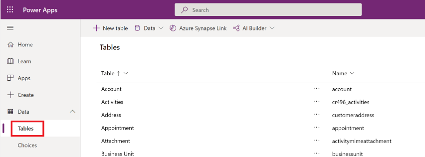
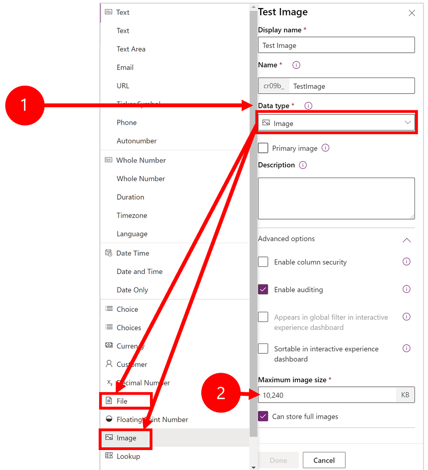
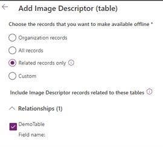
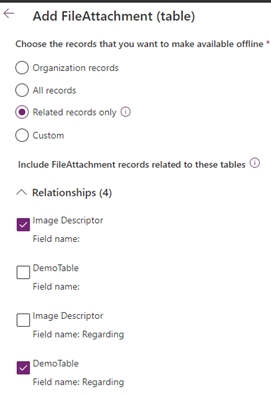

# Configure mobile offline profiles for files and images

To work with file and images tables in offline mode, you need to add additional tables and relationships.

Follow the steps in this topic, for a mobile offline profile that has a table with a column where **Date type** is set to a file or image.

## View column properties for file or image 

1. Sign in to [Power Apps](https://make.powerapps.com).

2. On the left nav select **Data** to expand it and then select **Tables**.  

   > [!div class="mx-imgBorder"]
   >
  
  
3. Select the **Display name** of a column where **Date type** is set to an file or image.

4. The column properties show the **Date type** andexpand **Advanced options** to view the maximum size for a file or image.

   > [!div class="mx-imgBorder"]
   >

## Add image columns to mobile offline 

Add all tables to your mobile offline profile where the column type is a file or image. For any tables that has an image column, add the **Image Descriptor** table to make images available offline.

1. Go to Power Platform Admin center, [https://admin.powerplatform.microsoft.com](https://admin.powerplatform.microsoft.com) and sign-in as an admin.

2. On the right, select **Environments**.

   > [!div class="mx-imgBorder"]
   >
 
3. Choose an environment and then select **Settings**.

   > [!div class="mx-imgBorder"]
   >
 
4. Expand **Users + permissions**,  and then select **Mobile configuration**.

   > [!div class="mx-imgBorder"]
   >

5. Select a mobile offline profile to edit it.

6. In the **Data available offline** select **Add table**.

7. To make images available in offline mode, select **Image Descriptor**  and select **Next**.

8. Under **Choose the records that you want to make available offline**, select **Related records only**.
9. Expand **Relationships** and select **Field name**. 

   > [!div class="mx-imgBorder"]
    >

3.	Select Related records only.
4.	Under Relationships:
a.	For each table with image columns, select Field name: under Relationships.
5.	Add the **FileAttachment table**. This is required to make images and files available offline:

    > [!div class="mx-imgBorder"]
    >
    
6.	Select Related records only.
7.	Follow these steps, Under Relationships
  .	Select Image Descriptor, Field name:.
Do not select Image Descriptor, Field name: Regarding.
  b.	For each table with image and/or file columns to be downloaded, select Field name: Regarding. 
  
  
  
