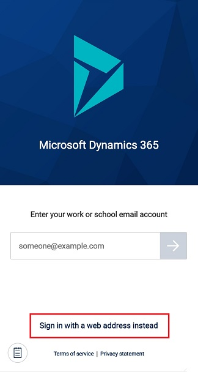
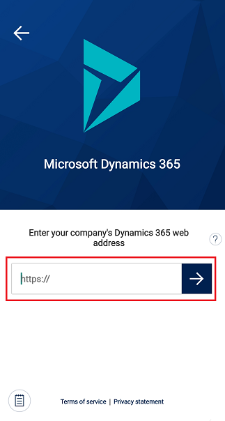
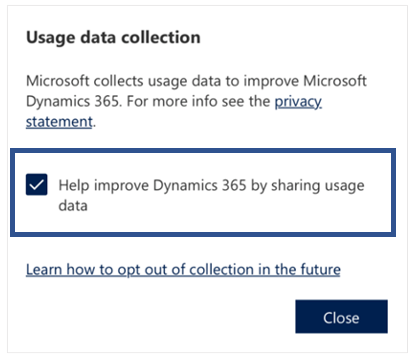

# How to opt out of data collection on Dynamics 365 phones and tables
 
At Microsoft, we work hard to protect your privacy while delivering products that bring you the performance, power, and convenience you want. Microsoft collects certain information about your usage of Dynamics 365 for phones to help diagnose problems and improve the product. For more details about Microsoft’s privacy practices, please review the [Microsoft Privacy Statement](https://go.microsoft.com/fwlink/p/?LinkId=123161). It applies to the data we collect from your use of Dynamics 365 for phones. 

To opt out of data collection, you will need to sign out and then sign back in using your web address. This is the same web address you use when you sign in on the web browser.
 
1. Depending on which screen you're one, do one of the following to sign out of the mobile app:

   - If your signed in and using an app, select the site map , select the profile icon , then **Sign out**.
   
   - If you're on the apps screen, select the gear icon  and then **Sign out**.

2. On the sign-in screen, select **Sign in with a web address instead**.

   > [!div class="mx-imgBorder"]
   > 

3. Enter the web address and then selct the arrow button or select the enter key on your keyboard.

   > [!div class="mx-imgBorder"]
   > 
   
4. In the **Usage data collection** dialog box, clear the **Help improve Dynamics 365 by sharing usage data** check box and then select **Close**.

   > [!div class="mx-imgBorder"]
   > . 
   
  
   

