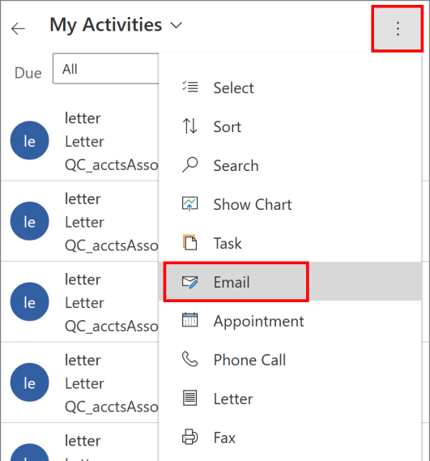
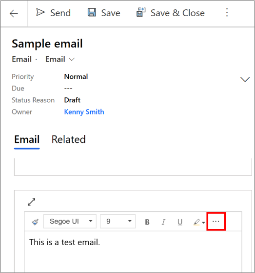
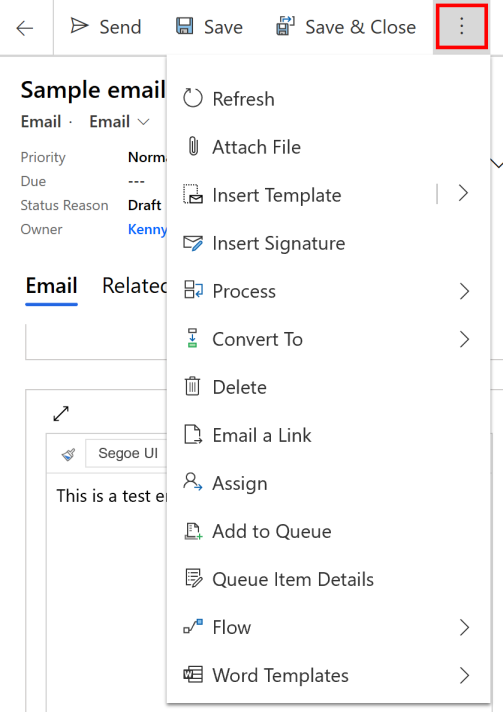

# Preview: Send email using the Dynamics 365 for phones and tablets app

[!INCLUDE [cc-beta-prerelease-disclaimer](../includes/cc-beta-prerelease-disclaimer.md)]

Until now, you could only read emails using the Dynamics 365 for phones and tablets app. With the early access release of the enhanced email experience in the Dynamics 365 for phones and tablets app, you can compose an email within the app with the following capabilities:
- Full email editor formatting supported as available in the Unified Interface apps.
- Search for and apply a predefined template to an email.
- Add attachments to an email

> [!NOTE]
> This feature isn't available for mobile offline.

## How to enable this feature?

Your administrator has to opt in to early access updates for your environment and then install the updates to get this feature. More information: [Opt in to early access updates](https://docs.microsoft.com/power-platform/admin/opt-in-early-access-updates)
 
## Use the feature

1. You can create emails from home page grid or by using quick create. 

    1. **Home page grid**: On the home page, select Activities, select the **More** button  > **Email**.
    
       > [!div class="mx-imgBorder"]
       > 

    1. **Quick create**: On the command bar, select the **More** button  > **Quick Create Menu** > **Activities** > **Email**. 

2. Fill in the subject of the email and use the space provided to write the email. You can select the more option (**...**) to expand the full formatting capabilities for your email body. Select **Save** to save your changes.

   > [!div class="mx-imgBorder"]
   > 
   
3. To add an attachment to the email, select the **More** button  and select **Attach File** and then select the file that you want to attach to the email.

   > [!div class="mx-imgBorder"]
   > 
   
4. To use a template for the email body, select the **More** button  and select **Insert Template**. Select or search a template from the available templates, and select **Apply template**. 
   
5. When you're ready to send the email, select **Send**.

