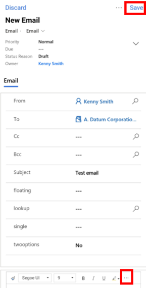

# Send email using the Dynamics 365 for phones and tablets app

Use the Dynamics 365 for phones and tablets app to compose an email within the app with the following capabilities:

- Full email editor formatting supported as available in the Unified Interface apps.
- Add attachments to an email.
- Search for and apply a predefined template to an email. 

> [!NOTE]
> - This feature isn't available for mobile offline.

 
## Use the feature

1. You can create emails from home page grid or by using quick create. 

    1. **Home page grid**: On the home page, select the site map button in the the top-left corner > **Activities**, and then select the **More** button > **Email**.
    
       > [!div class="mx-imgBorder"]
       > 

    1. **Quick create**: On the command bar, select **+** > **Activities** > **Email**. 

       > [!div class="mx-imgBorder"]
       > 

2. Fill in the subject of the email and use the space provided to write the email. You can select the more option (**...**) in the body area of the email to expand the full formatting capabilities for your email. Select **Save** to save your changes.

   > [!div class="mx-imgBorder"]
   > 
   
3. To add an attachment to the email, select the **More** button > **Attach File**, and then select the file that you want to attach to the email.

   > [!div class="mx-imgBorder"]
   > 
   
4. To use a template for the email body, select the **More** button > **Insert Template**. Select or search a template from the available templates, and select **Apply template**. 
   
5. When you're ready to send the email, select the **More** button > **Send**.

