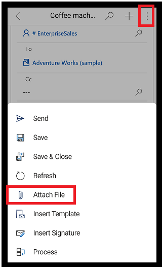

# Preview: Send email using the Dynamics 365 for phones and tablets app

[!INCLUDE [cc-beta-prerelease-disclaimer](../includes/cc-beta-prerelease-disclaimer.md)]

Create and send an email using the Dynamics 365 for phones and tablets app.

1. On the command bar, select **plus sign**  > **Activities** > **Email**. 

2. Fill in the subject of the email and use the space provided to write the email and then select **Save**.

   > [!div class="mx-imgBorder"]
   > 
   
3. To add an attachment to the email, select the **More** button  > **Attach File** and then select the file that you want to attach to the email.

   > [!div class="mx-imgBorder"]
   > 
   
4. To use a template for the email body, select the **More** button  > **Insert Template**, and then select the template. 
   
5.  When you're ready to send the email, select the **More** button  and then select **Send**.    

