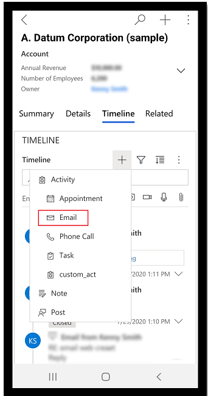

# Preview: Send email using the Dynamics 365 for phones and tablets app

[!INCLUDE [cc-beta-prerelease-disclaimer](../includes/cc-beta-prerelease-disclaimer.md)]

Create and send an email using the Dynamics 365 for phones and tablets app.

## Create a new email using the + option on the command bar

1. On the commbar, select **plus sign**  and then select **Email**. 

## Open a record and create a new email  

1. Open the record that you want to add the activity to. 
  
2. Select the **Timeline** tab.

3. Select the **plus sign**  and then select **Email**. 

> [!div class="mx-imgBorder"]
> 

3. Fill in the subject of the email and use the space provided to write the email.
  
4. To add an attachment to the email, save the email. Then, on the command bar select **Attach File** > **Choose File** and then select the file that you want to attach to the email.

   > [!NOTE]
   > An email with an attached image will be shown inline with the body of the email.
  
5. To use a template for the email body, on the command bar, select **Insert Template**, and then select the template. For more information on inserting an email template, see [Insert an email template](insert-email-template.md). 
  
6. When you're done composing in the email, on the command bar select **Send**. 
