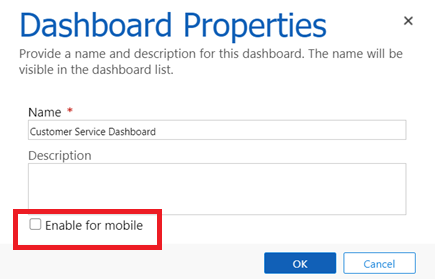
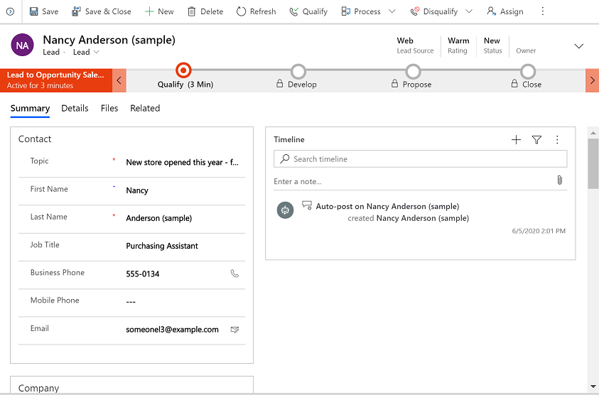
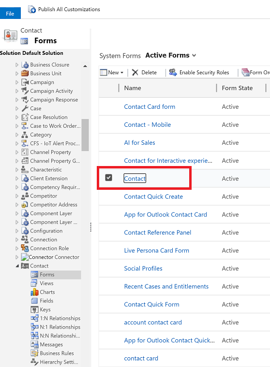
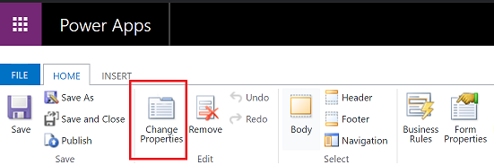
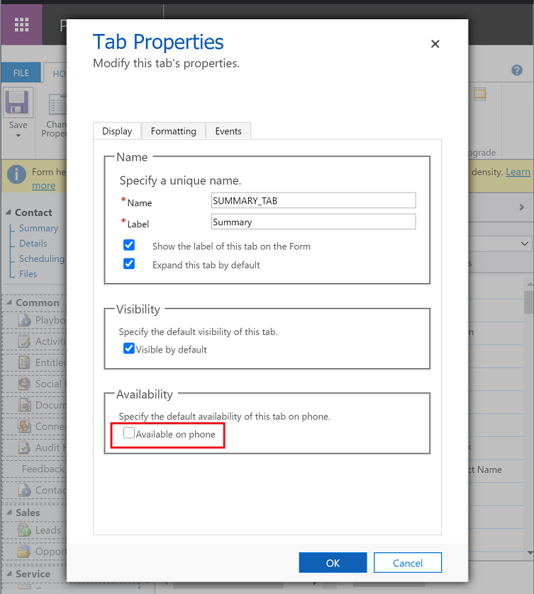
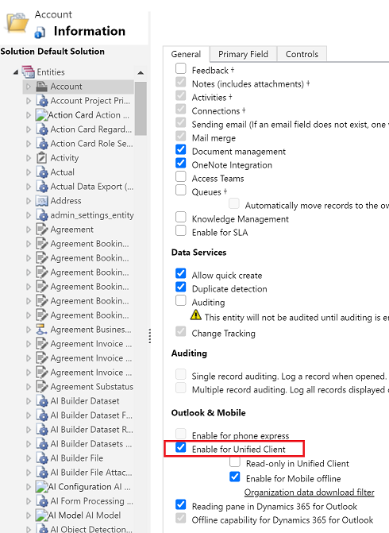

# Setup overview for mobile apps

Your users can access their data stored in Microsoft Dataverse or Dynamics 365 Customer Engagement (on-premises) while they're out in the field by using either of the following apps:  
  
- **[!INCLUDE[pn_Mobile_Express_short](../includes/pn-mobile-express-short.md)]**: With [!INCLUDE[pn_Mobile_Express_short](../includes/pn-mobile-express-short.md)], you can design your information architecture once and the customizations will automatically flow to all form factors. Much is shared with [!INCLUDE[pn_moca_short](../includes/pn-moca-short.md)].  
  
  
- **[!INCLUDE[pn_moca_short](../includes/pn-moca-short.md)]**: With the same basic features as [!INCLUDE[pn_Mobile_Express_short](../includes/pn-mobile-express-short.md)], tablet users will appreciate the experience optimized for a larger screen.  
    
  
## Requirements  
 For hardware and software requirements for [!INCLUDE[pn_Mobile_Express_short](../includes/pn-mobile-express-short.md)] and [!INCLUDE[pn_moca_short](../includes/pn-moca-short.md)], see [Support for Dynamics 365 for phones and Dynamics 365 for tablets](support-phones-tablets.md).  
  
### Required privileges  

Both Microsoft Dataverse and Dynamics 365 Customer Engagement (on-premises) uses security privileges to provide access to Dynamics 365 for phones and tablets app and [Power Apps mobile](https://docs.microsoft.com/powerapps/mobile/run-powerapps-on-mobile). The privilege is pre-configured for Sales roles, but not other security roles, so you may want to add to other roles for your teams.
 
 The app should be shared for the security role that user has been assigned.
  
 Follow these steps to check and assign the security privilege for a security role:  
  
1. [!INCLUDE[proc_settings_security](../includes/proc-settings-security.md)]  
  
2. Select **Security Roles**.  
  
3. Select a security role > **Business Management** tab.  
  
4. In the **Privacy Related Privileges** section, verify that **Dynamics 365 for mobile** is set to **Organization**. If not, select **Dynamics 365 for mobile**.  
  
5. Select **Save and Close** to save the changes to the security role.  
  
6. Send an email to mobile-enabled users to let them know they can download the mobile app from the app store. Include the organization URL and sign-in information in the email.  
  
This applies to new installations of Microsoft Dataverse or Dynamics 365 Customer Engagement (on-premises). You can add or remove this privilege from custom or default security roles to meet your business needs. Users who do not have this privilege will see and see an empty app list or the following error: **Contact your administrator for access your organization’s mobile apps**  
> 
> [!NOTE]
> Both Microsoft Dataverse and Dynamics 365 Customer Engagement (on-premises) include the ability to audit user access. Audit events are logged if a user accesses your Dynamics 365 apps organization through the Dynamics 365 mobile app. However, there is not a new event type that indicates the access was through the mobile app. The audit login events would appear as **User Access via Web**.  
  
### Required privileges for custom security roles

In addition, particularly if you have created a custom security role, validate that these entities have **Read** permission.  
  
1. [!INCLUDE[proc_settings_security](../includes/proc-settings-security.md)]  
  
2. Select **Security Roles**.  
  
3. Choose a security role > **Customization** tab. Verify that the **Read** permission is set for the following entities:   
  
   -   System Application Metadata  
  
   -   System Form  
  
   -   User Application Metadata  
 
   -   View  
 
   -   Model-driven App

4. Choose a security role > **Business Management** tab. Verify that the **Read** permission is set for the following entity:

   -   User Settings

5. Select **Save and Close** to save the changes to the security role.

### Required services
This list identifies all services to which Dynamics 365 for Phones and Tablets talks and their usages. Your network must **not** block these services.

| Domain(s) | Protocols | Uses |
| --- | --- | --- |
| management.azure.com |https |Between versions 4.3.19022.10 and 4.3.19081.22 (Android) or 13.19022.10 and 13.19081.22 (iOS), used to fetch the list of apps to populate the app list. |
| api.businessappdiscovery.microsoft.com |https |Between versions 4.3.19091.0 and 4.3.20081.1 (Android) or 13.19091.0 and 13.20081.1 (iOS), used to fetch the list of apps to populate the app list. |
| api.powerapps.com |https |Starting with version 4.3.20081.2 (Android) and 13.20081.2 (iOS), used to fetch the list of apps to populate the app list. |
| login.microsoft.com   login.windows.net   login.microsoftonline.com   secure.aadcdn.microsoftonline-p.com |https |Azure Active Directory - used for authentication (in all versions).
  
This list identifies all resources used by Dynamics 365 for phones and tablets. Your configuration (for example, Azure Active Directory or Intune) must not block these resources.

| Resources(s) | Uses |
| --- | --- |
| service.powerapps.com |Starting with version 13.19091.20, used for email sign-in and the app list. |

### Security privileges  
 Both Microsoft Dataverse and Dynamics 365 Customer Engagement (on-premises) use a security privilege, **Dynamics 365 apps for mobile**, to provides access to [!INCLUDE[pn_Mobile_Express_short](../includes/pn-mobile-express-short.md)] and [!INCLUDE[pn_moca_short](../includes/pn-moca-short.md)]. This privilege is pre-configured for Sales roles, but not other security roles, so you may want to add to other roles for your teams. For more information on how to share apps in Microsoft Dataverse, see [Share a model-driven app using Power Apps](https://docs.microsoft.com/powerapps/maker/model-driven-apps/share-model-driven-app).
  
  
   
## Configure customer engagement apps in Dynamics 365  

 You must configure apps that will be available for Dynamics 365 for phones and tablets mobile app.  

 - For Microsoft Dataverse, see [Create a custom entity](https://docs.microsoft.com/powerapps/maker/common-data-service/data-platform-create-entity).
 - For Dynamics 365 Customer Engagement (on-premises), see [App making and customization overview](https://docs.microsoft.com/dynamics365/customerengagement/on-premises/customize/overview) 
  
### Charts  
 All the charts you can create in the Chart Designer, such as Bar, Line, Pie, and Funnel charts, are viewable in [!INCLUDE[pn_Mobile_Express_short](../includes/pn-mobile-express-short.md)] and [!INCLUDE[pn_moca_short](../includes/pn-moca-short.md)].  
  
 Some more things to note:  
  
- Open a chart from the Sales Dashboard to get a page with a chart and the records used to generate the chart.  
  
- Choose the chart sections to see the records filtered for that part of the chart.  
  
- Charts are not available offline in the Dynamics 365 mobile app.  
  
- You can add charts to dashboards and chart pages only. 

### Dashboards
The mobile app has multiple dashboards are available for users. After you set up standard or custom dashboards for mobile access, users can easily modify which dashboards appear and how they appear on their phones or tablets.  
  
1. [!INCLUDE[proc_settings_customization](../includes/proc-settings-customization.md)]  
  
2. Select **Customize the System**.  
  
3. Under Components, select **Dashboards**.  
  
4. Double-click or press and hold the dashboard you want to enable for phone or tablet access.  
  
5. Select **Properties** > **Enable for mobile** > **OK**.  

   > [!div class="mx-imgBorder"] 
   > .

 
6. Select **Save**.  
  
   Show your users how to set and view the enabled dashboards on their phones or tablets. More information: [User Guide for Dynamics 365 for phones and tablets](dynamics-365-phones-tablets-users-guide.md)  
  
You can assign security roles to a dashboard, so the dashboard appears only to users with certain security roles. For example, to set who has access to the Sales Dashboard.

1. Select **Settings** > **Customizations** > **Customize the System** > **Components** > **Dashboards**.
2. Select the **Sales Dashboard**, and then select **Enable Security Roles**.  
  
### Forms  
 Forms in the Dynamics 365 mobile app are based on the development principle of *Design once and deploy across clients*.
 

  
 Forms in the Dynamics 365 mobile app use the Main form type. The main form is used by all model-driven apps. This form provides a consistent user experience whether someone is using a web browser or the Dynamics 365 mobile app.
  
 To further simplify forms, you can hide components from appearing in the phone app. You can hide tabs, sections, subgrids, fields, and charts. For example, to hide the Details tab in the Contact form.
 
1. Select **Settings** > **Customizations** > **Customize the System** > **Components**.
2. Expand **Entities** > expand the **Contact** entity > **Forms** and then select the **Contact** form.

   > [!div class="mx-imgBorder"] 
   > 

3. Select **Change Properties**.

   > [!div class="mx-imgBorder"] 
   > 

4. Clear the **Available on phone** check box to hide the Detail tab from appearing on the Contact form for phone users.  

   > [!div class="mx-imgBorder"] 
   > 
  
  
   
## Enable entities for the mobile app

 You can enable a limited set of entities for the mobile app. To see if an entity is enabled or to enable an entity.
 
1. Go to **Settings** > **Customizations** > **Customize the System**. 
2. Expand **Entities** in the left pane.  
3. Select the entity you want to enable for mobile app (for example, **Account**).  
  
4. Under **Outlook & Mobile**, select **Enable for Unified Client**. 
 
   > [!div class="mx-imgBorder"] 
   > .

Things to note:  
  
- All custom entities can be enabled for [!INCLUDE[pn_Mobile_Express_short](../includes/pn-mobile-express-short.md)] and [!INCLUDE[pn_moca_short](../includes/pn-moca-short.md)].  
  
- You can use the Lookup for entities that are not enabled for [!INCLUDE[pn_Mobile_Express_short](../includes/pn-mobile-express-short.md)] and [!INCLUDE[pn_moca_short](../includes/pn-moca-short.md)] from a record that is enabled and see the data. However, you won’t be able to edit the entity.  
  
  **Entities that are visible and read/write in the mobile app**  
  
|Entity Name| Visibility Property| Read-only Property|  
|-----------------|-------------------------------------------------------------------------------------------------------------------------------------------------------------------|-------------------------------------------------------------------------------------------------------------------------------------------------------------------|  
|Account|Modifiable|Modifiable|  
|Activity|Not modifiable|Not modifiable|  
|Appointment|Modifiable|Modifiable|  
|Case|Modifiable|Modifiable|  
|Competitor|Modifiable|Modifiable|  
|Connection|Not modifiable|Modifiable|  
|Contact|Modifiable|Modifiable|  
|Invoice|Modifiable|Modifiable|  
|Lead|Modifiable|Modifiable|  
|Note|Not modifiable|Not modifiable|  
|Opportunity|Modifiable|Modifiable|  
|Order|Modifiable|Modifiable|  
|Phone Call|Modifiable|Modifiable|  
|Quote|Modifiable|Modifiable|  
|Social Activity|Modifiable|Modifiable|  
|Social Profile|Modifiable|Modifiable|  
|Task|Modifiable|Modifiable|  
  
 **Entities that are visible and read-only in the mobile app**  
  
|Entity Name| Visibility Property| Read-only Property|  
|-----------------|-------------------------------------------------------------------------------------------------------------------------------------------------------------------|-------------------------------------------------------------------------------------------------------------------------------------------------------------------|  
|Attachment|Not modifiable|Not modifiable|  
|Email|Modifiable|Not modifiable|  
|Entitlement|Not modifiable|Not modifiable|  
|Knowledge Article|Modifiable|Not modifiable|  
|Price List|Not modifiable|Not modifiable|  
|Product|Modifiable|Not modifiable|  
|Queue|Modifiable|Not modifiable|  
|Sharepoint Document|Not modifiable|Not modifiable|  
|SLA KPI Instance|Not modifiable|Modifiable|  
|Team|Not modifiable|Not modifiable|  
|User|Not modifiable|Not modifiable|  
|Web Resource|Not modifiable|Not modifiable|  
  
   
## Authentication 

 [!INCLUDE[pn_Mobile_Express_short](../includes/pn-mobile-express-short.md)] and [!INCLUDE[pn_moca_short](../includes/pn-moca-short.md)] authenticate users with browser-based authentication, which means no credentials are stored on the phone.  
    
   
## Best practices for securing app data on the mobile app
 Consider the following when planning security for [!INCLUDE[pn_moca_short](../includes/pn-moca-short.md)]:  
  
- **Data transmission**. [!INCLUDE[pn_moca_short](../includes/pn-moca-short.md)] requires an [!INCLUDE[pn_Internet_facing_deployment](../includes/pn-internet-facing-deployment.md)], so when your organization’s mobile devices synchronize Dynamics 365 apps data with your Microsoft Dataverse environment or Dynamics 365 Customer Engagement (on-premises) organization, the data is encrypted with [!INCLUDE[pn_Secure_Sockets_Layer](../includes/pn-secure-sockets-layer.md)].  
  
- **Cached data**. [!INCLUDE[pn_Mobile_Express_short](../includes/pn-mobile-express-short.md)] and [!INCLUDE[pn_moca_short](../includes/pn-moca-short.md)] only cache records and lists that you’ve recently accessed in the app. To clear cached data, users can either sign out or reconfigure.

- **Encrypting cached data**. By default, data are not encrypted but can be encrypted through several mechanisms:

  - You can use Intune's MDM capabilities to enforce device wide encryption. 
  - The mobile application also implements and enforces Intune's application policies. This allows you to encrypt data at the application level.  
  - You can use BitLocker to encrypt the entire hard drive on a Windows 8 or later device.

## Other features

### Save
 Records are saved in [!INCLUDE[pn_moca_short](../includes/pn-moca-short.md)] based on how you configured autosave in your organization settings. 
 
1. To view your save settings, select **Settings** > **Administration** > **System Settings**.
2. On the **General** tab and view the settings under **Select the default save option for forms**.

 If autosave is:

-   Enabled for the organization, changes to forms are saved when users leave forms.

-   Disabled for the organization, users must use the command bar and select **Save** to save form changes.

### Images
 The mobile app honors the server's caching policies and won't store the content locally unless it's permitted to do so by the server.
 

## Privacy notice
 [!INCLUDE[cc_privacy_crm_for_tablets](../includes/cc-privacy-crm-for-tablets.md)]

### See Also
 [Secure and manage Dynamics 365 for phones and tablets](secure-manage-phones-tablets.md)  
 [What's supported](support-phones-tablets.md)  
 [Troubleshooting](troubleshooting-things-know-about-phones-tablets.md)  
 [Install Dynamics 365 for tablets and phones](dynamics-365-phones-tablets-users-guide.md)  
 [Dynamics 365 for phones and tablets User's Guide](dynamics-365-phones-tablets-users-guide.md)

