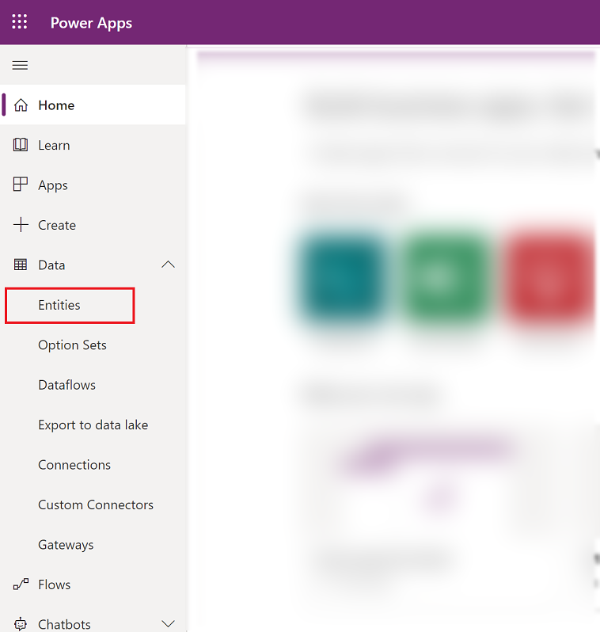
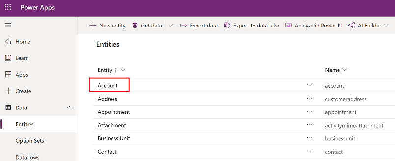
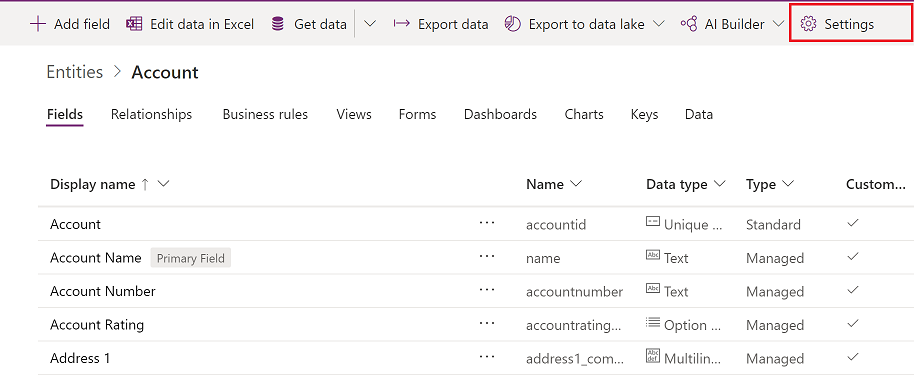
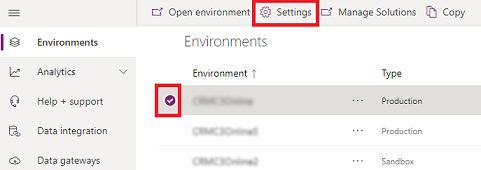
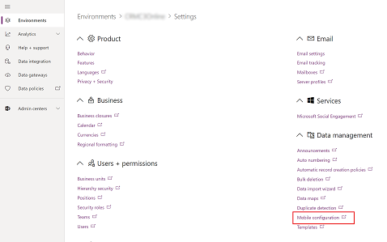
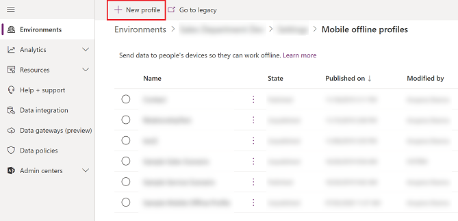
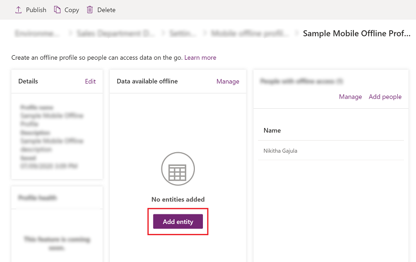
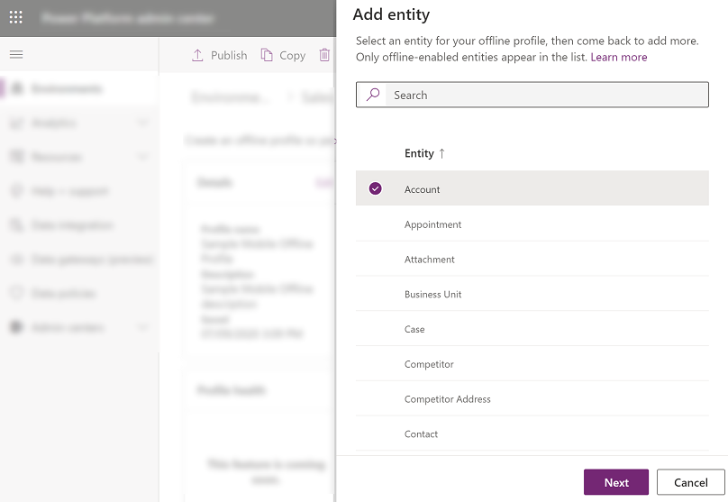
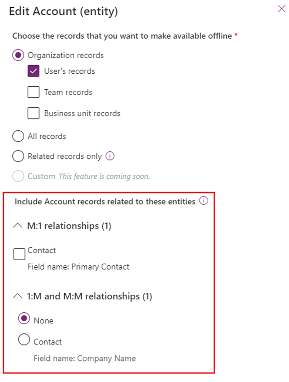
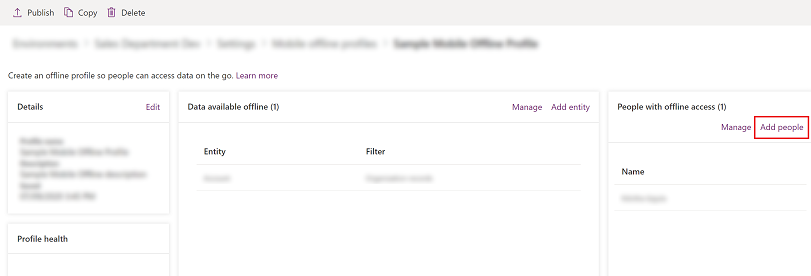

# Configure mobile offline synchronization for your mobile app

Set up mobile offline synchronization to allow users to work in offline mode on their mobile device. Mobile offline allows your users to use the mobile app in offline mode to interact with their data, even when they are not connected to the internet. 

The mobile app provides a rich offline experience and helps you to stay productive. You can use basic commands such as create, read, update, and delete when you are offline. Once you are back online, the changes you made on the mobile app are automatically synchronized with Microsoft Dataverse.

To allows users to use this feature, an administrator will need to set up mobile offline for their organization as outlined below.
  
This offline experience uses [!INCLUDE[pn_Windows_Azure](../includes/pn-windows-azure.md)] services to periodically synchronize entities with the mobile app so synchronized records are available when users’ mobile devices are disconnected. 

> [!IMPORTANT]
> The set-up and configuration process for mobile offline is the same for [Power Apps mobile](https://docs.microsoft.com/powerapps/mobile/run-powerapps-on-mobile) and Dynamics 365 for phones and tablets app. To enable mobile offline synchronization for Power Apps mobile or Dynamics 365 mobile, follow the steps in this toipc.

## Install the mobile app

Mobile offline is available for iOS and Android devices. To use the mobile offline feature, download the latest version of the mobile app from the app store. 

### Install Dynamics 365 phones and table app (for customer engagement apps in Dynamics 365)

For customer engagement apps in Dynamics 365 (Dynamics 365 Sales, Dynamics 365 Customer Service, and Dynamics 365 Marketing) install the [install the Dynamics 365 phones and table app](https://docs.microsoft.com/dynamics365/mobile-app/install-dynamics-365-for-phones-and-tablets#install-the-app-from-your-devices-app-store).

These are the supported devices to use mobile offline:

- For iOS, version 13.19043.32 or later is supported.
- for Android, version 4.3.19043.33 or later supported.

> [!NOTE]
> - The offline feature isn't supported for Dynamics 365 Customer Engagement (on-premises). 

### Install Power Apps mobile app (for Power Apps)

For model-drvien app and canvas apps [Install the Power Apps mobile app](https://docs.microsoft.com/powerapps/mobile/run-powerapps-on-mobile#install-the-power-apps-mobile-app).

For information on supported devices for Power Apps mobile app, see [Supported devices](https://docs.microsoft.com/powerapps/mobile/run-powerapps-on-mobile#supported-devices).

## Step 1: Enable entities for mobile offline synchronization 
 
One of the first things you need to do is enable entities that will be available to mobile users when they're using the mobile app in offline mode. You can disable or enable any of the supported entities for offline mode.

To enable an entity for mobile offline synchronization, follow the steps below.

1. Sign in to [Power Apps](https://make.powerapps.com).

  
2. On the left nav select **Data** to expand it and then select **Entities**.  

   > [!div class="mx-imgBorder"]
   >
   
  
3. Select the entity you want to enable for mobile offline (for example, **Account**).  

   > [!div class="mx-imgBorder"]
   >
 

4. On the command bar, select **Settings**. 

   > [!div class="mx-imgBorder"]
   >
 
  
5. On the **Edit entity** pane, expand **More settings** > **Offline** and then make sure **Enable for mobile offline** check box is selected and then select **Done**.

   > [!div class="mx-imgBorder"]
   >

   > [!NOTE]
   > Keep in mind that the amount of data you make available to users while they’re offline can affect data sync times, device performance, and can affect the data usage rates  for devices on cellular network. The amount of data that gets downloaded to the device depends on: 
   > -   The number of entities you enable for mobile offline.  
   > -   The filters you set while creating mobile offline profiles.  
 
## Step 2: Create a mobile offline profile to determine what data will be available while offline
 
Create a mobile offline profile to enable users for offline and configure filters that will determine how much data will be available to the user when they work in offline mode. 

To create a profile follow the steps below.
  
1. Go to Power Platform Admin center, [https://admin.powerplatform.microsoft.com](https://admin.powerplatform.microsoft.com) and sign-in as an admin.

2. On the right, select **Environments**.

   > [!div class="mx-imgBorder"]
   >
 
3. Choose an environment and then select **Settings**.

   > [!div class="mx-imgBorder"]
   >
 
4. Expand **Users + permissions**,  and then select **Mobile configuration**.

   > [!div class="mx-imgBorder"]
   >
  
5. Select **New Profiles** to create a new mobile offline profile. If you already have a profile that you want to edit, select it from the list.

   > [!div class="mx-imgBorder"]
   >

  
6. Enter a name and description for your mobile offline profile. Select **Create** to create the mobile offline profile. Once the profile is created select it to open the profile so you can continue editing it.  
    
   > [!div class="mx-imgBorder"]
   >
  
  
7. In the **Data available offline** area, select **Add entity** to add an entity to the profile. 

   > [!div class="mx-imgBorder"]
   >
   
  
8. Select an entity from the list of entities shown. Only entities that can be enabled for mobile offline appear in the **Entity** list and then select **Next**.

   > [!div class="mx-imgBorder"]
   >
 

9. Select a filter based on the ownership type for the entity. Entity ownership is decided when you create the entity. For more information, see [Types of entities and entity ownership](https://docs.microsoft.com/powerapps/maker/common-data-service/types-of-entities).

   |Entity ownership type|Available Data Download Filter options |  
  |---------------|-----------------|  
  |**User or Team**| <ul><li>**Download Related records only** - Make related data for this entity available offline. If you don’t set any relationships, no records for this entity will be available.</li> <li>**All records** - Make all records for this entity available offline.</li> <li>**Other data filter** - Make only the specified records for this entity available offline and then choose from the following: </li> <ul><li> **Download user records** - Make only your records available offline.</li>  <li> **Download team records** - Make your team’s records available offline.</li> <li>**Download my business unit’s records** - Make your business unit’s records available offline.</lu>|  
  |**Organization**|<ul><li>**Download related records only** - Make related data for this entity available offline. If you don’t set any relationships, no records for this entity will be available.</li> <li>**All records** - Make all records for this entity available offline. </li>|  
  |**Business**|<ul><li>**Download related data only** -  Make related data for this entity available offline. If you don’t set any relationships, no records for this entity will be available. </li> <li>**All records** - Make all records for this entity available offline.</li> <li>**Other records** - Make only the specified records for this entity available offline and choose from the following:</li> <ul><li> **Download my business unit’s records** - Make your business unit’s records available offline.</li>   |  
  |**None**|  <ul><li>**Download related records only**. Make related data for this entity available offline. If you don’t set any relationships, no records for this entity will be available.</li> |        
 
    
   **Custom** Admins can define a custom filter based on the following rules. You can create filters up to three levels.  

   | |  | |
   |---------|---------|---------|
   |equal     |     not equal     |   gt – greater than      |
   |ge – greater than or equal to     |   le – less than or equal to      |   lt – less than      |
   |like     |   not-like      |     in   |
   |not-in     |    null     |    not-null     |
   |eq-userid     |   ne-userid      |    eq-userteams     |
   |eq-useroruserteams     |    eq-useroruserhierarchy     |    eq-useroruserhierarchyandteams     |
   |eq-businessid     |    ne-businessid     |   eq-userlanguage      |
   |begins-with     |     not-begin-with    |    ends-with     |
   |not-end-with    |       |         |

 
10. In the **Include [selected entity name] records related to these entities** area, select the related entity relationships. You need to have already added the entity you want to create the relationship with. For example, if you want to add a relationship between the Account and Contact entities, you need to add both to this mobile offline profile. 

    For example, if you select **Contact | Field name: Primary contact** this means for every contact, the system will also download the account related to it. 
     
    > [!div class="mx-imgBorder"]
    >
  
11. Optionally, under **Sync interval** update the default sync interval e.g., **Every 5 minutes**, to a less frequent interval to optimize the sync performance and user experience, based on the pattern of record updates for the table and business requirements. Typically the more static the data is, the less need for a frequent sync interval. 

> [!NOTE]
> Even if the value for **Sync interval** is set to be less frequent than, **Every 1 hour**, data will currently still be synched every hour. 
> Relationships and dependencies are analyzed for each sync request and this might result in a sync being triggered also for related tables.
  
12. Select **Save** to add the entity to your profile so you can continue editing it.

### Step 2.1: Add users to a mobile offline profile 

Once you have created a mobile offline profile, you can start adding users to the profile. This will make the profile available to the users so they can get the mobile offline experience that you've set-up. From March 2021 it is also possible to add teams to a profile. 

> [!NOTE]
> A user must have a security role that has Read permissions on the mobile offline profile to be able to use their mobile device in offline mode. 

  
1.  If it’s not already open, open the mobile offline profile you want to add users to.  
 
2.  In the **People with offline access** area, select **Add people**.  

    > [!div class="mx-imgBorder"]
    >
  
3.  Choose the user or team that you want to add to the mobile offline profile.  
  
4.  When you’re done adding people, select **Save**.

The actual users added based on teams are displayed under each team. Individually added users are displayed under Individual users. 

A user and a team can only be added to one offline profile at a time. A warning will be displayed If a user or team already has been added to another profile. If the user or team is still added they will be moved to the new profile. This might disrupt users experience, if the other profile has been published. 

### Step 2.2: Publish a mobile offline profile

The profile that was set up in the previous step is still in draft mode, until it is published. In order to deploy your changes to a user's device, the draft profile needs to be published.

When you publish the profile, it will be available to your users and they will get the mobile offline experience that you have defined in the profile.

Following these steps to publish the profile:
  
1. If it’s not already open, open the mobile offline profile you want to publish.  
  
2. When you’re done adding people and making any other changes to the mobile offline profile, select **Publish** so the data you specified can start syncing with your users’ mobile devices.  

It is not required to re-publish a mobile profile after users or teams have been added.

   > [!div class="mx-imgBorder"]
   >
  
   > [!TIP]
   > **Solution export and import**  
   >   
   >  When exporting a solution that includes a mobile offline profile, always select the **Include entity metadata** check box for each entity you export.  
   >   
   >  After importing the solution into the target organization, publish all mobile offline profiles.  

### Step 2.3: Set conflict detection for mobile offline  

1. In the web app, go to **Settings**  > **Administration** and then select **System Settings**. For more information on system settings, see [System Settings dialog box](https://docs.microsoft.com/power-platform/admin/system-settings-dialog).

2. To configure conflict resolution behavior, select the **Mobile Client** tab.

   > [!div class="mx-imgBorder"]
   >

When there is a mismatch of data between client and server, conflict errors occur. To resolve those, you can choose one of the following settings:

- Select **No** - Conflict detection for mobile offline is turned off, so whatever changes are made by a user in offline mode are automatically synced to the server when the user is back online, and client wins over server.

- Select **Yes** - Server wins over client.

## Step 3: Enable the app module for offline

Enable mobile offline for a specific app from MyApps page.

1. Sign in to [Power Apps](https://make.powerapps.com).

2. On the left nav select **Apps** and then select the app that you want open. Then on the command bar select **Edit**. This will open the app in the **App Designer**.

   > [!div class="mx-imgBorder"]
   >

3. Select the **Properties** tab and scroll down to select the **Enable Mobile Offline** check box. Then select the drop-down menu and choose a mobile offline profile.

   > [!div class="mx-imgBorder"]
   >
   
   > [!NOTE] 
   > You can add more than one profile for an app module.

4. When you're done, at the top choose **Save** and then **Publish**.

   > [!div class="mx-imgBorder"]
   > 

## Mobile offline capabilities and limitations

For information on capabilities and limitations of mobile offline, see [Mobile offline capabilities and limitations](mobile-offline-capabilities.md).

[!INCLUDE[footer-include](../includes/footer-banner.md)]
