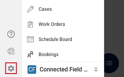
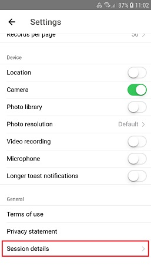
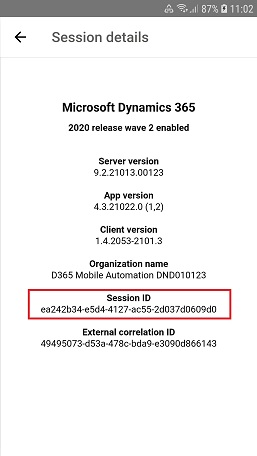
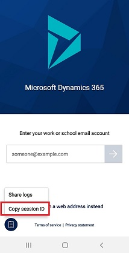
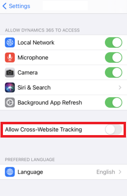
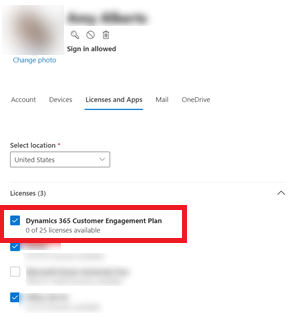

# Potential issues and resolutions

## Get a session ID

If you encounter a problem with the mobile app, you can help Microsoft troubleshoot the problem much more effectively if you provide them with a session ID for that problem.

### Get the session ID from the Setting menu

1. From the navigation bar, select  and then the gear icon (**Settings**).

   > [!div class="mx-imgBorder"]
   > 

2. Select **Session details** (at the bottom of the menu) and then you will see the **Session ID**.

   > [!div class="mx-imgBorder"]
   > 
   > 

### Get the session ID from the sign in screen

- On the sign in screen, select the clipboard icon and then select **Copy session ID**.

   > [!div class="mx-imgBorder"]
   > 
   
   
## Error: On iOS 14, canvas embedding, Power BI dashboards or iframes relying on cookies do not work.

Go to the iOS settings page related to the mobile app, and enable **Allow Cross-Website Tracking**.

   > [!div class="mx-imgBorder"]
   >    

## Error: Contact your administrator for access to your organizations mobile apps

When using the Dynamics 365 mobile app, you encounter the following message: **Contact your administrator for access to your organizations mobile apps**. 

To check for recently-added apps, select Refresh. If you can’t find your app, change your search criteria and try again.**

 For more information see, [Troubleshoot "We can’t find any apps for your role"  error message](https://support.microsoft.com/help/4486472/we-can-t-find-any-apps-for-your-role-message-in-dynamics-365-for-phone).


## Error message: Your device configuration is preventing sign-in

If you receive this message it means that your IT administrator is using Microsoft Intune and requires you to sign-in securely using an authenticator app, but your device configuration is blocking the Dynamics 365 mobile app from launching the authenticator app installed on your device. Microsoft authenticator apps are Authenticator and Company Portal. Your company may also use a third-party authenticator app. If you are unsure, ask your IT administrator which authenticator app you should be using and then follow the instructions below.

On iOS and sometimes on Android devices, manually opening (or restarting) your authenticator app on your device before you try to sign-in again from the Dynamics 365 mobile app is enough to fix the issue.
 
If you are using an Android device and the suggestion above did not work, the steps to resolve the issue are device manufacturer-specific and depend which authenticator app you have installed.

For **Huawei** and **Honor** device, do the following:

1. Go to **Settings** > **Battery** > **App launch**. 

    > [!NOTE]
    > The **App launch** menu can have different names depending on the model and the operating version of your mobile device. If you   don’t see the **App launch** menu option, then look for one of the following menu options:
    > - **Close apps after screen lock** 
    > - **Applications** 
    > - **Background applications**

2. Under **Manage automatically** for the authenticator app set the toggle switch to **OFF**.
3. On the **Manage manually** screen ensure that **Secondary launch / Can be launched by other apps** is enabled. This will allow the Dynamics 365 mobile app to launch the app.

For **Vivo** device, do the following:

1. Go to **Settings** > **More Settings** > **Applications** > **Autostart**.
2. Set the toggle switch to **ON** for the authenticator app.

For other device manufacturers, please email Dynamics 365 Mobile Support dynmobisup@microsoft.com and include your device make and model, session ID ([learn how to find this information above](#get-the-session-id-from-the-sign-in-screen) and quote the error message above.


## Error message: This record is unavailable
 If this message appears when a user starts the mobile app, and then selects the **Home** button, or **Dashboards** from the menu, the user likely doesn’t have access to the expected dashboards.  
  
  
### Admin instructions to resolve the issue

If you're an admin, you can avoid users getting this error by making sure all mobile users have access to the sales dashboard:  
  
1. In the web app, go to **Settings > Customizations > Customize the System**.  
  
2. Select **Dashboards**.  
  
3. Select **Sales Dashboard**.  
  
4. Select **Enable Security Roles**.  
  
5. Select **Display to everyone** and then select **OK**. If you prefer to display only to select security roles, be sure to select your user’s security role.  
  
6. Select **Publish**.  
  
7. Have your user close and open the mobile app so your dashboard changes will download.  
  
### End-user instructions to resolve the issue
   
#### You can choose a different dashboard and set it as your home page:  
  
1. From the mobile app, select the menu and then select **Dashboards**.  
  
2. On the command bar, select **Select Dashboard** and then select the dashboard you would like to use as your home page.  
  
3. On the command bar, select **Set as Home**.  
  

#### Or, you can create a personal dashboard through the web app and enable it for mobile:  
  
1. In the web app, go to **Sales > Dashboards**.  
  
2. Select **New**.  
  
3. Select **Properties**.  

4. Enter a name for your dashboard and select **Enable for mobile**.  
  
5. Add the components you want on your dashboard and select **Save**.  
  
6. In the mobile app, follow the previous procedure to select your new dashboard and set it as your home page.  
  
## Error message: Your server is not available or does not support this application  
 **Cause 1**: The Microsoft Dataverse or Dynamics 365 Customer Engagement (on-premises) server is down. Verify that the server is on and connected to your network.  
 
 **Cause 2**: Your Microsoft Dataverse or Dynamics 365 Customer Engagement (on-premises) app version is not supported. For supported version information, see [What's supported](../mobile-app/support-phones-tablets.md). 
  
 **Cause 3**: This error can also occur if you enter an invalid URL. Make sure the same URL you have provided works to access Dynamics 365 apps in your browser on your device  
  
  
## Error message: You haven't been authorized to use this app. Check with your system administrator to update your settings
 **Cause 1**: Verify that your security role includes the **Use [!INCLUDE[pn_moca_short](../includes/pn-moca-short.md)]** privilege. See "Required privileges" in [Get started with Dynamics 365 for phones and Dynamics 365 for tablets](./set-up-dynamics-365-for-phones-and-dynamics-365-for-tablets.md#requirements).  
  
 **Cause 2**: This error can occur if you have a Microsoft Dataverse or Dynamics 365 Customer Engagement (on-premises) organization and your user has not been assigned a license for the organization. If you add a Microsoft Dataverse or Dynamics 365 Customer Engagement (on-premises) subscription to an existing [!INCLUDE[pn_MS_Office_365](../includes/pn-ms-office-365.md)] tenant, your user may not have a  license assigned. 
 
 If the user has the Global Administrator or Service Administrator role and you’re able to sign in to on the web app to perform certain administrative actions, but you can’t perform end user tasks, such as creating records (for example, accounts, contacts, and leads) or configuring Dynamics 365 for mobile. When you sign in to the web app, you may notice that not all areas appear within the navigation (for example, Sales and Marketing are missing):  
  
  
 Access the **Active** users section in the admin center and verify you have a **Dynamics 365 Customer Engagement Plan** license assigned to your user record.  
  
   > [!div class="mx-imgBorder"]
   >   
  
  
## Error message: Sorry, something went wrong while initializing the app. Please try again, or restart the app  
 **Cause 1**: Permissions might not be set properly. See "Required privileges" in [Get started with Dynamics 365 for phones and Dynamics 365 for tablets](./set-up-dynamics-365-for-phones-and-dynamics-365-for-tablets.md#requirements)).  
  
 **Cause 2**: See the following KB article:  
  
 An error occurs in the [!INCLUDE[pn_microsoftcrm](../includes/pn-microsoftcrm.md)] app for users in child business units. For more information, see [Sorry, something went wrong while initializing the app](https://support.microsoft.com/kb/2899860).  
  
 **Sample Trace Message for Cause 2**:  
  
 `Error Message:System.NullReferenceException: Object reference not set to an instance of an object.`   
 `Microsoft.Crm.Application.WebServices.ApplicationMetadataService.<>c__DisplayClass30.<UserRolesChanged>b__2d(Entity role)`   
  `at System.Linq.Enumerable.Any[TSource](IEnumerable`1 source, Func`2 predicate)`   
  `at Microsoft.Crm.Application.WebServices.ApplicationMetadataService.UserRolesChanged(Guid[] clientUserRoles, DateTime syncTime, ExecutionContext context)`   
 `at Microsoft.Crm.Application.WebServices.ApplicationMetadataService.RetrieveUserContext(UserContextRetrieveRequest userContextRetrieveRequest)`  
 
  
## Error message: The language installed on your company’s system isn’t available on the app. Please contact your system administrator to set up a supported language
 **Cause**: This error will occur if one of the supported languages is not enabled in Microsoft Dataverse or Dynamics 365 Customer Engagement (on-premises). For more information on the supported languages, see [Supported languages for Dynamics 365 for phones and tablets](./support-phones-tablets.md#supported-languages-for--and-).
  
## Error message: The process assigned to this record is unavailable or has been deleted 
 If you receive this message for a record which has a non-deleted process assigned to it, you should manually synchronize Dynamics 365 mobile app data with Microsoft Dataverse or Dynamics 365 Customer Engagement (on-premises) app data. Close the mobile app, reopen it, and then choose to download the latest customizations. This procedure forces the mobile app to check for updated customizations. Recently viewed data while you were connected is cached and synched. Record data like Accounts or Contacts are not synched.
  

## Event 10001 messages appear in the Event Log when you run Dynamics 365 for mobile. 
 The following event may be recorded multiple times to the Event Log, when **Show Analytic and Debug Logs** is enabled, on the device where Dynamics 365 for mobile is running. Notice that, by default, **Show Analytic and Debug Logs** is disabled in [!INCLUDE[pn_Event_Viewer](../includes/pn-event-viewer.md)] and these messages won’t be recorded. [!INCLUDE[proc_more_information](../includes/proc-more-information.md)] [Enable Analytic and Debug Logs](/previous-versions/windows/it-pro/windows-server-2008-R2-and-2008/cc749492(v=ws.11))  
  
- Event Id: 10001  
  
- Message: `SEC7131 : Security of a sandboxed iframe is potentially compromised by allowing script and same origin access.`  
  
  Verify the source of the messages. If the source is Microsoft Dataverse or Dynamics 365 Customer Engagement (on-premises), these events don’t pose a security threat and can be ignored.  
  
## By design: “—d” added to URL  
  
 To improve the reliability of DNS resolutions to Microsoft Dataverse or Dynamics 365 Customer Engagement (on-premises) organizations, Dynamics 365 for mobile modifies the organization URL used when signing in. When a user signs in, the Dynamics 365 mobile app adds “—d” (two dashes + d) to the URL. For example, if the organization URL is **<https://contoso.crm.dynamics.com>**, [!INCLUDE[pn_moca_short](../includes/pn-moca-short.md)] will change the URL to **<https://contoso--d.crm.dynamics.com>**.  
  
 If a user needs to retry signing in, they’ll see “—d” in the web address. They can sign in with the modified URL or reset it to the URL normally used.  
  
 
## Redirected URLs do not work when you configure the Dynamics 365 mobile app
 URLs that redirect, such as [!INCLUDE[pn_iis](../includes/pn-iis.md)] host headers or link-shortening websites such as tinyurl or bitly, do not work when you use the URL in the **Dynamics 365 apps web address** field with Dynamics 365 mobile during configuration.  
  
 For example, an *<https://www.contosocrm.com>* host header for a Dynamics 365 apps online  website URL that is actually *<https://crm.contososerver001.com>*, will not work and will display an error message. To work around this behavior, you must enter the actual web address for the Microsoft Dataverse or Dynamics 365 Customer Engagement (on-premises) organization. When this issue occurs and you have enabled logging, the information logged is similar to the following. Notice that the URLs in lines 2 and 3 are different. That difference indicates a redirected URL.  
  
1.  User entered URL: *https://URL_entered*  
  
2.  Constructed server URL: *https://URL_after_CRMforTablets_processing*  
  
3.  HTTP Response location: *https://URL_that_the_response_came_from*  
 
 
  
## Data cached for offline viewing remains after the entity is no longer enabled for Dynamics 365 for mobile
 In  Dynamics 365 for mobile, record data is cached as the user visits the record so the user can access the data when going offline.  
  
 This cached data persists after the entity is no longer enabled for Dynamics 365 for mobile (**Settings** > **Customizations** > **Customize the System** > [select an entity] > under **Outlook & Mobile**, deselect **[!INCLUDE[pn_moca_short](../includes/pn-moca-short.md)]**).  
  
 To remove the cached data, the user must sign out of mobile app, or the app must be reconfigured or uninstalled.  
  
## Customization changes do not appear in the mobile app
 **Cause 1**: The customizations (metadata) from Microsoft Dataverse or Dynamics 365 Customer Engagement (on-premises) organization are cached on your device. The app checks for updated metadata after 24 hours or any time you reopen the app. For customization changes to become available immediately, you must completely close and then reopen the app. If new metadata is found, you will be prompted to download it. For more information on how to completely close an app, refer to the help for your operating system or reference one of the articles provided:  
  
- **Windows 10**: [How do I close an app?](https://support.microsoft.com/help/4027154/windows-close-an-app-in-windows-10)  
  
- **iPad**: [Force an app to close](https://support.apple.com/kb/ht5137)  
  
- **Android**: [How to force close Android apps](https://support.google.com/android/answer/9079646?hl=en#close_apps)  
  
**Cause 2**: You may be seeing a different form than the one you customized. If you have multiple forms for an entity, you will see the first form in the form order that you have access to. This is different than the web application where you see the last form you used and have the ability to change between forms. 

 
## Troubleshoot: Deep links that come from Microsoft Dataverse or Dynamics 365 Customer Engagement (on-premises) apps

### Deep links propagated in an email that come from your apps will not open on your mobile phone or tablet (especially on an Android device).

Most email clients have security restrictions on displayed links. Due to these restrictions, deep links that come from apps that are either handcrafted or generated by a workflow tool may not open properly on your mobile device. 

To workaround this issue, wrap the URL in a handmade HTML file and send it to your users. For example:

```html
<html>
   <title>Wrapping my Dynamics URL</title>
      <head></head>
      <body>
        <a href="ms-dynamicsxrm://?pagetype=entity&etn=account&id=xxxxxxxx-xxxx-xxxx-xxxx-xxxxxxxxxxxx">My Dynamics url</a>
      </body>
 </html>
```
When a user selects the link, it will open properly on their mobile app.

### Deep links may not open on your mobile device due to email based sign in limitations.
Deep links can only be invoked in the context of the currently opened app. While the mobile app doesn't need to be running at the time the deep link is invoked, you must have been in an app in the same organization when you exited the mobile app.
To work around this issue, make sure that you have an app that is in the same organization open on your device when you invoke a link.

## Native Android or iOS links are not supported
The Dynamics 365 mobile app does not support universal links on iOS and Android app links on Android.
  
## Issue still not resolved?  
If the information provided previously doesn’t resolve your issue, either [Post your issue in the Power App Community](https://powerusers.microsoft.com/t5/Power-Apps-Community/ct-p/PowerApps1) or [Contact Technical Support](https://powerapps.microsoft.com/support/).

 The following are some suggested details to provide:

- What are the specific symptoms you encounter? For example, if you encounter an error, what is the exact error message?

- Does the issue only occur for users with certain [!INCLUDE[pn_microsoftcrm](../includes/pn-microsoftcrm.md)] security roles?

- Does the issue only occur on certain devices but works correctly for the same user on another device?

- If you attempt to connect to a different [!INCLUDE[pn_microsoftcrm](../includes/pn-microsoftcrm.md)] organization that does not include your customizations, does the same issue occur? If the issue only occurs with your customizations, provide a copy of the customizations if possible.

- Does the issue still occur after uninstalling the app and reinstalling it?

- What type of device are you using, such as iPad 4th Generation, Microsoft Surface. What is the version of the operating system, such as iOS 10.0 or Windows 10.

### See also
 [Set up Dynamics 365 for phones and tablets](set-up-dynamics-365-for-phones-and-dynamics-365-for-tablets.md)


[!INCLUDE[footer-include](../includes/footer-banner.md)]
