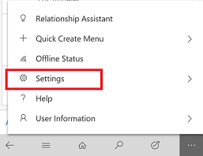
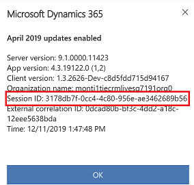

# Potential issues and resolutions

## Get a session ID

If you encounter a problem with the mobile app, you can help Microsoft troubleshoot the problem much more effectively if you provide them with a session ID for that problem.


1. From the navigation bar, select  > **Settings**.

   > [!div class="mx-imgBorder"]
   > 
    
2. Select **About** and then you will see the **Sesson ID**.

   > [!div class="mx-imgBorder"]
   > 

## Troubleshoot *We can’t find any apps for your role* error message on Dynamics 365 for phones and tablets.**

When using Dynamics 365 for phones and tablets, you encounter the following message:

**We can’t find any apps for your role. To check for recently-added apps, select Refresh.If you can’t find your app, change your search criteria and try again.**

 For more information see, [Troubleshoot "We can’t find any apps for your role"  error message](https://support.microsoft.com/help/4486472/we-can-t-find-any-apps-for-your-role-message-in-dynamics-365-for-phone).


  

## Error message: Your device configuration is preventing sign-in

If you receive this message it means that your IT administrator is using Microsoft Intune and requires you to sign-in securely using an authenticator app, but your device configuration is blocking the Dynamics 365 for phones and tablets app from launching the authenticator app installed on your device.
 
Steps to resolve the issue are device manufacturer-specific and depend which authenticator app you have installed. Microsoft authenticator apps are Authenticator and Company Portal. Your company may also use a third-party authenticator app. If you are unsure, ask your IT administrator which authenticator app you should be using and then follow the instructions below.

For **Huawei** and **Honor** device, do the following:

1. Go to **Settings** > **Battery** > **App launch**.
2. Under **Manage automatically** for the authenticator app set the toggle switch to **OFF**.
3. On the **Manage manually** screen ensure that **Secondary launch / Can be launched by other apps** is enabled. This will allow Dynamics 365 for phones and tablets can launch the app.

For **Vivo** device, do the following:

1. Go to **Settings** > **More Settings** > **Applications** > **Autostart**.
2. Set the toggle switch to **ON** for the authenticator app.

For other device manufacturers, please email Dynamics 365 Mobile Support dynmobisup@microsoft.com and include your device make and model and quote the error message above.

## Error message: This record is unavailable
 If this message appears when a user starts the mobile app, taps the **Home** button, or selects **Dashboards** from the menu, the user likely doesn’t have access to the expected dashboards.  
  
 If you’re an admin, you can avoid users getting this error by making sure all mobile users have access to the sales dashboard:  
  
1. In the web app, go to **Settings > Customizations > Customize the System**.  
  
2. Click **Dashboards**.  
  
3. Select **Sales Dashboard**.  
  
4. Click **Enable Security Roles**.  
  
5. Select **Display to everyone** and then click **OK**. If you prefer to display only to select security roles, be sure to select your user’s security role.  
  
6. Click **Publish**.  
  
7. Have your user close and open the mobile app so your dashboard changes will download.  
  
   If you’re an end user and you’re seeing this message on your home page, you can choose a different dashboard and set it as your home page:  
  
8. From the mobile app, tap the menu and then tap **Dashboards**.  
  
9. On the command bar, tap **Select Dashboard** and then select the dashboard you would like to use as your home page.  
  
10. On the command bar, tap **Set as Home**.  
  
    If you’re an end user and you’re seeing this message on the dashboards page, you can create a personal dashboard through the web app and enable it for mobile:  
  
11. In the web app, go to **Sales > Dashboards**.  
  
12. Click **New**.  
  
13. Click **Properties**.  
  
14. Enter a name for your dashboard and select **Enable for mobile**.  
  
15. Add the components you want on your dashboard and click **Save**.  
  
16. In the mobile app, follow the previous procedure to select your new dashboard and set it as your home page.  
  
## Error message: Your server is not available or does not support this application  
 **Cause 1**: The Dynamics 365 server is down. Verify that the server is on and connected to your network.  
  
 **Sample Trace Message for Cause 1**:  
  
 `“Dynamics CRM [Error] | Connection error: 404”`  
  
 **Cause 2**: Your Dynamics 365 apps  version is not supported. See [What's supported](../mobile-app/support-phones-tablets.md) for version support information.  
  
 **Cause 4**: This error can also occur if you enter an invalid URL. Make sure the same URL you have provided works to access [!INCLUDE[pn_microsoftcrm](../includes/pn-microsoftcrm.md)] in your browser on your device.  
  
 **Sample Trace Messages for Cause 4**:  
  
 `“XMLHttpRequest: Network Error 0x2ee7, Could not complete the operation due to error 00002ee7.”`   
 `“Dynamics CRM [Error] | Connection error: 0”`  
  
## Error message: You haven't been authorized to use this app. Check with your system administrator to update your settings
 **Cause 1**: Verify that your [!INCLUDE[pn_microsoftcrm](../includes/pn-microsoftcrm.md)] security role includes the **Use [!INCLUDE[pn_moca_short](../includes/pn-moca-short.md)]** privilege. See "Required privileges" in [Get started with Dynamics 365 for phones and Dynamics 365 for tablets](set-up-dynamics-365-for-phones-and-dynamics-365-for-tablets.md#BKMK_GetStartedTablets).  
  
 **Cause 2**: This error can occur if you have a [!INCLUDE[pn_CRM_Online](../includes/pn-crm-online.md)] organization and your user has not been assigned a [!INCLUDE[pn_CRM_Online](../includes/pn-crm-online.md)] license. If you add a [!INCLUDE[pn_CRM_Online](../includes/pn-crm-online.md)] subscription to an existing [!INCLUDE[pn_MS_Office_365](../includes/pn-ms-office-365.md)] tenant, your user may not have a [!INCLUDE[pn_CRM_Online](../includes/pn-crm-online.md)] license assigned. If the user has the Global Administrator or Service Administrator role in the [Microsoft Online Service Portal](https://portal.microsoftonline.com/), you’re able to sign in to the [!INCLUDE[pn_microsoftcrm](../includes/pn-microsoftcrm.md)] web application to perform certain administrative actions, but you can’t perform end user tasks, such as creating records (for example, accounts, contacts, and leads) or configuring [!INCLUDE[pn_moca_short](../includes/pn-moca-short.md)]. When you sign in to the web application, you may notice that not all areas appear within the navigation (for example, Sales and Marketing are missing):  
  
   
  
 Access the **Users and Groups** section within the [Microsoft Online Service Portal](https://portal.microsoftonline.com/) and verify you have a [!INCLUDE[pn_CRM_Online](../includes/pn-crm-online.md)] license assigned to your user record.  
  
   
  
  
## Error message: Sorry, something went wrong while initializing the app. Please try again, or restart the app  
 **Cause 1**: Permissions might not be set properly. See "Required privileges" in [Get started with Dynamics 365 for phones and Dynamics 365 for tablets](set-up-dynamics-365-for-phones-and-dynamics-365-for-tablets.md#BKMK_GetStartedTablets).  
  
 **Cause 2**: See the following KB article:  
  
 An error occurs in the [!INCLUDE[pn_microsoftcrm](../includes/pn-microsoftcrm.md)] app for users in child business units. For more information, see [Sorry, something went wrong while initializing the app](https://support.microsoft.com/kb/2899860).  
  
 **Sample Trace Message for Cause 2**:  
  
 `Error Message:System.NullReferenceException: Object reference not set to an instance of an object.`   
 `Microsoft.Crm.Application.WebServices.ApplicationMetadataService.<>c__DisplayClass30.<UserRolesChanged>b__2d(Entity role)`   
  `at System.Linq.Enumerable.Any[TSource](IEnumerable`1 source, Func`2 predicate)`   
  `at Microsoft.Crm.Application.WebServices.ApplicationMetadataService.UserRolesChanged(Guid[] clientUserRoles, DateTime syncTime, ExecutionContext context)`   
 `at Microsoft.Crm.Application.WebServices.ApplicationMetadataService.RetrieveUserContext(UserContextRetrieveRequest userContextRetrieveRequest)`  
  
 **Cause 3**: This can occur if the download of the metadata failed. The next attempt to connect will fully regenerate the metadata and successfully connect. Microsoft is aware of an issue where metadata may fail to download due to a timeout and plans to address this issue in a future update.  
  
 **Sample Trace Messages for Cause 3**:  
  
 `“Error occurred during complete refresh of Application/Entity/Attribute metadata”`   
 `“XMLHttpRequest: Network Error 0x2ef3, Could not complete the operation due to error 00002ef3.”`  
  
## Error message: The language installed on your company’s system isn’t available on the app. Please contact your system administrator to set up a supported language
 **Cause**: This error will occur if one of the supported languages is not enabled in [!INCLUDE[pn_microsoftcrm](../includes/pn-microsoftcrm.md)]. For more information on the supported languages, see [Dynamics 365 for tablets: Set up and use](https://go.microsoft.com/fwlink/p/?LinkID=325404) and expand **What you need to use Dynamics 365 for tablets** and **Supported Languages**.  
  
## Error message: The process assigned to this record is unavailable or has been deleted 
 If you receive this message for a record which has a non-deleted process assigned to it, you should manually synchronize [!INCLUDE[pn_moca_short](../includes/pn-moca-short.md)] with your [!INCLUDE[pn_microsoftcrm](../includes/pn-microsoftcrm.md)] data. Close the [!INCLUDE[pn_moca_short](../includes/pn-moca-short.md)] app, reopen, and then choose to download the latest customizations. This procedure forces [!INCLUDE[pn_moca_short](../includes/pn-moca-short.md)] to check for updated customizations. Recently viewed data while you were connected is cached and synched. Record data like Accounts or Contacts are not synched. You can’t choose which data synchronizes to the device like you can with [!INCLUDE[pn_microsoft_dynamics_crm_for_outlook](../includes/pn-microsoft-dynamics-crm-for-outlook.md)].  
  

## Event 10001 messages appear in the Event Log when you run [!INCLUDE[pn_crm_for_windows_8](../includes/pn-crm-for-windows-8.md)]  
 The following event may be recorded multiple times to the Event Log, when **Show Analytic and Debug Logs** is enabled, on the device where [!INCLUDE[pn_crm_for_windows_8](../includes/pn-crm-for-windows-8.md)] is running. Notice that, by default, **Show Analytic and Debug Logs** is disabled in [!INCLUDE[pn_Event_Viewer](../includes/pn-event-viewer.md)] and these messages won’t be recorded. [!INCLUDE[proc_more_information](../includes/proc-more-information.md)] [Enable Analytic and Debug Logs](https://technet.microsoft.com/library/cc749492.aspx)  
  
- Event Id: 10001  
  
- Message: `SEC7131 : Security of a sandboxed iframe is potentially compromised by allowing script and same origin access.`  
  
  Verify the source of the messages. If the source is [!INCLUDE[pn_microsoftcrm_server](../includes/pn-microsoftcrm-server.md)], these events don’t pose a security threat and can be ignored.  
  
#### By design: “—d” added to URL  
 **For [!INCLUDE[pn_CRM_Online](../includes/pn-crm-online.md)] users**  
  
 To improve the reliability of DNS resolutions to [!INCLUDE[pn_CRM_Online](../includes/pn-crm-online.md)] organizations, [!INCLUDE[pn_moca_short](../includes/pn-moca-short.md)] modifies the organization URL used when signing in. When a user signs in, [!INCLUDE[pn_moca_short](../includes/pn-moca-short.md)] adds “—d” (two dashes + d) to the URL. For example, if the organization URL is **<https://contoso.crm.dynamics.com>**, [!INCLUDE[pn_moca_short](../includes/pn-moca-short.md)] will change the URL to **<https://contoso--d.crm.dynamics.com>**.  
  
 If a user needs to retry signing in, they’ll see “—d” in the web address. They can sign in with the modified URL or reset it to the URL normally used.  
  
 
## Redirected URLs do not work when you configure [!INCLUDE[pn_moca_short](../includes/pn-moca-short.md)] or [!INCLUDE[pn_Mobile_Express_short](../includes/pn-mobile-express-short.md)]  
 URLs that redirect, such as [!INCLUDE[pn_iis](../includes/pn-iis.md)] host headers or link-shortening websites such as tinyurl or bitly, do not work when you use the URL in the **Dynamics 365 apps web address** field with [!INCLUDE[pn_moca_full](../includes/pn-moca-full.md)] or [!INCLUDE[pn_Mobile_Express_short](../includes/pn-mobile-express-short.md)] during configuration.  
  
 For example, an *<https://www.contosocrm.com>* host header for a Dynamics 365 apps online  website URL that is actually *<https://crm.contososerver001.com>*, will not work and will display an error message. To work around this behavior, you must enter the actual web address for the [!INCLUDE[pn_CRM_Online](../includes/pn-crm-online.md)] organization. When this issue occurs and you have enabled logging, the information logged is similar to the following. Notice that the URLs in lines 2 and 3 are different. That difference indicates a redirected URL.  
  
1.  User entered URL: *https://URL_entered*  
  
2.  Constructed server URL: *https://URL_after_CRMforTablets_processing*  
  
3.  HTTP Response location: *https://URL_that_the_response_came_from*  
 
  
## Users not getting customizations  
 Users will not get customizations made to Dynamics 365 apps if there are draft records present. Users should be encouraged to save records as soon as they go online.  
  
## Data cached for offline viewing remains after the entity is no longer enabled for [!INCLUDE[pn_moca_short](../includes/pn-moca-short.md)]  
 In [!INCLUDE[pn_moca_short](../includes/pn-moca-short.md)], record data is cached as the user visits the record so the user can access the data when going offline.  
  
 This cached data persists after the entity is no longer enabled for [!INCLUDE[pn_moca_short](../includes/pn-moca-short.md)] (**Settings** > **Customizations** > **Customize the System** > [select an entity] > under **Outlook & Mobile**, deselect **[!INCLUDE[pn_moca_short](../includes/pn-moca-short.md)]**).  
  
 To remove the cached data, the user must sign out of [!INCLUDE[pn_moca_short](../includes/pn-moca-short.md)], or [!INCLUDE[pn_moca_short](../includes/pn-moca-short.md)] must be reconfigured or uninstalled.  
  
## Customization changes do not appear in [!INCLUDE[pn_moca_short](../includes/pn-moca-short.md)]  
 **Cause 1**: The customizations (metadata) from your [!INCLUDE[pn_microsoftcrm](../includes/pn-microsoftcrm.md)] organization are cached on your device. The app checks for updated metadata after 24 hours or any time you reopen the app. For customization changes to become available immediately, you must completely close and then reopen the app. If new metadata is found, you will be prompted to download it. For more information on how to completely close an app, refer to the help for your operating system or reference one of the articles provided:  
  
- **Windows 8**: [How do I close an app?](https://go.microsoft.com/fwlink/p/?LinkId=513271)  
  
- **iPad**: [Force an app to close](https://support.apple.com/kb/ht5137)  
  
- **Android**: [How to force close Android apps](https://www.tomsguide.com/faq/id-2372153/force-close-android-apps.html)  
  
**Cause 2**: You may be seeing a different form than the one you customized. If you have multiple forms for an entity, you will see the first form in the form order that you have access to. This is different than the web application where you see the last form you used and have the ability to change between forms.  
  
  
## Private Browsing not supported in Safari  
 If you enable Private Browsing on your iPad in your Safari browser, you will see the following error message when you attempt to connect to your Common Data Service environment or Dynamics 365 Customer Engagement (on-premises) organization: “[Dynamics 365 has encountered an error.” You will need to disable Private Browsing. Tap the address bar, and then tap **Private**.  
  
## Web app differences in mobile browsers  
 For differences you can expect to find in the web app when you’re accessing it from a mobile device, see [Support for Dynamics 365 for phones and Dynamics 365 for tablets](../mobile-app/support-phones-tablets.md).  
   
  
## Clipboard data – available to admins and customizers  
 [!INCLUDE[pn_microsoftcrm](../includes/pn-microsoftcrm.md)] System Administrators or System Customizers can access other users’ Clipboard data for users of [!INCLUDE[pn_windows8](../includes/pn-windows8.md)] and 8.1 devices.  
  
## Users can view queue items in another person’s queue  
 A user viewing records in [!INCLUDE[pn_moca_short](../includes/pn-moca-short.md)] can view records in another user’s queue.  
  
## Update the [!INCLUDE[pn_dynamics_crm_for_good](../includes/pn-dynamics-crm-for-good.md)] app before updating to [!INCLUDE[pn_crm_online_2015_update_1](../includes/pn-crm-online-2015-update-1.md)]  
 Users must update to the latest version of the [!INCLUDE[pn_microsoft_dynamics_crm_for_good](../includes/pn-microsoft-dynamics-crm-for-good.md)] application prior to updating to [!INCLUDE[pn_crm_online_2015_update_1](../includes/pn-crm-online-2015-update-1.md)]. On the [Apple App store](https://go.microsoft.com/fwlink/p/?LinkID=524762), the version the users need is 1.1. On the [Good Dynamics Marketplace](https://go.microsoft.com/fwlink/p/?LinkId=524809) or Good Control Console, the version needed is listed as 1.1.0.  
  
 Users who haven’t updated their app prior to connecting to [!INCLUDE[pn_crm_online_2015_update_1](../includes/pn-crm-online-2015-update-1.md)], will likely see the following error approximately 2 minutes after connecting to [!INCLUDE[pn_crm_online_2015_update_1](../includes/pn-crm-online-2015-update-1.md)].  
  
 Error: We’re sorry. Your server is not available or does not support this application.  
  
 To fix this error, the user must uninstall and reinstall the [!INCLUDE[pn_microsoft_dynamics_crm_for_good](../includes/pn-microsoft-dynamics-crm-for-good.md)] app using the version listed previously.  
  
## App restart required after reconfiguring [!INCLUDE[pn_microsoft_dynamics_crm_for_good](../includes/pn-microsoft-dynamics-crm-for-good.md)]  
 After you reconfigure [!INCLUDE[pn_microsoft_dynamics_crm_for_good](../includes/pn-microsoft-dynamics-crm-for-good.md)], the app can get stuck in a loop. You need to close and reopen the app.  
  
1. On your [!INCLUDE[tn_ipad](../includes/tn-ipad.md)], press the **Home** button two times quickly. You'll see small previews of your recently used apps.  
  
2. Swipe to find the [!INCLUDE[pn_dynamics_crm_for_good](../includes/pn-dynamics-crm-for-good.md)] app.  
  
3. Swipe up on the app's preview to close it.  
  
4. Tap the [!INCLUDE[pn_dynamics_crm_for_good](../includes/pn-dynamics-crm-for-good.md)] app icon to launch the app and configure for the new org.  
  
#### Prevent click for mapping and [!INCLUDE[pn_crm_online_2015_update_1](../includes/pn-crm-online-2015-update-1.md)]  
 For users of version 1.0 (1.0.0) of the [!INCLUDE[pn_microsoft_dynamics_crm_for_good](../includes/pn-microsoft-dynamics-crm-for-good.md)] app that have updated to [!INCLUDE[pn_crm_online_2015_update_1](../includes/pn-crm-online-2015-update-1.md)], note that the **Prevent click for mapping** setting does not work.  
  
 To prevent click for mapping in version 1.0 (1.0.0), admins should enable the **Require a secure browser for opening URLs** setting in the [!INCLUDE[pn_good_shortest](../includes/pn-good-shortest.md)] Control server, as shown here.  
  
   
  
 The **Prevent click for mapping** setting works as expected in [!INCLUDE[pn_microsoft_dynamics_crm_for_good](../includes/pn-microsoft-dynamics-crm-for-good.md)] app version 1.1 (1.1.0). We recommend updating to the latest version of the [!INCLUDE[pn_dynamics_crm_for_good](../includes/pn-dynamics-crm-for-good.md)] app rather than applying this workaround.  
 
## Troubleshoot: Deep links that come from  Dynamics 365 apps

### Deep links propagated in an email that come from Dynamics 365 apps will not open on your mobile phone or tablet (especially on an Android device).

Most email clients have security restrictions on displayed links. Due to these restrictions, deep links that come from Dynamics 365 apps that are either handcrafted or generated by a workflow tool may not open properly on your mobile device. 

To workaround this issue, wrap the url in a handmade HTML file and send it to your users. For example:

```html
<html>
   <title>Wrapping my Dynamics URL</title>
      <head></head>
      <body>
        <a href="ms-dynamicsxrm:///?pagetype=entity&etn=account&id=xxxxxxxx-xxxx-xxxx-xxxx-xxxxxxxxxxxx">My Dynamics url</a>
      </body>
 </html>
```
When a user selects the link, it will open properly on their mobile app.

### Deep links may not open on your mobile device due to email based sign in process.
Deep links can only be invoked in the context of the currently opened app. While the mobile app doesn't need to be running at the time the deep link is invoked, you must have been in an app in the same organization when you exited the mobile app.
To work around this issue, make sure that you have an app that is in the same organization open on your device when you invoke a link.

## Native Android or iOS links are not supported
The Dynamics 365 mobile does not support universal links on iOS and Android app links on Android.
  
## Issue still not resolved?  
If the information provided previously doesn’t resolve your issue, either [Post your issue in the Dynamics CRM Community](https://community.dynamics.com/crm/f/117/p/addpost.aspx?GroupToJoin=57) or [Contact Technical Support](../admin/contact-technical-support.md).

 The following are some suggested details to provide:

- What are the specific symptoms you encounter? For example, if you encounter an error, what is the exact error message?

- Does the issue only occur for users with certain [!INCLUDE[pn_microsoftcrm](../includes/pn-microsoftcrm.md)] security roles?

- Does the issue only occur on certain devices but works correctly for the same user on another device?

- If you attempt to connect to a different [!INCLUDE[pn_microsoftcrm](../includes/pn-microsoftcrm.md)] organization that does not include your customizations, does the same issue occur? If the issue only occurs with your customizations, provide a copy of the customizations if possible.

- Does the issue still occur after uninstalling the app and reinstalling it?

<!-- -   Please provide traces. See [Enable tracing for Dynamics 365 for tablets](../Topic/Monitor%20and%20troubleshoot%20Microsoft%20Dynamics%20365.md#BKMK_MoCA_tracing).  -->

-   What type of device (ex. iPad 4th Generation, Microsoft Surface, etc…) are you using and what is the version of the operating system (ex. iOS 6.0, Windows 8, etc…)?

### See also
 [Set up Dynamics 365 for phones and tablets](set-up-dynamics-365-for-phones-and-dynamics-365-for-tablets.md)
 [Dynamics 365 for phones and tablets User's Guide](dynamics-365-phones-tablets-users-guide.md)

