# Basic navigation on Dynamics 365 for phones and tablets 

Use the Dynamics 365 for phones and tablets app to run your customer engagement apps in Dynamics 365 (such as Dynamics 365 Sales, Dynamics 365 Customer Service, and Dynamics 365 Marketing) on your mobile device. To install the app, see [Install Dynamics 365 for phones and tablets](https://docs.microsoft.com/dynamics365/mobile-app/install-dynamics-365-for-phones-and-tablets).

> [!NOTE]
> There are separate mobile apps for:
>   - Dynamics 365 for phones and tablets for Dynamics 365 Customer Engagement (on-premises): [Dynamics 365 mobile app to run Dynamics 365 Customer Engagement (on-premises) apps.](https://docs.microsoft.com/dynamics365/customerengagement/on-premises/basics/dynamics-365-phones-tablets-users-guide-onprem)
>   - Dynamics 365 Field Service: [Field Service mobile app](https://go.microsoft.com/fwlink/?linkid=846157)
>   - Finance and Operations applications: [Finance and Operations mobile app](https://docs.microsoft.com/dynamics365/unified-operations/dev-itpro/mobile-apps/mobile-app-home-page) 
>   - Canvas and model-driven apps in Power Apps: [Power Apps mobile app](https://docs.microsoft.com/powerapps/user/run-canvas-and-model-apps-on-mobile)

## Home screen 

It's easy to get around in the Dynamics 365 mobile app. The following illustration shows the primary navigation elements on the Home screen. 

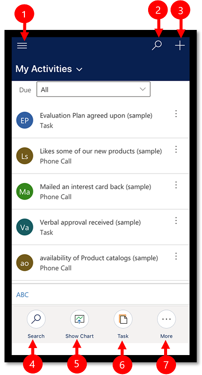

Legend:

1. **Site map**: Open the menu and move between apps, get to your favorite and recently used records, access settings, and more.
2. **Search**: Search for all records in the app.
3. **New**: Create a new record and quickly enter almost any type of information into the system.
4. **Search**: Search for records in the current view.
5. **Show Chart**: Show the list of records in a chart view.
6. **Task**: Create a new task record.
7. **More**: Access more commands such as add activities, start a task flow, use the assistant, and more.

## Site map 

From the Home screen, select the site map  to access entities, favorite or most-used records, other apps, and settings.

 
   > [!div class="mx-imgBorder"]
   > 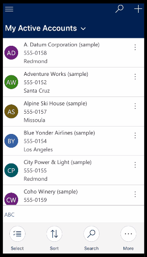
   

The following illustration shows the primary navigation elements on the site map screen. 

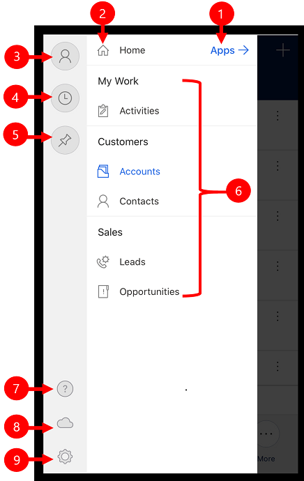

Legend

1. **App selector**: Open this menu to close your app and switch to another app.
2. **Home screen**: Select this to go back to the Home screen.
3. **Profile**: Go to the Profile screen to sign out or reconfigure the app. 
4. **Recent records**: View a list of records you were recently using. 
5. **Pinned records**: View and open your favorite (pinned) records. 
6. **Entity navigator**: This area lists the entity available in the app.
7. **Help**: Access help content for more information about how to use the app.
8. **Offline status**: Work with your data in offline mode, even when you don't have internet access. More information: [Work offline on your mobile device](https://docs.microsoft.com/dynamics365/mobile-app/work-in-offline-mode)
9. **Settings**: Access settings.

## Pin favorite records

The **Pinned** and **Recent** lists provide quick access to records that you've recently used or pinned to favorites. Use the **Recent** list to pin favorite records.  

1. From the site map , select **Recent** .

2. On the **Recent** records screen, select the push-pin icon next to a record to add it to your favorites (pinned records).

3. To view the newly pinned records, select **X**, and then select **Pinned** .

   
   > [!div class="mx-imgBorder"]
   > 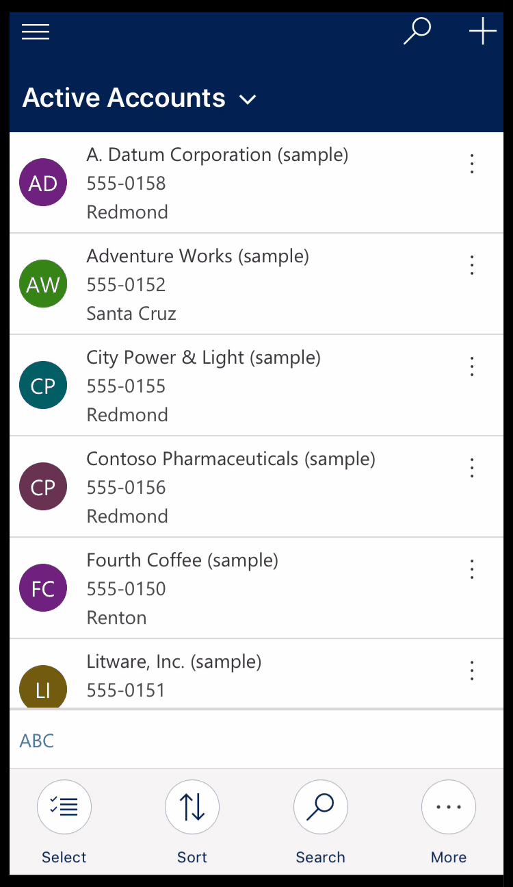
   

### Unpin a record

1. From the site map , select **Pinned** .

2. Select the remove-pin icon  next to a record to remove it from favorites (pinned records).

   > [!div class="mx-imgBorder"]
   > 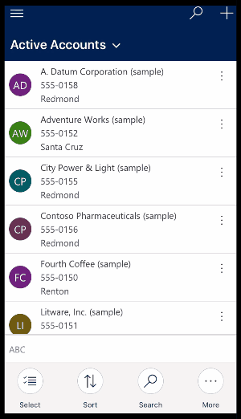
   

## Change views

- From the Home screen, select the down arrow  next to the current view, and then select a new view.

   > [!div class="mx-imgBorder"]
   > 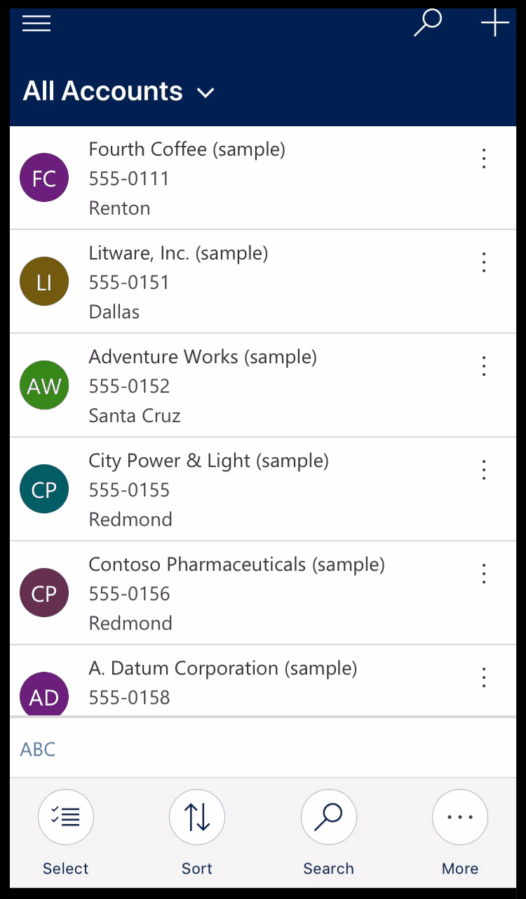

## Add a record quickly

1. From the Home screen, select **New** .
2. Fill in the fields, and then select **Save**.
3. After the record is created, you can view the new record. 

   > [!div class="mx-imgBorder"]
   > 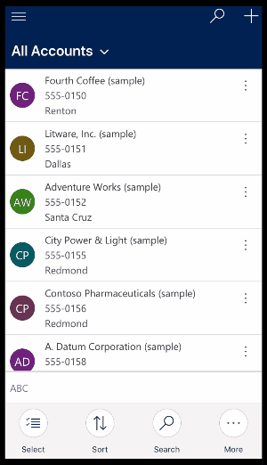

-  To save and open the record that you created, select **More** , and then select **Save and Open**.

- To save and create another record, select **More** , and then select **Save and Create new**.

   > [!div class="mx-imgBorder"]
   > 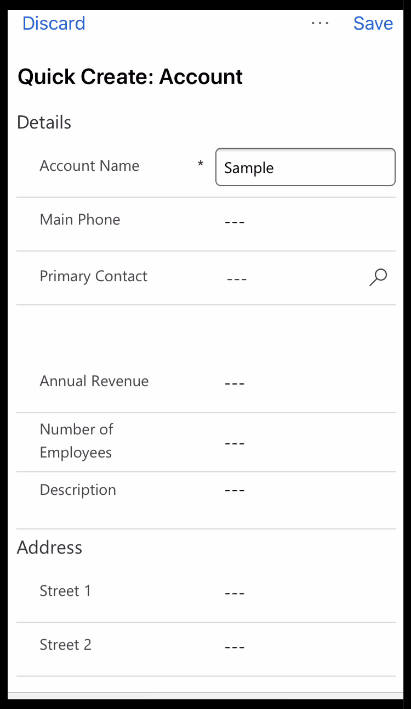

## View commands for a record

1. From the Home screen, open a record.
2. On the open record, select **More** to access more commands.

   > [!div class="mx-imgBorder"]
   > 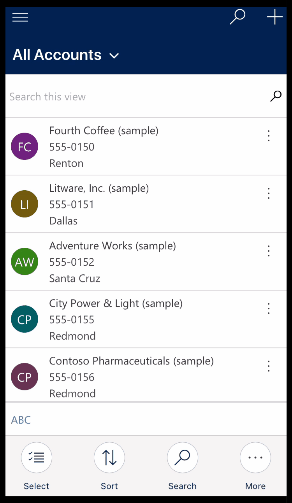

## Edit a record

1. From the Home screen, open a record that you want to edit. 
2. When you're done editing the record, select **Save**. To cancel your changes, select **Discard**.

   > [!div class="mx-imgBorder"]
   > 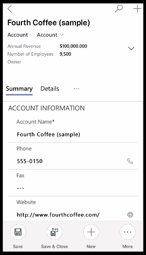

## Go back to the Home screen

- To get back to the Home screen when you're in a record, select **Back** .
- At any point, press and hold **Back**  to go back to the Home screen. 

   > [!div class="mx-imgBorder"]
   > 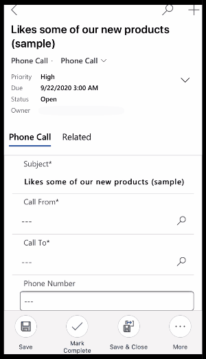

## Sign out

From the site map , select the profile icon , and then select **Sign out**.

## Reconfigure and clear cache

If you used the mobile app on a phone or tablet temporarily and want to remove all your cached data before giving the device to someone else, you need to reconfigure the app.

Reconfiguring deletes data and metadata for the current organization from the cache, however do not rely on this as a security measure.

Make sure you use the **Reconfigure** option before you sign out. If you sign in to another organization but you wanted to delete data for the previous organization that you were logged into, then you will need to sign back into that organization and use the **Reconfigure** option to delete data and metadata for that organization from the cache. 

To reconfigure the app, from the site map , select the profile icon , and then select **Reconfigure**.
