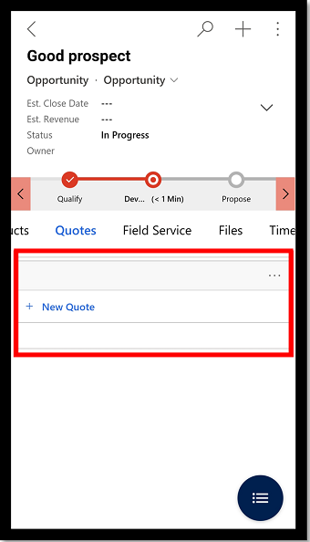
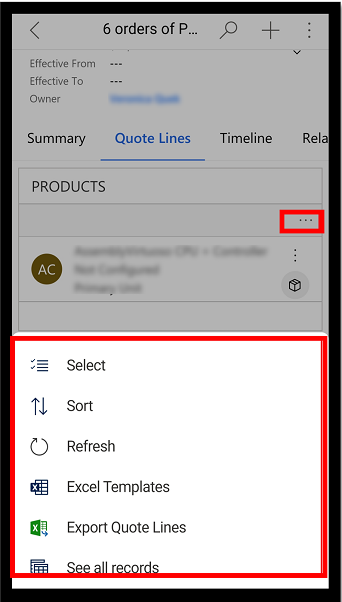
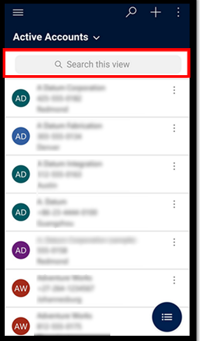

# Basic navigation on Dynamics 365 for phones and tablets

Use Dynamics 365 for phones and tablets to run customer engagement apps&mdash;such as Dynamics 365 Sales, Dynamics 365 Customer Service, and Dynamics 365 Marketing&mdash;on your mobile device. To install the app, go to [Install Dynamics 365 for phones and tablets](install-dynamics-365-for-phones-and-tablets.md).

You can run your Sales Hub app, Customer Service Hub app, and Dynamics 365 Customer Engagement (on-premises) apps on the Dynamics 365 mobile app. For more information, go to the following articles:

- [Sales Hub app on mobile devices](https://docs.microsoft.com/dynamics365/sales-enterprise/use-sales-hub-on-dynamics-365-mobile)
- [Customer Service Hub on mobile devices](https://docs.microsoft.com/dynamics365/customer-service/use-customer-service-hub-on-dynamics-365-mobile)
- [Dynamics 365 Customer Engagement (on-premises) apps on mobile](https://docs.microsoft.com/dynamics365/customerengagement/on-premises/basics/dynamics-365-phones-tablets-users-guide-onprem)

> [!NOTE]
> For information about the following mobile apps, go to these articles:
>
> - Canvas and model-driven apps in Power Apps: [Power Apps Mobile](https://docs.microsoft.com/powerapps/user/run-canvas-and-model-apps-on-mobile)
> - Dynamics 365 Field Service: [Field Service mobile app](https://go.microsoft.com/fwlink/?linkid=846157)
> - Finance and Operations applications: [Finance and Operations mobile app](https://docs.microsoft.com/dynamics365/unified-operations/dev-itpro/mobile-apps/mobile-app-home-page) 

## Home screen 

It's easy to get around in Dynamics 365 for phones and tablets. The following image shows the primary navigation elements on the home screen.

Legend:

1. **Site map**: Open the site map to move between apps, get to your favorite and recently used records, access settings, and more.
2. **Search**: Search for all records in the app.
3. **New**: Create a new record, and quickly enter almost any type of information into the system.
4. **Search**: Search for records in the current view.
5. **Show Chart**: Show the list of records in a chart view.
6. **Task**: Create a new task record.
7. **More**: Access more commands such as adding activities, starting a task flow, using the assistant, and more.

## Early access features

If you've enabled early access, you'll have a different navigation experience. This section describes the improved experience on form pages, including form tabs and subgrids.

Your administrator has to opt in to early access updates for your environment and then install the updates to get this feature. More information: [Opt in to early access updates](https://docs.microsoft.com/power-platform/admin/opt-in-early-access-updates)

### Form page with tabs

When you're on a form page with tabs, you can scroll and span horizontally across the screen. When you select a tab, the header is adjusted so you can easily view the next few tabs.

### Add a new record on subgrids

On a subgrid with no records, you can now add a new record quickly.

### More commands

You can easily see the commands on a subgrid that appear at the bottom of the screen.

### Search this view

When you're on a view, use the **Search this view** option to search the current view.

## Site map

On the home screen, select the site map  to access entities, favorite or most-used records, other apps, and settings.

   > [!div class="mx-imgBorder"]
   > 

The following image shows the primary navigation elements on the site map. 

Legend

1. **App selector**: Open this menu to close your app and switch to another app.
2. **Home screen**: Select this to go back to the home screen.
3. **Profile**: Go to the Profile screen to sign out of or reconfigure the app.
4. **Recent records**: View a list of records you were recently using.
5. **Pinned records**: View and open your favorite (pinned) records. 
6. **Entity navigator**: This area lists the entities available in the app.
7. **Help**: Access help content for more information about how to use the app.
8. **Offline status**: Work with your data in offline mode, even when you don't have internet access. More information: [Work offline on your mobile device](work-in-offline-mode.md)
9. **Settings**: Access settings.

## Pin favorite records

The **Pinned** and **Recent** lists provide quick access to records that you've recently used or pinned to favorites. Use the **Recent** list to pin favorite records.  

1. On the site map , select **Recent** .

2. On the **Recent** records screen, select the pushpin  next to a record to add it to your favorites (pinned records).

3. To view the newly pinned records, select **Close** , and then select **Pinned** .

   > [!div class="mx-imgBorder"]
   > 

### Unpin a record

1. On the site map , select **Pinned** .

2. Select **Remove**  next to a record to remove it from favorites (pinned records).

   > [!div class="mx-imgBorder"]
   > 

## Change views

- On the home screen, select the down arrow  next to the current view, and then select a new view.

   > [!div class="mx-imgBorder"]
   > 

## Add a record quickly

1. On the home screen, select **New** .
2. Fill in the fields, and then select **Save**. After the record is created, you can view the new record. 

   > [!div class="mx-imgBorder"]
   > 

-  To save and open the record that you created, select **More** , and then select **Save and open**.

- To save and create another record, select **More** , and then select **Save and create new**.

   > [!div class="mx-imgBorder"]
   > 

## View commands for a record

1. On the home screen, open a record.
2. On the open record, select **More** to access more commands.

   > [!div class="mx-imgBorder"]
   > 

## Edit a record

1. On the home screen, open a record that you want to edit. 
2. Edit the record, and then select **Save**. To cancel your changes, select **Discard**.

   > [!div class="mx-imgBorder"]
   > 

## Go back to the home screen

- To get back to the home screen when you're in a record, select **Back** .
- At any point, you can select and hold **Back**  to go back to the home screen. 

   > [!div class="mx-imgBorder"]
   > 

## Sign out

On the site map , select **Profile** , and then select **Sign out**.

## Reconfigure and clear cache

If you used the mobile app on a phone or tablet temporarily and want to remove all your cached data before giving the device to someone else, you need to reconfigure the app.

Reconfiguring deletes data and metadata for the current organization from the cache; however, don't rely on this as a security measure.

Make sure you use the **Reconfigure** option before you sign out. If you sign in to another organization but you wanted to delete data for the previous organization that you were signed in to, you'll need to sign back in to that organization and use the **Reconfigure** option to delete data and metadata for that organization from the cache.

To reconfigure the app, select the site map , select **Profile** , and then select **Reconfigure**.

[!INCLUDE[footer-include](../includes/footer-banner.md)]
