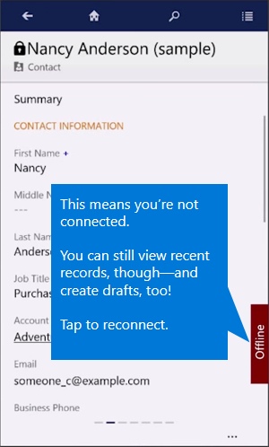

# Work offline with Dynamics 365 for phones and tablets

[!INCLUDE[cc-applies-to-update-8-2-0](../../../includes/cc_applies_to_update_8_2_0.md)]
  
## Offline synchronization vs. Offline drafts  
 You’ll have one of two possible offline experiences, depending on which one your admin set up:  
  
-   **Seamless mobile offline synchronization**. You can view, edit, and create records while you're disconnected from the Internet. Once you're back online, changes you've made are synchronized with [[!INCLUDE[pn-microsoftcrm](../../../includes/pn-microsoftcrm.md)].  
  
     \- OR -  
  
-   **Offline drafts**. This experience is available to everyone. In this case, the app keeps records you’ve used recently, so you can still access them when you’re disconnected.  
  
     You can also capture new information by creating drafts of new records - like accounts, contacts, and activities - and save the records the next time you go online.  
  
     Your offline experience might look a little different than your online experience, because charts and some images aren’t available offline.  
  
 [Watch a short video (3:06) about working offline with Dynamics 365](https://go.microsoft.com/fwlink/p/?linkid=837630).  
  
### Working with offline drafts  
 You can view and create records offline and save them as drafts. Once you’re reconnected, save them as soon as you can. Unsaved drafts are available only on your mobile device.  
  
1.  From the menu, tap **Draft Records**.  

    
  
2.  Select each record individually and tap **Save**.  
  
### A few things to note about offline drafts  
  
-   While offline, you can only create and edit new records. To edit existing records, you need to be connected.  
  
-   While offline, you can only create standalone records or associate records to those that are available for offline access on your device. For example, you can create an opportunity for an account only if that account was created before you went offline, and if it’s available for offline access. You can’t create an opportunity for an account while offline if you also created the account while offline.  
  
-   While offline, you can’t set the value for lookup fields. If you create a record that is associated with another record, such as adding a phone call to a contact, some lookup fields might populate automatically (in this case, the To and From fields might pre-populate). You need to fill these fields in once you re-connect while you review and save your drafts.  
  
## About cached data  
 The records you’ve recently used are kept on your mobile device, and are also known as cached data. Cached data is specific to your device, so if you use both the phone and tablet apps, the cached data on each device will be different, depending on the records you’ve viewed on each one.  
  
> [!WARNING]
> Cached data is not encrypted. You can use BitLocker to encrypt the entire hard drive on a [!INCLUDE [pn-windows8](../../../includes/pn-windows8.md)] or [!INCLUDE [pn-windows-10](../../../includes/pn-windows-10.md)] device.  
  
## If you’re prompted to sign in while you’re disconnected  
 If you’re prompted to sign in while you’re offline, tap the **Back** button on the sign-in page and you’ll still be able to work in offline mode on [!INCLUDE [tn-ipad](../../../includes/tn-ipad.md)] and [!INCLUDE [pn-windows8](../../../includes/pn-windows8.md)] tablets until you can reconnect. On all other phones and [!INCLUDE [tn-android](../../../includes/tn-android.md)] tablets, however, you can no longer work in offline mode and will be redirected to the **Let’s get started** page until you can reconnect and sign in again.  
  
## Working offline with on-premises deployments  
 If you’re using the mobile app with [!INCLUDE [pn-crm-2015](../../../includes/pn-crm-2015.md)] (on-premises) or later, you can continue to use [!INCLUDE [pn-moca-short](../../../includes/pn-moca-short.md)] while disconnected. However, with the [!INCLUDE [pn-windows8](../../../includes/pn-windows8.md)] app, once you close the app (like when you start another app), you can’t use it until you can connect to the internet. With the [!INCLUDE [pn-windows-8-1](../../../includes/pn-windows-8-1.md)] app, you can continue to access your data even if you close the app. If you’re not sure whether your organization has an on-premises deployment, contact your Dynamics 365 admin to find out.  
  
 Note that offline synchronization is not supported by on-premises deployments.  
  
## Reconnect to go back online  
 Once you have phone service or Internet again, tap the offline indicator on your device to reconnect.  
  
 
  
 You’ll need to save your drafts to make them available in [[!INCLUDE[pn-microsoftcrm](../../../includes/pn-microsoftcrm.md)].  
  
