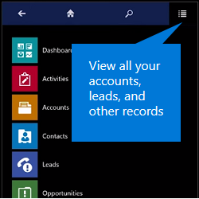
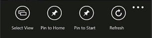
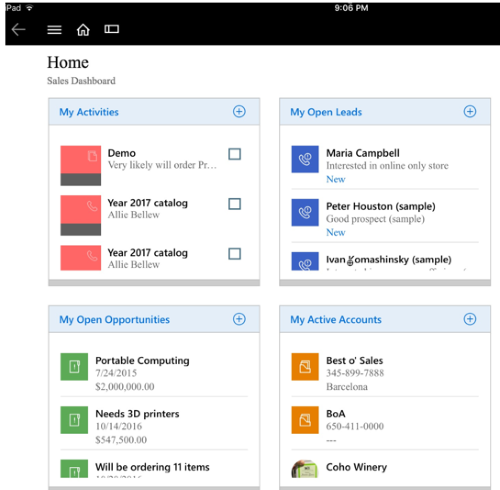

# Basic navigation in Dynamics 365 for phones and tablets

## The menu  
 When you want to view all of your accounts, contacts, leads, or other records, use the menu.  
  
 Tap the menu icon on the top of the page, then select the type of record you want to work with.  
  
   
  
## The command bar  
 You can add a new record, change views, or do other tasks from the command bar.  
  
 Just tap  on the bottom right-hand corner of the page.  
  
 You can also press and hold an item to display the command bar.  
  
   
  
 The command bar is context-sensitive, and the available commands change depending on where you are in the app. When you display the command bar for a specific item (when you press and hold the item), the commands that appear are relevant to that item.  
  
   

## The Home page: your dashboards  
 If you want to use a different dashboard, it’s easy to switch back and forth.  
  
 Tap **Dashboards** in the menu and then select the dashboard you want to use.  
  
 When you want to go back to your Home screen, tap **Home**.  
  
   
  
 To create new dashboards in [!INCLUDE[pn_crm_shortest](../../../../includes/pn-crm-shortest.md)] and enable them for use in [!INCLUDE[pn_crm_shortest](../../../../includes/pn-crm-shortest.md)] for phones and tablets, see [Create or customize dashboards](../../../../customize/create-edit-dashboards.md).  
  
## Screen orientation

For phones, portrait mode is set as the default screen orientation. For tablets, landscape mode is set as the default. Screen orientation for Dynamics 365 for phones and Dynamics 365 for tablets apps cannot be changed. 

[!INCLUDE[footer-include](../../../../includes/footer-banner.md)]