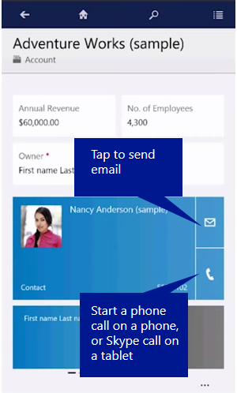

# Email and call customers in Dynamics 365 for phones and tablets

 Call or send email to your customers easily from the mobile apps. Tap any phone number in a record to start a call, or on the communication card for a contact, tap the email button to send an email, or the phone button to start a call.  
  
   
  
 In [!INCLUDE[pn_moca_short](../../../../includes/pn-moca-short.md)], tapping the phone button starts a [!INCLUDE[pn_skype](../../../../includes/pn-skype.md)] call. In [!INCLUDE[pn_Mobile_Express_short](../../../../includes/pn-mobile-express-short.md)], it starts a phone call.  
  
 When you’re finished with your call, the app prompts you to enter details about the call. If you’re using a [!INCLUDE[pn_windows8](../../../../includes/pn-windows8.md)] or later tablet, you can enter details while you’re on the call, because [!INCLUDE[pn_skype](../../../../includes/pn-skype.md)] snaps to the screen next to the [!INCLUDE[pn_moca_short](../../../../includes/pn-moca-short.md)] app.  
  
### See also  
 [Pin your favorites in Dynamics 365 for phones and tablets](pin-favorites.md)   
 [Search and sort in Dynamics 365 for phones and tablets](search-sort.md)

[!INCLUDE[footer-include](../../../../includes/footer-banner.md)]