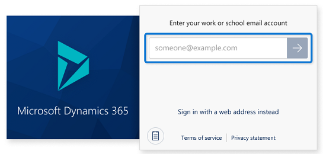
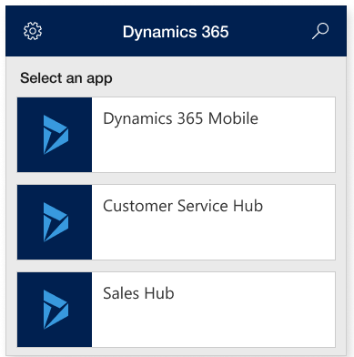

# Signing in and signing out (for iOS users)

Sign in to the Dynamics 365 mobile app quickly using your work email address or web address for the Dynamics 365 app that you use. 

> [!IMPORTANT]
> - This feature is supported for both version 8.x (Online and on-premises) when signing in using the mobile app on an iOS device.
> - If you are a [Dynamics 365 US Government](https://docs.microsoft.com/dynamics365/customer-engagement/admin/government/microsoft-dynamics-365-government)(GCC and GCC High)user, you are required to sign in using the web address option.

### Required services (for admins)
This list identifies all services to which Dynamics 365 for Phones and Tablets talks and their usages. Your network must **not** block these services.

| Domain(s) | Protocols | Uses |
| --- | --- | --- |
| service.powerapps.com |https |Starting with version 13.19033.0, used for email sign-in and the app list. |
## Sign in with your email address

To sign in using your work email address, enter your email address, and then select .

.

2.	When you sign in, you see a list of apps that you have access to. If you have access to multiple organizations, you see all the apps that you have access to across organizations.

3.	Select the app that you want to use.

    . 

### Sign out

1. If you selected the app for version 8.x from the app list above, go to the Home page, tap .  
  
2. Select **Settings**.  
  
3. Select **Sign Out**.  

## Sign in with your web address

You can also sign in using your web address for the Dynamics 365 app and user name and password. 

1. On the sign-in screen, select **Sign in with a web address instead**.

    . 

    > [!NOTE]
    > If you need help with your sign-in information, contact your Dynamics 365 administrator.

2. Enter the web address for the Dynamics 365 app that you use, and select . 

3. On the next screen, enter your user name and password, and select **Sign in**.  
  
   A few basic navigation tips appear while your app starts up. Be sure to stay on this screen while your app starts up so any changes can download successfully to your device. If you switch to another app during this time, the processing will restart when you open this one again.  
  
   Here's how to sign out in case someone else needs to use your device.  
  
4. From your Home page, select .  
  
5. Select **Settings**.  
  
6. Select **Sign Out**.  

