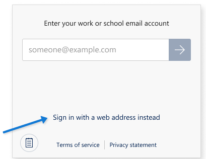

# Sign in and sign out

Sign in using your web address for the Dynamics 365 app and user name and password. 

1. On the sign-in screen, select **Sign in with a web address instead**.

    . 

> [!IMPORTANT]
> - If you are a [Dynamics 365 US Government](/dynamics365/customer-engagement/admin/government/microsoft-dynamics-365-government)(GCC and GCC High)user, you are required to sign in using the web address option.

2. Enter the web address for the Dynamics 365 app that you use, and select . 

3. On the next screen, enter your user name and password, and select **Sign in**.  
  
   A few basic navigation tips appear while your app starts up. Be sure to stay on this screen while your app starts up so any changes can download successfully to your device. If you switch to another app during this time, the processing will restart when you open this one again.    

## Sign out
  
1. From your Home page, select .  
  
2. Select **Settings**.  
  
3. Select **Sign Out**.  

### Required services (for admins)
This list identifies all services to which Dynamics 365 for Phones and Tablets talks and their usages. Your network must **not** block these services.

| Domain(s) | Protocols | Uses |
| --- | --- | --- |
| service.powerapps.com |https |Starting with version 13.19033.0, used for email sign-in and the app list. |

[!INCLUDE[footer-include](../../../../includes/footer-banner.md)]