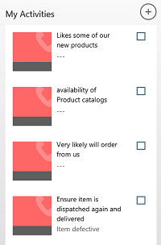

# Manage activities in Dynamics 365 for phones and tablets

## My Activities  
 Use activities to keep track of all your customer communications. For example, during the course of a sale, you might send emails, make phone calls, set up appointments, or assign tasks. All of these are considered activities, and the [!INCLUDE[pn_crm_shortest](../../../../includes/pn-crm-shortest.md)] for phones and tablets app helps you track them so you don’t miss an important follow-up activity.  
  
 On your dashboard, **My Activities** shows activities that are past due or due today in a darker color than those that aren’t. You can do the following from your activity feed:  
  
- To view an activity, select it from your **My Activities** feed on the dashboard.  
  
- To add an activity, tap **+** at the top of your **My Activities** feed.  
  
- To mark an activity complete, tap the check box next to the activity in the feed.  
  
- To see a subset of your activities:  
  
  -   On a tablet, press and hold **My Activities** and tap **Select View** on the command bar.  
  
  -   On a phone, tap **Select View** on the command bar.  
  
    
  
### See also  
 [Dynamics 365 for phones and tablets User's Guide](../../../../customerengagement/on-premises/basics/dynamics-365-phones-tablets-users-guide-onprem.md)

[!INCLUDE[footer-include](../../../../includes/footer-banner.md)]