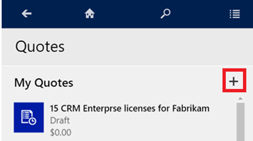
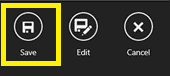
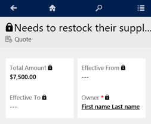
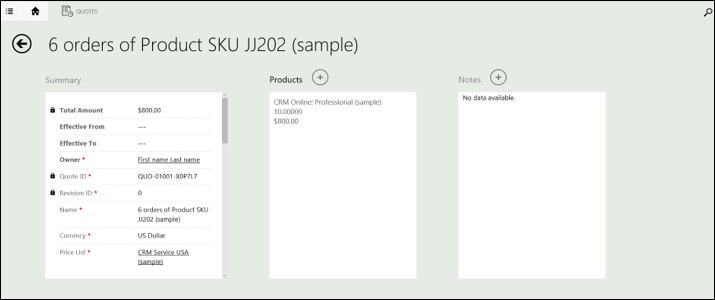
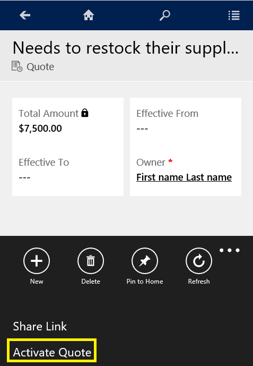
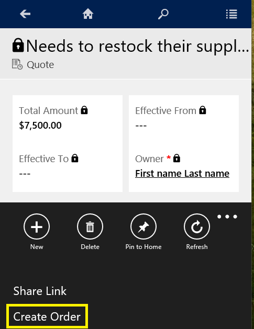
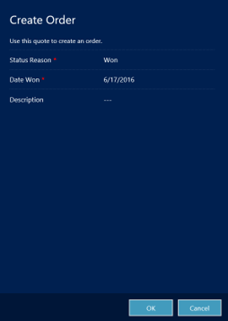
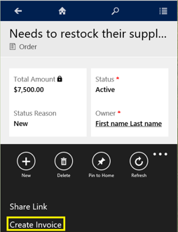

# Manage quotes, orders, and invoices in Dynamics 365 for phones and tablets

As a sales professional, you'll frequently work with the following types of records:  
  
- **Quotes**: Most sales begin with a price quote, which eventually leads to an order.  
  
- **Orders**:  When a quote is accepted and approved, it becomes an order.  
  
- **Invoices**:  Once an order is shipped or delivered, an invoice is created.  
  
  With [!INCLUDE[pn_microsoftcrm](../../../../includes/pn-microsoftcrm.md)], it's easy to customize for the way your organization does business, so  you might see different types of records in your [!INCLUDE[pn_crm_shortest](../../../../includes/pn-crm-shortest.md)] system.  
  
> [!NOTE]
>  Managing quotes, orders, and invoices is not supported in an offline environment.  
> 
>  This feature was introduced in [!INCLUDE[pn_crm_8_1_0_op](../../../../includes/pn-crm-8-1-0-op.md)] and [!INCLUDE[pn_crm_8_1_0_online](../../../../includes/pn-crm-8-1-0-online.md)].  
  
## View or change records  
  
1.  Tap the menu button , and then tap the record type you want from the drop-down list.  
  
2.  Open the record type.  
  
3.  Tap the record.  
  
4.  Make your changes.  
  
## Create a new quote  
  
### Phone  
  
1.  Go to the **Quote** screen.  
  
2.  Tap the Add button **+** to the right of the header.  
  
       
  
3.  Enter the information, and then save the record.  
  
       
  
### Tablet  
  
1.  On the  **Home** screen, tap the ellipsis button ( **...**) at the bottom-right corner of the screen.  
  
2.  Tap **New Record**.  
  
       
  
3.  Select **Quote** from the list.  
  
4.  Enter the information for the quote, and then tap  **Save**.  
  
## Create a quote from an opportunity  
  
### Phone  
  
1.  Open the opportunity.  
  
2.  With the opportunity open, swipe left to the **Product Line Items** screen and make sure a price list is selected.  
  
3.  Go to the next tab on the right. If a product isn't automatically selected, tap the Add button **+**.  
  
4.  Select the product(s) you want, and then tap **Save**.  
  
5.  Go to the **Opportunity Quotes** screen, and then tap the Add button **+**.  
  
6.  On the **Quotes** page,  verify that the quote is listed.  
  
       
  
### Tablet  
  
1.  Open the opportunity.  
  
2.  Go to **Opportunity Quotes** on the far right, and then tap the Add button **+**.  
  
       
  
3.  Review the quote.  
  
       
  
## Activate a quote  
  
### Phone  
  
1.  Open the quote, and then tap the ellipsis (**...**) at the bottom-right corner of the screen.  
  
2.  Tap **Activate Quote**.  
  
       
  
### Tablet  
  
1.  Open the quote, and then tap the ellipsis (**...**) at the bottom-right corner of the screen.  
  
2.  Tap **Activate Quote**.  
  
       
  
## Create an order from a quote  
  
### Phone  
  
1.  Open an active quote, and then tap the ellipsis (**...**) at the bottom-right corner of the screen.  
  
2.  Tap **Create Order**.  
  
       
  
3.  On the **Create Order** page, verify that all information is correct, enter a description (optional), and then tap **OK**.  
  
### Tablet  
  
1.  Open an active quote, and tap the ellipsis (**...**) at the bottom-right corner of the screen.  
  
2.  Tap **Create Order**.  
  
       
  
3.  Review the order, add a description (optional), and then tap **OK**.  
  
       
  
4.  Open the orders list, and verify that the new order is  there.  
  
## Create an invoice from an order  
  
### Phone  
  
1.  Open the order, and then  tap the ellipsis (**...**) at the bottom-right corner of the screen.  
  
2.  Tap **Create Invoice**.  
  
       
  
### Tablet  
  
1.  Open the order, and then tap the ellipsis (**...**) at the bottom-right corner of the screen.  
  
2.  Tap **Create Invoice**.  
  
       
  
### See also  
 [Install Dynamics 365 for phones and tablets](install.md)

[!INCLUDE[footer-include](../../../../includes/footer-banner.md)]