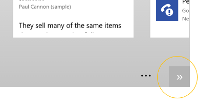

# A note for Android users of Dynamics 365 for phones and tablets

[!INCLUDE[cc-applies-to-update-8-2-0](../../../../includes/cc_applies_to_update_8_2_0.md)]

Navigation on [!INCLUDE[tn_android](../../../../includes/tn-android.md)] tablets is a little different than on [!INCLUDE[tn_ipad](../../../../includes/tn-ipad.md)] or [!INCLUDE[pn_ms_Windows_short](../../../../includes/pn-ms-windows-short.md)] tablets.  
  
 When you scroll on an [!INCLUDE[tn_android](../../../../includes/tn-android.md)] tablet by swiping left or right, the app scrolls a whole page at a time instead of a partial page. You can also use the arrow buttons at the bottom of the screen to scroll left or right.  
  
   
  
 Depending on where you are in the app, the [!INCLUDE[tn_android](../../../../includes/tn-android.md)]**Back** button takes you to the previous form, cancels dialog boxes or error messages, closes the keyboard, or performs other actions depending on the context.  
  
## See Also  
 [Dynamics 365 for Phones and Tablets User's Guide](../../../dynamics-365-phones-tablets-users-guide.md)