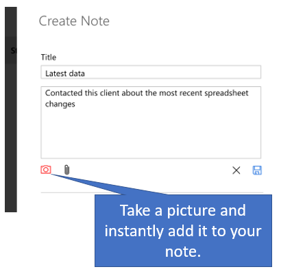

# Notes in Dynamics 365 for phones and tablets

Taking a cue from easy-to-use social media apps, the mobile app now lets you start a note from anywhere, and attach the note to whatever you’re doing at that moment. You can also attach photos to a note, or take a new photo with your device's camera. So if, for example, you're out at a site and need to document a customer's issue with a product, you can capture and add it to a note right away, rather than taking the photo, then adding it from your camera roll later.  
  
   
  
### See also  
 [Dynamics 365 for phones and tablets User's Guide](../../../../customerengagement/on-premises/basics/dynamics-365-phones-tablets-users-guide-onprem.md)

[!INCLUDE[footer-include](../../../../includes/footer-banner.md)]