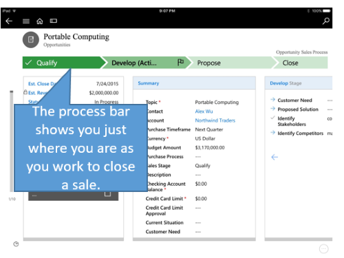

# Nurture leads through the sales process in Dynamics 365 for phones and tablets

[!INCLUDE[cc-applies-to-update-8-2-0](../../../../includes/cc_applies_to_update_8_2_0.md)]

## Track leads through the sales process  
 Move customers through the sales process, from lead to close, with the process bar. Once you’ve completed the steps in one stage, you can move on to the next one. The process bar highlights the stage you’re in so you know where you are in the process, and shows you what to do next.  
  
   
  
 For example, in the illustration above, you start the process with a lead. In the first stage (**Qualify**), you qualify or disqualify the lead based on criteria established by your company. If you qualify the lead, it’s converted to an opportunity. The process bar then walks you through the rest of the stages: **Develop**, **Propose**, and **Close**.  
  
 The process bar helps you and everyone on your sales team follow best practices. The process bar that your company uses might have different stages than the one illustrated, to match the way you do business.  
  
### Qualify, Disqualify, or Reopen an opportunity  
 To change the status of an opportunity, tap **Qualify**, **Disqualify**, or **Reopen Opportunity** on the command bar.  
  
## See Also  
 [Dynamics 365 for Phones and Tablets User's Guide](../../../dynamics-365-phones-tablets-users-guide.md)