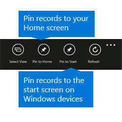

# Pin your favorites in Dynamics 365 for phones and tablets

 Pinned tiles provide quick access to your records, contacts, views, and dashboards. You can pin as many tiles as you want to the Pinned Tiles section of your Home screen or to the Start screen or menu of [!INCLUDE[pn_windows8](../../../../includes/pn-windows8.md)] and [!INCLUDE[pn_windows_10](../../../../includes/pn-windows-10.md)] devices.  
  
 Press and hold the item you want to pin, or display the command bar while viewing a record, and then tap **Pin to Home**.  
  
   
  
   
#### Create a communication card  
 Communication cards provide a quick way to email or call your contact just by tapping the email address or phone number on the card. Communication cards appear on contact forms, but you can also create a communication card from a contact in the Pinned Tiles section of your Home screen by expanding the pinned tile.  
  
 Press and hold a contact tile that’s pinned to the dashboard, and then tap **Larger** on the command bar.  
  
   
  
### See also  
 [Dynamics 365 for phones and tablets User's Guide](../../../dynamics-365-phones-tablets-users-guide.md)

[!INCLUDE[footer-include](../../../../includes/footer-banner.md)]