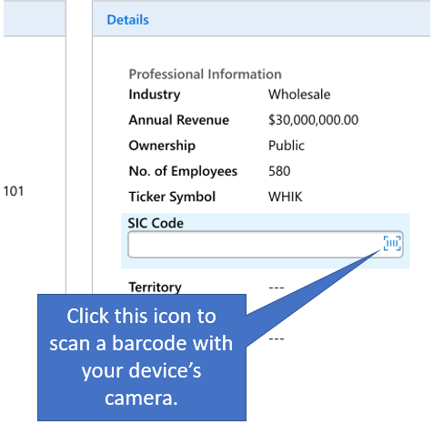

# Scan barcodes  in Dynamics 365 for phones and tablets

Rather than manually typing a barcode number into a field, you can scan barcodes by using your device's camera. Tap the icon to the right of the field to start the scanner. This makes it easy to capture info about inventory and other issues when you're out in the field. You'll need to ask your admin to set this feature up for you.  
  
   
  
### See also  
 [Field Service Mobile App User’s Guide](../../../../field-service/field-service-mobile-app-user-guide.md)

[!INCLUDE[footer-include](../../../../includes/footer-banner.md)]