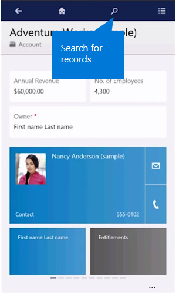
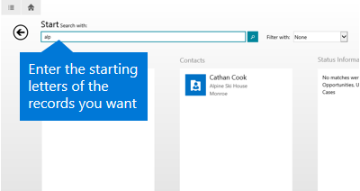
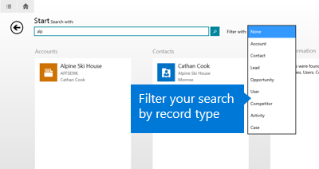
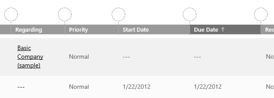

# Search and sort in Dynamics 365 for phones and tablets
  
 To search, tap  on the top of the page, type in the search box, and tap  next to the search box.  
  
   
  
 Search results include only records that begin with the letters you type. For example, if you want to search for “Alpine Ski House,” type **alp** in the search box. If you type **ski**, the record won’t show up.  
  
   
  
#### Filter search results  
 To filter results by record type, choose a record type from the **Filter with:** drop-down box.  
  
   
  
#### Resize columns  
 You can resize columns in a grid in the [!INCLUDE[pn_moca_short](../../../../includes/pn-moca-short.md)] app, and the app will remember your settings the next time you view that grid.  
  
1. On the command bar, tap **Resize Columns**.  
  
2. Drag the column handles that appear above the grid to the width you want.  
  
     
  
#### Sort items  
 You can also sort items in a grid in the Dynamics 365 for tablets app:  
  
-   To sort in ascending order by a column, tap that column’s heading.  
  
-   To sort in descending order, tap the column’s heading again.  
  
#### Export records to Excel  
 In [!INCLUDE[pn_Mobile_Express_long](../../../../includes/pn-mobile-express-long.md)] and [!INCLUDE[pn_moca_short](../../../../includes/pn-moca-short.md)], you can export records to [!INCLUDE[pn_microsoft_excel](../../../../includes/pn-microsoft-excel.md)], just like you can in the web app. From a grid view in [!INCLUDE[pn_moca_short](../../../../includes/pn-moca-short.md)] or a list of records in [!INCLUDE[pn_Mobile_Express_short](../../../../includes/pn-mobile-express-short.md)], tap **…** to open the command bar and then tap **Export to Excel**.  
  
 [!INCLUDE[proc_more_information](../../../../includes/proc-more-information.md)] [Export data to Excel](../../../../customerengagement/on-premises/basics/export-data-excel.md)  
  
> [!IMPORTANT]
>  [!INCLUDE[cc_feature_included_with_update_2016](../../../../includes/cc-feature-included-with-update-2016.md)]  
  
### See also  
 [Dynamics 365 for phones and tablets User's Guide](../../../../customerengagement/on-premises/basics/dynamics-365-phones-tablets-users-guide-onprem.md)

[!INCLUDE[footer-include](../../../../includes/footer-banner.md)]