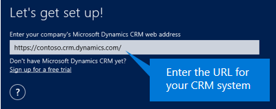

# Signing in and signing out on Dynamics 365 for phones and tablets

[!INCLUDE[cc-applies-to-update-8-2-0](../../../../includes/cc_applies_to_update_8_2_0.md)]

### Signing in and signing out  
 To sign in, you’ll need your [!INCLUDE[pn_microsoftcrm](../../../../includes/pn-microsoftcrm.md)] web address, user name, and password. If you don’t have any of these, contact your [!INCLUDE[pn_crm_shortest](../../../../includes/pn-crm-shortest.md)] admin.  
  
1.  Open your app, enter your [!INCLUDE[pn_crm_shortest](../../../../includes/pn-crm-shortest.md)] web address, and tap .  
  
       
  
2.  On the next screen, enter your user name and password, and tap **Sign in**.  
  
 A few basic navigation tips appear while your app starts up. Be sure to stay on this screen while your app starts up so any changes can download successfully to your device. If you switch to another app during this time, the processing will restart when you open this one again.  
  
 Here's how to sign out in case someone else needs to use your device.  
  
1.  From your Home page, tap .  
  
2.  Tap **Settings**.  
  
3.  Tap **Sign Out**.  
  
 You can sign in again as the same or a different user, or you can sign in to a different organization.  
  
### See also  
 [Dynamics 365 for Phones and Tablets User's Guide](../../../dynamics-365-phones-tablets-users-guide.md)