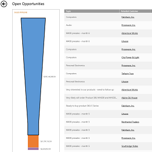
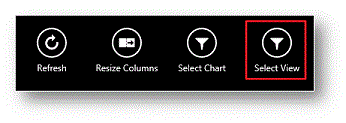
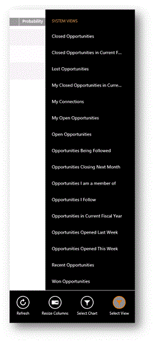

# Track your progress with charts in Dynamics 365 for phones and tablets
  
 Charts give you a quick view of how you’re tracking to your goals. They’re interactive, so you can tap an area of a chart to see the data for that area, or you can tap the area outside the chart to see the data for the entire chart. In the phone app, swipe left and right to view the chart and its associated records.  
  
   
  
 Tap any of the records to see more information.  
  
#### Change the chart view  
 Changing the chart view shows you a different breakdown of your data, such as opportunities opened within a specific time period.  
  
1.  On the command bar, tap **Select View**.  
  
       
  
2.  Select the view you want.  
  
       
  
#### Show a different chart  
 You can change the chart to show data for a different type of record in much the same way.  
  
1.  Tap **Select Chart** on the command bar.  
  
2.  Select the chart you want to display.  
  
### See also  
 [Dynamics 365 for phones and tablets User's Guide](../../../dynamics-365-phones-tablets-users-guide.md)

[!INCLUDE[footer-include](../../../../includes/footer-banner.md)]