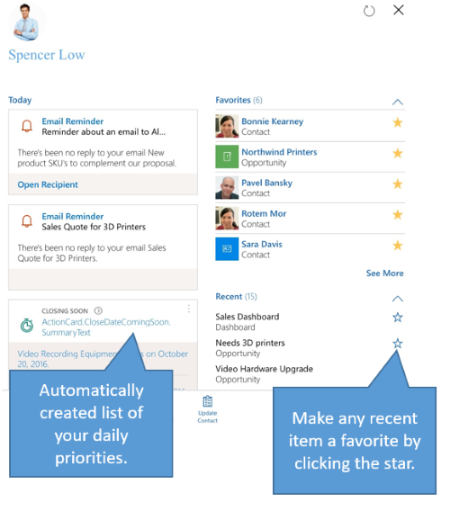

# The workspace, your personalized action hub in Dynamics 365 for phones and tablets

When you first sign in to Dynamics 365 for phones and tablets, a pane slides in. This is your all-new workspace, a personalized action hub to help you get to common tasks more quickly.  
  
 From the workspace, you can instantly create new activities, records, and notes. It features a list of suggested priorities (“intelligent cards”) in the left column. These may include upcoming meetings, info relevant to that day’s activities, and other things that require attention, and are part of a suite of new features collectively called [Embedded intelligence](https://docs.microsoft.com/dynamics365/ai/sales/embedded-intelligence). The workspace also has a list of favorite and recent items. Items that appear in the **Recent** feed can be added to **Favorites** by hitting the star icon. You can also click on your profile picture to upload or capture a new one.  
  
   
  

[!INCLUDE[footer-include](../../../../includes/footer-banner.md)]