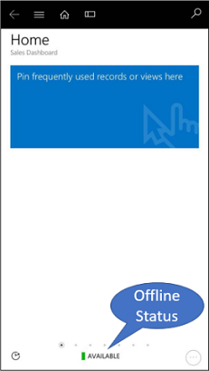
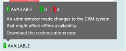
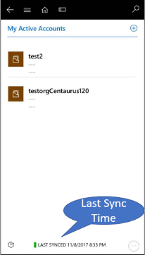
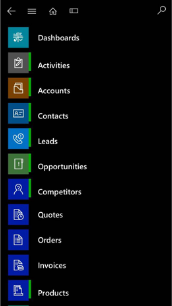
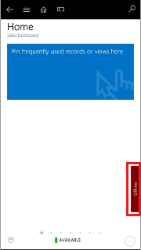
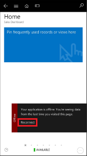
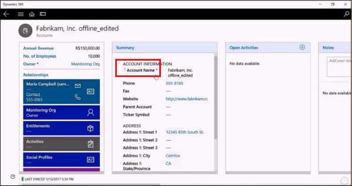

# Work offline with Dynamics 365 for phones and tablets

Your [!INCLUDE[pn-microsoftcrm](../../../includes/pn-microsoftcrm.md)] for phones and tablets users aren't always going to be connected to a network. Admins can enable and configure mobile offline so even when no network is available users can still be productive with up-to-date information at hand. 

> [!NOTE]
> Mobile offline functionality for version 8.x customers will not be available post general availability (second quarter of 2019) of the new offline solution for version 9.0. This is in line with the guidelines already provided to version 8.x customers about upgrading to the latest generally available version by January 31, 2019. To leverage the upcoming offline capabilities, we recommend upgrading to the latest server version as soon as possible. 

## Mobile offline capabilities for administrators

[!INCLUDE[pn-microsoftcrm](../../../includes/pn-microsoftcrm.md)] for phones and tablets provides the following for administrators:

- Manage the offline capability for your org by provisioning and deprovisioning it.
- Control the right amount of data for mobile with the following filter capability: 
  - Mobile offline entity filter. Once admins enable an entity for mobile offline, they can set an entity filter to download the data to mobile middleware. 
    Note: if no rules are set on a mobile enabled entity data, users will not have any data available  offline for that entity.
  - Profile definition with filter. Admins can create a profile which will define the data available on user in mobile offline. These filters will be applied on the middleware data set available for your org based on the mobile offline entity filter. Admins must assign the profile to users and publish it, for the profile to become active.
    Note: only the mobile offline enabled entity can be part of the profile.  
    For more information, see [Filter your data for mobile offline usage on Microsoft Dynamics 365 apps](https://blogs.msdn.microsoft.com/crm/2017/07/07/filter-your-data-for-mobile-offline-usage-on-microsoft-dynamics-365/).
- All the data will be downloaded to the mobile client based on user security access.
- If a user is following a record in [!INCLUDE [pn-crm-2016](../../../includes/pn-crm-2016.md)] and the corresponding entity is part of the profile, then the record will be available to the user when offline. If the user stops following the record, it will be removed from offline in the mobile client.

## Mobile offline capabilities for end users

[!INCLUDE[pn-microsoftcrm](../../../includes/pn-microsoftcrm.md)] for phones and tablets provides the following for end users:

- Offline enabled entities: [!INCLUDE[pn-microsoftcrm](../../../includes/pn-microsoftcrm.md)] mobile-enabled entities can be enabled for mobile offline. 
  - Users can perform create, read, update, and delete (CRUD) operations on entities when offline based on the [!INCLUDE[pn-microsoftcrm](../../../includes/pn-microsoftcrm.md)] security model. 
  - Business process flows are supported in offline mode. Users can move the business process stage when offline for a single entity. 
  - Business process flows with multiple entities or business process flows with child processes are not supported. 
  - Other than create, read, update, and delete operations in offline mode, users can perform before commands:
    -  Business process: Next/Previous stage commands, Set Active commands
    -  Lead entity: Qualify and Disqualify commands 
    -  Opportunity entity: Command to perform Close as won\lost  
    -  Case entity: Command to Resolve case 
    -  Activity: Convert to opportunity command, Close activity through ‘Mark Complete’ command in Activity form and Activity Grid
- Lookup supported to offline records: Look up are supported for the entities that are mobile offline enabled.  All the entities participating in the lookup should be mobile offline enabled. 
- Offline views: Only system views are supported in mobile offline. There are limitation of Views supported in offline.
- Offline search:
  - Available only for offline entities. User can only search one entity at a time. Only categorized search is supported in offline and not relevant search.
  - Date field not available for mobile offline search. 
- Security modelling:
  - Mobile offline honors the [!INCLUDE[pn-microsoftcrm](../../../includes/pn-microsoftcrm.md)] security model. It also supports the hierarchical security model.  
  - Field level security and attribute sharing are not supported for offline. 

- If user was working on a record and loose the network connection, the updates on the record will be saved in the offline mode and will be synchronized to [!INCLUDE[pn-microsoftcrm](../../../includes/pn-microsoftcrm.md)] once the user goes back online. The record, once synchronized to [!INCLUDE[pn-microsoftcrm](../../../includes/pn-microsoftcrm.md)], will follow the filter rule for availability in offline mode. 

For more information, see [Work offline in Dynamics 365 for phones and tablets]().

For a list of entities supported in mobile offline, see [Entities displayed in Dynamics 365 for phones and tablets](/previous-versions/dynamicscrm-2016/administering-dynamics-365/dn531159(v=crm.8)#Entities%20displayed%20in%20Dynamics%20365%20for%20phones%20and%20tablets).

## Other offline capabilities

- Offline data is refreshed periodically. Duration of the refresh depends on the mobile offline profile and amount of data that is enabled for offline.
- Automatic replay for offline actions. All the data created or modified by user in offline are replayed to [!INCLUDE[pn-microsoftcrm](../../../includes/pn-microsoftcrm.md)]  automatically without user intervention. 
- Actions are replayed from the offline synchronization in queue. The changes are played back in the same sequence as they were created/modified/ deleted. This ensure that the data state is maintained and there are no data mismatch on [!INCLUDE[pn-microsoftcrm](../../../includes/pn-microsoftcrm.md)]. 
- Mobile offline supports conflict detection and error resolution. Conflict error for any update and delete will be detected and users can resolve the error in the  [!INCLUDE[pn-microsoftcrm](../../../includes/pn-microsoftcrm.md)] web client and on the mobile client. Any other errors created in offline will also be available for users to edit and resubmit. 
- The org can enhance business functionality available in mobile offline using Xrm.Mobile.offline. For more information, see [Xrm.Mobile.offline (client-side reference)](/previous-versions/dynamicscrm-2016/developers-guide/mt787123(v=crm.8)).

### Mobile offline blogs

- Feature overview: [The new full offline experience with mobile Dynamics CRM apps](/archive/blogs/lystavlen/the-new-full-offline-experience-with-mobile-dynamics-crm-apps)
- Filtering in mobile offline: [Filter your data for mobile offline usage on Microsoft Dynamics 365 apps](https://blogs.msdn.microsoft.com/crm/2017/07/07/filter-your-data-for-mobile-offline-usage-on-microsoft-dynamics-365/)

### Mobile offline videos

- [Working offline with Dynamics 365 apps](https://youtu.be/V-eIlZ04zQE)
- [Microsoft Dynamics CRM Online 2016 Update 1 New Features- Mobile Offline](https://youtu.be/GMlm3pnr-Z0)

## Work in disconnected mode with Dynamics 365 for phones and tablets 

You can continue to work in the mobile apps when the device is disconnected from the internet when you've enabled mobile offline synchronization.

With mobile offline synchronization enabled, the app provides a rich offline experience. You can work with all the basic commands like create, read, update, delete in addition to certain business processes. Upon reconnecting, these offline changes will be automatically synchronize to Dynamics 365 apps. The data is periodically synchronized from Dynamics 365 apps to your device for offline usage based on the sync profile configured by administrator.  

### Download app updates for offline 

When you log onto the Dynamics 365 apps mobile app, you will see the list of app modules that you have access to. When you navigate to any app module that your admin has configured for offline, you'll receive a prompt to download these config updates to setup your app to work in offline mode.  

### Offline synchronization status 

#### Status on footer

To verify offline synchronization is enabled on your app look at the offline synchronization status in the footer of the app. The status also lets you know the entities that are available in offline and, for each of these available entities, when the data is last synchronized with Dynamics 365 apps.  

The following table lists the various status icons and what they mean.

|Mobile offline synchronization status icon |Status |Description  |
|---------|---------|---------|
|     |Available         |Offline synchronization is available as the device database is available.         |
|     |Available          |Warning due to metadata mismatch. You can tap on the link in the status to download the metadata if it's pending from Dynamics 365 apps.|
|     |Initializing         |Offline database is being setup.         |
|      |Not available         |Offline synchronization is not available as the database is not created on your mobile device.        |
|     |Not available         |Offline synchronization is not available. A background fix is in process.          |
|      |Error         |The database is not available.         |

> [!NOTE]
> If there is no status in the footer, offline synchronization is not enabled for your app or the user has not been added to the mobile offline profile.

#### Status flyout 

You can check the reason for the offline synchronization status by clicking on this status. This opens a flyout which shows the number of entities enabled for offline along with status reasons, if any. 

| |  |
|---------|---------|
| Number of entities enabled     | Status reasons         |

#### Last Sync Time 

For offline available entities, when you navigate to the entities grid or form, you can check in the footer when data is last synchronized with Dynamics 365 apps.

#### Status on sitemap 

You can also check the status of entities enabled for offline on the sitemap. A vertical rectangle on right side of the entity’s image represents the offline status.  

- Green – entity is enabled for offline and is available to work in when offline 
- Red – entity is enabled for offline but is not available to work in when offline due to an error
- No rectangle – entity is not enabled for offline  

### Offline data

Users will have the following data in offline mode:
- Data of all available entities as per the filters defined by admin in the profile. 
- Any records of offline available entities that you follow on Dynamics 365 apps will be available in when offline. 
- Any records of offline available entities that you are working on when you lose the connectivity will be available when offline, and you can continue working on these records. The changes in these records will be synchronized to Dynamics 365 apps when you reconnect and will be available when offline again as per your filters.    

### Offline indicator

As soon as the application is disconnected from the server you will see an indication on the application that it is offline. Once you have reconnected to your phone service or internet, tap this offline indicator to reconnect to Dynamics 365 apps.

| |  |
|---------|---------|
| Tap offline     | Tap Reconnect         |

### Working in offline mode

You can seamlessly work in offline mode with all available entities. In offline mode you have support for:

- Create, read, update, and delete (CRUD) actions
- Business processes:
  -  Next Stage 
  - Previous Stage 
  - Set Active
- Commands 
  - Lead – Qualify\Disqualify 
  - Opportunity – Close as won\lost 
  - Case – Resolve 
  - Activity – Convert to opportunity  
  - Close activity through Mark Complete command in Activity form and Activity grid.  
- Entity Views 
- Search 
- Lookup for offline records 

Watch a short [video](https://go.microsoft.com/fwlink/p/?linkid=837630) (3:06) about working offline with Dynamics 365 apps. 

### Automatic playback

On reconnecting to the Dynamics 365 apps, all offline actions are automatically played back to the Dynamics 365 apps. Any errors during this automatic play back are captured and stored in the Sync Error entity.  

### Sync conflict resolution

Changes done in offline mode on your device that create conflicts with Dynamics 365 apps are detected and captured in the Sync Error entity. You can view and resolve these errors either in Dynamics 365 apps or on the device. Sync Error conflict resolution gives you an option to either keep the offline changes on the device or reject them for the changes in Dynamics 365 apps. 

When resolving a sync error, an exclamation mark (!) highlights the conflict fields before you update them. If a record has changed Dynamics 365 apps between the time your device retrieved the record and when it tries to update or delete that record, you'll see an exclamation mark (!) by the relevant field and you'll need to resubmit your updated changes. 

### Background sync

Background sync is enabled even when the app is minimized as long as a network connection is detected. But when the app is in the background, metadata changes will not be accepted automatically. When you bring the app to the foreground, you will be prompted to accept the metadata changes. 

**About background sync**

- Sync will run until you sign in to the mobile app. 
- While the app is running in the background, sync is automatically enabled when a network is detected. 
- While the app is running in the background, sync is automatically disabled when a network is disabled 
- When you bring the app to the foreground, regular sync is detected and enabled. 
- Background sync is disabled when the device is locked and enabled when the device is unlocked. 
- While the app is running in the background, metadata changes will not be accepted automatically; the mobile app will stop the background sync. 
- When you bring the app to the foreground, you are prompted to accept the metadata changes. 
- While the app is running in the foreground, after metadata is updated, the app will switch to regular sync. 

Background sync will be disabled if: 

- Your user token expires in the background. 
- The application closes for some reason. 
- Your device locks. 

  Background sync is available on all supported devices. See [Support for Dynamics 365 for phones and Dynamics 365 for tablets](../set-up-manage/support.md).

## Offline synchronization vs. Offline drafts  
 You’ll have one of two possible offline experiences, depending on which one your admin set up:  

- **Seamless mobile offline synchronization**. You can view, edit, and create records while you're disconnected from the Internet. Once you're back online, changes you've made are synchronized with [!INCLUDE[pn-microsoftcrm](../../../includes/pn-microsoftcrm.md)].  

   \- OR -  

- **Offline drafts**. This experience is available to everyone. In this case, the app keeps records you’ve used recently, so you can still access them when you’re disconnected.  

   You can also capture new information by creating drafts of new records - like accounts, contacts, and activities - and save the records the next time you go online.  

   Your offline experience might look a little different than your online experience, because charts and some images aren’t available offline.  

  [Watch a short video (3:06) about working offline with Dynamics 365 apps](https://go.microsoft.com/fwlink/p/?linkid=837630).  

### Working with offline drafts  
 You can view and create records offline and save them as drafts. Once you’re reconnected, save them as soon as you can. Unsaved drafts are available only on your mobile device.  

1.  From the menu, tap **Draft Records**.  

    

2.  Select each record individually and tap **Save**.  

### A few things to note about offline drafts  

-   While offline, you can only create and edit new records. To edit existing records, you need to be connected.  

-   While offline, you can only create standalone records or associate records to those that are available for offline access on your device. For example, you can create an opportunity for an account only if that account was created before you went offline, and if it’s available for offline access. You can’t create an opportunity for an account while offline if you also created the account while offline.  

-   While offline, you can’t set the value for lookup fields. If you create a record that is associated with another record, such as adding a phone call to a contact, some lookup fields might populate automatically (in this case, the To and From fields might pre-populate). You need to fill these fields in once you re-connect while you review and save your drafts.  

## About cached data  
 The records you’ve recently used are kept on your mobile device, and are also known as cached data. Cached data is specific to your device, so if you use both the phone and tablet apps, the cached data on each device will be different, depending on the records you’ve viewed on each one.  

> [!WARNING]
> Cached data is not encrypted. You can use BitLocker to encrypt the entire hard drive on a [!INCLUDE [pn-windows8](../../../includes/pn-windows8.md)] or [!INCLUDE [pn-windows-10](../../../includes/pn-windows-10.md)] device.  

## If you’re prompted to sign in while you’re disconnected  
 If you’re prompted to sign in while you’re offline, tap the **Back** button on the sign-in page and you’ll still be able to work in offline mode on [!INCLUDE [tn-ipad](../../../includes/tn-ipad.md)] and [!INCLUDE [pn-windows8](../../../includes/pn-windows8.md)] tablets until you can reconnect. On all other phones and [!INCLUDE [tn-android](../../../includes/tn-android.md)] tablets, however, you can no longer work in offline mode and will be redirected to the **Let’s get started** page until you can reconnect and sign in again.  

## Working offline with on-premises deployments  
 If you’re using the mobile app with [!INCLUDE [pn-crm-2015](../../../includes/pn-crm-2015.md)] (on-premises) or later, you can continue to use [!INCLUDE [pn-moca-short](../../../includes/pn-moca-short.md)] while disconnected. However, with the [!INCLUDE [pn-windows8](../../../includes/pn-windows8.md)] app, once you close the app (like when you start another app), you can’t use it until you can connect to the internet. With the [!INCLUDE [pn-windows-8-1](../../../includes/pn-windows-8-1.md)] app, you can continue to access your data even if you close the app. If you’re not sure whether your organization has an on-premises deployment, contact your Dynamics 365 apps admin to find out.  

 Note that offline synchronization is not supported by on-premises deployments.  

[!INCLUDE[footer-include](../../../includes/footer-banner.md)]