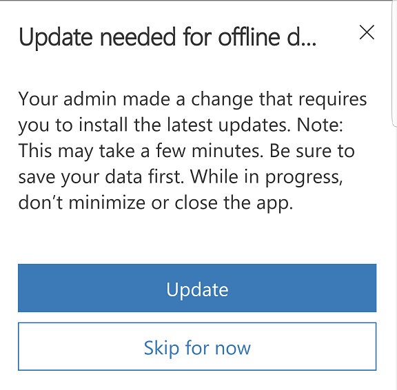
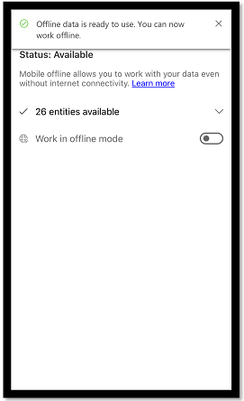
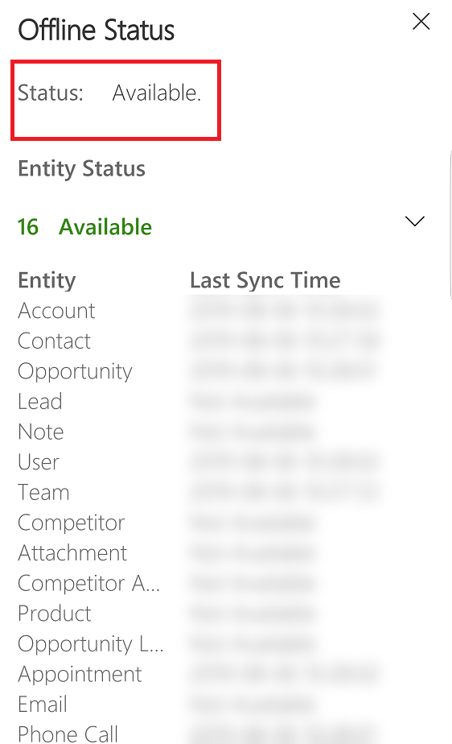
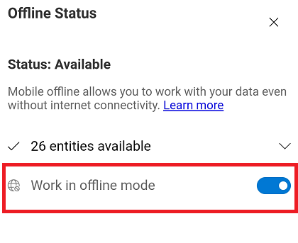

# Work offline on your mobile device

Work with your data in offline mode even when you don't have internet access. The mobile app provides a rich offline experience that lets you work with commands like create, read, update, and delete along with some special commands—so you always stay productive. Once you're back online, changes you've made are synchronized with your apps in the Microsoft Dataverse environment.

If you're working on a record and lose network connection, any updates made to the record are saved in offline mode and will be synchronized to the app once you're back online. When the record is synchronized with the app, it follows the filter rule for availability in offline mode.

> [!IMPORTANT]
> This topic covers how to use the Dynamics 365 for phones and tablets app and [Power Apps mobile](https://docs.microsoft.com/powerapps/mobile/run-powerapps-on-mobile) in offline mode. The process is the same for both apps.

## Install the mobile app

Mobile offline is currently available for iOS and Android devices. To use the mobile offline feature, download the latest version of the mobile app from the app store. 

### Install Dynamics 365 phones and tablets app (for customer engagement apps in Dynamics 365 )

For customer engagement apps in Dynamics 365 (Dynamics 365 Sales, Dynamics 365 Customer Service, Dynamics 365 Marketing) install the [install the Dynamics 365 phones and table app](https://docs.microsoft.com/dynamics365/mobile-app/install-dynamics-365-for-phones-and-tablets#install-the-app-from-your-devices-app-store).

These are the supported devices to use mobile offline:

- For iOS, version 13.19043.32 or later is supported.
- for Android, version 4.3.19043.33 or later supported.

> [!NOTE]
> - The offline feature isn't supported for Dynamics 365 Customer Engagement (on-premises). 

### Install Power Apps mobile app (for Power Apps)

For model-drvien app and canvas apps [Install the Power Apps mobile app](https://docs.microsoft.com/powerapps/mobile/run-powerapps-on-mobile#install-the-power-apps-mobile-app).

For information on supported devices for Power Apps mobile app, see [Supported devices](https://docs.microsoft.com/powerapps/mobile/run-powerapps-on-mobile#supported-devices).

## Download updates to work in offline mode

Once you have the mobile app installed and your admin has [enabled mobile offline](setup-mobile-offline.md), the next time you access the mobile app, you will be prompted to download offline updates. Once you download the updates, you can start using the mobile app in offline mode.

1. When you see the dialog box that asks you to download updates to work offline, choose **Download**. 

   > [!div class="mx-imgBorder"] 
   >   
 
2. Offline data starts to download in the background. Do not close the app or disconnect from the internet until the download is complete.

## Download offline data later

If did not want to download offline data and choose **Skip for now**, you will not be able to use the app in offline mode until you manually download the updates. 

1. To manually download updates, do one of the following:

    - **Current**: From the nav bar, select  > **Offline Status**. 
    - **Early access**: From the Home screen, select the site map  > Offline .

2. On the **Offline Status** screen, select **Download offline updates**.

   > [!div class="mx-imgBorder"] 
   > 

3. The download will start and the status will change to **Initializing**.

   > [!div class="mx-imgBorder"] 
   > 
   
3. When Offline download is completed, you will get a notification indicating that you can start working in offline mode.

   |Current  |Early access  |
   |---------|---------|
   |     |          |

## See if offline mode is available

When offline updates are complete, you can check to see if mobile offline is available. 

- To check the offline status, do one of the following:   

    - **Current**: From the nav bar, select  > **Offline Status**. 
    - **Early access**: From the Home screen, select the site map  > Offline .
    
  
    > [!div class="mx-imgBorder"] 
    > 

Legend:

1. **Status**: Tracks the offline status of the whole app, and also the status of each entity individually. When the status shows as  **Available**, it indicates offline is available and data has synced successfully.

   > [!NOTE] 
   > The status here can be **Not Available** due to an error or if you missed downloading offline updates. If the status is **Not Available** due to missing the latest offline updates, then try downloading the updates again.
   
 2. **Entity**: Provides the offline status of each entity individually. For the available entities, you can also track the last time the entity synced. Data is synced periodically in the background to ensure that you have access to the latest data whenever you go offline.
   
 3. **Last Sync Date**: Indicates the last time your data was synced with the server.
 

## Work in offline mode

Once the offline download is complete, you can use the mobile app in offline mode.

With no connectivity, you'll automatically have access to the downloaded data so you can continue working while you're on the go. The data will be automatically synced with the server as soon as the connectivity is restored.

With intermittent connectivity, it is recommended to switch to offline mode. As long as the offline mode is turned on, the updates that you make on your device will not be synced with the server and you can continue to work with the local data on your device. To push the changes you've made to the server and refresh your local data, set the **Work in offline mode** toggle to Off.

1. To start working in offline mode, do one of the following:

    - **Current**: From the nav bar, select  > **Offline Status**. 
    - **Early access**: From the Home screen, select the site map  > Offline .

2. Set the **Work in offline mode** toggle to On.

   > [!div class="mx-imgBorder"] 
   >  
   

## Sync conflict resolution

Conflict errors can be resolved based on the settings set by the admin. If your admin has set the conflict resolution to **No**, then the data value on your client device wins and there will be no sync errors. 

If your admin has set the conflict resolution to **Yes**, then the data value on the server wins. In this case, while syncing changes to the server, you might see some errors that are automatically resolved. Client changes are overwritten by server values.

## Mobile offline capabilities and limitations

For information on capabilities and limitations of mobile offline, see [Mobile offline capabilities and limitations](mobile-offline-capabilities.md).

