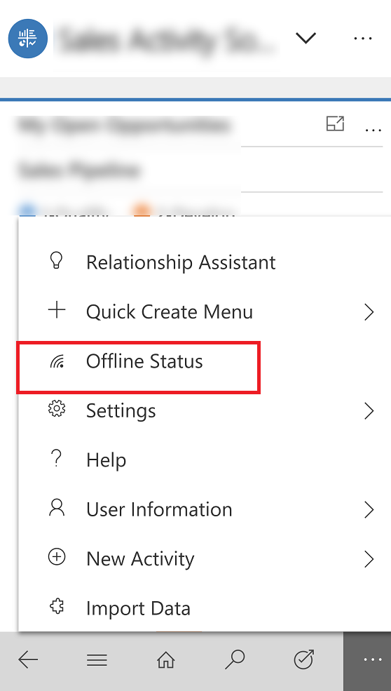
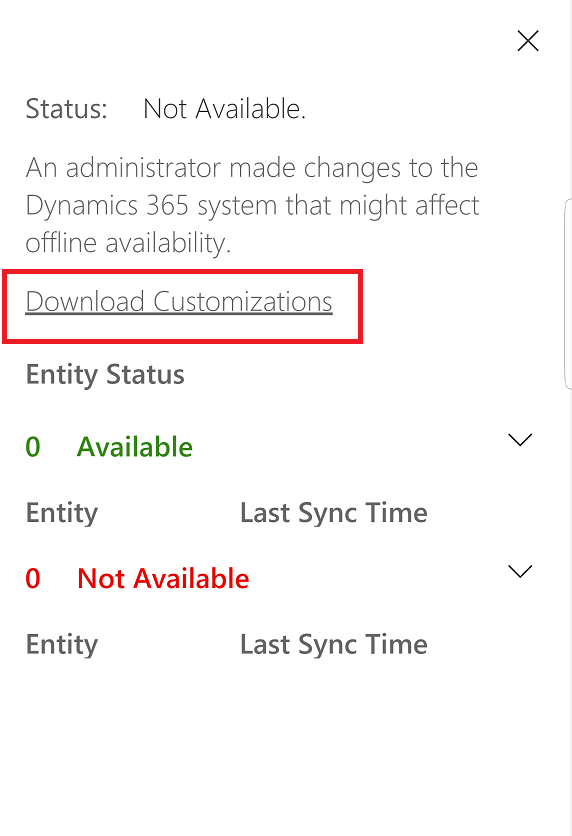

# Work offline on your mobile device

Work with your data in offline mode even when you don't have internet access. The Dynamics 365 for phones and tablets app provides a rich offline experience that lets you work with commands like create, read, update, and delete along with some special commands—so you always stay productive. Once you're back online, changes you've made are synchronized with your apps in the Common Data Service environment.

> [!NOTE]
> - The mobile offline feature is only available for iOS and Android devices.
> - To use the mobile offline feature, download the latest version of the Dynamics 365 for phones and tablet app from the app store. For iOS, version 13.19043.32 or later is supported; for Android, version 4.3.19043.33 or later supported.
> - The offline feature is not supported If you are a [Dynamics 365 US Government](https://docs.microsoft.com/power-platform/admin/microsoft-dynamics-365-government) (GCC and GCC High) user or Dynamics 365 Customer Engagement (on-premises). 

## Download updates to work in offline mode

When your admin has [enabled mobile offline](setup-mobile-offline-for-admin.md
), the next time you access the mobile app, you will be prompted to download offline updates. Once you download the updates, you can start using the mobile app in offline mode.

1. When you see the dialog box that asks you to download updates to work offline, choose **Update**. 

    > [!div class="mx-imgBorder"] 
    > 

    > [!NOTE]
    > If you choose **Skip for now**, you will not be able to use the app in offline mode until you [manually download the updates](https://docs.microsoft.com/dynamics365/mobile-app/work-in-offline-mode#manually-download-updates). 

2. Offline data automatically starts to download in the background. Once it's complete, you will get a notification letting you know the download is complete.

   > [!div class="mx-imgBorder"] 
   > 
   
When you open the app, offline data is automatically updated and you can start using the app in offline mode.

### Manually download updates

1. From the nav bar, select  > **Offline Status**.

    > [!div class="mx-imgBorder"] 
    > 

2. Select **Download Customizations** to download the updates.

    > [!div class="mx-imgBorder"] 
    > 

3. Offline data automatically starts to download in the background. Once it's complete, you will get a notification letting you know the download is complete.

   > [!div class="mx-imgBorder"] 
   > 
   
When you open the app, offline data is automatically updated and you can start using the app in offline mode.

## See if offline mode is available

When updates are downloaded, you can check to see if mobile offline is available.

- From the nav bar, select  > **Offline Status**.
  
   > [!div class="mx-imgBorder"] 
   >    

  -  **Offline Status** tracks the offline status of the whole app, and also the status of each entity individually. When the status shows as  **Available**, it indicates offline is available and data has synced successfully.

   > [!NOTE] 
   > The status here can be **Not Available** due to an error or if you missed downloading offline updates. If the status is **Not Available** due to missing the latest offline updates, then try downloading the updates again.
   
 
  -  **Entity Status** provides the offline status of each entity individually. For the available entities, you can also track the last time the entity synced. Data is synced periodically in the background to ensure that you have access to the latest data whenever you go offline.
   
  -  **Sync time** indicates the last time your data was synced with the server.
 
     > [!div class="mx-imgBorder"] 
     > 
 
### Check offline status from the main menu

You can also see which entities are available in offline mode from the main menu.

- From the nav bar, select .

  -  A green Wi-Fi icon next to the entity name indicates that it is available in offline mode.
  -  A red Wi-Fi icon indicates that this entity is enabled for offline use but is not available to work in offline mode due to an error or missing updates.
  -  If no Wi-Fi icon is visible, it means your admin has not enabled the entity to use in offline mode.

     > [!div class="mx-imgBorder"] 
     > 
   

## Sync conflict resolution

Conflict errors can resolved based on the settings set by the admin. If your admin has set the conflict resolution to **No**, then the data value on your client device wins and there will be no sync errors. 

If your admin has set the conflict resolution to **Yes**, then the data value on the server wins. In this case, while syncing changes to the server, you might see some errors that are automatically resolved. Client changes are overwritten by server values.

## Clear cache from the device

If you used the mobile app on a phone or tablet temporarily and want to remove all your cached data before giving the device to someone else, you need to reconfigure the app.

- From the nav bar, select   > **User Information** > **Reconfigure**. 

     > [!div class="mx-imgBorder"] 
     > 

Reconfiguring deletes all data and metadata from the cache, however do not rely on this as a security measure.

Make sure you use the **Reconfigure** option before you sign out. If you sign in to another organization but you wanted to delete data for the previous organization that you were logged into, then you will need to sign back into that organization and use the **Reconfigure** option to delete all data and metadata from the cache. 

## Capabilities available in offline mode

Dynamics 365 for phones and tablets provides the capabilities listed below in offline mode for the end users.

These entities and corresponding commands are available in offline mode.

|Entities |Commands|  
|-------------|---------|  
|Account|	Create, Read, Update, Delete|
|Activity Pointer|Read, Delete|
|Appointment|	Create, Read, Update, Delete, Convert ActivityCase|
|Attachment	|Read only|
|Case|Create, Read, Update, Delete|
|Competitor|Create, Read, Update, Delete	|
|Competitor Address Address|Create, Read, Update, Delete	|
|Connection|Read only|
|Connection Role|Read only|
|Contact|Create, Read, Update, Delete	|
|Custom Entity|Create, Read, Update, Delete	|
|Email|Read only	|
|Lead|Create, Read, Update, Delete, Qualify/Disqualify	|
|Opportunity|Create, Read, Update, Delete|
|Opportunity Product|Create, Read, Update, Delete	|
|Phone Call|Create, Read, Update, Delete	|
|Position|Create, Read, Update, Delete	|
|Product|Read|
|Task |Create, Read, Update, Delete|
|Team |Read only	|
|User |Read only	|

**Add Existing on subgrids**: **Add Existing** is not supported for mobile offline for certain types of relationships. When you are offline, certain relationships such as relationships that are N:N are read only, and the **Add Existing** command will be hidden on subgrids for those relationships. Even if the button is unhidden via customization, the command will not work in offline.

**Business rules**: Business rules are supported in mobile offline. For more information, see [Create business rules and recommendations to apply logic in a model-driven app form](https://docs.microsoft.com/powerapps/maker/model-driven-apps/create-business-rules-recommendations-apply-logic-form).

**Lookup support**: Lookups are supported for the entities that are mobile offline-enabled. All the entities participating in the lookup should also be offline-enabled.

**Offline views**: Only system views are supported in mobile offline. 

**Quick views**: Quick views are available in offline mode.

**Offline search**: Available only for offline entities. User can only search one entity at a time. Only categorized search is supported in offline mode and not relevant search.

**Notes on the Timeline control**: Notes on the Timeline control is available in offline mode. You can take pictures, read notes, and add attachments in offline mode.

> [!NOTE]
> The **Date** field is not available for mobile offline search.
   
**Security modeling**: Mobile offline honors the Dynamics 365 apps security model. It also supports the hierarchical security model.

Field level security and attribute sharing are not supported for offline mode.

If a user was working on a record and lost network connection, any updates made to the record are saved in offline mode and will be synchronized to Dynamics 365 app once the user is back online. When the record is synchronized with the app, it follows the filter rule for availability in offline mode.

> [!NOTE]
> - Actions from offline mode are replayed automatically. The changes are played back in the same sequence as they were created, modified, or deleted. This ensures that the data state is maintained and there are no data mismatches on the Dynamics 365 apps.
> - The org can enhance business functionality available in mobile offline using Xrm.Mobile.offline. For more information, see Xrm.Mobile.offline (client-side reference).

## Known Issues

**Business Process Flows**: Business process flows are not supported for mobile offline. When you are offline, business process flows grids and views will not be available and business process flows will not be rendered on records that are opened in offline mode. If a record containing a business process flow was loaded prior to going offline, business process flow functions, such as move next or move previous will not work. Business process flows support the ability to branch to a different set of stages, based on conditions defined on fields of the record. In offline mode, these conditions to determine the next set of stages in the business process flows will not be evaluated.

**Qualify a lead**: When a lead created in mobile offline is qualified and when the user goes online, the business process stage will still show the  qualify stage. The user will have to manually click **Next stage** to move to the next stage.

**Views** are not supported for the following entities in offline mode: 

- Email

- Task

- Fax

- Letter

- Serviceappointment

- Campaignresponse

- Campaignactivity

- Recurringappointmentmaster

- Socialactivity

Any views that have linked entities (related entity) that are not available offline are also not supported.

