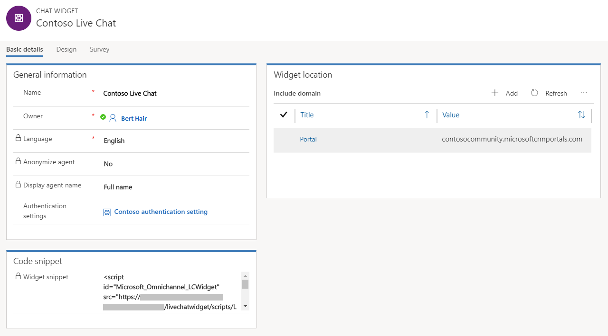
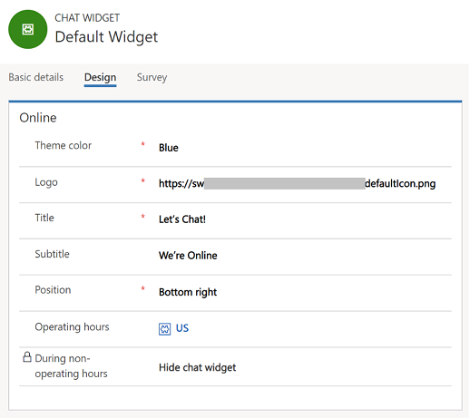
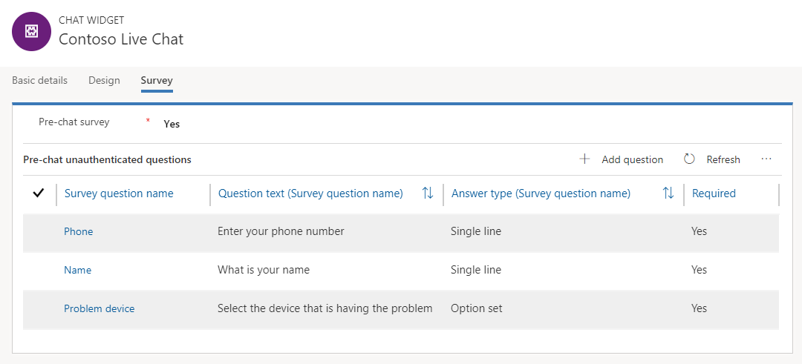
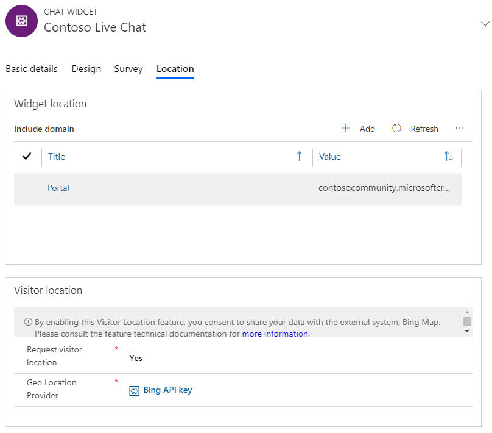

# Add a chat widget

Applies to Dynamics 365 for Customer Engagement apps version 9.1.0

[!include[cc-beta-prerelease-disclaimer](../../includes/cc-beta-prerelease-disclaimer.md)]

1. Sign in to Omni-channel Engagement Hub.
2. Go to **Administration** &gt; **Chat**.
3. Select **New** to create a chat widget.
4. On the **New Chat Widget** page, provide the appropriate information on each tab:

    - **Basic details**:

        1. In the **General information** section, enter a name for the chat widget and select the agent name to be displayed. More information on agent display name: [Configure agent display name](agent-display-name.md).
        
            You can optionally specify authentication settings. For more information about how to specify authentication settings, see [Create chat authentication settings](create-chat-auth-settings.md). You must save the record to enter more details.

        2. In the **Work Distribution** section, browse and select the work stream you created for the chat widget. By default, **Live chat workstream** is selected.
        
        > [!NOTE]
        > If no domains are specified, the chat widget can be embedded on any website without restrictions. If you specify a domain, the chat widget can be hosted only on the specified domain.
        
        3. Copy the value in the **Code snippet** section and embed it in the HTML source of your website.
        
        > [!div class=mx-imgBorder]
        > 

    - **Design**: Use this tab to specify the theme color, logo, title, subtitle, and operating hours of the chat widget. For more information about how to set up operating hours, see [Create and manage operating hours](create-operating-hours.md).

        > [!div class=mx-imgBorder]
        > 

    - **Survey**: Use this tab to set up a pre-chat survey. This survey is shown to users before a conversation is initiated. For more information, see [Configure a pre-chat survey](configure-pre-chat-survey.md).

        > [!div class=mx-imgBorder]
        > 

    - **Location**:
        1. In the **Widget location** section, select **Add** to specify the website domain where the chat widget must be shown. The domain format should not include the protocol (for example, **http** or **https**).
        2. In the **Visitor location** section, specify if you need to detect the visitor's location. For more information about how to set up location detection, see [Set up location detection](geo-location-provider.md).

        > [!div class=mx-imgBorder]
        > 

### See also

[Create a survey question](create-question-library.md) 
[Configure a pre-chat survey](configure-pre-chat-survey.md)  
[Create quick replies](create-quick-replies.md)  
[Create and manage operating hours](create-operating-hours.md)  
[Create chat authentication settings](create-chat-auth-settings.md)   
[Embed chat widget in Dynamics 365 for Customer Engagement Portal](embed-chat-widget-portal.md)
