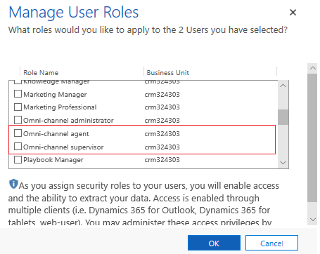

# Assign roles and enable users for Omni-channel Engagement Hub

Applies to Dynamics 365 for Customer Engagement apps version 9.1.0

[!include[cc-beta-prerelease-disclaimer](../../includes/cc-beta-prerelease-disclaimer.md)]

All Dynamics 365 users who are assigned the **Omni-channel administrator**, **Omni-channel supervisor**, or **Omni-channel agent** role are enabled for Omni-channel and become Omni-channel users.

> [!IMPORTANT]
> To enable users for Omni-channel, your org should have successfully on-boarded to the Omni-channel public preview. Refer [Provision Omni-channel Engagement Hub](omni-channel-provision-license.md) to provision Omni-channel in your Dynamics 365 org.

Use the Microsoft 365 admin center to create user accounts for every user who needs access to Omni-channel Engagement Hub. For more information, see  [Create users in Dynamics 365 for Customer Engagement apps and assign security roles](../../admin/create-users-assign-online-security-roles.md).

Follow these steps to assign Omni-channel roles to users in the Dynamics 365 web application:

1. Select **Settings** > **Security** > **Users**.

2. In the list, select the user or users that you want to assign a security role to.

3. Select **Manage Roles**.

   Only the security roles available for that user's business unit are displayed.

4. In the **Manage User Roles** dialog box, select the security role or roles you want for the user or users, and then select OK.

    > [!div class=mx-imgBorder]
    > 

To view and manage omni-channel users, see [Manage users in Omni-channel Engagement Hub](users-user-profiles.md).

## Understand roles and their privileges 

Each role in Omni-channel Engagement Hub can perform a set of actions based on the privileges. 

> [!NOTE]
> Omni-channel users (agents and supervisors) should be assigned **Channel Access** role.

|Role  |Privileges  |
|---------|---------|
|**Omni-channel Administrator**      |  Can view user list / presence list / work stream list / queue list / PBI config list       |
|    |    Can edit roles of a user     |
|    |   Can edit default presence and default capacity of a user      |
|    |     Can edit queue assignment of a user    |
|    |    Can add / edit / delete presence     |
|    |      Can add / remove users from presence   |
|    |    Can add / edit / delete presence associations     |
|    |      Can add / edit / delete work streams   |
|    |   Can add / edit / delete channel settings, context settings, routing rules      |
|    |     Can add / edit / delete queues    |
|    |     Can add / remove agents from queue    |
|    |    Can view / add / edit / delete quick replies     |
|    |     Can add / edit / delete PBI config    |
|    |    Can view add / edit / delete operating hours    |
|    |    Can view add / edit / delete auth settings     |
|**Omni-channel Supervisor**     |  Can view user list / presence list / work stream list / queue list / PBI config list       |
||Can edit default presence and default capacity of a user|
||Can edit queue assignment of a user|
|| Can add / remove users from presence |
||Can add / remove agents from queue| 
|| Can view / add / edit / delete quick replies|
||Can view operating hours |
|**Omni-channel Agent**  |Can view user list / presence list / work stream list / queue list|
||Can view quick replies|
|**Channel Access**  |Can access Omni-channel records||
||

### See also

[Provision Omni-channel Engagement Hub](omni-channel-provision-license.md)

[Manage users in Omni-channel Engagement Hub](users-user-profiles.md)
